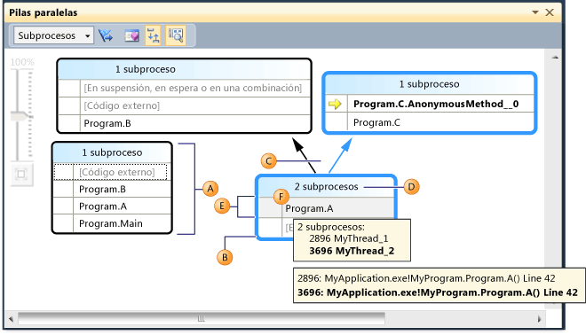
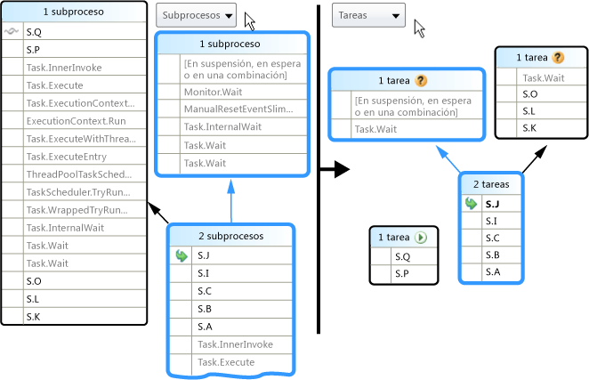
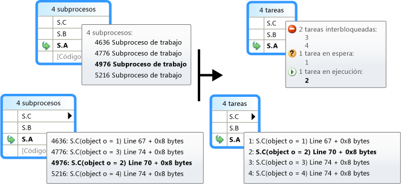

# Uso de la ventana Tareas paralelas
[!INCLUDE[vs2017banner](../code-quality/includes/vs2017banner.md)]

La ventana **Pilas paralelas** es útil cuando se depuran aplicaciones multithreading.  La **Vista de subprocesos** muestra información de la pila de llamadas de todos los subprocesos de la aplicación.  Permite navegar entre los subprocesos y marcos de pila de esos subprocesos.  En código administrado, la **Vista de tareas** muestra las pilas de llamadas de los objetos <xref:System.Threading.Tasks.Task?displayProperty=fullName>.  En código nativo, la **Vista de tareas** muestra las pilas de llamadas de [grupos de tareas](/visual-cpp/parallel/concrt/task-parallelism-concurrency-runtime), [algoritmos paralelos](/visual-cpp/parallel/concrt/parallel-algorithms), [agentes asincrónicos](/visual-cpp/parallel/concrt/asynchronous-agents) y [tareas ligeras](/visual-cpp/parallel/concrt/task-scheduler-concurrency-runtime).  
  
## Vista de subprocesos  
 En la siguiente ilustración se muestra un subproceso que fue de Main a A a B y después a código externo.  Otros dos subprocesos se iniciaron en código externo y fueron a A, pero uno de los subprocesos continuó a B y después a código externo, y el otro subproceso continuó a C y después a un AnonymousMethod.  
  
   
  
 En la ilustración, la ruta de acceso de la llamada del subproceso actual se resalta en azul y la flecha amarilla representa el marco de pila activo.  Puede cambiar el marco de pila seleccionando un método diferente en la ventana **Pilas paralelas**.  Esto también puede producir el cambio del subproceso actual, dependiendo de si el método que seleccionó ya forma parte del subproceso actual o de otro.  En la siguiente tabla se describen las características principales de la ventana **Pilas paralelas** como se muestra en la ilustración.  
  
|Letra de la llamada|Nombre del elemento|Descripción|  
|-------------------------|-------------------------|-----------------|  
|A|Nodo o segmento de pila de llamadas|Contiene una serie de contextos de método para uno o más subprocesos.  Si el nodo no tiene ninguna línea de flecha conectada, representa la ruta de acceso completa de la llamada de subprocesos.|  
|B|Resaltado azul|Indica la ruta de acceso de la llamada del subproceso actual.|  
|C|Líneas de flecha|Conecta nodos para recuperar la ruta de acceso completa de la llamada de subprocesos.|  
|D|Información sobre herramientas en los encabezados de nodo|Muestra el identificador y el nombre definido por el usuario de cada subproceso cuya ruta de acceso de llamada comparte este nodo.|  
|E|Contexto del método|Representa uno o más marcos de pila del mismo método.|  
|F|Información sobre herramientas en el contexto del método|En la vista Subprocesos, muestra todos los subprocesos en una tabla de modo similar a la ventana de **Subprocesos**.  En la vista Tareas, muestra todas las tareas en una tabla de modo similar a la ventana **Tareas paralelas**.|  
  
 Por otro lado, en la ventana Pilas paralelas, aparece un icono de **Vista aérea** en el panel principal cuando el gráfico es demasiado grande y no se ajusta a la ventana.  Puede hacer clic en este icono para ver el gráfico completo en la ventana.  
  
## Iconos del contexto del método  
 En la siguiente tabla se describen los iconos que proporcionan información sobre los marcos de pila activos actuales:  
  
|||  
|-|-|  
|Icono|Descripción|  
||Indica que el contexto del método contiene el marco de pila activo del subproceso actual.|  
||Indica que el contexto del método contiene el marco de pila activo de un subproceso que no es el actual.|  
||Indica que el contexto del método contiene el marco de pila actual.  Ese nombre de método está negrita en todos los nodos en los que aparece.|  
  
## Controles de la barra de herramientas  
 En la siguiente ilustración y tabla se describen los controles que están disponibles en la barra de herramientas Pilas paralelas.  
  
   
  
|Letra de la llamada|Control|Descripción|  
|-------------------------|-------------|-----------------|  
|A|Cuadro combinado de subprocesos\/tareas|Intercambia la vista entre las pilas de llamadas de subprocesos y las pilas de llamadas de tareas.  Para obtener más información, vea Vista de tareas y subprocesos.|  
|B|Mostrar marcadas únicamente|Solo muestra las pilas de llamadas de los subprocesos que están marcados en otras ventanas de depuración, por ejemplo las ventanas **Subprocesos de GPU** e **Inspección paralela**.|  
|C|Alternar vista de método|Alterna entre la vista de pila y la vista de método.  Para obtener más información, vea Vista de método.|  
|D|Desplazar automáticamente al marco de pila actual|Desplaza automáticamente el diagrama para que el marco de pila actual esté a la vista.  Esta característica es útil cuando está cambiando el marco de pila actual de otras ventanas o cuando está alcanzando un nuevo punto de interrupción en diagramas grandes.|  
|E|Alternar control Zoom|Muestra u oculta el control Zoom.  También puede hacer zoom presionando CTRL y girando la rueda del mouse, sin tener en cuenta la visibilidad del zoom.|  
  
### Elementos del menú contextual  
 En la siguiente ilustración y tabla se describen los elementos de menú contextual que están disponibles al hacer clic con el botón secundario en un contexto de método en la vista de subprocesos o de tareas.  Los últimos seis elementos se toman prestados directamente en la ventana Pila de llamadas y no presentan nuevo comportamiento.  
  
   
  
|Elemento de menú|Descripción|  
|----------------------|-----------------|  
|Marcar|Marca el elemento seleccionado.|  
|Quitar marcador|Quita la marca del elemento seleccionado.|  
|Inmovilizar|Inmoviliza el elemento seleccionado.|  
|Reanudar|Reanuda el elemento seleccionado.|  
|Ir a tarea \(Subproceso\)|Realiza la misma función que el cuadro combinado de la barra de herramientas, pero mantiene el mismo marco de pila resaltado.|  
|Ir al código fuente|Navega hasta la ubicación en el código fuente que corresponde al marco de pila en el que el usuario hizo clic con el botón secundario.|  
|Cambiar a marco|Igual que el comando de menú correspondiente de la ventana Pila de llamadas.  Sin embargo, con Pilas paralelas, varios marcos pueden corresponder a un contexto de método.  Por consiguiente, el elemento de menú tiene submenús, cada uno de los cuales representa un marco de pila concreto.  Si uno de los marcos de pila está en el subproceso actual, el menú que corresponde a ese marco de pila está seleccionado.|  
|Ir al desensamblado|Se desplaza hasta la ubicación en la ventana del desensamblado que corresponde al marco de pila en el que el usuario hizo clic con el botón secundario.|  
|Mostrar código externo|Muestra u oculta el código externo.|  
|Presentación hexadecimal|Alterna entre la presentación hexadecimal y decimal.|  
|Información de carga de símbolos|Muestra el cuadro de diálogo correspondiente.|  
|Valores de los símbolos|Muestra el cuadro de diálogo correspondiente.|  
  
## Vista de tareas  
 Si la aplicación está utilizando objetos <xref:System.Threading.Tasks.Task?displayProperty=fullName> \(código administrado\) u objetos `task_handle` \(código nativo\) para expresar el paralelismo, puede utilizar el cuadro combinado de la barra de herramientas de la ventana Pilas paralelas para pasar a la *vista de tareas*.  La vista de tareas muestra las pilas de llamadas de las tareas en lugar de los subprocesos.  La vista de tareas difiere en la vista de subprocesos en lo siguiente:  
  
-   No se muestran las pilas de llamadas de los subprocesos que no están ejecutando tareas.  
  
-   Las pilas de llamadas de los subprocesos que están ejecutando tareas se recortan visualmente en la parte superior y superior para mostrar los marcos más pertinentes que pertenecen a las tareas.  
  
-   Cuando varias tareas están en un subproceso, las pilas de llamadas de esas tareas se dividen en nodos independientes.  
  
 En la siguiente ilustración se muestra la vista de tareas de pilas paralelas a la derecha y la vista de subprocesos correspondiente a la izquierda.  
  
   
  
 Para ver la pila de llamadas completa, simplemente vuelva a la vista de subprocesos haciendo clic con el botón secundario en un marco de pila y haciendo clic a continuación en **Ir a subproceso**.  
  
 Tal y como se describe en la tabla anterior, desplazando el puntero del mouse sobre un contexto de método, puede ver información adicional.  En la imagen siguiente se muestra la información de la información sobre herramientas para la vista de subprocesos y de tareas.  
  
   
  
## Vista de método  
 Desde la vista de subprocesos o la de tareas, puede dinamizar el gráfico del método actual haciendo clic en el icono Vista de método de la barra de herramientas.  La vista de método muestra de una ojeada todos los métodos de todos los subprocesos que llaman o a los que llama el método actual.  En la siguiente ilustración se muestra un vista de subprocesos y también el aspecto que tiene la misma información en la vista de método.  
  
   
  
 Si se pasa a un nuevo marco de pila, ese método se convierte en el método actual y hace que la ventana muestre todos los llamadores y destinatarios del nuevo método.  Esto puede hacer que algunos subprocesos aparezcan o desaparezcan de la vista, dependiendo de si ese método aparece en sus pilas de llamadas.  Para volver a la vista de pilas, haga clic de nuevo en el botón de la barra de herramientas de la vista de método.  
  
## Vea también  
 [Tutorial: Depurar una aplicación paralela](../debugger/walkthrough-debugging-a-parallel-application.md)   
 [Conceptos básicos del depurador](../debugger/debugger-basics.md)   
 [Depurar código administrado](../debugger/debugging-managed-code.md)   
 [Parallel Programming](../Topic/Parallel%20Programming%20in%20the%20.NET%20Framework.md)   
 [Usar la ventana Tareas](../debugger/using-the-tasks-window.md)   
 [Tutorial: Depurar una aplicación paralela](../debugger/walkthrough-debugging-a-parallel-application.md)   
 [Clase de tarea](../extensibility/debugger/task-class-internal-members.md)