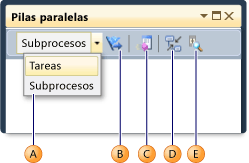
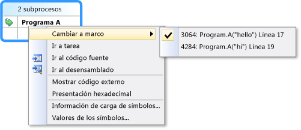
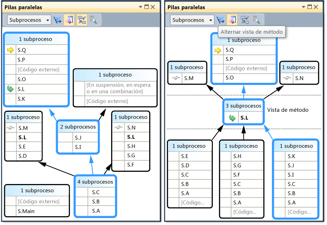

# Visualización de subprocesos y tareas en la ventana Pilas paralelas (C#, Visual Basic, C++)

La ventana **Pilas paralelas** es útil cuando se depuran aplicaciones multiproceso. Cuenta con varias vistas:

- [Vista de subprocesos](#threads-view): muestra información de la pila de llamadas de todos los subprocesos de la aplicación. Puede desplazarse entre los subprocesos y marcos de pila de esos subprocesos.

- [Vista de tareas](#tasks-view): muestra información de la pila de llamadas centrada en la tarea.
  - En código administrado, la **Tareas** muestra las pilas de llamadas de los objetos <xref:System.Threading.Tasks.Task?displayProperty=fullName>.
  - En código nativo, la vista **Tareas** muestra las pilas de llamadas de [grupos de tareas](/cpp/parallel/concrt/task-parallelism-concurrency-runtime), [algoritmos paralelos](/cpp/parallel/concrt/parallel-algorithms), [agentes asincrónicos](/cpp/parallel/concrt/asynchronous-agents) y [tareas ligeras](/cpp/parallel/concrt/task-scheduler-concurrency-runtime).

- [Vista de método](#method-view): dinamiza la pila de llamadas en un método seleccionado.

## Usar la ventana Tareas paralelas

Para abrir la ventana **Pilas paralelas**, debe estar en una sesión de depuración. Seleccione **Depurar** > **Windows** > **Pilas paralelas**.

### Controles de la barra de herramientas

La ventana **Pilas paralelas** tiene los siguientes controles de barra de herramientas:

|Iconos|Control|Descripción|
|-|-|-|
||Cuadro combinado **Subprocesos**/**Tareas**|Intercambia la vista entre las pilas de llamadas de subprocesos y las pilas de llamadas de tareas. Para obtener más información, vea [Vista de tareas](#tasks-view) y [Vista de subprocesos](#threads-view).|
||Mostrar marcadas únicamente|Solo muestra las pilas de llamadas de los subprocesos que están marcados en otras ventanas de depuración, por ejemplo, las ventanas **Subprocesos de GPU** e **Inspección paralela**.|
||Alternar **vista de método**|Cambia entre las vistas de pila de llamadas y la **vista de método**. Para obtener más información, vea [Vista de método](#method-view).|
||Desplazar automáticamente al marco de pila actual|Desplaza automáticamente el gráfico para que el marco de pila actual esté a la vista. Esta característica es útil cuando se cambia el marco de pila actual desde otras ventanas o cuando se alcanza un nuevo punto de interrupción en gráficos grandes.|
||Alternar control Zoom|Muestra u oculta el control de zoom situado a la izquierda de la ventana.   Con independencia de la visibilidad del control de zoom, para hacer zoom también puede presionar **Ctrl** y girar la rueda del mouse o presionar **Ctrl**+**Mayús**+ **+** para acercar y **Ctrl**+**Mayús**+ **-** para alejar. |

### Iconos de marco de pila
Los iconos siguientes proporcionan información sobre los marcos de pila activos y actuales en todas las vistas:

|Iconos|Descripción|
|-|-|
||Indica la ubicación actual (marco de pila activo) del subproceso actual.|
||Indica la ubicación actual (marco de pila activo) de un subproceso no actual.|
||Indica el marco de pila actual (el contexto del depurador actual). El nombre del método está en negrita dondequiera que aparezca.|

### Elementos del menú contextual
Los siguientes elementos de menú contextual están disponibles cuando se hace clic con el botón secundario en un método en la vista **Subprocesos** o en la vista **Tareas**. Los últimos seis elementos son los mismos que en la [ventana Pila de llamadas](how-to-use-the-call-stack-window.md).

|Elemento de menú|Descripción|
|-|-|
|**Marcar**|Marca el elemento seleccionado.|
|**Quitar marcador**|Quita la marca del elemento seleccionado.|
|**Inmovilizar**|Inmoviliza el elemento seleccionado.|
|**Reanudar**|Reanuda el elemento seleccionado.|
|**Cambiar a marco**|Igual que el comando de menú correspondiente de la ventana **Pila de llamadas**. Sin embargo, en la ventana **Pilas paralelas**, un método puede estar en varios marcos. Puede seleccionar el marco que quiera en el submenú de este elemento. Si uno de los marcos de pila está en el subproceso actual, ese marco se selecciona de forma predeterminada en el submenú.|
|**Ir a tarea** o **Ir a subproceso**|Cambia a la vista **Tareas** o **Subprocesos** y mantiene el mismo marco de pila resaltado.|
|**Ir al código fuente**|Va a la ubicación correspondiente en la ventana de código fuente. |
|**Ir al desensamblado**|Va a la ubicación correspondiente en la ventana **Desensamblado**.|
|**Mostrar código externo**|Muestra u oculta el código externo.|
|**Presentación hexadecimal**|Alterna entre la presentación hexadecimal y decimal.|
|**Mostrar subprocesos en código fuente**|Marca la ubicación del subproceso en la ventana de código fuente. |
|**Información de carga de símbolos**|Abre el cuadro de diálogo **Información de carga de símbolos**.|
|**Configuración de símbolos**|Abre el cuadro de diálogo **Configuración de símbolos**. |

## Vista de subprocesos

En la vista **Subprocesos**, el marco de pila y la ruta de acceso de llamada del subproceso actual se resaltan en azul. La ubicación actual del subproceso se muestra mediante la flecha amarilla.

Para cambiar el marco de pila actual, haga doble clic en un método diferente. Esta acción también podría cambiar el subproceso actual, dependiendo de si el método que seleccione forma parte del subproceso actual o de otro subproceso.

Cuando el gráfico de vista **Subprocesos** es tan grande que no cabe en la ventana, en la ventana aparece un control **vista de pájaro**. Puede desplazar el marco del control para desplazarse por distintas partes del gráfico.

En la ilustración siguiente se muestra un subproceso que pasa por una transición de código principal, administrado y nativo. Hay seis subprocesos en el método actual. Uno sigue hasta Thread.Sleep y otro continúa hacia Console.WriteLine y luego hacia SyncTextWriter.WriteLine.

 

En la tabla siguiente se describen las características principales de la vista **Subprocesos**:

|Llamada|Nombre del elemento|Descripción|
|-|-|-|
|1|Nodo o segmento de pila de llamadas|Contiene una serie de métodos para uno o más subprocesos. Si el marco no tiene ninguna línea de flecha conectada, representa la ruta de acceso completa de la llamada de los subprocesos.|
|2|Resaltado azul|Indica la ruta de acceso de la llamada del subproceso actual.|
|3|Líneas de flecha|Conecta nodos para recuperar la ruta de acceso completa de la llamada de subprocesos.|
|4|Encabezado de nodo|Muestra el número de procesos y subprocesos del nodo.|
|5|Método|Representa uno o más marcos de pila del mismo método.|
|6|Información sobre herramientas en el método|Aparece cuando se mantiene el mouse sobre un método. En la vista **Subprocesos**, la información sobre herramientas muestra todos los subprocesos de una tabla de modo similar a la ventana de **Subprocesos**. |

## Vista de tareas
Si la aplicación usa objetos <xref:System.Threading.Tasks.Task?displayProperty=fullName> (código administrado) u objetos `task_handle` (código nativo) para expresar el paralelismo, puede usar la vista **Tareas**. La **vista de tareas** muestra las pilas de llamadas de las tareas en lugar de los subprocesos.

En la vista **Tareas**:

- No se muestran las pilas de llamadas de los subprocesos que no están ejecutando tareas.
- Las pilas de llamadas de los subprocesos que ejecutan tareas se recortan visualmente en la parte superior e inferior para mostrar los marcos más pertinentes para las tareas.
- Cuando hay varias tareas en un subproceso, las pilas de llamadas de esas tareas se muestran en distintos nodos.

Para ver una pila de llamadas completa, vuelva a la vista **Subprocesos**; para ello, haga clic con el botón secundario en un marco de pila y seleccione **Ir a subproceso**.

En la ilustración siguiente se muestra la vista **Subprocesos** en la parte superior y la vista **Tareas** correspondiente en la parte inferior.

Mantenga el mouse sobre un método para mostrar información sobre herramientas con información adicional. En la vista **Tareas**, en la información sobre herramientas, se muestran todas las tareas de una tabla, de forma similar a la ventana **Tareas**.

En la imagen siguiente se muestra la información sobre herramientas de un método en la vista **Subprocesos** en la parte superior y de la vista **Tareas** correspondiente en la parte inferior.

## Vista de método
Desde la vista **Subprocesos** o la vista **Tareas**, puede dinamizar el gráfico del método actual seleccionando el icono **Alternar vista de método**. La **vista de método** muestra de una ojeada todos los métodos de todos los subprocesos que llaman o a los que llama el método actual. En la ilustración siguiente se muestra cómo aparece la misma información en la vista **Subprocesos** a la izquierda y en la **Vista de método** a la derecha.

Si cambia a un nuevo marco de pila, lo convierte en el método actual y en **Vista de método** se muestra todos los llamadores y destinatarios del nuevo método. Esto puede hacer que algunos subprocesos aparezcan o desaparezcan de la vista, dependiendo de si ese método aparece en sus pilas de llamadas. Para volver a la vista Pila de llamadas, vuelva a seleccionar el icono **Vista de método** de la barra de herramientas.

## Vea también
- [Introducción a la depuración de aplicaciones multiproceso](../debugger/get-started-debugging-multithreaded-apps.md)
- [Tutorial: Depuración de una aplicación paralela](../debugger/walkthrough-debugging-a-parallel-application.md)
- [Primer vistazo al depurador](../debugger/debugger-feature-tour.md)
- [Depurar código administrado](../debugger/debugging-managed-code.md)
- [Programación en paralelo en .NET](/dotnet/standard/parallel-programming/index)
- [Usar la ventana Tareas](../debugger/using-the-tasks-window.md)
- [Clase de tarea: miembros internos](../extensibility/debugger/task-class-internal-members.md)
