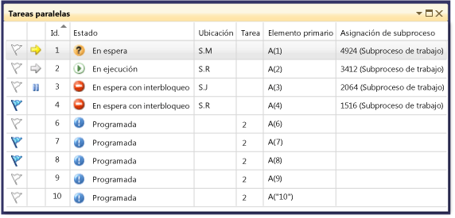
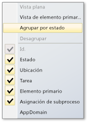
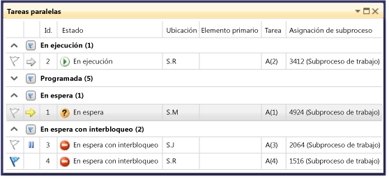
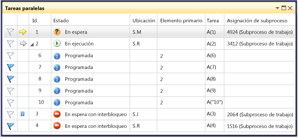
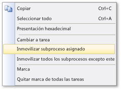

# Usar la ventana Tareas
El **tareas** ventana es similar a la **subprocesos** ventana, excepto que muestra información acerca de <xref:System.Threading.Tasks.Task?displayProperty=fullName>, [task_handle](/cpp/parallel/concrt/reference/task-group-class), o [WinJS.Promise ](http://msdn.microsoft.com/library/windows/apps/br211867.aspx) en lugar de cada subproceso. Como los subprocesos, las tareas representan operaciones asincrónicas que se pueden ejecutar simultáneamente; sin embargo, varias tareas se pueden ejecutar en el mismo subproceso. 
  
 En código administrado, puede usar el **tareas** ventana cuando se trabaja con <xref:System.Threading.Tasks.Task?displayProperty=fullName> objetos o con el **await** y **async** palabras clave (**Await** y **Async** en Visual Basic). Para obtener más información acerca de las tareas en código administrado, consulte [Parallel Programming](/dotnet/standard/parallel-programming/index).  
  
 En código nativo, puede usar el **tareas** ventana cuando se trabaja con [grupos de tareas](/cpp/parallel/concrt/task-parallelism-concurrency-runtime), [algoritmos paralelos](/cpp/parallel/concrt/parallel-algorithms), [agentes asincrónicos](/cpp/parallel/concrt/asynchronous-agents), y [tareas ligeras](/cpp/parallel/concrt/task-scheduler-concurrency-runtime). Para obtener más información acerca de las tareas en código nativo, vea [Runtime de simultaneidad](/cpp/parallel/concrt/concurrency-runtime).  
  
 En JavaScript, puede usar la ventana tareas cuando se trabaja con promise `.then` código. Vea [programación asincrónica en JavaScript (aplicaciones de UWP)](http://msdn.microsoft.com/library/windows/apps/hh700330.aspx) para obtener más información.   
  
 Puede usar el **tareas** ventana cada vez que interrumpa el depurador. Puede obtener acceso a él en el **depurar** menú haciendo clic en **Windows** y, a continuación, haga clic en **tareas**. La siguiente ilustración muestra la **tareas** ventana en su modo predeterminado.  
  
   
  
> [!NOTE]
>  En el código administrado, una tarea <xref:System.Threading.Tasks.Task> que tiene un estado de <xref:System.Threading.Tasks.TaskStatus>, <xref:System.Threading.Tasks.TaskStatus>, o <xref:System.Threading.Tasks.TaskStatus> podría no mostrarse en la ventana Tareas si los subprocesos administrados están en un estado de suspensión o combinación.  
  
## Información de la columna Tareas  
 Las columnas de la **tareas** ventana muestran la siguiente información.  
  
|Nombre de columna|Descripción|  
|-----------------|-----------------|  
|**Marcas**|Muestra las tareas que están marcadas y permiten marcar o desmarcar una tarea.|  
|**Iconos**|Una flecha amarilla indica la tarea actual. La tarea actual es la tarea de nivel superior del subproceso actual.   Una flecha blanca indica la tarea de ruptura, es decir, la tarea en curso cuando se invocó el depurador.   El icono de pausa indica una tarea inmovilizada por el usuario. Puede inmovilizar y liberar una tarea haciendo clic con el botón secundario en ella en la lista.|  
|**ID**|Un número proporcionado por sistema para la tarea. En código nativo, ésta es la dirección de la tarea.|  
|**Estado**|El estado actual (programado, activo, interbloqueado, en espera o completado) de la tarea. Una tarea programada es la que aún no se ha ejecutado y, por consiguiente, no tiene pila de llamadas, subproceso asignado ni información relacionada.   Una tarea activa es la que estaba ejecutando código antes de la interrupción del depurador.   Una tarea en espera es la que se bloquea porque está esperando a que se señalice un evento, se libere un bloqueo o termine otra tarea.   Una tarea interbloqueada es una tarea en espera cuyo subproceso está en interbloqueo con otro subproceso.   Mantenga el mouse sobre la **estado** celda para una tarea interbloqueada o en espera obtener más información sobre el bloque. **Advertencia:** el **tareas** ventana notifica un interbloqueo solo para una tarea bloqueada que utilice una primitiva de sincronización que sea compatible con WCT Wait Chain Traversal (). Por ejemplo, para un interbloqueo <xref:System.Threading.Tasks.Task> objeto, que utiliza WCT, el depurador notifica **espera con interbloqueo**. Para una tarea interbloqueada administrada por el Runtime de simultaneidad, que no utiliza WCT, el depurador notifica **espera**. Para obtener más información sobre WCT, vea [Wait Chain Traversal](http://msdn.microsoft.com/library/ms681622\(VS.85\).aspx).|  
|**Hora de inicio**|La hora en la que se activó la tarea.|  
|**Duración**|El número de segundos que la tarea ha estado activa.|  
|**Hora de finalización**|La hora en la que se completó la tarea.|  
|**Ubicación**|La ubicación actual en la pila de llamadas de la tarea. Desplace el puntero del mouse sobre esta celda para ver la pila de llamadas completa de la tarea. Las tareas programadas no tienen un valor en esta columna.|  
|**Task**|El método inicial y los argumentos que se pasaron a la tarea cuando se creó.|  
|**Elemento primario**|El identificador del subproceso que creó esta ventana. Si está en blanco, la tarea tiene ningún primario. Esto solo es aplicable a los programas administrados.|  
|**Asignación de subprocesos**|El identificador y nombre del subproceso en el que la tarea se está ejecutando.|  
|**Estado de retorno**|El estado de la tarea cuando se completó. Los valores de estado de retorno son **correcto**, **Cancelled**, y **Error**.|  
|**AppDomain**|En código administrado, el dominio de aplicación en el que la tarea se está ejecutando.|  
|**task_group)**|Para código nativo, la dirección de la [task_group](/cpp/parallel/concrt/reference/task-group-class.mdd) objeto que programó la tarea. En los agentes asincrónicos y las tareas ligeras, esta columna se establece en 0.|  
|Proceso|El identificador del proceso en el que se está ejecutando la tarea.|  
|Estado asincrónico|En el código administrado, el estado de la tarea. De forma predeterminada, se oculta esta columna. Para mostrar esta columna, abra el menú contextual de uno de los encabezados de columna. Elija **columnas**, **AsyncState**.|  
  
 Puede agregar columnas a la vista haciendo clic con el botón secundario en un encabezado de columna y seleccionando las columnas que desea. (Quite columnas borrando las selecciones). También puede reordenar las columnas arrastrándolas a izquierda o derecha. El menú contextual de la columna se muestra en la siguiente ilustración.  
  
   
  
## Ordenar Tareas  
 Para ordenar las tareas por columnas, haga clic en el encabezado de columna. Por ejemplo, haciendo clic en el **identificador** encabezado de columna, puede ordenar las tareas por Id. de tarea: 1,2,3,4,5 y así sucesivamente. Para invertir el criterio de ordenación, haga clic en el encabezado de columna de nuevo. Una flecha en la columna indica el criterio y la columna de ordenación.  
  
## Agrupar tareas  
 Puede agrupar tareas por cualquier columna en la vista de lista. Por ejemplo, haciendo clic en el **estado** encabezado de columna y, a continuación, haga clic en **Agrupar por estado**, puede agrupar todas las tareas que tienen el mismo estado. Por ejemplo, podría ver rápidamente las tareas en espera para ver por qué se bloquean. También puede contraer un grupo que no es de interés durante la sesión de depuración. De la misma manera, puede agrupar por otras columnas. Se puede marcar o quitar la marca de un grupo haciendo clic en el botón del encabezado de grupo. La siguiente ilustración muestra la **tareas** ventana en modo agrupado.  
  
   
  
## Vista de elemento primario y secundario  
 (Esta vista solo está disponible en código administrado). Haciendo clic en un encabezado de columna y, a continuación, haga clic en **vista de elemento primario**, puede cambiar la lista de tareas a una vista jerárquica, en que cada tarea secundaria es un subnodo que se puede mostrar u ocultar bajo su elemento primario. En la siguiente ilustración se muestran las tareas en vista de elemento secundario y primario.  
  
   
  
## Marcar tareas  
 También puede marcar el subproceso de la tarea en el que está ejecutando una tarea seleccionando la tarea de elemento de lista y, a continuación, elegir **marca** en el menú contextual, o haciendo clic en el icono de marca en la primera columna. Si marca varias tareas, después puede ordenarlas en la columna para llevar todas las tareas marcadas a la parte superior de forma que se pueda concentrar en ellas. También puede usar el **pilas paralelas** ventana para ver las tareas marcadas solamente. Esto le permite filtrar las tareas que no le interesa depurar. Las marcas no se conservan entre sesiones de depuración.  
  
## Inmovilizar y reanudar tareas  
 Puede inmovilizar el subproceso en el que está ejecutando una tarea haciendo clic en el elemento de lista de tareas y, a continuación, haga clic en **Inmovilizar subproceso asignado**. (Si la tarea ya está inmovilizada, el comando es **Reanudar subproceso asignado**.) Al inmovilizar un subproceso, no se ejecutará cuando se recorra el código después del punto de interrupción actual. El **inmovilizar todos los subprocesos menos este** comando inmoviliza todos los subprocesos salvo el que se está ejecutando el elemento de lista de tareas.  
  
 En la siguiente ilustración se muestran el resto de elementos de menú para cada tarea.  
  
   
  
## Vea también  
 [Conceptos básicos del depurador](../debugger/debugger-basics.md)   
 [Depurar código administrado](../debugger/debugging-managed-code.md)   
 [Parallel Programming](/dotnet/standard/parallel-programming/index)  (Programación en paralelo)  
 [Runtime de simultaneidad](/cpp/parallel/concrt/concurrency-runtime)   
 [Mediante la ventana Pilas paralelas](../debugger/using-the-parallel-stacks-window.md)   
 [Tutorial: Depurar una aplicación paralela](../debugger/walkthrough-debugging-a-parallel-application.md)