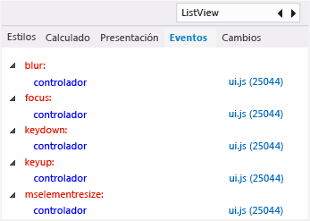

# Ver agentes de escucha de eventos DOM
[!INCLUDE[vs2017banner](../code-quality/includes/vs2017banner.md)]

  
  
 La pestaña **Eventos** del Explorador DOM muestra los eventos que están asociados a un elemento DOM. Cada nodo de la pestaña **Eventos** representa un evento que tiene suscriptores activos. El nodo superior contiene subnodos que representan a los agentes de escucha registrados para el evento específico. Además de para ver los agentes de escucha de eventos, puedes utilizar esta pestaña para navegar a la ubicación del agente de escucha de eventos en el código de JavaScript. La información de este tema se aplica a las aplicaciones de la Tienda compiladas mediante HTML y JavaScript.  
  
 La lista de la pestaña **Eventos** es dinámica. Si agrega un agente de escucha de eventos mientras la aplicación se está ejecutando, el nuevo evento aparecerá en ella. Para obtener información sobre cómo agregar y eliminar agentes de escucha de eventos, consulte [Sugerencias para resolver problemas con agentes de escucha de eventos](#Tips) en este tema.  
  
> [!NOTE]
>  Los agentes de escucha de los eventos de código que no son elementos DOM, como `xhr`, no aparecen en la pestaña **Eventos**.  
  
## Ver agentes de escucha de eventos para elementos DOM  
 En este ejemplo se muestra una aplicación de la Tienda de Windows Phone. Las características del Explorador DOM descritas aquí también son compatibles con las aplicaciones de la Tienda Windows.  
  
#### Para ver los agentes de escucha de eventos  
  
1.  En Visual Studio, cree una aplicación de JavaScript que use la plantilla de proyecto Aplicación Pivot de Windows Phone.  
  
2.  Con la plantilla abierta en Visual Studio, seleccione **Emulator 8.1 WVGA 4in 512MB\(ES\)** en la lista desplegable de la barra de herramientas Depurar del depurador:  
  
       
  
3.  Presiona F5 para ejecutar la aplicación en modo de depuración.  
  
4.  En la aplicación en ejecución, vaya al elemento dinámico **Sección 3**.  
  
5.  Cambia a Visual Studio \(Alt\+Tab o F12\).  
  
6.  En el Explorador DOM, elija `Find` en la esquina superior derecha.  
  
7.  Escribe `ListView` y, a continuación, presiona Intro.  
  
8.  Si es necesario, elija el botón **Siguiente** para buscar el elemento `DIV` que representa el control `ListView` \(este elemento tiene un valor `data-win-control` de `WinJS.UI.ListView`\).  
  
     El elemento `DIV` debería estar ahora seleccionado en el Explorador DOM.  
  
9. Elige la pestaña **Eventos** en el panel de la derecha del Explorador DOM.  
  
     Ahora, puedes ver los eventos que tienen suscriptores activos para el elemento `DIV`, como se muestra aquí.  
  
       
  
10. Para localizar los agentes de escucha de estos eventos, elija los vínculos de archivo de JavaScript asociados.  
  
11. Para identificar rápidamente agentes de escucha de eventos para elementos principales de la jerarquía DOM, elija un elemento principal en la lista de jerarquías situada en la parte inferior del Explorador DOM.  
  
       
  
     La pestaña **Eventos** muestra agentes de escucha de eventos para cualquier elemento que elija en la lista de jerarquías.  
  
###  <a name="Tips"></a> Sugerencias para resolver problemas con agentes de escucha de eventos  
 En algunos escenarios de aplicaciones, los agentes de escucha de eventos deben quitarse explícitamente mediante [removeEventListener](http://msdn.microsoft.com/library/ie/ff975250\(v=vs.85\).aspx). Use la pestaña **Eventos** del Explorador DOM para probar si los agentes de escucha de eventos se han quitado de los elementos DOM al ejecutar código. A continuación se ofrecen algunas sugerencias para resolver este tipo de problemas:  
  
-   Para aplicaciones que usen el modelo de navegación de una sola página implementado en las [plantillas de proyecto](http://msdn.microsoft.com/es-es/library/windows/apps/hh758331.aspx) de Visual Studio, generalmente no es necesario quitar agentes de escucha de eventos registrados para objetos como, por ejemplo, elementos DOM, que formen parte de una página. En este escenario, un elemento DOM y sus agentes de escucha de eventos asociados tienen la misma vigencia y se pueden recolectar.  
  
-   Si la vigencia del elemento u objeto DOM es diferente a la del agente de escucha de eventos asociado, es posible que deba llamar al método `removeEventListener`. Por ejemplo, si usa el evento `window.onresize`, es posible que deba quitar el agente de escucha de eventos al salir de la página en la que controla el evento.  
  
-   Si `removeEventListener` no puede quitar el agente de escucha especificado, es posible que se esté llamando en una instancia distinta del objeto. Puede usar el método [bind \(Método, Function\)](../Topic/bind%20Method%20\(Function\)%20\(JavaScript\).md) para resolver este problema al agregar el agente de escucha.  
  
-   Para quitar un agente de escucha de eventos que se haya agregado mediante [bind \(Método, Function\)](../Topic/bind%20Method%20\(Function\)%20\(JavaScript\).md) o una función anónima, almacene una instancia de la función al agregar el agente de escucha. A continuación se expone un modo de usar este patrón con seguridad:  
  
    ```javascript  
    // You could use the following code within the constructor function of an object, or  
    // in the ready function of a PageControl object (Store app).  
    this.storedHandler = this._handlerFunc.bind(this);  
    elem.addEventListener('mouseup', this.storedHandler);  
  
    // In this example, add the following code in the PageControl object's unload function.  
    elem.removeEventListener('mouseup', this.storedHandler);  
  
    ```  
  
     Si usa el siguiente código en lugar de almacenar una referencia a la función enlazada, no podrá quitar el agente de escucha de eventos explícitamente:  
  
    ```javascript  
    // Avoid this pattern. No reference to the bound function is available.  
    elem.addEventListener('mouseup', this._handlerFunc.bind(this));  
    ```  
  
-   No puede quitar un agente de escucha de eventos mediante `removeEventListener` si lo agregó mediante el atributo `obj.on<eventname>` como, por ejemplo, `window.onresize = handlerFunc`.  
  
-   Use el analizador de memoria de JavaScript para [Memoria de JavaScript](../profiling/javascript-memory.md) en su aplicación. Es posible que los agentes de escucha de eventos que deban quitarse explícitamente aparezcan como pérdida de memoria.  
  
## Vea también  
 [Inicio rápido: Depurar HTML y CSS](../debugger/quickstart-debug-html-and-css.md)   
 [Depurar estilos de CSS mediante el Explorador DOM](../debugger/debug-css-styles-using-dom-explorer.md)   
 [Depurar el diseño mediante el Explorador DOM](../debugger/debug-layout-using-dom-explorer.md)