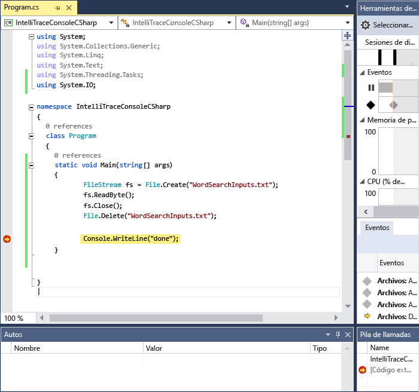
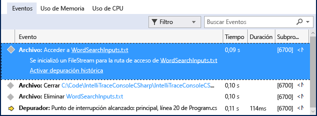
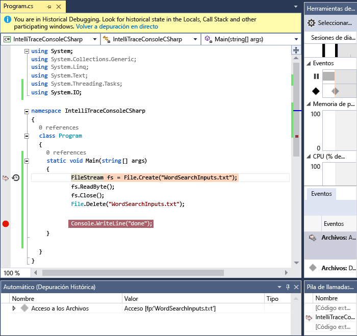

# <a name="view-events-with-intellitrace-in-visual-studio"></a>Ver eventos de IntelliTrace en Visual Studio
Puede usar IntelliTrace para recopilar información sobre determinados eventos, categorías de eventos o llamadas a funciones individuales. En los siguientes procedimientos se muestra cómo hacerlo.  
  
 Puede usar IntelliTrace en Visual Studio Enterprise edition, pero no en las ediciones Professional o Community.  
  
##  <a name="GettingStarted"></a>Configurar Intellitrace  
 Puede intentar depurar con solo los eventos de IntelliTrace. Los eventos de IntelliTrace son eventos del depurador, excepciones, eventos de .NET Framework y otros eventos del sistema. Antes de iniciar la depuración debe activar o desactivar eventos específicos para controlar los eventos que IntelliTrace registra. Para obtener más información, consulte [características de IntelliTrace](../debugger/intellitrace-features.md).  
  
 - Active el evento de IntelliTrace para el acceso de archivo. Vaya a la **Herramientas > Opciones > IntelliTrace > eventos de IntelliTrace** página y expanda el **archivo** categoría. Compruebe la categoría de eventos **Archivo** . Esto hace que se comprueben todos los eventos de archivo (acceso, cierre y eliminación).

## <a name="create-your-app"></a>Crear la aplicación
  
1.  Cree una aplicación de consola de C#. En el archivo Program.cs, agregue la siguiente declaración de `using`:  
  
    ```csharp  
    using System.IO;  
    ```  
  
2.  Cree un <xref:System.IO.FileStream> en el método Principal, lea de él, ciérrelo y elimine el archivo. Agregue otra línea solo para tener un sitio donde establecer un punto de interrupción:  
  
    ```csharp  
    static void Main(string[] args)  
    {  
        FileStream fs = File.Create("WordSearchInputs.txt");  
        fs.ReadByte();  
        fs.Close();  
        File.Delete("WordSearchInputs.txt");  
  
        Console.WriteLine("done");  
    }  
    ```  
  
3.  Establecer un punto de interrupción en `Console.WriteLine("done");`  

## <a name="start-debugging-and-view-intellitrace-events"></a>Inicie la depuración y ver los eventos de IntelliTrace
  
1.  Inicie la depuración como de costumbre. (Presione **F5** o haga clic en **Depurar > Iniciar depuración**.  
  
    > [!TIP]
    >  Mantener la **locales** y **automático** ventanas abiertas durante la depuración para ver y grabar los valores de esas ventanas.  
  
2.  La ejecución se detiene en el punto de interrupción. Si no ve el **herramientas de diagnóstico** ventana, haga clic en **Depurar > Windows > eventos de IntelliTrace**.  
  
     En la ventana **Herramientas de diagnóstico** , busque la pestaña **Eventos** (verá 3 pestañas: **Eventos**, **Uso de memoria**y **Uso de CPU**). La pestaña **Eventos** muestra una lista cronológica que termina con el último evento antes de que el depurador interrumpiera la ejecución. Debería ver un evento denominado **Acceso WordSearchInputs.txt**.  
  
     La siguiente captura de pantalla es de Visual Studio 2015 Update 1.  
  
       
  
3.  Selecciónelo para expandir los detalles.  
  
     La siguiente captura de pantalla es de Visual Studio 2015 Update 1.  
  
       
  
     Puede elegir el vínculo de la ruta de acceso para abrirlo. Si la ruta de acceso completa no está disponible, aparece el cuadro de diálogo **Abrir archivo** .  
  
     Haga clic en **Activar depuración histórica**, que establece el contexto del depurador en la hora en que el evento seleccionado se recopilan, muestra datos históricos la **pila de llamadas**, **locales** y las demás participan ventanas del depurador. Si el código fuente está disponible, Visual Studio mueve el puntero al código correspondiente en la ventana de código fuente para que pueda examinarlo.  
  
     La siguiente captura de pantalla es de Visual Studio 2015 Update 1.  
  
       
  
4.  Si no encontró el error, intente examinar otros eventos que conduzcan al error. También puede hacer que IntelliTrace registre la información de llamadas de forma que pueda examinar las llamadas a función una por una. 
  
## <a name="next-steps"></a>Pasos siguientes

Se pueden utilizar algunas de las características avanzadas de IntelliTrace con depuración histórica:

 - Para ver las instantáneas, vea [ver instantáneas mediante la devolución de paso de IntelliTrace](../debugger/how-to-use-intellitrace-step-back.md)
 - Para obtener información sobre cómo inspeccionar variables y navegar por el código, vea [inspeccionar la aplicación con depuración histórica](../debugger/historical-debugging-inspect-app.md)