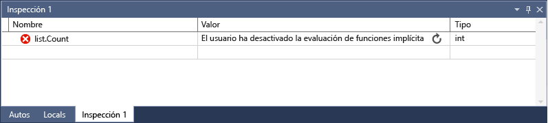

# <a name="watch-variables-with-watch-windows-and-quickwatch"></a>Inspección de variables con las ventanas Inspección e Inspección rápida

Mientras realiza la depuración, puede usar las ventanas **Inspección** e **Inspección rápida** para realizar una inspección de las variables y expresiones. Las ventanas solo están disponibles durante una sesión de depuración.

Las ventanas **Inspección** pueden mostrar varias variables a la vez durante la depuración. El cuadro de diálogo **Inspección rápida** muestra una sola variable a la vez y se debe cerrar antes de que pueda continuar la depuración.

> [!NOTE]
> Si esta es la primera vez que intenta depurar código, le recomendamos que lea [Cómo depurar para principiantes sin experiencia](../debugger/debugging-absolute-beginners.md) y [Herramientas y técnicas de depuración](../debugger/write-better-code-with-visual-studio.md) antes de continuar con este artículo.

## <a name="observe-variables-with-a-watch-window"></a>Consulta de las variables mediante una ventana Inspección

Puede abrir más de una ventana **Inspección** y consultar más de una variable en una ventana **Inspección**.

Por ejemplo, para establecer una inspección en los valores de `a`, `b`y `c` en el código siguiente:

```C++
int main()
{
    int a, b, c;
    a = 1;
    b = 2;
    c = 0;

    for (int i = 0; i < 10; i++)
    {
        a++;
        b *= 2;
        c = a + b;
    }

    return 0;
}

```

1. Establezca un punto de interrupción en la línea de `c = a + b;`. Para ello, haga clic en el margen izquierdo, seleccione **Depurar** > **Alternar punto de interrupción** o presione **F9**.

1. Para iniciar la depuración, seleccione la flecha verde **Inicio** o **Depurar** > **Iniciar depuración**, o presione **F5**. La ejecución se pone en pausa en el punto de interrupción.

1. Para abrir una ventana **Inspección**, seleccione **Depurar** > **Windows** > **Inspección** > **Inspección 1**, o bien presione **Ctrl**+**Alt**+**W** > **1**.

   Para abrir otras ventanas **Inspección**, seleccione ventanas **2**, **3** o **4**.

1. En la ventana **Inspección**, seleccione una fila vacía y escriba la variable `a`. Haga lo mismo para `b` y `c`.

   

1. Para continuar con la depuración, seleccione **Depurar** > **Depurar paso a paso por instrucciones** o presione **F11** según sea necesario para avanzar. Los valores de variable en la ventana **Inspección** cambian durante la iteración en el bucle `for`.

>[!NOTE]
>Solo en C++
>- Es posible que deba calificar el contexto de un nombre de variable o una expresión que use un nombre de variable. El contexto es la función, el archivo de código fuente o el módulo donde se encuentra una variable. Si tiene que calificar el contexto, use la sintaxis del [operador de contexto (C++)](../debugger/context-operator-cpp.md) en el **nombre** de la ventana **Inspección**.
>
>- Puede agregar nombres de registro y nombres de variable mediante **$\<register&nbsp;name>** o **@\<register&nbsp;name>** al **Nombre** en la ventana **Inspección**. Para obtener más información, consulta [Pseudovariables](../debugger/pseudovariables.md).

## <a name="use-expressions-in-a-watch-window"></a>Uso de expresiones en una ventana Inspección

Puede observar cualquier expresión válida reconocida por el depurador en una ventana **Inspección**.

Por ejemplo, para el código de la sección anterior, puede obtener el promedio de los tres valores especificando `(a + b + c) / 3` en la ventana **Inspección**:


Las reglas de evaluación de expresiones de la ventana **Inspección** son generalmente las mismas que en el lenguaje de programación. Si una expresión tiene un error de sintaxis, espere el mismo error del compilador que se produciría en el editor de código. Por ejemplo, un error ortotipográfico en la expresión anterior produce este error en la ventana **Inspección**:


Puede aparecer un círculo con dos líneas onduladas en la ventana **Inspección**. Este icono significa que el depurador no evalúa la expresión debido a una posible dependencia entre subprocesos. La evaluación del código requiere que otros subprocesos de la aplicación se ejecuten de forma temporal, pero, como está en modo de interrupción, se suelen detener todos los subprocesos de la aplicación. Permitir que otros subprocesos se ejecuten temporalmente puede tener efectos inesperados en el estado de su aplicación. Además, es posible que el depurador omita algunos eventos, como los puntos de interrupción o las excepciones de dichos subprocesos.

::: moniker range=">= vs-2019" 
## <a name="search-in-the-watch-window"></a>Búsqueda en la ventana Inspección

Puede buscar palabras clave en las columnas Nombre, Valor y Tipo de la ventana **Inspección** mediante la barra de búsqueda situada encima de cada ventana. Presione Entrar o seleccione una de las flechas para ejecutar una búsqueda. Para cancelar una búsqueda en curso, seleccione el icono "x" en la barra de búsqueda.

Use las flechas izquierda y derecha (Mayús+F3 y F3, respectivamente) para desplazarse por las coincidencias encontradas.


Para que la búsqueda sea más o menos exhaustiva, use la lista desplegable **Profundizar la búsqueda** en la parte superior de la ventana **Inspección** para seleccionar cuántos niveles de profundidad quiere buscar en objetos anidados. 

## <a name="pin-properties-in-the-watch-window"></a>Anclado de propiedades en la ventana Inspección

>[!NOTE]
> Esta característica se admite en .NET Core 3.0 o versiones posteriores.

Puede inspeccionar rápidamente los objetos según sus propiedades en la ventana Inspección con la **herramienta para anclar propiedades**.  Para usar esta herramienta, mantenga el puntero sobre una propiedad y seleccione el icono para anclar que aparece o haga clic con el botón derecho y seleccione la opción **Anclar miembro como favorito** en el menú contextual resultante.  Esta propiedad se propaga a la parte superior de la lista de propiedades del objeto, y el nombre y el valor de la propiedad se muestran en la columna **Valor**.  Para desanclar una propiedad, vuelva a seleccionar el icono para anclar o seleccione la opción **Desanclar miembro como favorito** en el menú contextual.


También puede alternar los nombres de propiedades y filtrar las no ancladas al consultar la lista de propiedades del objeto en la ventana Inspección.  Puede acceder a ambas opciones seleccionando los botones en la barra de herramientas situada encima de la ventana Inspección.

::: moniker-end

### <a name="refresh-watch-values"></a><a name="bkmk_refreshWatch"></a> Actualización de los valores de inspección

Es posible que aparezca un icono de actualización (flecha circular) en la ventana **Inspección** al evaluar una expresión. El icono de actualización indica un error o un valor que no está actualizado.

Para actualizar el valor, seleccione el icono de actualización o presione la barra espaciadora. El depurador intenta evaluar de nuevo la expresión. Sin embargo, es posible que no quiera o pueda volver a evaluar la expresión, en función de la razón por la que no se haya evaluado el valor.

Mantenga el puntero sobre el icono de actualización o vea la columna **Valor** para conocer el motivo por el que no se ha evaluado la expresión. Entre los motivos se incluyen:

- Ha habido un error al evaluar la expresión, como en el ejemplo anterior. Es posible que se agote el tiempo de espera o que una variable esté fuera del ámbito.

- La expresión tiene una llamada de función que puede desencadenar un efecto secundario en la aplicación. Vea [Efectos secundarios de la expresión](#bkmk_sideEffects).

- La evaluación automática de las propiedades y las llamadas de función implícitas está deshabilitada.

Si el icono de actualización aparece porque la evaluación automática de las propiedades y las llamadas de función implícitas está deshabilitada, puede habilitarla seleccionando **Habilitar evaluación de propiedades y otras llamadas a función implícitas** en **Herramientas** > **Opciones** > **Depuración** > **General**.

Para mostrar el uso del icono de actualización:

1. En **Herramientas** > **Opciones** > **Depuración** > **General**, desactive la casilla **Habilitar evaluación de propiedades y otras llamadas a función implícitas**.

1. Escriba el código siguiente y, en la ventana **Inspección**, establezca una inspección en la propiedad `list.Count`.

   ```csharp
   static void Main(string[] args)
   {
       List<string> list = new List<string>();
       list.Add("hello");
       list.Add("goodbye");
   }
   ```

1. Inicie la depuración. En la ventana **Inspección** se muestra un mensaje similar al siguiente:

   

1. Para actualizar el valor, seleccione el icono de actualización o presione la barra espaciadora. El depurador vuelve a evaluar la expresión.

### <a name="expression-side-effects"></a><a name="bkmk_sideEffects"></a> Efectos secundarios de la expresión

La evaluación de algunas expresiones puede cambiar el valor de una variable o afectar de otra forma al estado de la aplicación. Por ejemplo, la evaluación de la siguiente expresión cambia el valor de `var1`:

```csharp
var1 = var2
```

Este código puede producir un [efecto secundario](https://en.wikipedia.org/wiki/Side_effect_\(computer_science\)). Los efectos secundarios pueden dificultar la depuración al cambiar la forma en la que funciona su aplicación.

Una expresión con efectos secundarios se evalúa solo una vez: cuando se escribe por primera vez. Después, la expresión aparece en gris en la ventana **Inspección** y se deshabilitan otras evaluaciones. La información sobre herramientas o la columna **Valor** explica que la expresión produce un efecto secundario. Para forzar la reevaluación, seleccione el icono de actualización que aparece junto al valor.

Una manera de evitar la designación de efectos secundarios es desactivar la evaluación automática de funciones. En **Herramientas** > **Opciones** > **Depuración** > **General**, anule la selección de **Habilitar evaluación de propiedades y otras llamadas a función implícitas**.

Solo en C#, cuando se desactiva la evaluación de propiedades o de las llamadas a funciones implícitas, puede forzar la evaluación agregando el modificador de formato **ac** a una variable **Nombre** en la ventana **Inspección**. Vea [Format Specifiers in C#](../debugger/format-specifiers-in-csharp.md) (Especificadores de formato en C#).

## <a name="use-object-ids-in-the-watch-window-c-and-visual-basic"></a><a name="bkmk_objectIds"></a> Uso de los identificadores de objeto en la ventana Inspección (C# y Visual Basic)

Hay ocasiones en las que se quiere observar el comportamiento de un objeto concreto. Por ejemplo, puede que quiera realizar el seguimiento de un objeto al que hace referencia una variable local después de que dicha variable haya dejado de estar en el ámbito del objeto. En C# y Visual Basic, puede crear identificadores de objetos para instancias específicas de tipos y usarlos en la ventana **Inspección** y en condiciones de interrupción. Los servicios de depuración de Common Language Runtime (CLR) generan el identificador de objeto y lo asocian al objeto.

> [!NOTE]
> Los identificadores de objeto crean referencias débiles y no impiden que el objeto se recopile en la recolección de elementos no utilizados. Los identificadores de objeto solo son válidos para la sesión de depuración actual.

En el código siguiente, el método `MakePerson()` crea `Person` mediante una variable local:

```csharp
class Person
{
    public Person(string name)
    {
        Name = name;
    }
    public string Name { get; set; }
}

public class Program
{
    static List<Person> _people = new List<Person>();
    public static void Main(string[] args)
    {
        MakePerson();
        DoSomething();
    }

    private static void MakePerson()
    {
        var p = new Person("Bob");
        _people.Add(p);
    }

    private static void DoSomething()
    {
        // more processing
         Console.WriteLine("done");
    }
}
```

Para averiguar el nombre de `Person` en el método `DoSomething()`, puede agregar una referencia al identificador de objeto `Person` en la ventana **Inspección**.

1. Establezca un punto de interrupción en el código después de que se haya creado el objeto `Person`.

1. Inicie la depuración.

1. Cuando la ejecución se ponga en pausa en el punto de interrupción, abra la ventana **Variables locales**, en **Depurar** > **Windows** > **Variables locales**.

1. En la ventana **Variables locales**, haga clic con el botón derecho en la variable `Person` y seleccione **Crear el identificador del objeto**.

   Debería ver un signo de dólar ( **$** ), además de un número en la ventana **Variables locales**, que es el identificador de objeto.

1. Para agregar el identificador de objeto a la ventana **Inspección**, haga clic con el botón derecho en el identificador de objeto y seleccione **Agregar inspección**.

1. Establezca otro punto de interrupción en el método `DoSomething()`.

1. Continúe la depuración. Cuando la ejecución se ponga en pausa en el método `DoSomething()`, la ventana **Inspección** mostrará el objeto `Person`.

   > [!NOTE]
   > Si quiere ver las propiedades del objeto, como `Person.Name`, debe habilitar la evaluación de propiedades. Para ello, seleccione **Herramientas** > **Opciones** > **Depuración** > **General** > **Habilitar evaluación de propiedades y otras llamadas a función implícitas**.

## <a name="dynamic-view-and-the-watch-window"></a>Vista dinámica y ventana Inspección

Algunos lenguajes de scripting (por ejemplo, JavaScript o Python) usan escritura [duck](https://en.wikipedia.org/wiki/Duck_typing) o dinámica, y .NET 4.0 y versiones posteriores admiten objetos que son difíciles de observar en las ventanas de depuración normales.

En la ventana **Inspección** se muestran estos objetos como objetos dinámicos, que se crean a partir de tipos que implementan la interfaz de <xref:System.Dynamic.IDynamicMetaObjectProvider>. Los nodos de objetos dinámicos muestran los miembros dinámicos de los objetos dinámicos, pero no permiten editar los valores del miembro.

Para actualizar valores de la **vista dinámica**, seleccione el [icono de actualización](#bkmk_refreshWatch) situado junto al nodo de objeto dinámico.

Para mostrar solo la **vista dinámica** de un objeto, agregue un especificador de formato de **dinámico** después del nombre del objeto dinámico en la ventana **Inspección**:

- Para C#: `ObjectName, dynamic`
- Visual Basic: `$dynamic, ObjectName`

>[!NOTE]
>- El depurador de C# no vuelve a evaluar automáticamente los valores de la **vista dinámica** cuando se pasa a una nueva línea de código.
>- El depurador de Visual Basic actualiza automáticamente las expresiones agregadas a través de la **vista dinámica**.
>- La evaluación de los miembros de una **vista dinámica** puede tener [efectos secundarios](https://en.wikipedia.org/wiki/Side_effect_\(computer_science\)).

**Para insertar una nueva variable de inspección que convierta un objeto en un objeto dinámico:**

1. Haga clic con el botón derecho en cualquier elemento secundario de una **vista dinámica**.
1. Elija **Agregar inspección**. `object.name` se convierte en `((dynamic) object).name` y aparece en una nueva ventana **Inspección**.

El depurador también agrega un nodo secundario de la **vista dinámica** del objeto a la ventana **Automático**. Para abrir la ventana **Automático**, durante la depuración, seleccione **Depurar** > **Windows** > **Automático**.

La **vista dinámica** también mejora la depuración para los objetos COM. Cuando el depurador obtiene un objeto COM encapsulado en **System.__ComObject**, agrega un nodo **Vista dinámica** para el objeto.

## <a name="observe-a-single-variable-or-expression-with-quickwatch"></a>Consultar una sola variable o expresión con Inspección rápida

Puede usar la **Inspección rápida** para observar una única variable.

Por ejemplo, para el código siguiente:

```csharp
static void Main(string[] args)
{
    int a, b;
    a = 1;
    b = 2;
    for (int i = 0; i < 10; i++)
    {
        a = a + b;
    }
}
```

Para observar la variable `a`:

1. Establezca un punto de interrupción en la línea `a = a + b;` .

1. Inicie la depuración. La ejecución se pone en pausa en el punto de interrupción.

1. Seleccione la variable `a` en el código.

1. Seleccione **Depurar** > **Inspección rápida**, presione **Mayús**+**F9** o haga clic con el botón derecho y seleccione **Inspección rápida**.

   Aparece el cuadro de diálogo **Inspección rápida**. La variable `a` está en el cuadro **Expresión** con un **valor** de **1**.

   

1. Para evaluar una expresión mediante la variable, escriba una expresión, como `a + b`, en el cuadro **Expresión** y seleccione **Volver a evaluar**.

   

1. Para agregar la variable o expresión de **Inspección rápida** a la ventana **Inspección**, seleccione **Agregar inspección**.

1. Seleccione **Cerrar** para cerrar la ventana **Inspección rápida**. (**Inspección rápida** es un cuadro de diálogo modal, por lo que no puede continuar con la depuración mientras está abierta).

1. Continúe la depuración. Puede observar la variable en la ventana **Inspección**.

## <a name="see-also"></a>Vea también
- [¿Qué es la depuración?](../debugger/what-is-debugging.md)
- [Herramientas y técnicas de depuración](../debugger/write-better-code-with-visual-studio.md)
- [Primer vistazo a la depuración](../debugger/debugger-feature-tour.md)
- [Ventanas del depurador](../debugger/debugger-windows.md)
