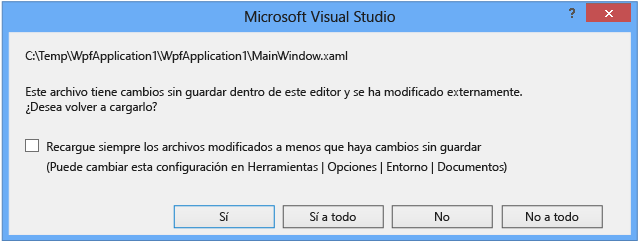

# Diseño de XAML en Visual Studio

Las herramientas visuales de Visual Studio y Blend para Visual Studio permiten crear interfaces de usuario atractivas y experiencias multimedia enriquecidas con XAML para diversos tipos de aplicaciones. Ambas herramientas comparten un conjunto común de características que incluyen un editor XAML visual, pero Blend para Visual Studio proporciona herramientas de diseño adicionales para tareas más avanzadas, como la animación y los comportamientos.

El proceso de diseño de una aplicación depende de la herramienta que elija y de su plataforma de destino. En este artículo se comparan las herramientas de diseño XAML en Visual Studio y en Blend para Visual Studio. Para obtener tutoriales más detallados sobre el uso de las herramientas, vea los temas siguientes:

- [Crear una UI con el Diseñador XAML en Visual Studio](creating-a-ui-by-using-xaml-designer-in-visual-studio.md)
- [Creación de una interfaz de usuario con Blend para Visual Studio](creating-a-ui-by-using-blend-for-visual-studio.md)

## Elegir la herramienta adecuada

La elección de las herramientas de diseño depende en gran medida de sus habilidades. Si está más orientado al código, puede escribir código XAML en Visual Studio para llevar a cabo tareas de diseño avanzadas. Si está más orientado al diseño, Blend para Visual Studio le permite realizar tareas avanzadas sin escribir código.

Puede alternar entre Visual Studio y Blend para Visual Studio, e incluso puede tener el mismo proyecto abierto en ambos al mismo tiempo. Los cambios realizados en los archivos XAML en un IDE pueden aplicarse a través de recarga automática cuando se cambia al otro IDE. Puede controlar el comportamiento de recarga a través de las opciones en el cuadro de diálogo **Herramientas** > **Opciones** en cualquiera de los dos IDE.

### Funcionalidades compartidas

Para realizar las tareas más básicas, los IDE de Visual Studio y de Blend para Visual Studio comparten el mismo conjunto de ventanas y funcionalidades, con algunas diferencias sutiles. Entre los aspectos destacados se incluyen:

- **Una interfaz de usuario coherente:** las aplicaciones se pueden diseñar en el contexto familiar de la interfaz de usuario de Visual Studio, que permite cambiar entre los IDE de manera más agradable y productiva. Blend para Visual Studio usa el tema oscuro de Visual Studio, lo que le ayuda a centrarse en el contenido que está diseñando, ya que mejora el contraste entre el contenido y la interfaz de usuario. Vea [Crear una IU con el Diseñador XAML](../designers/creating-a-ui-by-using-xaml-designer-in-visual-studio.md).

     

- **IntelliSense en XAML:** los dos IDE admiten todas las funcionalidades comunes que cabe esperar de IntelliSense, incluida la finalización de instrucciones, la compatibilidad con operaciones comunes de editor, como comentar y dar formato al código, y la navegación a los recursos, los enlaces y el código.

- **Funciones básicas de depuración:** ahora se puede depurar en Blend, e incluso establecer puntos de interrupción en el código para depurar la aplicación en ejecución. Para mantener una experiencia de depuración coherente con Visual Studio, Blend para Visual Studio incluye la mayoría de las barras de herramientas y ventanas de depuración de Visual Studio. Las funcionalidades de depuración avanzadas, como el diagnóstico y el análisis de código, solo están disponibles en Visual Studio. Vea [Depurar en Visual Studio](../debugger/debugger-feature-tour.md).

- **Experiencia de recarga de archivos:** tanto si los archivos XAML se editan en Blend para Visual Studio como en Visual Studio, los archivos editados se recargarán de forma automática al cambiar de uno a otro. Para minimizar las interrupciones del flujo de trabajo, ahora puede establecer las preferencias de recarga de archivos en el cuadro de diálogo de recarga de archivos.

     

- **Diseños y configuraciones sincronizados:** los diseños personalizados permiten guardar y aplicar las personalizaciones de diseño de la ventana de herramientas. Visual Studio sincroniza estas personalizaciones y preferencias de Visual Studio y Blend para Visual Studio en los equipos cuando inicia sesión con la misma cuenta de Microsoft. Vea [Sincronizar la configuración de Visual Studio en varios equipos](../ide/synchronized-settings-in-visual-studio.md).

- **Explorador de soluciones común:** el **Explorador de soluciones** proporciona una vista organizada de los proyectos y los archivos, así como acceso a los comandos asociados a ellos. Con el Explorador de soluciones, es más fácil trabajar con proyectos empresariales grandes. Vea [Soluciones y proyectos](../ide/solutions-and-projects-in-visual-studio.md).

- **Team Explorer:** con Team Explorer se pueden administrar los proyectos con repositorios GIT o TFS para facilitar la colaboración en equipo. Consulte [Trabajar en Team Explorer](/azure/devops/user-guide/work-team-explorer).

- **NuGet:** los paquetes NuGet se pueden administrar en Visual Studio y Blend para Visual Studio. NuGet es un administrador de paquetes para .NET que simplifica la instalación y la eliminación de paquetes de una solución.

## Funcionalidades avanzadas de Blend para Visual Studio

Para aumentar la productividad, considere el uso de Blend para Visual Studio para las siguientes tareas. Estas son las áreas en las que Blend para Visual Studio ofrece más velocidad y funcionalidad que el diseñador de Visual Studio o el código por sí solos.

|En|Programa para la mejora|Blend para Visual Studio|Más información|
|--------|-------------------| - | - |
|**Crear animaciones**|No hay ninguna herramienta de diseño para animaciones; debe crearse mediante programación. Esto requiere tener conocimientos del sistema de animación y temporización en WPF y una amplia experiencia en codificación.|Puede crear animaciones visualmente y verlas previamente en Blend para Visual Studio. Esto es más rápido y preciso que la compilación de las animaciones en el código. Puede agregar desencadenadores para controlar la interacción del usuario y puede cambiar al código para agregar controladores de eventos y otras funciones.|[Animar objetos](../designers/animate-objects-in-xaml-designer.md)|
|**Convertir formas y texto en trazados para una manipulación más fácil**|No se admite.|Puede realizar cambios sutiles o espectaculares en las formas (como rectángulos y elipses) si las convierte en trazados, logrando así un mejor control de la edición. Puede cambiar la forma de los trazados, combinarlo y crear trazados compuestos de varias formas.   También puede convertir bloques de texto en trazados para manipularlos como imágenes vectoriales.|[Dibujar formas y trazados](../designers/draw-shapes-and-paths.md)|
|**Agregar interactividad a los diseños de interfaz de usuario**|Requiere código de C#, Visual Basic o C++.|Arrastre y coloque comportamientos en los controles para agregar interactividad a los diseños estáticos. Los comportamientos son fragmentos de código listos para usar que encapsulan funcionalidades como arrastrar y colocar, zoom y cambios de estado visual. Hay un conjunto cada vez mayor de comportamientos entre los que puede elegir, pero también puede crear los suyos propios.   Después puede personalizar cada comportamiento mediante la modificación de sus propiedades en Blend para Visual Studio o la adición de controladores de eventos en código.|[Insertar controles y modificar su comportamiento](../designers/insert-controls-and-modify-their-behavior-in-xaml-designer.md)|
|**Usar material gráfico de Adobe**|No se admite.|Importe material gráfico de Adobe FXG, PhotoShop o Illustrator e implemente la interfaz de usuario en Blend para Visual Studio.|[Insertar imágenes, vídeos y clips de audio](../designers/insert-images-videos-and-audio-clips-in-xaml-designer.md)|
|**Editar controles, plantillas y estilos**|Requiere codificación y conocimientos de plantillas y estilos WPF.|Convierta cualquier imagen en un control.   Utilice las herramientas de edición de plantillas para realizar cambios en controles, estilos y plantillas con unos pocos clics del ratón.   Por ejemplo, puede usar recursos de estilo de Blend para Visual Studio para implementar controles WPF comunes (como botones, cuadros de lista, barras de desplazamiento, menús, etc.) y cambiar su color, estilo o plantilla subyacente directamente en Blend para Visual Studio. A continuación, puede cambiar a código para dar los últimos retoques si lo desea.|[Modificar el estilo de objetos](../designers/modify-the-style-of-objects-in-blend.md)|
|**Conectar la interfaz de usuario a los datos**|Puede crear un origen de datos a partir de recursos como bases de datos de SQL Server, servicios web o WCF, objetos o listas de SharePoint y enlazar el origen de datos a los controles de la interfaz de usuario.   Los datos en tiempo de diseño deben crearse manualmente para una experiencia de diseño interactivo.|Cree fácilmente datos de ejemplo para prototipos y pruebas y cambie a datos reales cuando esté listo.   Las capacidades de generación de datos de Blend para Visual Studio son excepcionales (puede agregar nombres, números, direcciones URL y fotografías de manera fácil y rápida) y pueden ahorrarle mucho tiempo.   Para datos reales, puede enlazar los controles de interfaz de usuario a un archivo XML o a cualquier origen de datos CLR.|[Mostrar datos](../designers/display-data-in-blend.md)|

Para obtener más información sobre el diseño XAML avanzado, vea [Creación de una interfaz de usuario con Blend para Visual Studio](../designers/creating-a-ui-by-using-blend-for-visual-studio.md).
