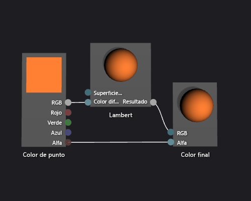

# Cómo: Crear un sombreador Lambert básico

En este artículo se muestra cómo usar el Diseñador de sombras y el lenguaje DGSL (Directed Graph Shader Language) para crear un sombreador de iluminación que implementa el modelo de iluminación de Lambert clásico.

## El modelo de iluminación de Lambert

El modelo de iluminación de Lambert incorpora iluminación ambiental y direccional para sombrear objetos en una escena 3D. Los componentes ambientales proporcionan un nivel de iluminación base en la escena 3D. Los componentes direccionales proporcionan iluminación adicional de fuentes de luz direccionales (lejanas). La iluminación ambiental afecta a todas las superficies de la escena igualmente, sin importar su orientación. Para una superficie determinada, es el producto del color de ambiente de la superficie y del color y la intensidad de la luz ambiental en la escena. La iluminación direccional afecta a cada superficie de la escena de manera diferente, en función de la orientación de la superficie con respecto a la dirección de la fuente de luz. Es un producto del color difuso y la orientación de la superficie, y del color, la intensidad y la dirección de las fuentes de luz. Las superficies que miran directamente hacia la fuente de luz reciben la máxima contribución y las superficies que miran directamente al otro lado no reciben ninguna contribución. Bajo el modelo de iluminación de Lambert, se combinan el componente ambiental y uno o más componentes direccionales para determinar la contribución de color difuso total para cada punto del objeto.

Antes de empezar, asegúrese de que se muestran la ventana **Propiedades** y el **Cuadro de herramientas**.

1.  Cree un sombreador DGSL con el que trabajar. Para obtener información sobre cómo agregar un sombreador DGSL al proyecto, vea la sección Introducción de [Diseñador de sombras](../designers/shader-designer.md).

2.  Desconecte el nodo **Color de punto** del nodo **Color final**. Elija el terminal **RGB** del nodo **Color de punto** y, después, elija **Romper vínculos**. Deje el terminal **Alfa** conectado.

3.  Agregue un nodo **Lambert** al gráfico. En el **Cuadro de herramientas**, en **Utilidad**, seleccione **Lambert** y muévalo a la superficie de diseño. El nodo Lambert calcula la contribución de color difuso total del píxel, en función de parámetros de iluminación ambiente y difusa.

4.  Conecte el nodo **Color de punto** al nodo **Lambert**. En modo **Seleccionar**, mueva el terminal **RGB** del nodo **Color de punto** al terminal **Color difuso** del nodo **Lambert**. Esta conexión proporciona al nodo Lambert el color difuso interpolado del píxel.

5.  Conecte el valor de color calculado al color final. Mueva el terminal **Salida** del nodo **Lambert** al terminal **RGB** del nodo **Color final**.

 La ilustración siguiente muestra el gráfico de sombreador completo y una vista previa del sombreador aplicado a un modelo de tetera.

> [!NOTE]
> Para demostrar mejor el efecto del sombreador en esta ilustración, se especificó un color naranja mediante el parámetro **MaterialDiffuse** del sombreador. Un juego o una aplicación puede usar este parámetro para proporcionar un valor de color único para cada objeto. Para obtener información sobre los parámetros de materiales, vea la sección Vista previa de sombreadores en [Diseñador de sombras](../designers/shader-designer.md).

 

 Es posible que algunas formas proporcionen mejores vistas previas para algunos sombreadores. Para más información sobre cómo obtener una vista previa de los sombreadores en el Diseñador de sombras, vea la sección Vista previa de sombreadores en [Diseñador de sombras](../designers/shader-designer.md).

 La siguiente ilustración muestra el sombreador descrito en este documento aplicado a un modelo 3D.

 

 Para más información sobre cómo aplicar un sombreador a un modelo 3D, vea [Cómo: Aplicar un sombreador a un modelo 3D](../designers/how-to-apply-a-shader-to-a-3-d-model.md).

## Vea también

- [Cómo: Aplicar un sombreador a un modelo en 3D](../designers/how-to-apply-a-shader-to-a-3-d-model.md)
- [Cómo: Exportar un sombreador](../designers/how-to-export-a-shader.md)
- [Cómo: Crear un sombreador Phong básico](../designers/how-to-create-a-basic-phong-shader.md)
- [Diseñador de sombras](../designers/shader-designer.md)
- [Nodos del Diseñador de sombras](../designers/shader-designer-nodes.md)