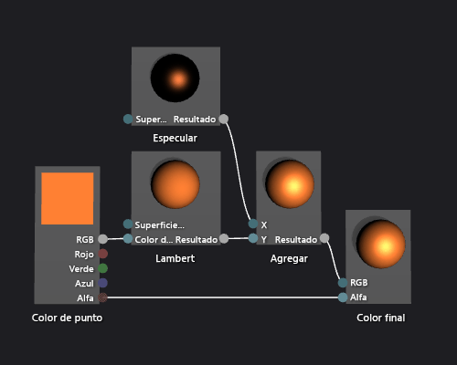

# C&#243;mo: Crear un sombreador Phong b&#225;sico
[!INCLUDE[vs2017banner](../code-quality/includes/vs2017banner.md)]

En este documento se muestra cómo usar el Diseñador de sombras y el lenguaje DGSL \(Directed Graph Shader Language\) para crear un sombreador de iluminación que implementa el modelo de iluminación de Phong clásico.  
  
 En este documento se muestran estas actividades:  
  
-   Nodos a un gráfico de presentación  
  
-   Desconectarse de nodos  
  
-   Conectar nodos  
  
## El modelo de iluminación de Phong  
 El modelo de iluminación de Phong extiende el modelo de iluminación de Lambert para incluir reflejos especulares, que simulan las propiedades brillantes de una superficie.  El componente especular proporciona iluminación adicional de las mismas fuentes de iluminación direccionales que se utilizan en el modelo de iluminación de Lamberto, pero su contribución al final color se procesa de manera diferente.  El resaltado especular afecta a cada superficie en la escena de manera diferente, en función de la relación entre la dirección de la vista, la dirección de luz, y la orientación de la superficie.  Es un producto de color especular, la eficacia especular, y la orientación de la superficie, y el color, la intensidad, y la dirección de luz.  Superficies que reflejan la fuente de luz directamente en el visor reciben la contribución y las superficies especulares máximas que reflejan la fuente de luz fuera del visor no reciben ninguna contribución.  Bajo el modelo de iluminación de Phong, combinan para determinar el color y la intensidad de resaltar especular para cada punto del objeto, y después se agregan uno o más componentes especulares en el resultado del modelo de iluminación de Lamberto para generar el color final del píxel.  
  
 Para obtener más información acerca del modelo de iluminación Lambert, vea [Cómo: Crear un sombreador Lambert básico](../designers/how-to-create-a-basic-lambert-shader.md).  
  
 Antes de empezar, asegúrese de que se muestran la ventana **Propiedades** y el **Cuadro de herramientas**.  
  
#### Para crear un sombreador Phong  
  
1.  Cree un sombreador de Lamberto, como se describe en [Cómo: Crear un sombreador Lambert básico](../designers/how-to-create-a-basic-lambert-shader.md).  
  
2.  Desconecte el nodo de **Lambert** de nodo de **Color final** .  Elija el terminal de **RGB** de nodo de **Lambert** , y elija **Romper vínculos**.  Esto hace sitio para el nodo que se agrega en el paso siguiente.  
  
3.  Agregue un nodo de **Add** al gráfico.  En **Cuadro de herramientas**, en **Matemáticas**, seleccione **Add** y muévalo a la superficie de diseño.  
  
4.  Agregue un nodo de **Especular** al gráfico.  En el **Cuadro de herramientas**, en **Utilidad**, seleccione **Especular** y muévalo a la superficie de diseño.  
  
5.  Agregue la contribución especular.  Mueva el terminal de **salida** de nodo de **Especular** el terminal de **X** de nodo de **Add** , y después mueva el terminal de **salida** de nodo de **Lambert** el terminal de **s** de nodo de **Add** .  Estas conexiones combinan las contribuciones de color difusas y especulares totales del píxel.  
  
6.  Conectar el valor de color calculado al color final.  Mueva el terminal de **salida** de nodo de **Add** el terminal de **RGB** de nodo de **Color final** .  
  
 La siguiente ilustración muestra el gráfico de sombreador completo y una vista previa del sombreador aplicado a un modelo de tetera.  
  
> [!NOTE]
>  Para ilustrar mejor el efecto de presentación en esta ilustración, color naranja se ha especificado mediante el parámetro de **MaterialDiffuse** de presentación, y una metálico\- apariencia acabada se ha especificado mediante los parámetros de **MaterialSpecular** y de **MaterialSpecularPower** .  Para obtener información sobre parámetros materiales, vea la sección sobre los sombreadores previewing de en [Diseñador de sombras](../designers/shader-designer.md).  
  
   
  
 Algunas formas podrían dar mejores vistas previas para algunos los sombreadores.  Para obtener más información sobre cómo obtener una vista previa de los sombreadores del Sombreador Designer, vea la sección de los sombreadores previewing de en [Diseñador de sombras](../designers/shader-designer.md)  
  
 La siguiente ilustración muestra el sombreador descrito en este documento aplicado a un modelo 3D.  La propiedad **MaterialSpecular** se establece en \(1,00, 0,50, 0,20, 0,00\), y su propiedad **MaterialSpecularPower** se establece en 16.  
  
> [!NOTE]
>  La propiedad **MaterialSpecular** determina el acabado aparente del material de la superficie.  Una superficie muy brillante como un cristal o plástico suele tener un color especular que es una sombra brillante de blanco.  Una superficie metálica suele tener un color especular próximo al color difuso.  Una superficie acabada con efecto satinado suele tener un color especular que es una sombra gris oscuro.  
>   
>  La propiedad **MaterialSpecularPower** determina la intensidad de los reflejos especulares.  Altos potencias especulares simulan más opaco, más\- localizado resaltan.  Muy bajo los potencias especulares simulan intenso, el barrer resalta que puede oversaturate y ocultar el color de la superficie entera.  
  
   
  
 Para obtener más información sobre cómo aplicar un sombreador a un modelo 3D, vea [Cómo: Aplicar un sombreador a un modelo 3D](../designers/how-to-apply-a-shader-to-a-3-d-model.md).  
  
## Vea también  
 [Cómo: Aplicar un sombreador a un modelo 3D](../designers/how-to-apply-a-shader-to-a-3-d-model.md)   
 [Cómo: Exportar un sombreador](../designers/how-to-export-a-shader.md)   
 [Cómo: Crear un sombreador Lambert básico](../designers/how-to-create-a-basic-lambert-shader.md)   
 [Diseñador de sombras](../designers/shader-designer.md)   
 [Nodos del Diseñador de sombras](../designers/shader-designer-nodes.md)