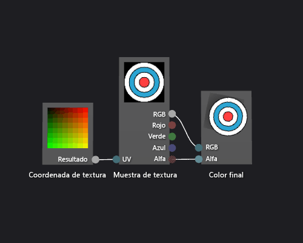

# C&#243;mo: Crear un sombreador de textura b&#225;sico
[!INCLUDE[vs2017banner](../code-quality/includes/vs2017banner.md)]

En este documento se muestra cómo usar el Diseñador de sombras y el lenguaje DGSL \(Directed Graph Shader Language\) para crear un sombreador de textura única.  Este sombreador establece directamente el color final a los valores RGB y alfa muestreados de la textura.  
  
 En este documento se muestran estas actividades:  
  
-   Quitar nodos de un gráfico de presentación  
  
-   Agregar nodos a un gráfico  
  
-   Parámetros del sombreador de valor  
  
-   Visibilidad del parámetro value  
  
-   Conectar nodos  
  
## Crear un sombreador básico de texturas  
 Puede implementar un sombreador básico de una sola textura escribiendo los valores de color y alfa de una muestra de textura directamente en el color del resultado final.  
  
 Antes de empezar, asegúrese de que se muestran la ventana **Propiedades** y el **Cuadro de herramientas**.  
  
#### Para crear un sombreador de textura básico  
  
1.  Cree un sombreador DGSL con el que trabajar.  Para obtener información sobre cómo agregar un sombreador DGSL al proyecto, vea la sección Introducción de [Diseñador de sombras](../designers/shader-designer.md).  
  
2.  Elimine el nodo **Color de punto**.  En el modo **Seleccionar**, seleccione el nodo **punto Color** y, a continuación, en la barra de menús, elija **Editar**, **Eliminar**.  Esto hace sitio para el nodo que se agrega en el paso siguiente.  
  
3.  Agregue un nodo de **Ejemplo de textura** al gráfico.  En el **Cuadro de herramientas**, en **Textura**, seleccione **Ejemplo de textura** y muévalo a la superficie de diseño.  
  
4.  Agregue un nodo de **Coordenadas de textura** al gráfico.  En el **Cuadro de herramientas**, en **Textura**, seleccione **Coordenada de textura** y muévala a la superficie de diseño.  
  
5.  Elija una textura para aplicar.  En el modo de **activada** , seleccione el nodo de **Muestra de textura** y, en la ventana de **Propiedades** , especifican la textura que desea usar mediante la propiedad de **Nombre de archivo** .  
  
6.  Cree la textura públicamente accesible.  Seleccione el nodo de **Muestra de textura** y, en la ventana de **Propiedades** , establezca la propiedad de **Acceso** a **Público**.  Ahora puede establecer la textura desde otra herramienta, como el **Editor de modelos**.  
  
7.  Conecte las coordenadas de textura a la muestra de textura.  En el modo **Seleccionar**, mueva el terminal **Resultado** del nodo **Coordenada de textura** al terminal **UV** del nodo **Muestra de textura**.  Esta conexión muestrea la textura en las coordenadas especificadas.  
  
8.  Conectar el ejemplo de textura al color final.  Mueva el terminal de **RGB** de nodo de **Muestra de textura** el terminal de **RGB** de nodo de **Color final** , y después mueva el terminal de **Alfa** de nodo de **Muestra de textura** el terminal de **Alfa** de nodo de **Color final** .  
  
 La siguiente ilustración muestra el gráfico de sombreador completo y una vista previa del sombreador aplicado a un cubo.  
  
> [!NOTE]
>  En esta ilustración, se utiliza un plano como la vista previa, y una textura se ha especificado para ilustrar mejor el efecto de presentación.  
  
   
  
 Algunas formas podrían dar mejores vistas previas para algunos los sombreadores.  Para obtener más información sobre cómo obtener una vista previa de los sombreadores en el Diseñador de sombras, vea [Diseñador de sombras](../designers/shader-designer.md)  
  
## Vea también  
 [Cómo: Aplicar un sombreador a un modelo 3D](../designers/how-to-apply-a-shader-to-a-3-d-model.md)   
 [Editor de imágenes](../designers/image-editor.md)   
 [Diseñador de sombras](../designers/shader-designer.md)   
 [Nodos del Diseñador de sombras](../designers/shader-designer-nodes.md)