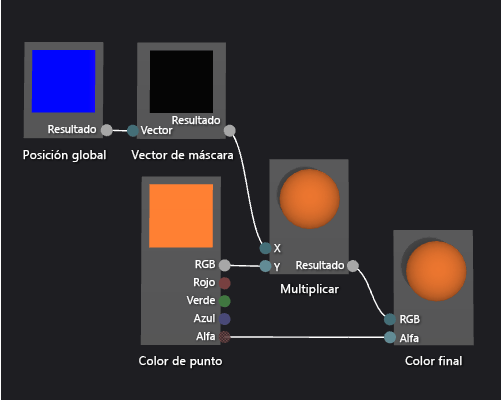

# C&#243;mo: Crear un sombreador de gradiente basado en geometr&#237;a
[!INCLUDE[vs2017banner](../code-quality/includes/vs2017banner.md)]

En este documento se muestra cómo usar el Diseñador de sombras y el lenguaje DGSL \(Directed Graph Shader Language\) para crear un sombreador de degradado basado en geometría.  Este sombreador escala un valor de color RGB constante según el alto de cada punto de un objeto en el espacio global.  
  
 En este documento se muestran estas actividades:  
  
-   Nodos a un gráfico de presentación  
  
-   Establecer las propiedades del nodo  
  
-   Desconectarse de nodos  
  
-   Conectar nodos  
  
## Crear un sombreador de degradado basado en geometría  
 Puede implementar un sombreador geometría\- basado escribiendo la posición del píxel del sombreador.  En lenguajes de trama, un píxel contiene más información que el color y ubicación en una pantalla 2d.  Píxel\- conocido como *un fragmento* en algunas sistema\- es una colección de valores que describe la superficie que corresponde a un píxel.  El sombreador descrito en este documento utiliza el alto de cada píxel de un objeto 3D en el espacio universal afecte al resultado final color del fragmento.  
  
 Antes de empezar, asegúrese de que se muestran la ventana **Propiedades** y el **Cuadro de herramientas**.  
  
#### Para crear un sombreador de degradado basado en geometría  
  
1.  Cree un sombreador DGSL con el que trabajar.  Para obtener información sobre cómo agregar un sombreador DGSL al proyecto, vea la sección Introducción de [Diseñador de sombras](../designers/shader-designer.md).  
  
2.  Desconecte el nodo de **Color de punto** de nodo de **Color final** .  Elija el terminal de **RGB** de nodo de **Color de punto** , y elija **Romper vínculos**.  Esto hace sitio para el nodo que se agrega en el paso siguiente.  
  
3.  Agregue un nodo de **Multiplicar** al gráfico.  En el **Cuadro de herramientas**, en **Matemáticas**, seleccione **Multiplicar** y muévala a la superficie de diseño.  
  
4.  Agregue un nodo de **Vector de máscara** al gráfico.  En el **Cuadro de herramientas**, en **Utilidad**, seleccione **Vector de máscara** y muévalo a la superficie de diseño.  
  
5.  Especifique los valores de máscara para el nodo **Vector de máscara**.  En el modo de **activada** , seleccione el nodo de **Vector de máscara** y, en la ventana de **Propiedades** , establezca la propiedad de **Verde \/ Y** a **VERDADERO**, y establezca **Rojo \/ X**, **Azul \/ Z** y las propiedades de **Alfa \/ W** a **False**.  En este ejemplo, **Rojo \/ X**, **Verde \/ Y**, y las propiedades de **Azul \/ Z** corresponden a x, a y, y los componentes de la z del nodo de **Posición global** , y **Alfa \/ W** es no.  Sólo **Verde \/ Y** se establece en **VERDADERO**, sólo permanecen el componente de la y el vector de entrada después de que se enmascare.  
  
6.  Agregue un nodo de **Posición del mundo** al gráfico.  En **Cuadro de herramientas**, en **Constantes**, seleccione **Posición del mundo** y muévalo a la superficie de diseño.  
  
7.  Enmascarar la posición de espacio global del fragmento.  En el modo **Seleccionar**, mueva el terminal **Resultado** del nodo **Posición del mundo** al terminal **Vector** del nodo **Vector de máscara**.  Esta conexión enmascara la posición del fragmento para omitir los componentes x y z.  
  
8.  Multiplique la constante de color RGB por la posición enmascarada del espacio universal.  Mueva el terminal de **RGB** de nodo de **Color de punto** el terminal de **s** de nodo de **Multiplicar** , y después mueva el terminal de **salida** de nodo de **Vector de máscara** el terminal de **X** de nodo de **Multiplicar** .  Esta conexión escala el valor de color por el alto en píxeles del espacio universal.  
  
9. Conectar el valor de color escalado al color final.  Mueva el terminal de **salida** de nodo de **Multiplicar** el terminal de **RGB** de nodo de **Color final** .  
  
 La siguiente ilustración muestra el gráfico de sombreador completo y una vista previa del sombreador aplicado a una esfera.  
  
> [!NOTE]
>  En esta ilustración, un color naranja se ha especificado para ilustrar mejor el efecto del sombreador, pero como la forma de la vista previa no tiene ninguna posición en el espacio del mundo, el sombreador no puede obtener una vista previa íntegra en el Diseñador de sombras.  Se debe obtener una vista previa del sombreador en una escena real para mostrar el efecto completo.  
  
   
  
 Algunas formas podrían dar mejores vistas previas para algunos los sombreadores.  Para obtener información sobre cómo obtener una vista previa de los sombreadores del Sombreador Designer, vea **Obtener una vista previa de los sombreadores** en [Diseñador de sombras](../designers/shader-designer.md)  
  
 La siguiente ilustración muestra el sombreador descrito en este documento aplicado a la escena 3D que se muestra en [Cómo: Modelar un terreno en 3D](../designers/how-to-model-3-d-terrain.md).  La intensidad del color aumenta con el alto del punto del mundo.  
  
   
  
 Para obtener más información sobre cómo aplicar un sombreador a un modelo 3D, vea [Cómo: Aplicar un sombreador a un modelo 3D](../designers/how-to-apply-a-shader-to-a-3-d-model.md).  
  
## Vea también  
 [Cómo: Aplicar un sombreador a un modelo 3D](../designers/how-to-apply-a-shader-to-a-3-d-model.md)   
 [Cómo: Exportar un sombreador](../designers/how-to-export-a-shader.md)   
 [Cómo: Modelar un terreno en 3D](../designers/how-to-model-3-d-terrain.md)   
 [Cómo: Crear un sombreador de textura de escala de grises](../designers/how-to-create-a-grayscale-texture-shader.md)   
 [Diseñador de sombras](../designers/shader-designer.md)   
 [Nodos del Diseñador de sombras](../designers/shader-designer-nodes.md)