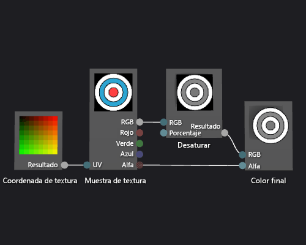

# Cómo: Crear un sombreador de textura de escala de grises

En este artículo se muestra cómo usar el Diseñador de sombras y el lenguaje DGSL (Directed Graph Shader Language) para crear un sombreador de textura de escala de grises. Este sombreador modifica el valor de color RGB del ejemplo de textura y después lo usa junto con el valor alfa sin modificar para establecer el color final.

## Crear un sombreador de textura de escala de grises

Puede implementar un sombreador de textura de escala de grises modificando el valor de color de una muestra de textura antes de escribirlo en el color de salida final.

Antes de empezar, asegúrese de que se muestran la ventana **Propiedades** y el **Cuadro de herramientas**.

1. Cree un sombreador de textura básico, como se describe en [Cómo: Crear un sombreador de textura básico](../designers/how-to-create-a-basic-texture-shader.md).

2. Desconecte el terminal **RGB** del nodo **Muestra de textura** del terminal **RGB** del nodo **Color final**. En el modo **Seleccionar**, elija el terminal **RGB** del nodo **Muestra de textura** y, después, elija **Romper vínculos**. Esto hace sitio para el nodo que se agrega en el paso siguiente.

3. Agregue un nodo **Desaturar** al gráfico. En el **Cuadro de herramientas**, en **Filtros**, seleccione **Desaturar** y muévalo a la superficie de diseño.

4. Calcule el valor de escala de grises mediante el nodo **Desaturar**. En el modo **Seleccionar**, mueva el terminal **RGB** del nodo **Muestra de textura** al terminal **RGB** del nodo **Desaturar**.

    > [!NOTE]
    > De forma predeterminada, el nodo **Desaturar** desatura completamente el color de entrada y usa las proporciones de luminancia estándar para la conversión de escala de grises. Puede cambiar el comportamiento del nodo **Desaturar** cambiando el valor de la propiedad **Luminancia** o solo desaturando parcialmente el color de entrada. Para desaturar parcialmente el color de entrada, proporcione un valor escalar en el intervalo [0,1) al terminal **Por ciento** del nodo **Desaturar**.

5. Conecte el valor de color de escala de grises al color final. Mueva el terminal **Salida** del nodo **Desaturar** al terminal **RGB** del nodo **Color final**.

La ilustración siguiente muestra el gráfico de sombreador completo y una vista previa del sombreador aplicado a un cubo.

> [!NOTE]
> En esta ilustración, se usó un plano como la forma de vista previa y se especificó una textura para demostrar mejor el efecto del sombreador.

Es posible que algunas formas proporcionen mejores vistas previas para algunos sombreadores. Para más información sobre cómo obtener una vista previa de los sombreadores en el Diseñador de sombras, consulte [Diseñador de sombras](../designers/shader-designer.md).

## Vea también

- [Cómo: aplicar un sombreador a un modelo en 3D](../designers/how-to-apply-a-shader-to-a-3-d-model.md)
- [Cómo: exportar un sombreador](../designers/how-to-export-a-shader.md)
- [Editor de imágenes](../designers/image-editor.md)
- [Diseñador de sombras](../designers/shader-designer.md)
- [Nodos del Diseñador de sombras](../designers/shader-designer-nodes.md)
