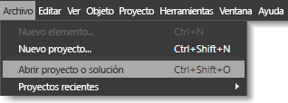
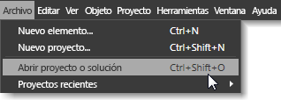

# M&#233;todos abreviados de teclado y teclas modificadoras
[!INCLUDE[vs2017banner](../code-quality/includes/vs2017banner.md)]

Los métodos abreviados de teclado pueden agilizar el trabajo al reducir una acción que requiere varios clics del botón del mouse a un solo método abreviado de teclado.  Los métodos abreviados de teclado de [!INCLUDE[blend_first](../debugger/includes/blend_first_md.md)] se dividen en dos categorías:  
  
-   **Tecla de acceso** Puede usar estas teclas para obtener acceso a un comando de menú o a un área de un cuadro de diálogo al presionar una tecla concreta en el teclado.  Las teclas de acceso se identifican mediante un carácter de subrayado que aparece en el comando seleccionado actualmente o en el cuadro de diálogo.  
  
     Para usar las teclas de acceso, presione primero ALT o F10 para que aparezca el carácter de subrayado y, a continuación, presione la letra correspondiente en dicho menú o cuadro de diálogo.  También puede desplazarse por un menú o un cuadro de diálogo con la tecla TAB o con las teclas de dirección.  Por ejemplo, si presiona ALT en [!INCLUDE[blend_subs](../debugger/includes/blend_subs_md.md)], aparece un subrayado debajo de la letra **A** en el menú **Archivo** que la identifica como tecla de acceso.  Para abrir un proyecto, puede mantener presionada la tecla ALT, presionar A y, a continuación, presionar B.  
  
       
Teclas de acceso que aparecen con un carácter de subrayado después de presionar ALT  
  
-   **Métodos abreviados de teclado** Puede usar las teclas de métodos abreviados de teclado para realizar una acción \(como seleccionar un comando de menú o modificar el comportamiento de una herramienta\) si presiona un método abreviado de teclado.  
  
     Es fácil identificar a la mayoría de los métodos abreviados de teclado en la interfaz de usuario de [!INCLUDE[blend_subs](../debugger/includes/blend_subs_md.md)], ya que aparecen a la derecha de los comandos de menú.  Por ejemplo, en el menú **Archivo** , el comando de menú **Abrir proyecto** incluye el método abreviado de teclado CTRL\+MAYÚS\+O.  Para ver las teclas de método abreviado de una herramienta en el panel **Herramientas**, desplace el puntero sobre la herramienta.  
  
       
Teclas de método abreviado que aparecen junto a los elementos de menú que incluyen una tecla de método abreviado  
  
 Para obtener más información sobre accesibilidad y características, consulte [Accesibilidad en Microsoft](http://go.microsoft.com/fwlink/?LinkId=75069).  
  
## Teclas modificadoras  
 Algunos métodos abreviados de teclado no tienen elementos de menú asociados, lo que significa que no puede usar la interfaz de usuario de [!INCLUDE[blend_subs](../debugger/includes/blend_subs_md.md)] para descubrirlos.  En los siguientes temas se proporcionan los métodos abreviados de teclado que modifican el comportamiento de las herramientas, o que modifican una acción como, por ejemplo, cambiar el tamaño de un objeto:  
  
-   [Teclas modificadoras de la mesa de trabajo](../designers/artboard-modifier-keys-in-blend.md)  
  
-   [Teclas modificadoras de la herramienta Pluma](../designers/pen-tool-modifier-keys-in-blend.md)  
  
-   [Teclas modificadoras de la herramienta Selección directa](../designers/direct-selection-tool-modifier-keys-in-blend.md)