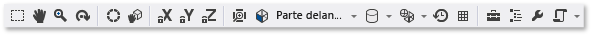

# Editor de modelos
En este documento se describe cómo trabajar con el Editor de modelos de [!INCLUDE[vsprvs](../code-quality/includes/vsprvs_md.md)] para ver, crear y modificar modelos 3D.  
  
 Puede utilizar el Editor de modelos para crear modelos 3D básicos desde cero, o para ver y modificar modelos 3D más complejos creados mediante herramientas completas de modelado tridimensional. El Editor de modelos admite varios formatos de modelos 3D que se utilizan en el desarrollo de aplicaciones DirectX.  
  
## Formatos compatibles  
 El Editor de modelos admite los siguientes formatos:  
  
|Nombre de formato|Extensión de archivo|Operaciones admitidas (ver, editar, crear)|  
|-----------------|--------------------|-------------------------------------------------|  
|Archivo de intercambio FBX de AutoDesk|.fbx|Ver, editar, crear|  
|Archivo DAE de Collada|.dae|Ver, editar (las modificaciones en los archivos DAE de Collada se guardan con formato FBX.)|  
|OBJ|.obj|Ver, editar (las modificaciones en los archivos OBJ se guardan con formato FBX.)|  
  
## Introducción  
 En esta sección se describe cómo agregar un modelo 3D al proyecto de [!INCLUDE[vsprvs](../code-quality/includes/vsprvs_md.md)] y se ofrece la información básica necesaria para comenzar.  
  
#### Para agregar un modelo 3D al proyecto  
  
1.  En el **Explorador de soluciones**, abra el menú contextual del proyecto al que quiere agregar la imagen y, después, elija **Agregar**, **Nuevo elemento**.  
  
2.  En el cuadro de diálogo **Agregar nuevo elemento**, en **Instalado**, seleccione **Gráficos** y, a continuación, seleccione **Escena 3D (.fbx)**.  
  
3.  Especifique el **Nombre** del archivo del modelo y la **Ubicación** en la quiere que se cree.  
  
4.  Elija el botón de **Agregar** .  
  
### Orientación axial  
 [!INCLUDE[vsprvs](../code-quality/includes/vsprvs_md.md)] admite cualquier orientación de eje tridimensional y carga la información de la orientación axial de los formatos de archivo de modelo que la admiten. Si no se especifica ninguna orientación axial, [!INCLUDE[vsprvs](../code-quality/includes/vsprvs_md.md)] usa el sistema de coordenadas para diestros de forma predeterminada. En el **indicador de ejes** se muestra la orientación axial actual en la parte inferior derecha de la superficie de diseño. En el **indicador de ejes**, el rojo representa el eje X, el verde representa el eje Y y el azul representa el eje Z.  
  
### Iniciar el modelo 3D  
 En el Editor de modelos, cada nuevo objeto comienza siempre como una de las formas 3D básicas (o *primitivas*) integradas en el Editor de modelos. Para crear objetos nuevos y únicos, se agrega una primitiva a la escena y después se le cambia de forma modificando sus vértices. En formas complejas, se agregan vértices adicionales mediante extrusión o subdivisión y después se modifican. Para obtener información sobre cómo agregar un objeto primitivo a la escena, consulte [Crear e importar objetos 3D](#Adding3DObjects). Para obtener información sobre cómo agregar más vértices a un objeto, consulte [Modificar objetos](#ModifyingObjects).  
  
## Trabajar con el Editor de modelos  
 En las secciones siguientes se describe cómo utilizar el Editor de modelos para trabajar con modelos 3D.  
  
### Barras de herramientas del Editor de modelos  
 Las barras de herramientas del Editor de modelos contienen comandos para trabajar con modelos 3D.  
  
 Los comandos que afectan al estado del Editor de modelos se encuentran en la barra de herramientas **Modo Editor de modelos** de la ventana principal de [!INCLUDE[vsprvs](../code-quality/includes/vsprvs_md.md)]. Las herramientas de modelado y los comandos con script se encuentran en la barra de herramientas **Editor de modelos** en la superficie de diseño del Editor de modelos.  
  
 A continuación, se muestra la barra de herramientas **Modo Editor de modelos**:  
  
   
  
 En esta tabla se describen los elementos de la barra de herramientas **Modo Editor de modelos**; se muestran en el orden en que aparecen de izquierda a derecha.  
  
|Elemento de la barra de herramientas|Description|  
|------------------|-----------------|  
|**Seleccionar**|Habilita la selección de puntos, bordes, caras u objetos de la escena, dependiendo del modo de selección activo.|  
|**Movimiento panorámico**|Habilita el movimiento de una escena 3D en relación con el marco de la ventana. Para realizar el movimiento panorámico, seleccione un punto de la escena y muévalo.   En el modo **Seleccionar**, presione y mantenga presionada la tecla Ctrl para activar el modo **Movimiento panorámico** temporalmente.|  
|**Zoom**|Habilita la presentación de más o menos detalles en relación con el marco de la ventana. En el modo **Zoom**, seleccione un punto de la escena y muévalo a la derecha o hacia abajo para acercar, o a la izquierda o hacia arriba para alejar.   En el modo **Seleccionar**, puede acercar o alejar con la rueda del mouse mientras mantiene presionada la tecla Ctrl.|  
|**Orbital**|Coloca la vista en una ruta circular en torno al objeto seleccionado. Si no se selecciona ningún objeto, la ruta se centra en el origen de la escena. **Nota**: Este modo no tiene ningún efecto cuando se habilita la proyección **Ortográfica**.|  
|**Posición global**|Cuando se habilita este elemento, las transformaciones en el objeto seleccionado aparecen en el espacio global. Si no, las transformaciones en el objeto seleccionado aparecen en el espacio local.|  
|**Modo de pivote**|Cuando se habilita este elemento, las transformaciones afectan a la ubicación y la orientación del *punto de pivote* del objeto seleccionado (el punto de pivote define el centro de las operaciones de traslación, escalado y giro). De lo contrario, las transformaciones afectarían a la ubicación y la orientación de la geometría del objeto, en relación con el punto de pivote.|  
|**Bloquear eje X**|Restringe la manipulación del objeto al eje X. Solo se aplica cuando se usa la parte central del widget del manipulador.|  
|**Bloquear eje Y**|Restringe la manipulación del objeto al eje Y. Solo se aplica cuando se usa la parte central del widget del manipulador.|  
|**Bloquear eje Z**|Restringe la manipulación del objeto al eje Z. Solo se aplica cuando se usa la parte central del widget del manipulador.|  
|**Objeto marco**|Enmarca el objeto seleccionado de modo que quede ubicado en el centro de la vista.|  
|**Vista**|Establece la orientación de la vista. Estas son las orientaciones disponibles:   **Frontal**  Posiciona la vista en la parte delantera de la escena.   **Atrás**  Posiciona la vista detrás de la escena.   **Izquierda**  Posiciona la vista a la izquierda de la escena.   **Derecha**  Posiciona la vista a la derecha de la escena.   **Superior**  Posiciona la vista sobre la escena.   **Inferior**  Posiciona la vista bajo de la escena. **Nota**: Esta es la única manera de cambiar la dirección de la vista cuando está habilitada la proyección **Ortográfica**.|  
|**Proyección**|Establece el tipo de proyección que se utiliza para dibujar la escena. Estas son las proyecciones disponibles:   **Perspectiva**  En la proyección de perspectiva, los objetos que están más alejados del punto de vista aparecen más pequeños y convergen finalmente en un punto en la distancia.   **Ortográfica**  En la proyección ortográfica, los objetos parecen del mismo tamaño, con independencia de la distancia desde el punto de vista. No se muestra convergencia. Cuando se habilita la proyección **Ortográfica**, no se puede utilizar el modo **Orbital** para colocar la vista.|  
|**Estilo de dibujo**|Establece cómo se presentan los objetos de la escena. Estos son los estilos disponibles:   **Estructura metálica**  Cuando se habilita, los objetos se representan como estructuras metálicas.   **Sobredibujar**  Cuando se habilita, los objetos se presentan mediante combinación aditiva. Se puede utilizar para visualizar la cantidad de sobredibujo que se está produciendo en la escena.   **Sombreado plano**  Cuando se habilita, los objetos se presentan mediante un modelo básico de iluminación de sombreado plano. Se puede utilizar para ver las caras de un objeto más fácilmente.   Si no se habilita ninguna de estas opciones, cada objeto se representa usando el material que se le aplicó.|  
|**Modo de representación en tiempo real**|Cuando se habilita la representación en tiempo real, [!INCLUDE[vsprvs](../code-quality/includes/vsprvs_md.md)] dibuja de nuevo la superficie de diseño, incluso si no se lleva a cabo ninguna acción de usuario. Este modo es útil cuando se trabaja con los sombreadores que cambian con el tiempo.|  
|**Alternar cuadrícula**|Cuando se habilita este elemento, se muestra una cuadrícula. De lo contrario, no se muestra la cuadrícula.|  
|**Cuadro de herramientas**|Muestra u oculta alternativamente el **Cuadro de herramientas**.|  
|**Esquema del documento**|Muestra u oculta alternativamente la ventana **Esquema del documento**.|  
|**Propiedades**|Muestra u oculta alternativamente la ventana **Propiedades**.|  
|**Avanzadas**|Contiene comandos y opciones avanzados.   **Motores gráficos**   **Representar con D3D11**  Utiliza Direct3D 11 para presentar la superficie de diseño del Editor de modelos.   **Representar con D3D11WARP**  Utiliza Windows Advanced Rasterization Platform (WARP) de Direct3D 11 para presentar la superficie de diseño del Editor de modelos.   **Administración de la escena**   **Import**  Importa objetos de otro archivo de modelo 3D a la escena actual.   **Asociar a primario**  Establece el primero de varios objetos seleccionados como elemento primario de los objetos seleccionados restantes.   **Desasociar de primario**  Desasocia el objeto seleccionado de su elemento primario. El objeto seleccionado se convierte en un *objeto raíz* de la escena. Un objeto raíz no tiene ningún objeto primario.   **Crear grupo**  Agrupa los objetos seleccionados como objetos relacionados.   **Combinar objetos**  Combina los objetos seleccionados en un objeto.   **Crear nuevo objeto a partir de selección de polígono**  Quita las caras seleccionadas del objeto actual y agrega a la escena un nuevo objeto que contiene esas caras.   **Herramientas**   **Voltear devanado de polígono**  Voltea los polígonos seleccionados de forma que el orden de devanado y el valor normal a la superficie se invierten.   **Quitar toda animación**  Quita los datos de animación de los objetos.   **Triangular**  Convierte el objeto seleccionado en triángulos.   **Vista**   Eliminación de caras traseras  Habilita o deshabilita la selección de la cara oculta.   **Velocidad de fotogramas**  Muestra la velocidad de fotogramas en la esquina superior derecha de la superficie de diseño. La velocidad de fotogramas es el número de fotogramas dibujados por segundo.   Esta opción es útil cuando se habilita la opción **Modo de representación en tiempo real**.   **Mostrar todo**  Muestra todos los objetos de la escena. Esto restablece la propiedad **Oculto** de cada objeto en **Falso**.   **Mostrar normales de cara**  Muestra el normal de cada cara.   **Mostrar materiales que faltan**  Muestra una textura especial en los objetos que no tienen ningún material asignado.   **Mostrar pivote**  Habilita o deshabilita la presentación de un marcador de eje 3D en el punto de pivote de la selección activa.   **Mostrar nodos de marcador de posición**  Muestra los nodos del marcador de posición. Cuando se agrupan objetos, se crea un nodo de marcadores de posición.   **Mostrar normales de vértices**  Muestra el normal de cada vértice. **Consejo**: Puede elegir el botón **Scripts** para volver a ejecutar el último script.|  
  
 Esta es la barra de herramientas **Editor de modelos**:  
  
   
  
 En la tabla siguiente se describen los elementos de la barra de herramientas **Editor de modelos**, en el orden en que aparecen de arriba abajo.  
  
|Elemento de la barra de herramientas|Description|  
|------------------|-----------------|  
|**Trasladar**|Mueve la selección.|  
|**Escalar**|Cambia el tamaño de la selección.|  
|**Girar**|Gira la selección.|  
|**Seleccionar punto**|Establece el **Modo de selección** para seleccionar puntos individuales en un objeto.|  
|**Seleccionar borde**|Establece el **Modo de selección** para seleccionar un borde (una línea entre dos vértices) en un objeto.|  
|**Seleccionar cara**|Establece el **Modo de selección** para seleccionar una cara de un objeto.|  
|**Seleccionar objeto**|Establece el **Modo de selección** para seleccionar un objeto completo.|  
|**Extruir**|Crea una cara adicional y la conecta con la cara seleccionada.|  
|**Subdividir**|Divide cada cara seleccionada en múltiples caras. Para crear las caras nuevas, se agregan vértices nuevos (uno en el centro de la cara original y otro en el medio de cada borde) y después se unen con los vértices originales. El número de caras agregadas es igual al número de bordes de la cara original.|  
  
### Controlar la vista  
 La escena 3D se presenta de acuerdo con la vista, que se puede considerar una cámara virtual con una posición y una orientación. Para cambiar la posición y orientación, use los controles de vista de la barra de herramientas **Modo Editor de modelos**.  
  
 En la tabla siguiente se describen los controles de la vista primaria.  
  
|Control de vista|Description|  
|------------------|-----------------|  
|**Movimiento panorámico**|Habilita el movimiento de una escena 3D en relación con el marco de la ventana. Para realizar el movimiento panorámico, seleccione un punto de la escena y muévalo.   En el modo **Seleccionar**, presione y mantenga presionada la tecla Ctrl para activar el modo **Movimiento panorámico** temporalmente.|  
|**Zoom**|Habilita la presentación de más o menos detalles en relación con el marco de la ventana. En el modo **Zoom**, seleccione un punto de la escena y muévalo a la derecha o hacia abajo para acercar, o a la izquierda o hacia arriba para alejar.   En el modo **Seleccionar**, puede acercar o alejar con la rueda del mouse mientras mantiene presionada la tecla Ctrl.|  
|**Orbital**|Coloca la vista en una ruta circular en torno al objeto seleccionado. Si no se selecciona ningún objeto, la ruta se centra en el origen de la escena. **Nota**: Este modo no tiene ningún efecto cuando se habilita la proyección **Ortográfica**.|  
|**Objeto marco**|Enmarca el objeto seleccionado de modo que quede ubicado en el centro de la vista.|  
  
 La vista la establece la cámara virtual, pero también se define mediante una proyección. La proyección define cómo se traducen las formas y los objetos de la vista en píxeles en la superficie de diseño. En la barra de herramientas **Editor de modelos**, puede elegir la proyección **Perspectiva** u **Ortográfica**.  
  
|Proyección|Description|  
|----------------|-----------------|  
|**Perspectiva**|En la proyección de perspectiva, los objetos que están más alejados del punto de vista aparecen más pequeños y convergen finalmente en un punto en la distancia.|  
|**Ortográfica**|En la proyección ortográfica, los objetos parecen del mismo tamaño, con independencia de la distancia desde el punto de vista. No se muestra convergencia. Cuando se habilita la proyección **Ortográfica**, no se puede utilizar el modo **Orbital** para colocar la vista arbitrariamente.|  
  
 Puede ser útil ver una escena 3D desde una posición y un ángulo conocidos, por ejemplo, si se desea comparar dos escenas similares. En este escenario, el Editor de modelos proporciona varias vistas predefinidas. Para utilizar una vista predefinida, en la barra de herramientas **Modo Editor de modelos**, elija **Ver** y, después, elija una vista predefinida: frontal, posterior, izquierda, derecha, superior o inferior. En estas vistas, la cámara virtual apunta directamente al origen de la escena. Por ejemplo, si elige **Vista superior**, la cámara virtual busca el origen de la escena directamente sobre ella.  
  
### Ver otros detalles de la geometría  
 Para entender mejor un objeto o una escena 3D, puede ver los detalles adicionales de la geometría como los normales por vértice y por cara, los puntos de pivote de la selección activa y otros detalles. Para habilitarlos o deshabilitarlos, en la barra de herramientas **Editor de modelos**, elija **Scripts**, **Ver** y, a continuación, elija lo que desee.  
  
###   Crear e importar objetos 3D  
 Para agregar una forma 3D predefinida a la escena, en el **Cuadro de herramientas**, seleccione la que quiera y muévala a la superficie de diseño. Las nuevas formas se colocan en el origen de la escena. El Editor de modelos proporciona siete formas: **Cono**, **Cubo**, **Cilindro**, **Disco**, **Plano**, **Esfera** y **Tetera**.  
  
 Para importar un objeto 3D desde un archivo, en la barra de herramientas **Editor de modelos**, elija **Avanzadas**, **Administración de la escena**, **Importar** y, a continuación, especifique el archivo que quiera importar.  
  
### Transformar objetos  
 Puede *transformar* un objeto cambiando sus propiedades de **Giro**, **Escala** y **Traslación**. El *Giro* orienta un objeto aplicando giros sucesivos alrededor de los ejes X, Y y Z definidos por el punto de pivote. Cada especificación de giro tiene tres componentes (x, y, z en ese orden) y los componentes se especifican en grados. El **Escalado** cambia el tamaño de un objeto ajustándolo según un factor especificado a lo largo de uno o más ejes centrados en el punto de pivote. La *Traslación* localiza un objeto en un espacio de 3 dimensiones en relación con su elemento primario en lugar de con su punto de pivote.  
  
 Puede transformar un objeto mediante las herramientas de modelado o estableciendo propiedades.  
  
##### Para transformar un objeto usando las herramientas de modelado  
  
1.  En el modo **Seleccionar**, seleccione el objeto que quiere transformar. Una superposición de wireframe indica que el objeto está seleccionado.  
  
2.  En la barra de herramientas **Editor de modelos**, elija la herramienta **Trasladar**, **Escalar** o **Girar**. Aparecerá un manipulador de giro, traslación o escala para el objeto seleccionado.  
  
3.  Utilice el manipulador para realizar la transformación. En las transformaciones de traslación y escala, el manipulador es un indicador de eje. Se puede cambiar un solo eje o todos los ejes simultáneamente mediante el cubo blanco situado en el centro del indicador. En el giro, el manipulador es una esfera hecha con círculos codificados con colores que corresponden al eje X (rojo), al eje Y (verde) y al eje Z (azul). Hay que cambiar cada eje individualmente para crear el giro que se desee.  
  
##### Para transformar un objeto mediante la configuración de sus propiedades  
  
1.  En el modo **Seleccionar**, seleccione el objeto que quiere transformar. Una superposición de wireframe indica que el objeto está seleccionado.  
  
2.  En la ventana **Propiedades**, especifique valores para las propiedades **Giro**, **Escala** y **Traslación**.  
  
    > [!IMPORTANT]
    >  En la propiedad **Giro**, especifique el grado de giro alrededor de cada uno de los tres ejes. Los giros se aplican en orden, de modo que asegúrese de planificar una rotación primero en términos de giro del eje X, después del eje Y y después del eje Z.  
  
 Con las herramientas de modelado, se crean transformaciones con rapidez pero no con precisión. Al establecer las propiedades del objeto, se especifican transformaciones con precisión pero no con rapidez. Se recomienda utilizar las herramientas de modelado para acercarse “lo más posible” a las transformaciones que se deseen y, a continuación, ajustar los valores de propiedad.  
  
 Si no se desea usar los manipuladores, se puede habilitar el modo de forma libre. En la barra de herramientas **Editor de modelos**, elija **Scripts**, **Herramientas**, **Manipulación de forma libre** para habilitar (o deshabilitar) el modo de forma libre. En el modo de forma libre, puede iniciar una manipulación en cualquier punto de la superficie de diseño, en lugar de hacerlo en un punto del manipulador. En el modo de forma libre, puede restringir los cambios a algunos ejes bloqueando los que no desea cambiar. En la barra de herramientas **Modo del Editor de modelos**, elija cualquier combinación de los botones **Bloquear X**, **Bloquear Y** y **Bloquear Z**.  
  
 Puede ser útil trabajar con los objetos usando el ajuste a la cuadrícula. En la barra de herramientas **Modo Editor de modelos**, elija **Ajustar** para habilitar (o deshabilitar) el ajuste a la cuadrícula. Cuando se habilita el ajuste a la cuadrícula, las transformaciones de traslación, giro y escala están restringidas a incrementos predefinidos.  
  
### Trabajar con el punto de pivote  
 El punto de pivote de un objeto define su centro de giro y su escala. Puede cambiar el punto de pivote de un objeto para cambiar cómo se ve afectado por las transformaciones de giro y escala. En la barra de herramientas **Modo Editor de modelos**, elija **Modo de pivote** para habilitar (o deshabilitar) dicho modo. Cuando se habilita el modo de pivote, un pequeño indicador de eje aparece en el punto de pivote del objeto seleccionado. Puede utilizar las herramientas **Traslación** y **Giro** para manipular el punto de pivote.  
  
 Para ver una demostración que muestra cómo utilizar el punto de pivote, consulte [Cómo: Modificar el punto de pivote de un modelo 3D](../designers/how-to-modify-the-pivot-point-of-a-3-d-model.md).  
  
### Modos local y global  
 La traslación y el giro pueden darse en el sistema de coordenadas local (o *marco de referencia local*) del objeto, o en el sistema de coordenadas global (o *marco de referencia global*). El marco de referencia global es independiente del giro del objeto. El modo local es el valor predeterminado. Para habilitar (o deshabilitar) el modo global, en la barra de herramientas **Modo Editor de modelos**, elija el botón **WorldLocal**.  
  
###   Modificar objetos  
 Puede cambiar la forma de un objeto 3D moviendo o eliminando sus vértices, bordes y caras. De forma predeterminada, el Editor de modelos está en *modo objeto*, para que se puedan seleccionar y transformar objetos completos. Para seleccionar puntos, bordes o caras, elija el modo de selección adecuado. En la barra de herramientas **Modo Editor de modelos**, elija **Modos de selección** y, después, elija el modo que desea.  
  
 Se pueden crear vértices adicionales mediante la extrusión o la subdivisión. La extrusión duplica los vértices de una cara (conjunto coplanar de vértices), que permanecen conectados por los vértices duplicados. La subdivisión agrega vértices para crear varias caras donde solo había una. Para crear las caras nuevas, se agregan vértices nuevos (uno en el centro de la cara original y otro en el medio de cada borde) y después se unen con los vértices originales. El número de caras agregadas es igual al número de bordes de la cara original. En ambos casos, se puede trasladar, girar y ajustar los nuevos vértices para cambiar la geometría del objeto.  
  
##### Para extruir una cara de un objeto  
  
1.  En el modo de selección de caras, seleccione la cara que desea extruir.  
  
2.  En la barra de herramientas **Editor de modelos**, elija **Scripts**, **Herramientas**, **Extruir**.  
  
##### Para subdividir caras  
  
1.  En el modo de selección de caras, seleccione las caras que desea subdividir. Dado que la subdivisión crea nuevos datos para los bordes, cuando se subdividen todas las caras a la vez, se obtienen resultados más coherentes si las caras son adyacentes.  
  
2.  En la barra de herramientas **Editor de modelos**, elija **Scripts**, **Herramientas**, **Subdividir**.  
  
 También puede triangular caras, combinar objetos y convertir selecciones de polígonos en objetos nuevos. La triangulación crea bordes adicionales de forma que una cara no triangular se convierte en un número óptimo de triángulos; sin embargo, no proporciona detalles geométricos adicionales. La combinación aglutina los objetos seleccionados en uno solo. Es posible crear objetos nuevos a partir de una selección de polígonos.  
  
##### Para triangular una cara  
  
1.  En el modo de selección de caras, seleccione la cara que desea triangular.  
  
2.  En la barra de herramientas **Editor de modelos**, elija **Scripts**, **Herramientas**, **Triangular**.  
  
##### Para combinar objetos  
  
1.  En el modo de selección de objetos, seleccione los objetos que desee combinar.  
  
2.  En la barra de herramientas **Editor de modelos**, elija **Scripts**, **Herramientas**, **Combinar objetos**.  
  
##### Para crear un objeto a partir de una selección de polígonos  
  
1.  En el modo de selección de caras, seleccione las caras a partir de las que desea crear un nuevo objeto.  
  
2.  En la barra de herramientas **Editor de modelos**, elija **Scripts**, **Herramientas**, **Crear objeto a partir de la selección del polígono**.  
  
### Trabajar con materiales y sombreadores  
 El aspecto de un objeto lo determinan la interacción de la iluminación de la escena y el material del objeto. Los materiales los definen las propiedades que describen el modo en que la superficie reacciona a diferentes tipos de luz y un programa sombreador que calcula el color final de cada píxel en la superficie del objeto según la información de iluminación, los mapas de textura, los mapas de normales y otros datos.  
  
 El Editor de modelos proporciona estos materiales predeterminados:  
  
|Material|Description|  
|--------------|-----------------|  
|Sin iluminación|Presenta una superficie sin iluminación simulada.|  
|Lambert|Presenta una superficie con iluminación ambiente simulada e iluminación difusa.|  
|Phong|Presenta una superficie con iluminación ambiente simulada, iluminación difusa y reflejos especulares.|  
  
 Cada uno de estos materiales aplica una textura a la superficie de un objeto. Es posible establecer una textura distinta para cada objeto que utilice el material.  
  
 Para modificar el modo en que un objeto determinado reacciona ante las distintas fuentes de luz de la escena, cambie las propiedades de iluminación del material independientemente de los demás objetos que utilizan el material. En esta tabla se describen las propiedades comunes de la iluminación:  
  
|Propiedad Lighting|Description|  
|-----------------------|-----------------|  
|Ambiente|Describe cómo afecta a la superficie la iluminación ambiente.|  
|Difusa|Describe cómo afecta a la superficie las luces direccionales y puntuales.|  
|Emisor de luz|Describe cómo la superficie emite luz independiente de otros focos de iluminación.|  
|Especular|Describe cómo refleja la superficie las luces direccionales y puntuales.|  
|Potencia especular|Describe la amplitud e intensidad de las iluminaciones especulares.|  
  
 En función del material admitido, se pueden cambiar las propiedades de iluminación, las texturas y otros datos. En el modo **Seleccionar**, seleccione el objeto cuyo contenido desea cambiar y, después, en la ventana **Propiedades**, cambie **MaterialAmbient**, **MaterialDiffuse**, **MaterialEmissive**, **MaterialSpecular**, **MaterialSpecularPower** y otras propiedades disponibles. Un material puede exponer hasta ocho texturas, cuyas propiedades se denominan secuencialmente de **Texture1** a **Texture8**.  
  
 Para quitar todos los materiales de un objeto, en la barra de herramientas **Editor de modelos**, elija **Scripts**, **Materiales**, **Quitar materiales**.  
  
 Puede usar el **Diseñador de sombras** para crear materiales personalizados de sombreador que se pueden aplicar a objetos de la escena 3D. Para obtener información acerca de la creación de materiales de sombreador personalizados, consulte [Diseñador de sombras](../designers/shader-designer.md). Para obtener información sobre cómo aplicar un material de sombreador personalizado a un objeto, vea [Cómo: Aplicar un sombreador a un modelo 3-D](../designers/how-to-apply-a-shader-to-a-3-d-model.md).  
  
### Administración de la escena  
 Las escenas se administran como una jerarquía de objetos. Cuando varios objetos se organizan en una jerarquía, cualquier traslación, escala o giro de un nodo primario también afecta a sus elementos secundarios. Esto es útil cuando se desean construir objetos complejos o escenas a partir de objetos más básicos.  
  
 Puede utilizar la ventana **Esquema del documento** para ver la jerarquía de la escena y seleccionar nodos de la escena. Cuando seleccione un nodo en el esquema, puede usar la ventana **Propiedades** para modificar sus propiedades.  
  
 Puede crear una jerarquía de objetos haciendo de uno de ellos el elemento primario de los demás o agrupándolos como elementos relacionados bajo un nodo marcador de posición que actúe como elemento primario.  
  
##### Para crear una jerarquía que tenga un objeto primario  
  
1.  En el modo **Seleccionar**, seleccione dos o más objetos. El primero que seleccione será el objeto primario.  
  
2.  En la barra de herramientas **Editor de modelos**, elija **Scripts**, **Administración de la escena**, **Asociar a elemento primario**.  
  
##### Para crear una jerarquía de objetos relacionados  
  
1.  En el modo **Seleccionar**, seleccione dos o más objetos. Se crea un objeto marcador de posición que pasa a ser el objeto primario.  
  
2.  En la barra de herramientas **Editor de modelos**, elija **Scripts**, **Administración de la escena**, **Crear grupo**.  
  
 El Editor de modelos utiliza un wireframe blanco para identificar el primer objeto seleccionado, que pasa a ser el elemento primario. Los demás objetos de la selección tienen un wireframe azul. De forma predeterminada, los nodos de marcador de posición no se muestran. Para mostrar los nodos de marcador de posición, en la barra de herramientas **Editor de modelos**, elija **Scripts**, **Administración de la escena**, **Mostrar nodos de marcador de posición**. Es posible trabajar con los nodos de marcador de posición mientras se trabaja con objetos sin marcador de posición.  
  
 Para quitar la asociación elemento primario-elemento secundario entre dos objetos, seleccione el objeto secundario y, en la barra de herramientas **Editor de modelos**, elija **Scripts**, **Administración de la escena**, **Desasociar de elemento primario**. Cuando se desasocia el objeto primario de un objeto secundario, el objeto secundario se convierte en un objeto raíz de la escena.  
  
## Métodos abreviados de teclado  
  
|Comando|Métodos abreviados de teclado|  
|-------------|------------------------|  
|Cambiar al modo **Seleccionar**|Ctrl+G, Ctrl+Q   S|  
|Cambiar al modo **Zoom**|Ctrl+G, Ctrl+Z   Z|  
|Cambiar al modo **Movimiento panorámico**|Ctrl+G, Ctrl+P   K|  
|Seleccionar todo|Ctrl+A|  
|Eliminar la selección actual|Eliminar|  
|Cancelar la selección actual|Escape|  
|Acercar|Rueda del mouse hacia delante   Ctrl+rueda del mouse hacia delante   Mayús+rueda del mouse hacia delante   Ctrl+Retroceso de página (RePág)   Signo más (+)|  
|Alejar|Rueda del mouse hacia atrás   Ctrl+rueda del mouse hacia atrás   Mayús+rueda del mouse hacia atrás   Ctrl+Avance de página (AvPág)   Signo menos (-)|  
|Movimiento panorámico de la cámara hacia arriba|AvPág|  
|Movimiento panorámico de la cámara hacia abajo|RePág|  
|Movimiento panorámico de la cámara hacia la izquierda|Rueda del mouse a la izquierda   Ctrl+Avance de página (AvPág)|  
|Movimiento panorámico de la cámara hacia la derecha|Rueda del mouse a la derecha   Ctrl+Avance de página (AvPág)|  
|Ver la parte superior del modelo|Ctrl+L, Ctrl+T   T|  
|Ver la parte inferior del modelo|Ctrl+L, Ctrl+U|  
|Ver el lado izquierdo del modelo|Ctrl+L, Ctrl+L|  
|Ver el lado derecho del modelo|Ctrl+L, Ctrl+R|  
|Ver la parte frontal del modelo|Ctrl+L, Ctrl+F|  
|Ver la parte posterior del modelo|Ctrl+L, Ctrl+B|  
|Objeto marco en la ventana|F|  
|Conmutar modo wireframe|Ctrl+L, Ctrl+W|  
|Alternar ajustar a la cuadrícula|Ctrl+G, Ctrl+N|  
|Alternar modo de pivote|Ctrl+G, Ctrl+V|  
|Alternar restricción del eje X|Ctrl+L, Ctrl+X|  
|Alternar restricción del eje Y|Ctrl+L, Ctrl+Y|  
|Alternar restricción del eje Z|Ctrl+L, Ctrl+Z|  
|Cambiar al modo traslación|Ctrl+G, Ctrl+W   X|  
|Cambiar al modo escala|Ctrl+G, Ctrl+E   E|  
|Cambiar al modo giro|Ctrl+G, Ctrl+R   R|  
|Cambiar al modo selección de punto|Ctrl+L, Ctrl+1|  
|Cambiar al modo selección de borde|Ctrl+L, Ctrl+2|  
|Cambiar al modo selección de cara|Ctrl+L, Ctrl+3|  
|Cambiar al modo selección de objeto|Ctrl+L, Ctrl+4|  
|Cambiar al modo de cámara orbital|Ctrl+G, Ctrl+O|  
|Seleccionar el siguiente objeto de la escena|Tab|  
|Seleccionar el objeto anterior de la escena|Mayús+Tab|  
|Manipular el objeto seleccionado según la herramienta actual.|Teclas de flecha|  
|Desactivar el manipulador actual|C|  
|Girar cámara|Alt+arrastrar con el botón primario del mouse|  
  
## Temas relacionados  
  
|Title|Description|  
|-----------|-----------------|  
|[Trabajar con activos 3D para juegos y aplicaciones](../designers/working-with-3-d-assets-for-games-and-apps.md)|Proporciona información general sobre las herramientas que se pueden usar en [!INCLUDE[vsprvs](../code-quality/includes/vsprvs_md.md)] para trabajar con activos gráficos como texturas e imágenes, modelos 3D y efectos de sombreador.|  
|[Editor de imágenes](../designers/image-editor.md)|Describe cómo usar el editor de imágenes de [!INCLUDE[vsprvs](../code-quality/includes/vsprvs_md.md)] para trabajar con texturas e imágenes.|  
|[Diseñador de sombras](../designers/shader-designer.md)|Describe cómo usar el diseñador de sombras de [!INCLUDE[vsprvs](../code-quality/includes/vsprvs_md.md)] para trabajar con sombreadores.|