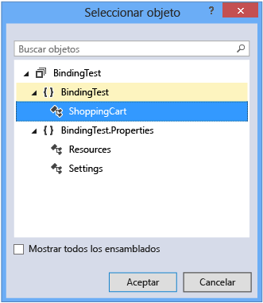
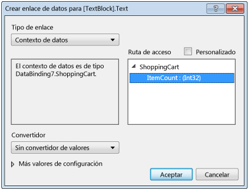

# <a name="walkthrough-binding-to-data-in-xaml-designer"></a>Tutorial: Enlazar a datos en el Diseñador XAML

En el Diseñador de XAML, puede establecer las propiedades de enlace de datos mediante el uso de la mesa de trabajo y la ventana Propiedades. En el ejemplo de este tutorial se muestra cómo enlazar datos a un control. En concreto, el tutorial muestra cómo crear una clase simple de carro de la compra que tenga una propiedad [DependencyProperty](/uwp/api/Windows.UI.Xaml.DependencyProperty) denominada `ItemCount` y luego enlazar la propiedad `ItemCount` a la propiedad **Text** de un control [TextBlock](/uwp/api/Windows.UI.Xaml.Controls.TextBlock).

## <a name="to-create-a-class-to-use-as-a-data-source"></a>Crear una clase que se va a usar como origen de datos

1. En el menú **Archivo**, seleccione **Nuevo**> **Proyecto**.

1. En el cuadro de diálogo **Nuevo proyecto**, elija el nodo de **Visual C#** o **Visual Basic**, expanda el nodo **Escritorio de Windows** y después elija la plantilla **Aplicación WPF**.

1. Asigne un nombre al proyecto **BindingTest** y después elija el botón **Aceptar**.

1. Abra el archivo MainWindow.xaml.cs (o MainWindow.xaml.vb) y agregue el código siguiente. En C#, agregue el código en el espacio de nombres `BindingTest` (antes del paréntesis de cierre final del archivo). En Visual Basic, agregue simplemente la nueva clase.

   ```csharp
   public class ShoppingCart : DependencyObject
   {
       public int ItemCount
       {
           get { return (int)GetValue(ItemCountProperty); }
           set { SetValue(ItemCountProperty, value); }
       }

       public static readonly DependencyProperty ItemCountProperty =
            DependencyProperty.Register("ItemCount", typeof(int),
            typeof(ShoppingCart), new PropertyMetadata(0));
   }
   ```

   ```vb
   Public Class ShoppingCart
       Inherits DependencyObject

       Public Shared ReadOnly ItemCountProperty As DependencyProperty = DependencyProperty.Register(
            "ItemCount", GetType(Integer), GetType(ShoppingCart), New PropertyMetadata(0))
       Public Property ItemCount As Integer
           Get
               ItemCount = CType(GetValue(ItemCountProperty), Integer)
           End Get
           Set(value As Integer)
               SetValue(ItemCountProperty, value)
           End Set
       End Property
   End Class
   ```

   Este código establece un valor de 0 como el número predeterminado de elementos mediante el objeto [PropertyMetadata](/uwp/api/Windows.UI.Xaml.PropertyMetadata).

1. En el menú **Archivo**, elija **Compilar** > **Compilar solución**.

## <a name="to-bind-the-itemcount-property-to-a-textblock-control"></a>Enlazar la propiedad ItemCount a un control TextBlock

1. En el Explorador de soluciones, abra el menú contextual de MainWindow.xaml y elija **Diseñador de vistas**.

1. En el cuadro de herramientas, elija un control [Grid](/uwp/api/Windows.UI.Xaml.Controls.Grid) y agréguelo al formulario.

1. Con el control `Grid` seleccionado, en la ventana Propiedades, elija el botón **Nuevo** situado junto a la propiedad **DataContext**.

1. En el cuadro de diálogo **Seleccionar objeto**, asegúrese de que la casilla **Mostrar todos los ensamblados** está desactivada, elija **ShoppingCart** en el espacio de nombres **BindingTest** y después elija el botón **Aceptar**.

     En la siguiente ilustración, se muestra el cuadro de diálogo **Seleccionar objeto** con **ShoppingCart** seleccionado.

     

1. En el **cuadro de herramientas**, elija un control `TextBlock` para agregar al formulario.

1. Con el control `TextBlock` seleccionado, en la ventana Propiedades, elija el marcador de propiedad situado a la derecha de la propiedad **Text** y después elija **Crear enlace de datos**. (el marcador de propiedad parece un pequeño cuadro).

1. En el cuadro de diálogo Crear enlace de datos, en el cuadro **Ruta de acceso**, seleccione la propiedad **ItemCount: (int32)** y después elija el botón **Aceptar**.

     En la siguiente ilustración, se muestra el cuadro de diálogo **Crear enlace de datos** con la propiedad **ItemCount** seleccionada.

     

1. Presione **F5** para ejecutar la aplicación.

     El control `TextBlock` debe mostrar el valor predeterminado 0 como texto.

## <a name="see-also"></a>Vea también

[Crear una UI usando el Diseñador XAML](../designers/creating-a-ui-by-using-xaml-designer-in-visual-studio.md)  
[Agregar convertidor de valores (Cuadro de diálogo)](https://msdn.microsoft.com/c5f3d110-a541-4b55-8bca-928f77778af8)