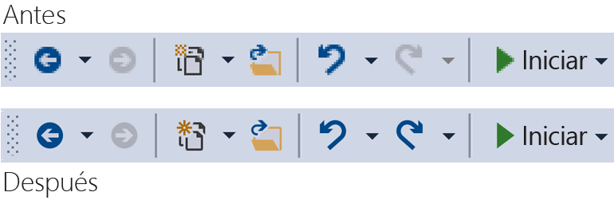
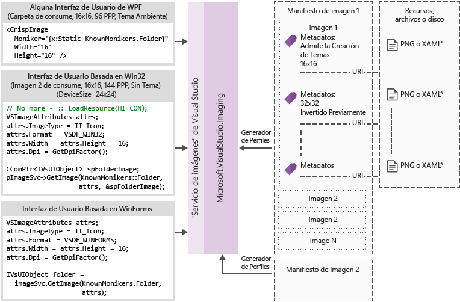

# Cat&#225;logo y el servicio de im&#225;genes
[!INCLUDE[vs2017banner](../code-quality/includes/vs2017banner.md)]

Esta guía contiene instrucciones y procedimientos recomendados para adoptar el servicio de imágenes de Visual Studio y el catálogo de imagen que se introdujo en Visual Studio 2015.  
  
 El servicio de imágenes que se introdujo en Visual Studio 2015 permite a los desarrolladores obtener las mejores imágenes para el dispositivo y el tema del usuario seleccionado para mostrar la imagen, incluyendo temas correcto para el contexto en que se muestran. Adoptar el servicio imágenes le ayudará a eliminar puntos débiles principales relacionados con el mantenimiento de activos, la escala de HDPI y temas.  
  
|||  
|-|-|  
|**Problemas de hoy en día**|**Soluciones**|  
|Mezcla de color de fondo|Combinación alfa integrados|  
|Imágenes de temas (algunos)|Metadatos de tema|  
|Modo de contraste alto|Recursos alternativos de contraste alto|  
|Necesita varios recursos para los distintos modos de PPP|Puede seleccionados recursos con reserva basada en vectores|  
|Imágenes duplicadas|Un identificador por concepto de imagen|  
  
 ¿Por qué adoptar el servicio de imágenes?  
  
-   Obtener siempre la última imagen de "píxeles perfectos" de Visual Studio  
  
-   Puede enviar y utilizar sus propias imágenes  
  
-   No es necesario probar las imágenes de salida cuando Windows agrega la nueva escala de PPP  
  
-   Obstáculos arquitectura antiguos en las implementaciones de direcciones  
  
 El Visual Studio shell barra de herramientas antes y después de usar el servicio de imágenes:  
  
   
  
## <a name="how-it-works"></a>¿Cómo funciona?  
 El servicio de imágenes puede proporcionar una imagen de mapa de bits adecuada para cualquier marco de interfaz de usuario admitido:  
  
-   WPF: BitmapSource  
  
-   Formularios Windows Forms: System.Drawing.Bitmap  
  
-   Win32: HBITMAP  
  
 Diagrama de flujo del servicio de imágenes  
  
   
  
 **Monikers de imagen**  
  
 Un moniker de la imagen (o moniker para abreviar) es un par GUID o Id. que identifica un recurso de imagen o activo de la lista de imágenes en la biblioteca de imágenes.  
  
 **Monikers conocidos**  
  
 El conjunto de monikers de la imagen contenida en el catálogo de imágenes de Visual Studio y públicamente consumibles por cualquier componente de Visual Studio o la extensión.  
  
 **Archivos de manifiesto de imagen**  
  
 Archivos de imagen de manifiesto (.imagemanifest) son archivos XML que definen un conjunto de activos de imagen, los monikers que representan esos activos y la imagen real o imágenes que representan cada activo. Manifiestos de imagen pueden definir imágenes independientes o listas de imágenes para admitir código heredado de interfaz de usuario. Además, hay atributos que se pueden establecer en el activo o en las imágenes individuales detrás de cada recurso para cambiar cuándo y cómo se muestran los activos.  
  
 **Esquema del manifiesto de imagen**  
  
 Un manifiesto de completar la imagen tiene el siguiente aspecto:  
  
```xml  
<ImageManifest>  
      <!-- zero or one Symbols elements -->  
      <Symbols>  
        <!-- zero or more Import, Guid, ID, or String elements -->  
      </Symbols>  
      <!-- zero or one Images elements -->  
      <Images>  
        <!-- zero or more Image elements -->  
      </Images>  
      <!-- zero or one ImageLists elements -->  
      <ImageLists>  
        <!-- zero or more ImageList elements -->  
      </ImageLists>  
</ImageManifest>  
```  
  
 **Símbolos**  
  
 Como ayudan a mejorar la legibilidad y el mantenimiento, el manifiesto de la imagen puede utilizar los símbolos para los valores de atributo. Así se definen los símbolos:  
  
```xml  
<Symbols>  
      <Import Manifest="manifest" />  
      <Guid Name="ShellCommandGuid" Value="8ee4f65d-bab4-4cde-b8e7-ac412abbda8a" />  
      <ID Name="cmdidSaveAll" Value="1000" />  
      <String Name="AssemblyName" Value="Microsoft.VisualStudio.Shell.UI.Internal" />  
</Symbols>  
```  
  
|||  
|-|-|  
|**Subelemento**|**Definición**|  
|Importar|Importa los símbolos del archivo de manifiesto especificado para su uso en el manifiesto actual|  
|Guid|El símbolo representa un GUID y debe coincidir con el formato de GUID|  
|Id.|El símbolo representa un identificador y debe ser un entero no negativo|  
|String|El símbolo representa un valor de cadena arbitrario|  
  
 Los símbolos son distingue mayúsculas de minúsculas y que se hace referencia mediante la sintaxis de $(symbol-name):  
  
```xml  
<Image Guid="$(ShellCommandGuid)" ID="$(cmdidSaveAll)" >  
      <Source Uri="/$(AssemblyName);Component/Resources/image.xaml" />  
</Image>  
```  
  
 Algunos símbolos están predefinidos para todos los manifiestos. Se pueden usar en el atributo de identificador Uri de la \< origen> o \< importación> elemento a rutas de acceso de referencia en el equipo local.  
  
|||  
|-|-|  
|**Símbolo**|**Descripción**|  
|CommonProgramFiles|El valor de la variable de entorno % CommonProgramFiles %|  
|LocalAppData|El valor de la variable de entorno % LocalAppData %|  
|ManifestFolder|La carpeta que contiene el archivo de manifiesto|  
|Mis documentos|La ruta de acceso completa de la carpeta Mis documentos del usuario actual|  
|ProgramFiles|El valor de la variable de entorno % ProgramFiles %|  
|System|La carpeta Windows\System32|  
|WinDir|El valor de la variable de entorno % WinDir %|  
  
 **Imagen**  
  
 El \< imagen> elemento define una imagen que se puede hacer referencia mediante un moniker. El GUID y el Id. de juntas forman el moniker de la imagen. El moniker de la imagen debe ser único en toda la biblioteca de toda la imagen. Si más de una imagen tiene un moniker determinado, la primera de ellas al generar la biblioteca es el que se conservan.  
  
 Debe contener al menos un origen. Independiente del tamaño orígenes proporcionará los mejores resultados en una amplia gama de tamaños, pero no son necesarios. Si el servicio se le solicita una imagen de un tamaño no está definido en el \< imagen> elemento y no hay ningún origen independiente del tamaño, el servicio de elegir la mejor fuente de específicos de tamaño y escala al tamaño solicitado.  
  
```xml  
<Image Guid="guid" ID="int" AllowColorInversion="true/false">  
      <Source ... />  
      <!-- optional additional Source elements -->  
</Image>  
```  
  
|||  
|-|-|  
|**Atributo**|**Definición**|  
|Guid|[Required] La parte GUID del moniker de imagen|  
|Id.|[Required] La parte del ID del moniker de imagen|  
|AllowColorInversion|[Opcional, valor predeterminado es verdadero] Indica si la imagen puede tener sus colores invertidos mediante programación cuando se utiliza en un fondo oscuro.|  
  
 **Origen**  
  
 El \< origen> elemento define un elemento de origen de imagen único (XAML y PNG).  
  
```xml  
<Source Uri="uri" Background="background">  
      <!-- optional NativeResource element -->  
 </Source>  
```  
  
|||  
|-|-|  
|**Atributo**|**Definición**|  
|URI|[Required] Un URI que define dónde se puede cargar la imagen desde. Puede ser uno de los siguientes:<br /><br /> -A [Pack URI](http://msdn.microsoft.com/en-US/library/aa970069\(v=vs.100\).aspx) utilizando la aplicación: / / / entidad<br />-Una referencia de recurso de componente absoluta<br />-Una ruta de acceso a un archivo que contiene un recurso nativo|  
|Fondo|[Opcional] Indica qué tipo de fondo que el origen está pensado para usarse.<br /><br /> Puede ser uno de los siguientes:<br /><br /> *Luz:* el origen se puede usar en un fondo claro.<br /><br /> *Oscuro:*el origen se puede usar en un fondo oscuro.<br /><br /> *HighContrast:* el origen se puede usar en cualquier fondo en modo de contraste alto.<br /><br /> *HighContrastLight:* el origen se puede usar en un fondo claro en el modo de contraste alto.<br /><br /> *HighContrastDark:* el origen se puede usar en un fondo oscuro en modo de contraste alto.<br /><br /> Si se omite el atributo de fondo, el origen se puede usar en cualquier fondo.<br /><br /> Si el fondo es *luz*, *oscuro*, *HighContrastLight*, o *HighContrastDark*, nunca se invierten los colores del código fuente. Si se omite o se establece en segundo plano *HighContrast*, la inversión de colores del código fuente se controla mediante la imagen **AllowColorInversion** atributo.|  
|||  
  
 Un \< origen> elemento puede tener exactamente uno de los subelementos opcionales siguientes:  
  
||||  
|-|-|-|  
|**Elemento**|**Atributos (todas requeridas)**|**Definición**|  
|\< tamaño>|Valor|El origen se usará para las imágenes del tamaño especificado (en unidades de dispositivo). La imagen es cuadrada.|  
|\< SizeRange>|MinSize, MaxSize|El origen se usará para imágenes de MinSize en MaxSize (en unidades de dispositivo) inclusive. La imagen es cuadrada.|  
|\< dimensiones>|Ancho, alto|El origen se usará para las imágenes del ancho y alto (en unidades de dispositivo).|  
|\< DimensionRange>|MinWidth, MinHeight,<br /><br /> MaxWidth, MaxHeight|El origen se usará para las imágenes de alto o ancho mínimo para el ancho y el alto máximo (en unidades de dispositivo) inclusive.|  
  
 Un \< origen> elemento también puede tener una función opcional \< NativeResource> subelemento, que define un \< origen> que se carga desde un ensamblado nativo en lugar de un ensamblado administrado.  
  
```xml  
<NativeResource Type="type" ID="int" />  
```  
  
|||  
|-|-|  
|**Atributo**|**Definición**|  
|Tipo|[Required] El tipo del recurso nativo, XAML o PNG|  
|Id.|[Required] La parte de identificador entero del recurso nativo|  
  
 **ImageList**  
  
 El \< ImageList> elemento define una colección de imágenes que pueden devolverse en una única barra. La banda se compila a petición, según sea necesario.  
  
```xml  
<ImageList>  
      <ContainedImage Guid="guid" ID="int" External="true/false" />  
      <!-- optional additional ContainedImage elements -->  
 </ImageList>  
```  
  
|||  
|-|-|  
|**Atributo**|**Definición**|  
|Guid|[Required] La parte GUID del moniker de imagen|  
|Id.|[Required] La parte del ID del moniker de imagen|  
|Externo|[Opcional, valor predeterminado es falso] Indica si el moniker de imagen hace referencia a una imagen en el manifiesto actual.|  
  
 El moniker de la imagen contenida no tiene que hacer referencia a una imagen que se define en el manifiesto actual. Si no se encuentra la imagen contenida en la biblioteca de imágenes, una imagen de marcador de posición en blanco se usará en su lugar.  
  
## <a name="using-the-image-service"></a>Usar el servicio de imágenes  
  
### <a name="first-steps-managed"></a>Primeros pasos (administrados)  
 Para utilizar el servicio de imágenes, necesitará agregar referencias a algunos o todos de los siguientes ensamblados al proyecto:  
  
-   **Microsoft.VisualStudio.ImageCatalog.dll**  
  
    -   Es obligatorio si se utiliza el catálogo de la imagen integrada KnownMonikers  
  
-   **Microsoft.VisualStudio.Imaging.dll**  
  
    -   Es obligatorio si se utiliza **CrispImage** y **ImageThemingUtilities** en la UI de WPF  
  
-   **Microsoft.VisualStudio.Imaging.Interop.14.0.DesignTime.dll**  
  
    -   Es obligatorio si se utiliza la **ImageMoniker** y **ImageAttributes** tipos  
  
    -   **EmbedInteropTypes** debe establecerse en true  
  
-   **Microsoft.VisualStudio.Shell.Interop.14.0.DesignTime**  
  
    -   Es obligatorio si se utiliza la **IVsImageService2** tipo  
  
    -   **EmbedInteropTypes** debe establecerse en true  
  
-   **Microsoft.VisualStudio.Utilities.dll**  
  
    -   Es obligatorio si se utiliza la **BrushToColorConverter** para el ImageThemingUtilities.**ImageBackgroundColor** en la interfaz de Usuario de WPF  
  
-   **Microsoft.VisualStudio.Shell. \< VSVersion>.0**  
  
    -   Es obligatorio si se utiliza el **IVsUIObject** tipo  
  
-   **Microsoft.VisualStudio.Shell.Interop.10.0.dll**  
  
    -   Es obligatorio si se utiliza de las aplicaciones auxiliares de la interfaz de usuario relacionados con formularios Windows Forms  
  
    -   **EmbedInteropTypes** debe establecerse en true  
  
### <a name="first-steps-native"></a>Primeros pasos (nativo)  
 Para utilizar el servicio de imágenes, necesitará incluir algunos o todos los encabezados siguientes al proyecto:  
  
-   **KnownImageIds.h**  
  
    -   Es obligatorio si se utiliza el catálogo de la imagen integrada **KnownMonikers**, pero no se puede usar el **ImageMoniker** tipo, por ejemplo, al devolver los valores de **IVsHierarchy GetGuidProperty** o **GetProperty** llamadas.  
  
-   **KnownMonikers.h**  
  
    -   Es obligatorio si se utiliza el catálogo de la imagen integrada **KnownMonikers**.  
  
-   **ImageParameters140.h**  
  
    -   Es obligatorio si se utiliza la **ImageMoniker** y **ImageAttributes** tipos.  
  
-   **VSShell140.h**  
  
    -   Es obligatorio si se utiliza la **IVsImageService2** tipo.  
  
-   **ImageThemingUtilities.h**  
  
    -   Requerido si no es posible permitir que el servicio de imágenes de controlar temas para usted.  
  
    -   No utilice este encabezado si el servicio de imágenes puede controlar la creación de temas de la imagen.  
  
-   **VSUIDPIHelper.h**  
  
    -   Requerido si utiliza las funciones auxiliares de PPP para obtener el valor de PPP actual.  
  
## <a name="how-do-i-write-new-wpf-ui"></a>¿Cómo se puede escribir nueva UI de WPF?  
  
1.  Empiece por agregar las referencias de ensamblado necesarias en la anterior sección de pasos primero a su proyecto. No es necesario agregar todas ellas, entonces, agregue simplemente las referencias que necesita. (Nota: si está usando o tener acceso a **Colores** en lugar de **pinceles**, a continuación, puede omitir la referencia a **utilidades**, puesto que no necesita el convertidor.)  
  
2.  Seleccione la imagen deseada y obtenga su moniker. Usar un **KnownMoniker**, o utilizar su propia si tiene sus propias imágenes personalizadas y monikers.  
  
3.  Agregar **CrispImages** para el código XAML. (Consulte a continuación del ejemplo).  
  
4.  Establecer el **ImageThemingUtilities.ImageBackgroundColor** propiedad en la jerarquía de la interfaz de Usuario. (Esta propiedad debe establecerse en la ubicación donde se conoce el color de fondo, no necesariamente en el **CrispImage**.) (Vea ejemplo siguiente).  
  
```xaml  
<Window  
  x:Class="WpfApplication.MainWindow"  
  xmlns="http://schemas.microsoft.com/winfx/2006/xaml/presentation"  
  xmlns:x="http://schemas.microsoft.com/winfx/2006/xaml"  
  xmlns:imaging="clr-namespace:Microsoft.VisualStudio.Imaging;assembly=Microsoft.VisualStudio.Imaging"  
  xmlns:theming="clr-namespace:Microsoft.VisualStudio.PlatformUI;assembly=Microsoft.VisualStudio.Imaging"  
  xmlns:utilities="clr-namespace:Microsoft.Internal.VisualStudio.Imaging;assembly=Microsoft.VisualStudio.Imaging"  
  xmlns:catalog="clr-namespace:Microsoft.VisualStudio.Imaging;assembly=Microsoft.VisualStudio.ImageCatalog"  
  Title="MainWindow" Height="350" Width="525" UseLayoutRounding="True">  
  <Window.Resources>  
    <utilities:BrushToColorConverter x:Key="BrushToColorConverter"/>  
  </Window.Resources>  
  <StackPanel Background="White" VerticalAlignment="Center"   
    theming:ImageThemingUtilities.ImageBackgroundColor="{Binding Background, RelativeSource={RelativeSource Self}, Converter={StaticResource BrushToColorConverter}}">  
    <imaging:CrispImage Width="16" Height="16" Moniker="{x:Static catalog:KnownMonikers.MoveUp}" />  
  </StackPanel>  
</Window>  
```  
  
 **¿Cómo puedo actualizar UI de WPF existentes?**  
  
 Actualizar UI de WPF existentes es un proceso relativamente sencillo que consta de tres pasos básicos:  
  
1.  Reemplazar todo \< imagen> elementos de la interfaz de Usuario con \< CrispImage> elementos  
  
2.  Cambiar todos los atributos de origen a los atributos de Moniker  
  
    -   Si la imagen no cambia nunca y utilizas **KnownMonikers**, a continuación, enlazar estáticamente esa propiedad con el **KnownMoniker**. (Consulte el ejemplo anterior).  
  
    -   Si la imagen no cambia nunca y usa su propia imagen personalizada, estáticamente enlazar a su propia moniker.  
  
    -   Si puede cambiar la imagen, enlazar el atributo Moniker a una propiedad de código que informa sobre los cambios de propiedad.  
  
3.  En algún lugar en la jerarquía de la interfaz de Usuario, establezca **ImageThemingUtilities.ImageBackgroundColor** realizar la inversión de color seguro funciona correctamente.  
  
    -   Esto podría requerir el uso de la **BrushToColorConverter** clase. (Consulte el ejemplo anterior).  
  
## <a name="how-do-i-update-win32-ui"></a>¿Cómo se puede actualizar la interfaz de usuario de Win32?  
 Agregue lo siguiente al código siempre que sea apropiado reemplazar la carga de imágenes raw. Cambie los valores para devolver HBITMAP frente a HICONs frente a HIMAGELIST según sea necesario.  
  
 **Obtener el servicio de imágenes**  
  
```cpp  
CComPtr<IVsImageService2> spImgSvc;  
CGlobalServiceProvider::HrQueryService(SID_SVsImageService, &spImgSvc);  
```  
  
 **Solicitando la imagen**  
  
```cpp  
ImageAttributes attr = { 0 };  
attr.StructSize      = sizeof(attributes);  
attr.Format          = DF_Win32;  
// IT_Bitmap for HBITMAP, IT_Icon for HICON, IT_ImageList for HIMAGELIST  
attr.ImageType       = IT_Bitmap;  
attr.LogicalWidth    = 16;  
attr.LogicalHeight   = 16;  
attr.Dpi             = VsUI::DpiHelper::GetDeviceDpiX();  
attr.Background      = 0xFFFFFFFF;  
// Desired RGBA color, if you don't use this, don't set IAF_Background below  
attr.Flags           = IAF_RequiredFlags | IAF_Background;  
  
CComPtr<IVsUIObject> spImg;  
// Replace this KnownMoniker with your desired ImageMoniker  
spImgSvc->GetImage(KnownMonikers::Blank, attributes, &spImg);  
  
```  
  
## <a name="how-do-i-update-winforms-ui"></a>¿Cómo actualizo WinForms UI?  
 Agregue lo siguiente al código siempre que sea apropiado reemplazar la carga de imágenes raw. Cambie los valores para devolver los mapas de bits en lugar de iconos según sea necesario.  
  
 **Útiles con la instrucción**  
  
```c#  
using GelUtilities = Microsoft.Internal.VisualStudio.PlatformUI.Utilities;  
```  
  
 **Obtener el servicio de imágenes**  
  
```c#  
// This or your preferred way of querying for Visual Studio services  
IVsImageService2 imageService = (IVsImageService2)Package.GetGlobalService(typeof(SVsImageService));  
  
```  
  
 **Solicitud de la imagen**  
  
```c#  
ImageAttributes attributes = new ImageAttributes  
{  
    StructSize    = Marshal.SizeOf(typeof(ImageAttributes)),  
    // IT_Bitmap for Bitmap, IT_Icon for Icon  
    ImageType     = (uint)_UIImageType.IT_Bitmap,  
    Format        = (uint)_UIDataFormat.DF_WinForms,  
    LogicalWidth  = 16,  
    LogicalHeight = 16,  
    // Desired RGBA color, if you don't use this, don't set IAF_Background below  
    Background    = 0xFFFFFFFF,  
    Flags = (uint)_ImageAttributesFlags.IAF_RequiredFlags | _ImageAttributesFlags.IAF_Background,  
};  
  
// Replace this KnownMoniker with your desired ImageMoniker  
IVsUIObject uIObj = imageService.GetImage(KnownMonikers.Blank, attributes);  
  
Bitmap bitmap = (Bitmap)GelUtilities.GetObjectData(uiObj); // Use this if you need a bitmap  
// Icon icon = (Icon)GelUtilities.GetObjectData(uiObj); // Use this if you need an icon  
  
```  
  
## <a name="how-do-i-use-image-monikers-in-a-new-tool-window"></a>¿Cómo se puede utilizar monikers de imagen en una nueva ventana de herramienta?  
 Se actualizó la plantilla de proyecto de paquete VSIX para Visual Studio 2015. Para crear una nueva ventana de herramientas, haga doble clic en el proyecto VSIX y seleccione "Agregar nuevo elemento..." (Ctrl + Mayús + A). En el nodo de extensibilidad para el lenguaje del proyecto, seleccione "Ventana de herramientas personalizada", asigne un nombre a la ventana de herramientas y presione el botón "Agregar".  
  
 Estos son los lugares claves para utilizar los monikers en una ventana de herramientas. Siga las instrucciones para cada uno:  
  
1.  La pestaña de ventana de herramienta cuando las pestañas pequeño suficiente (que también se utilizan en el selector de ventana Ctrl + Tab).  
  
     Agregue esta línea al constructor de la clase que deriva de la **ToolWindowPane** tipo:  
  
    ```c#  
    // Replace this KnownMoniker with your desired ImageMoniker  
    this.BitmapImageMoniker = KnownMonikers.Blank;  
    ```  
  
2.  El comando para abrir la ventana de herramientas.  
  
     En el archivo .vsct para el paquete, edite el botón de comando de la ventana de herramienta:  
  
    ```xml  
    <Button guid="guidPackageCmdSet" id="CommandId" priority="0x0100" type="Button">  
      <Parent guid="guidSHLMainMenu" id="IDG_VS_WNDO_OTRWNDWS1"/>  
      <!-- Replace this KnownMoniker with your desired ImageMoniker -->  
      <Icon guid="ImageCatalogGuid" id="Blank" />  
      <!-- Add this -->  
      <CommandFlag>IconIsMoniker</CommandFlag>  
      <Strings>  
        <ButtonText>MyToolWindow</ButtonText>  
      </Strings>  
    </Button>  
    ```  
  
 **¿Cómo se puede utilizar monikers de imagen en una ventana de herramientas existente?**  
  
 Actualizar una ventana de herramienta existente para utilizar monikers de imagen es similar a los pasos para crear una nueva ventana de herramienta.  
  
 Estos son los lugares claves para utilizar los monikers en una ventana de herramientas. Siga las instrucciones para cada uno:  
  
1.  La pestaña de ventana de herramienta cuando las pestañas pequeño suficiente (que también se utilizan en el selector de ventana Ctrl + Tab).  
  
    1.  Quite estas líneas (si existen) en el constructor de la clase que deriva de la **ToolWindowPane** tipo:  
  
        ```c#  
        this.BitmapResourceID = <Value>;  
        this.BitmapIndex = <Value>;  
        ```  
  
    2.  Vea el paso 1 # de la "¿Cómo puedo utilizar Monikers de imagen en una nueva ventana de herramienta?" sección anterior.  
  
2.  El comando para abrir la ventana de herramientas.  
  
    -   Vea el paso 2 # de la "¿Cómo puedo utilizar Monikers de imagen en una nueva ventana de herramienta?" sección anterior.  
  
## <a name="how-do-i-use-image-monikers-in-a-vsct-file"></a>¿Cómo se puede utilizar monikers de imagen en un archivo de vsct?  
 Actualice el archivo de vsct como se indica en las líneas de comentarios siguiente:  
  
```xml  
<?xml version="1.0" encoding="utf-8"?>  
<CommandTable xmlns="http://schemas.microsoft.com/VisualStudio/2005-10-18/CommandTable" xmlns:xs="http://www.w3.org/2001/XMLSchema">  
  <!--  Include the definitions for images included in the VS image catalog -->  
  <Include href="KnownImageIds.vsct"/>  
  <Commands package="guidMyPackage">  
    <Buttons>  
      <Button guid="guidMyCommandSet" id="cmdidMyCommand" priority="0x0000" type="Button">  
        <!-- Add an Icon element, changing the attributes to match the image moniker you want to use.  
             In this case, we’re using the Guid for the VS image catalog.  
             Change the id attribute to be the ID of the desired image moniker. -->  
        <Icon guid="ImageCatalogGuid" id="OpenFolder" />  
        <CommandFlag>DynamicVisibility</CommandFlag>  
        <CommandFlag>DefaultInvisible</CommandFlag>  
        <CommandFlag>DefaultDisabled</CommandFlag>  
        <CommandFlag>CommandWellOnly</CommandFlag>  
        <CommandFlag>IconAndText</CommandFlag>  
        <!-- Add the IconIsMoniker CommandFlag -->  
        <CommandFlag>IconIsMoniker</CommandFlag>  
        <Strings>  
          <ButtonText>Quick Fixes...</ButtonText>  
          <CommandName>Show Quick Fixes</CommandName>  
          <CanonicalName>ShowQuickFixes</CanonicalName>  
          <LocCanonicalName>ShowQuickFixes</LocCanonicalName>  
        </Strings>  
      </Button>  
    </Buttons>  
  </Commands>  
  <!-- It is recommended that you remove <Bitmap> elements that are no longer used in the vsct file -->  
  <Symbols>  
    <GuidSymbol name="guidMyPackage"    value="{1491e936-6ffe-474e-8371-30e5920d8fdd}" />  
    <GuidSymbol name="guidMyCommandSet" value="{10347de4-69a9-47f4-a950-d3301f6d2bc7}">  
      <IDSymbol name="cmdidMyCommand" value="0x9437" />  
    </GuidSymbol>  
  </Symbols>  
</CommandTable>  
```  
  
 **¿Qué ocurre si mi archivo .vsct también tiene que leerse en las versiones anteriores de Visual Studio?**  
  
 Las versiones anteriores de Visual Studio no reconocen el **IconIsMoniker** comando marca. Puede usar imágenes desde el servicio de imágenes en las versiones de Visual Studio que lo admiten, pero seguirán utilizando imágenes de estilo antiguo en versiones anteriores de Visual Studio. Para ello, debería dejar el archivo .vsct sin cambios (y, por tanto, son compatibles con versiones anteriores de Visual Studio) y crear un archivo CSV (valores separados por comas) que se asigna de pares GUID/identificador definidos en un archivo .vsct \< mapas de bits> elemento a pares GUID/Id. del moniker de imagen.  
  
 El formato del archivo CSV de asignación es:  
  
```  
Icon guid, Icon id, Moniker guid, Moniker id  
b714fcf7-855e-4e4c-802a-1fd87144ccad,1,fda30684-682d-421c-8be4-650a2967058e,100  
b714fcf7-855e-4e4c-802a-1fd87144ccad,2,fda30684-682d-421c-8be4-650a2967058e,200  
```  
  
 El archivo CSV se implementa con el paquete y su ubicación se especifica mediante la **IconMappingFilename** propiedad de la **ProvideMenuResource** atributo de paquete:  
  
```c#  
[ProvideMenuResource("MyPackage.ctmenu", 1, IconMappingFilename="IconMappings.csv")]  
```  
  
 El **IconMappingFilename** es una ruta de acceso relativa implícitamente con raíz en $PackageFolder$ (como en el ejemplo anterior) o una ruta de acceso absoluta explícitamente con raíz en un directorio definido por una variable de entorno, como @"%UserProfile%\dir1\dir2\MyMappingFile.csv".  
  
## <a name="how-do-i-port-a-project-system"></a>¿El puerto de un sistema de proyectos?  
 **Cómo proporcionar ImageMonikers para un proyecto**  
  
1.  Implemente **VSHPROPID_SupportsIconMonikers** en el proyecto **IVsHierarchy**, y devuelva true.  
  
2.  Implementan **VSHPROPID_IconMonikerImageList** (si utiliza el proyecto original **VSHPROPID_IconImgList**) o **VSHPROPID_IconMonikerGuid**, **VSHPROPID_IconMonikerId**, **VSHPROPID_OpenFolderIconMonikerGuid**, **VSHPROPID_OpenFolderIconMonikerId** (si utiliza el proyecto original **VSHPROPID_IconHandle** y **VSHPROPID_OpenFolderIconHandle**).  
  
3.  Cambiar la implementación de la VSHPROPIDs originales para iconos para crear versiones "heredadas" de los iconos si solicitan de puntos de extensión. **IVsImageService2** proporciona la funcionalidad necesaria para poner los iconos  
  
 **Requisitos adicionales para VB / tipos de proyecto de C#**  
  
 Solo implementar **VSHPROPID_SupportsIconMonikers** Si detecta que el proyecto es la **flavor exterior**. En caso contrario, el tipo extremo real puede no admitir monikers de imagen en realidad y el tipo base puede "ocultarse" imágenes personalizadas.  
  
 **¿Cómo se puede utilizar monikers de imagen en CPS?**  
  
 Establecer imágenes personalizadas de CPS (sistema de proyecto comunes) puede realizarse manualmente o a través de una plantilla de elemento que se incluye con el SDK de extensibilidad del sistema de proyecto.  
  
 **Usar el SDK de extensibilidad de sistema de proyecto**  
  
 Siga las instrucciones de [proporcionar iconos personalizados para el tipo de elemento de tipo de proyecto](https://github.com/Microsoft/VSProjectSystem/blob/master/doc/scenario/provide_custom_icons_for_the_project_or_item_type.md) para personalizar las imágenes de CPS. Puede encontrar más información acerca de CPS en [documentación de extensibilidad de sistema de proyecto de Visual Studio](https://github.com/Microsoft/VSProjectSystem)  
  
 **Utilizar manualmente ImageMonikers**  
  
1.  Implemente y exporte la **IProjectTreeModifier** interfaz en el sistema del proyecto.  
  
2.  Determinar qué **KnownMoniker** o moniker de imagen personalizada que se va a utilizar.  
  
3.  En el **ApplyModifications** método, haga lo siguiente en algún lugar en el método antes de devolver el nuevo árbol, similar del ejemplo siguiente:  
  
    ```c#  
    // Replace this KnownMoniker with your desired ImageMoniker  
    tree = tree.SetIcon(KnownMonikers.Blank.ToProjectSystemType());  
    ```  
  
4.  Si está creando un nuevo árbol, puede establecer las imágenes personalizadas pasando los monikers deseados en el método NewTree, similar del ejemplo siguiente:  
  
    ```c#  
    // Replace this KnownMoniker with your desired ImageMoniker  
    ProjectImageMoniker icon         = KnownMonikers.FolderClosed.ToProjectSystemType();  
    ProjectImageMoniker expandedIcon = KnownMonikers.FolderOpened.ToProjectSystemType();  
  
    return this.ProjectTreeFactory.Value.NewTree(/*caption*/<value>,  
                                                 /*filePath*/<value>,  
                                                 /*browseObjectProperties*/<value>,  
                                                 icon,  
                                                 expandedIcon);  
    ```  
  
## <a name="how-do-i-convert-from-a-real-image-strip-to-a-moniker-based-image-strip"></a>¿Cómo convierto en una banda de imagen real en una franja de imágenes basadas en moniker?  
 **Se necesita admitir HIMAGELISTs**  
  
 Si hay una franja de imagen ya existente para el código que desea actualizar para usar el servicio de imágenes, pero están restringidas por las API que requieren pasar listas de imágenes, todavía puede obtener las ventajas del servicio en la imagen. Para crear una franja de imágenes basadas en moniker, siga estos pasos para crear un manifiesto de monikers existentes.  
  
1.  Ejecute el **ManifestFromResources** herramienta, pasándole la franja de imágenes. Esto generará un manifiesto de la franja.  
  
    -   Recomendado: proporcione un nombre de no predeterminados para el manifiesto que se adapten a su uso.  
  
2.  Si solo utiliza **KnownMonikers**, a continuación, haga lo siguiente:  
  
    -   Reemplace el \< imágenes> sección del manifiesto con \< imágenes />.  
  
    -   Quitar todos lo identificadores de subimagen (cualquier cosa con \< nombre de imagestrip>_ ##).  
  
    -   Recomendado: cambiar el nombre AssetsGuid símbolos y símbolos de franja de imagen que se adapten a su uso.  
  
    -   Reemplace cada **ContainedImage**del GUID con $(ImageCatalogGuid), reemplace cada **ContainedImage**del IDENTIFICADOR con $(\<moniker>) y agregue el atributo externo = "true" en cada uno **ContainedImage**  
  
        -   \< moniker> debe reemplazarse por el **KnownMoniker** que coincida con la imagen, pero con la "KnownMonikers". elimina del nombre.  
  
    -   Agregar < importación Manifest="$(ManifestFolder)\\< relativa instalar ruta de acceso de directorio a\>\Microsoft.VisualStudio.ImageCatalog.imagemanifest" /\> a la parte superior de la \< símbolos> sección.  
  
        -   La ruta de acceso relativa se determina por la ubicación de implementación que se define en la configuración de creación para el manifiesto.  
  
3.  Ejecute el **ManifestToCode** herramienta para generar contenedores para que el código existente tiene un moniker puede utilizar para consultar el servicio de imágenes para la franja de imágenes.  
  
    -   Recomendado: proporcionar nombres no predeterminado para los contenedores y los espacios de nombres que se adapten a su uso.  
  
4.  Siga todos los agrega, creación e implementación de instalación y otros cambios de código para trabajar con el servicio de imágenes y los nuevos archivos.  
  
 Manifiesto de ejemplo incluidas imágenes internas y externas para ver lo que debería ser similar:  
  
```xml  
<?xml version="1.0"?>  
<ImageManifest  
  xmlns:xsi="http://www.w3.org/2001/XMLSchema-instance"  
  xmlns:xsd="http://www.w3.org/2001/XMLSchema"  
  xmlns="http://schemas.microsoft.com/VisualStudio/ImageManifestSchema/2014">  
  
  <Symbols>  
    <!-- This needs to be the relative path from your manifest to the ImageCatalog's manifest  
         where $(ManifestFolder) is the deployed location of this manifest. -->  
    <Import Manifest="$(ManifestFolder)\<RelPath>\Microsoft.VisualStudio.ImageCatalog.imagemanifest" />  
  
    <String Name="Resources" Value="/My.Assembly.Name;Component/Resources/ImageStrip" />  
    <Guid Name="ImageGuid" Value="{fb41b7ef-6587-480c-aa27-5b559d42cfc9}" />  
    <Guid Name="ImageStripGuid" Value="{9c84a570-d9a7-4052-a340-188fb276f973}" />  
    <ID Name="MyImage_0" Value="100" />  
    <ID Name="MyImage_1" Value="101" />  
    <ID Name="InternalList" Value="1001" />  
    <ID Name="ExternalList" Value="1002" />  
  </Symbols>  
  
  <Images>  
    <Image Guid="$(ImageGuid)" ID="$(MyImage_0)">  
      <Source Uri="$(Resources)/MyImage_0.png">  
        <Size Value="16" />  
      </Source>  
    </Image>  
    <Image Guid="$(ImageGuid)" ID="$(MyImage_1)">  
      <Source Uri="$(Resources)/MyImage_1.png">  
        <Size Value="16" />  
      </Source>  
    </Image>  
  </Images>  
  
  <ImageLists>  
    <ImageList Guid="$(ImageStripGuid)" ID="$(InternalList)">  
      <ContainedImage Guid="$(ImageGuid)" ID="$(MyImage_0)" />  
      <ContainedImage Guid="$(ImageGuid)" ID="$(MyImage_1)" />  
    </ImageList>  
    <ImageList Guid="$(ImageStripGuid)" ID="$(ExternalList)">  
      <ContainedImage Guid="$(ImageCatalogGuid)" ID="$(StatusError)" External="true" />  
      <ContainedImage Guid="$(ImageCatalogGuid)" ID="$(StatusWarning)" External="true" />  
      <ContainedImage Guid="$(ImageCatalogGuid)" ID="$(StatusInformation)" External="true" />  
    </ImageList>  
  </ImageLists>  
  
</ImageManifest>  
```  
  
 **No es necesario admitir HIMAGELISTs**  
  
1.  Determinar el conjunto de **KnownMonikers** que coinciden con las imágenes en la franja de imagen, o cree sus propia monikers para las imágenes en la franja de imagen.  
  
2.  Actualice cualquier asignación que se usa para obtener la imagen en el índice requerido en la banda de imagen para utilizar los monikers en su lugar.  
  
3.  Actualice el código para usar el servicio de imágenes para solicitar monikers a través de la asignación actualizada. (Esto podría significar que actualizar a **CrispImages** para código administrado, o solicitar HBITMAP o HICONs desde el servicio de imágenes y pasarlos alrededor para código nativo.)  
  
## <a name="testing-your-images"></a>Pruebas de sus imágenes  
 Puede utilizar la herramienta Visor de la biblioteca de imágenes para probar los manifiestos de la imagen para asegurarse de que todo se creó correctamente. Puede encontrar la herramienta en el [Visual Studio 2015 SDK](http://msdn.microsoft.com/library/bb166441.aspx). Puede encontrar documentación para esta herramienta y otras [aquí](http://aka.ms/VSImageThemeTools).  
  
## <a name="additional-resources"></a>Recursos adicionales  
  
### <a name="samples"></a>Muestras  
 Algunos de los ejemplos de Visual Studio en GitHub se actualizaron para mostrar cómo utilizar el servicio de imágenes como parte de varios puntos de extensibilidad de Visual Studio.  
  
 Comprobar [http://github.com/Microsoft/VSSDK-Extensibility-Samples](http://github.com/Microsoft/VSSDK-Extensibility-Samples) para los ejemplos más recientes.  
  
### <a name="tooling"></a>Tooling  
 Se creó un conjunto de herramientas de soporte para el servicio de imágenes para ayudar a crear o actualizar la interfaz de usuario que funciona con el servicio de imágenes. Para obtener más información acerca de cada herramienta, consulte la documentación que se incluye con las herramientas. Las herramientas se incluyen como parte de la [SDK de Visual Studio 2015.](http://msdn.microsoft.com/library/bb166441.aspx)  
  
 **ManifestFromResources**  
  
 El manifiesto de la herramienta de recursos toma una lista de recursos de imagen (PNG o XAML) y genera un archivo de manifiesto de la imagen para usar esas imágenes con el servicio de imágenes.  
  
 **ManifestToCode**  
  
 El manifiesto de la herramienta de código toma un archivo de manifiesto de la imagen y genera un archivo de contenedor para hacer referencia a los valores de manifiesto en el código (C++, C# o VB) o los archivos .vsct.  
  
 **ImageLibraryViewer**  
  
 La herramienta de Visor de la biblioteca de imágenes puede cargar imagen manifiestos y permite al usuario manipularlos en la misma manera Visual Studio para asegurarse de que el manifiesto se creó correctamente. El usuario puede alterar el fondo, tamaños, configuración de PPP, contraste alto y otras opciones. También muestra información de carga para buscar errores en los manifiestos y muestra información de origen para cada imagen en el manifiesto.  
  
## <a name="faq"></a>Preguntas más frecuentes  
  
-   ¿Hay alguna dependencia que se debe incluir al cargar \< Include="Microsoft.VisualStudio.* de referencia. ¿Interop.14.0.designTime"/>?  
  
    -   Establezca EmbedInteropTypes = "true" en todos los archivos DLL de interoperabilidad.  
  
-   ¿Cómo se puede implementar un manifiesto de la imagen con una extensión?  
  
    -   Agregue el archivo .imagemanifest a su proyecto.  
  
    -   "Incluir en VSIX" se establece en True.  
  
-   Actualizo mi sistema de proyectos de CPS. ¿Qué ha ocurrido con **ImageName** y **StockIconService**?  
  
    -   o que estos se quitaron cuando CPS se actualizó para usar monikers. Ya no es necesario llamar a la **StockIconService**, sólo tiene que pasar el deseado **KnownMoniker** para el método o propiedad utilizando el **ToProjectSystemType()** método de extensión en las utilidades de CPS. Puede encontrar una asignación de **ImageName** a **KnownMonikers** a continuación:  
  
        |||  
        |-|-|  
        |**ImageName**|**KnownMoniker**|  
        |ImageName.OfflineWebApp|KnownImageIds.Web|  
        |ImageName.WebReferencesFolder|KnownImageIds.Web|  
        |ImageName.OpenReferenceFolder|KnownImageIds.FolderOpened|  
        |ImageName.ReferenceFolder|KnownImageIds.Reference|  
        |ImageName.Reference|KnownImageIds.Reference|  
        |ImageName.SdlWebReference|KnownImageIds.WebReferenceFolder|  
        |ImageName.DiscoWebReference|KnownImageIds.DynamicDiscoveryDocument|  
        |ImageName.Folder|KnownImageIds.FolderClosed|  
        |ImageName.OpenFolder|KnownImageIds.FolderOpened|  
        |ImageName.ExcludedFolder|KnownImageIds.HiddenFolderClosed|  
        |ImageName.OpenExcludedFolder|KnownImageIds.HiddenFolderOpened|  
        |ImageName.ExcludedFile|KnownImageIds.HiddenFile|  
        |ImageName.DependentFile|KnownImageIds.GenerateFile|  
        |ImageName.MissingFile|KnownImageIds.DocumentWarning|  
        |ImageName.WindowsForm|KnownImageIds.WindowsForm|  
        |ImageName.WindowsUserControl|KnownImageIds.UserControl|  
        |ImageName.WindowsComponent|KnownImageIds.ComponentFile|  
        |ImageName.XmlSchema|KnownImageIds.XMLSchema|  
        |ImageName.XmlFile|KnownImageIds.XMLFile|  
        |ImageName.WebForm|KnownImageIds.Web|  
        |ImageName.WebService|KnownImageIds.WebService|  
        |ImageName.WebUserControl|KnownImageIds.WebUserControl|  
        |ImageName.WebCustomUserControl|KnownImageIds.WebCustomControl|  
        |ImageName.AspPage|KnownImageIds.ASPFile|  
        |ImageName.GlobalApplicationClass|KnownImageIds.SettingsFile|  
        |ImageName.WebConfig|KnownImageIds.ConfigurationFile|  
        |ImageName.HtmlPage|KnownImageIds.HTMLFile|  
        |ImageName.StyleSheet|KnownImageIds.StyleSheet|  
        |ImageName.ScriptFile|KnownImageIds.JSScript|  
        |ImageName.TextFile|KnownImageIds.Document|  
        |ImageName.SettingsFile|KnownImageIds.Settings|  
        |ImageName.Resources|KnownImageIds.DocumentGroup|  
        |ImageName.Bitmap|KnownImageIds.Image|  
        |ImageName.Icon|KnownImageIds.IconFile|  
        |ImageName.Image|KnownImageIds.Image|  
        |ImageName.ImageMap|KnownImageIds.ImageMapFile|  
        |ImageName.XWorld|KnownImageIds.XWorldFile|  
        |ImageName.Audio|KnownImageIds.Sound|  
        |ImageName.Video|KnownImageIds.Media|  
        |ImageName.Cab|KnownImageIds.CABProject|  
        |ImageName.Jar|KnownImageIds.JARFile|  
        |ImageName.DataEnvironment|KnownImageIds.DataTable|  
        |ImageName.PreviewFile|KnownImageIds.Report|  
        |ImageName.DanglingReference|KnownImageIds.ReferenceWarning|  
        |ImageName.XsltFile|KnownImageIds.XSLTransform|  
        |ImageName.Cursor|KnownImageIds.CursorFile|  
        |ImageName.AppDesignerFolder|KnownImageIds.Property|  
        |ImageName.Data|KnownImageIds.Database|  
        |ImageName.Application|KnownImageIds.Application|  
        |ImageName.DataSet|KnownImageIds.DatabaseGroup|  
        |ImageName.Pfx|KnownImageIds.Certificate|  
        |ImageName.Snk|KnownImageIds.Rule|  
        |ImageName.VisualBasicProject|KnownImageIds.VBProjectNode|  
        |ImageName.CSharpProject|KnownImageIds.CSProjectNode|  
        |ImageName.Empty|KnownImageIds.Blank|  
        |ImageName.MissingFolder|KnownImageIds.FolderOffline|  
        |ImageName.SharedImportReference|KnownImageIds.SharedProject|  
        |ImageName.SharedProjectCs|KnownImageIds.CSSharedProject|  
        |ImageName.SharedProjectVc|KnownImageIds.CPPSharedProject|  
        |ImageName.SharedProjectJs|KnownImageIds.JSSharedProject|  
        |ImageName.CSharpCodeFile|KnownImageIds.CSFileNode|  
        |ImageName.VisualBasicCodeFile|KnownImageIds.VBFileNode|  
  
    -   Actualizo mi proveedor de la lista de finalización. ¿Qué **KnownMonikers** coincide con la antigua **StandardGlyphGroup** y **StandardGlyph** valores?  
  
        ||||  
        |-|-|-|  
        |GlyphGroupClass|GlyphItemPublic|ClassPublic|  
        |GlyphGroupClass|GlyphItemInternal|ClassInternal|  
        |GlyphGroupClass|GlyphItemFriend|ClassInternal|  
        |GlyphGroupClass|GlyphItemProtected|ClassProtected|  
        |GlyphGroupClass|GlyphItemPrivate|ClassPrivate|  
        |GlyphGroupClass|GlyphItemShortcut|ClassShortcut|  
        |GlyphGroupConstant|GlyphItemPublic|ClassPublic|  
        |GlyphGroupConstant|GlyphItemInternal|ClassInternal|  
        |GlyphGroupConstant|GlyphItemFriend|ClassInternal|  
        |GlyphGroupConstant|GlyphItemProtected|ClassProtected|  
        |GlyphGroupConstant|GlyphItemPrivate|ClassPrivate|  
        |GlyphGroupConstant|GlyphItemShortcut|ClassShortcut|  
        |GlyphGroupDelegate|GlyphItemPublic|DelegatePublic|  
        |GlyphGroupDelegate|GlyphItemInternal|DelegateInternal|  
        |GlyphGroupDelegate|GlyphItemFriend|DelegateInternal|  
        |GlyphGroupDelegate|GlyphItemProtected|DelegateProtected|  
        |GlyphGroupDelegate|GlyphItemPrivate|DelegatePrivate|  
        |GlyphGroupDelegate|GlyphItemShortcut|DelegateShortcut|  
        |GlyphGroupEnum|GlyphItemPublic|EnumerationPublic|  
        |GlyphGroupEnum|GlyphItemInternal|EnumerationInternal|  
        |GlyphGroupEnum|GlyphItemFriend|EnumerationInternal|  
        |GlyphGroupEnum|GlyphItemProtected|EnumerationProtected|  
        |GlyphGroupEnum|GlyphItemPrivate|EnumerationPrivate|  
        |GlyphGroupEnum|GlyphItemShortcut|EnumerationShortcut|  
        |GlyphGroupEnumMember|GlyphItemPublic|EnumerationMemberPublic|  
        |GlyphGroupEnumMember|GlyphItemInternal|EnumerationMemberInternal|  
        |GlyphGroupEnumMember|GlyphItemFriend|EnumerationMemberInternal|  
        |GlyphGroupEnumMember|GlyphItemProtected|EnumerationMemberProtected|  
        |GlyphGroupEnumMember|GlyphItemPrivate|EnumerationMemberPrivate|  
        |GlyphGroupEnumMember|GlyphItemShortcut|EnumerationMemberShortcut|  
        |GlyphGroupEvent|GlyphItemPublic|EventPublic|  
        |GlyphGroupEvent|GlyphItemInternal|EventInternal|  
        |GlyphGroupEvent|GlyphItemFriend|EventInternal|  
        |GlyphGroupEvent|GlyphItemProtected|EventProtected|  
        |GlyphGroupEvent|GlyphItemPrivate|EventPrivate|  
        |GlyphGroupEvent|GlyphItemShortcut|EventShortcut|  
        |GlyphGroupException|GlyphItemPublic|ExceptionPublic|  
        |GlyphGroupException|GlyphItemInternal|ExceptionInternal|  
        |GlyphGroupException|GlyphItemFriend|ExceptionInternal|  
        |GlyphGroupException|GlyphItemProtected|ExceptionProtected|  
        |GlyphGroupException|GlyphItemPrivate|ExceptionPrivate|  
        |GlyphGroupException|GlyphItemShortcut|ExceptionShortcut|  
        |GlyphGroupField|GlyphItemPublic|FieldPublic|  
        |GlyphGroupField|GlyphItemInternal|FieldInternal|  
        |GlyphGroupField|GlyphItemFriend|FieldInternal|  
        |GlyphGroupField|GlyphItemProtected|FieldProtected|  
        |GlyphGroupField|GlyphItemPrivate|FieldPrivate|  
        |GlyphGroupField|GlyphItemShortcut|FieldShortcut|  
        |GlyphGroupInterface|GlyphItemPublic|InterfacePublic|  
        |GlyphGroupInterface|GlyphItemInternal|InterfaceInternal|  
        |GlyphGroupInterface|GlyphItemFriend|InterfaceInternal|  
        |GlyphGroupInterface|GlyphItemProtected|InterfaceProtected|  
        |GlyphGroupInterface|GlyphItemPrivate|InterfacePrivate|  
        |GlyphGroupInterface|GlyphItemShortcut|InterfaceShortcut|  
        |GlyphGroupMacro|GlyphItemPublic|MacroPublic|  
        |GlyphGroupMacro|GlyphItemInternal|MacroInternal|  
        |GlyphGroupMacro|GlyphItemFriend|MacroInternal|  
        |GlyphGroupMacro|GlyphItemProtected|MacroProtected|  
        |GlyphGroupMacro|GlyphItemPrivate|MacroPrivate|  
        |GlyphGroupMacro|GlyphItemShortcut|MacroShortcut|  
        |GlyphGroupMap|GlyphItemPublic|MapPublic|  
        |GlyphGroupMap|GlyphItemInternal|MapInternal|  
        |GlyphGroupMap|GlyphItemFriend|MapInternal|  
        |GlyphGroupMap|GlyphItemProtected|MapProtected|  
        |GlyphGroupMap|GlyphItemPrivate|MapPrivate|  
        |GlyphGroupMap|GlyphItemShortcut|MapShortcut|  
        |GlyphGroupMapItem|GlyphItemPublic|MapItemPublic|  
        |GlyphGroupMapItem|GlyphItemInternal|MapItemInternal|  
        |GlyphGroupMapItem|GlyphItemFriend|MapItemInternal|  
        |GlyphGroupMapItem|GlyphItemProtected|MapItemProtected|  
        |GlyphGroupMapItem|GlyphItemPrivate|MapItemPrivate|  
        |GlyphGroupMapItem|GlyphItemShortcut|MapItemShortcut|  
        |GlyphGroupMethod|GlyphItemPublic|MethodPublic|  
        |GlyphGroupMethod|GlyphItemInternal|MethodInternal|  
        |GlyphGroupMethod|GlyphItemFriend|MethodInternal|  
        |GlyphGroupMethod|GlyphItemProtected|MethodProtected|  
        |GlyphGroupMethod|GlyphItemPrivate|MethodPrivate|  
        |GlyphGroupMethod|GlyphItemShortcut|MethodShortcut|  
        |GlyphGroupOverload|GlyphItemPublic|MethodPublic|  
        |GlyphGroupOverload|GlyphItemInternal|MethodInternal|  
        |GlyphGroupOverload|GlyphItemFriend|MethodInternal|  
        |GlyphGroupOverload|GlyphItemProtected|MethodProtected|  
        |GlyphGroupOverload|GlyphItemPrivate|MethodPrivate|  
        |GlyphGroupOverload|GlyphItemShortcut|MethodShortcut|  
        |GlyphGroupModule|GlyphItemPublic|ModulePublic|  
        |GlyphGroupModule|GlyphItemInternal|ModuleInternal|  
        |GlyphGroupModule|GlyphItemFriend|ModuleInternal|  
        |GlyphGroupModule|GlyphItemProtected|ModuleProtected|  
        |GlyphGroupModule|GlyphItemPrivate|ModulePrivate|  
        |GlyphGroupModule|GlyphItemShortcut|ModuleShortcut|  
        |GlyphGroupNamespace|GlyphItemPublic|NamespacePublic|  
        |GlyphGroupNamespace|GlyphItemInternal|NamespaceInternal|  
        |GlyphGroupNamespace|GlyphItemFriend|NamespaceInternal|  
        |GlyphGroupNamespace|GlyphItemProtected|NamespaceProtected|  
        |GlyphGroupNamespace|GlyphItemPrivate|NamespacePrivate|  
        |GlyphGroupNamespace|GlyphItemShortcut|NamespaceShortcut|  
        |GlyphGroupOperator|GlyphItemPublic|OperatorPublic|  
        |GlyphGroupOperator|GlyphItemInternal|OperatorInternal|  
        |GlyphGroupOperator|GlyphItemFriend|OperatorInternal|  
        |GlyphGroupOperator|GlyphItemProtected|OperatorProtected|  
        |GlyphGroupOperator|GlyphItemPrivate|OperatorPrivate|  
        |GlyphGroupOperator|GlyphItemShortcut|OperatorShortcut|  
        |GlyphGroupProperty|GlyphItemPublic|PropertyPublic|  
        |GlyphGroupProperty|GlyphItemInternal|PropertyInternal|  
        |GlyphGroupProperty|GlyphItemFriend|PropertyInternal|  
        |GlyphGroupProperty|GlyphItemProtected|PropertyProtected|  
        |GlyphGroupProperty|GlyphItemPrivate|PropertyPrivate|  
        |GlyphGroupProperty|GlyphItemShortcut|PropertyShortcut|  
        |GlyphGroupStruct|GlyphItemPublic|StructurePublic|  
        |GlyphGroupStruct|GlyphItemInternal|StructureInternal|  
        |GlyphGroupStruct|GlyphItemFriend|StructureInternal|  
        |GlyphGroupStruct|GlyphItemProtected|StructureProtected|  
        |GlyphGroupStruct|GlyphItemPrivate|StructurePrivate|  
        |GlyphGroupStruct|GlyphItemShortcut|StructureShortcut|  
        |GlyphGroupTemplate|GlyphItemPublic|TemplatePublic|  
        |GlyphGroupTemplate|GlyphItemInternal|TemplateInternal|  
        |GlyphGroupTemplate|GlyphItemFriend|TemplateInternal|  
        |GlyphGroupTemplate|GlyphItemProtected|TemplateProtected|  
        |GlyphGroupTemplate|GlyphItemPrivate|TemplatePrivate|  
        |GlyphGroupTemplate|GlyphItemShortcut|TemplateShortcut|  
        |GlyphGroupTypedef|GlyphItemPublic|TypeDefinitionPublic|  
        |GlyphGroupTypedef|GlyphItemInternal|TypeDefinitionInternal|  
        |GlyphGroupTypedef|GlyphItemFriend|TypeDefinitionInternal|  
        |GlyphGroupTypedef|GlyphItemProtected|TypeDefinitionProtected|  
        |GlyphGroupTypedef|GlyphItemPrivate|TypeDefinitionPrivate|  
        |GlyphGroupTypedef|GlyphItemShortcut|TypeDefinitionShortcut|  
        |GlyphGroupType|GlyphItemPublic|TypePublic|  
        |GlyphGroupType|GlyphItemInternal|TypeInternal|  
        |GlyphGroupType|GlyphItemFriend|TypeInternal|  
        |GlyphGroupType|GlyphItemProtected|TypeProtected|  
        |GlyphGroupType|GlyphItemPrivate|TypePrivate|  
        |GlyphGroupType|GlyphItemShortcut|TypeShortcut|  
        |GlyphGroupUnion|GlyphItemPublic|UnionPublic|  
        |GlyphGroupUnion|GlyphItemInternal|UnionInternal|  
        |GlyphGroupUnion|GlyphItemFriend|UnionInternal|  
        |GlyphGroupUnion|GlyphItemProtected|UnionProtected|  
        |GlyphGroupUnion|GlyphItemPrivate|UnionPrivate|  
        |GlyphGroupUnion|GlyphItemShortcut|UnionShortcut|  
        |GlyphGroupVariable|GlyphItemPublic|FieldPublic|  
        |GlyphGroupVariable|GlyphItemInternal|FieldInternal|  
        |GlyphGroupVariable|GlyphItemFriend|FieldInternal|  
        |GlyphGroupVariable|GlyphItemProtected|FieldProtected|  
        |GlyphGroupVariable|GlyphItemPrivate|FieldPrivate|  
        |GlyphGroupVariable|GlyphItemShortcut|FieldShortcut|  
        |GlyphGroupValueType|GlyphItemPublic|ValueTypePublic|  
        |GlyphGroupValueType|GlyphItemInternal|ValueTypeInternal|  
        |GlyphGroupValueType|GlyphItemFriend|ValueTypeInternal|  
        |GlyphGroupValueType|GlyphItemProtected|ValueTypeProtected|  
        |GlyphGroupValueType|GlyphItemPrivate|ValueTypePrivate|  
        |GlyphGroupValueType|GlyphItemShortcut|ValueTypeShortcut|  
        |GlyphGroupIntrinsic|GlyphItemPublic|ObjectPublic|  
        |GlyphGroupIntrinsic|GlyphItemInternal|ObjectInternal|  
        |GlyphGroupIntrinsic|GlyphItemFriend|ObjectInternal|  
        |GlyphGroupIntrinsic|GlyphItemProtected|ObjectProtected|  
        |GlyphGroupIntrinsic|GlyphItemPrivate|Objeto empresarialprivate|  
        |GlyphGroupIntrinsic|GlyphItemShortcut|ObjectShortcut|  
        |GlyphGroupJSharpMethod|GlyphItemPublic|MethodPublic|  
        |GlyphGroupJSharpMethod|GlyphItemInternal|MethodInternal|  
        |GlyphGroupJSharpMethod|GlyphItemFriend|MethodInternal|  
        |GlyphGroupJSharpMethod|GlyphItemProtected|MethodProtected|  
        |GlyphGroupJSharpMethod|GlyphItemPrivate|MethodPrivate|  
        |GlyphGroupJSharpMethod|GlyphItemShortcut|MethodShortcut|  
        |GlyphGroupJSharpField|GlyphItemPublic|FieldPublic|  
        |GlyphGroupJSharpField|GlyphItemInternal|FieldInternal|  
        |GlyphGroupJSharpField|GlyphItemFriend|FieldInternal|  
        |GlyphGroupJSharpField|GlyphItemProtected|FieldProtected|  
        |GlyphGroupJSharpField|GlyphItemPrivate|FieldPrivate|  
        |GlyphGroupJSharpField|GlyphItemShortcut|FieldShortcut|  
        |GlyphGroupJSharpClass|GlyphItemPublic|ClassPublic|  
        |GlyphGroupJSharpClass|GlyphItemInternal|ClassInternal|  
        |GlyphGroupJSharpClass|GlyphItemFriend|ClassInternal|  
        |GlyphGroupJSharpClass|GlyphItemProtected|ClassProtected|  
        |GlyphGroupJSharpClass|GlyphItemPrivate|ClassPrivate|  
        |GlyphGroupJSharpClass|GlyphItemShortcut|ClassShortcut|  
        |GlyphGroupJSharpNamespace|GlyphItemPublic|NamespacePublic|  
        |GlyphGroupJSharpNamespace|GlyphItemInternal|NamespaceInternal|  
        |GlyphGroupJSharpNamespace|GlyphItemFriend|NamespaceInternal|  
        |GlyphGroupJSharpNamespace|GlyphItemProtected|NamespaceProtected|  
        |GlyphGroupJSharpNamespace|GlyphItemPrivate|NamespacePrivate|  
        |GlyphGroupJSharpNamespace|GlyphItemShortcut|NamespaceShortcut|  
        |GlyphGroupJSharpInterface|GlyphItemPublic|InterfacePublic|  
        |GlyphGroupJSharpInterface|GlyphItemInternal|InterfaceInternal|  
        |GlyphGroupJSharpInterface|GlyphItemFriend|InterfaceInternal|  
        |GlyphGroupJSharpInterface|GlyphItemProtected|InterfaceProtected|  
        |GlyphGroupJSharpInterface|GlyphItemPrivate|InterfacePrivate|  
        |GlyphGroupJSharpInterface|GlyphItemShortcut|InterfaceShortcut|  
        |GlyphGroupError||StatusError|  
        |GlyphBscFile||ClassFile|  
        |GlyphAssembly||Referencia|  
        |GlyphLibrary||Biblioteca|  
        |GlyphVBProject||VBProjectNode|  
        |GlyphCoolProject||CSProjectNode|  
        |GlyphCppProject||CPPProjectNode|  
        |GlyphDialogId||Cuadro de diálogo|  
        |GlyphOpenFolder||FolderOpened|  
        |GlyphClosedFolder||FolderClosed|  
        |GlyphArrow||GoToNext|  
        |GlyphCSharpFile||CSFileNode|  
        |GlyphCSharpExpansion||Fragmento de código|  
        |GlyphKeyword||IntellisenseKeyword|  
        |GlyphInformation||StatusInformation|  
        |GlyphReference||ClassMethodReference|  
        |GlyphRecursion||Recursión|  
        |GlyphXmlItem||Etiqueta|  
        |GlyphJSharpProject||DocumentCollection|  
        |GlyphJSharpDocument||Documento|  
        |GlyphForwardType||GoToNext|  
        |GlyphCallersGraph||CallTo|  
        |GlyphCallGraph||CallFrom|  
        |GlyphWarning||StatusWarning|  
        |GlyphMaybeReference||QuestionMark|  
        |GlyphMaybeCaller||CallTo|  
        |GlyphMaybeCall||CallFrom|  
        |GlyphExtensionMethod||ExtensionMethod|  
        |GlyphExtensionMethodInternal||ExtensionMethod|  
        |GlyphExtensionMethodFriend||ExtensionMethod|  
        |GlyphExtensionMethodProtected||ExtensionMethod|  
        |GlyphExtensionMethodPrivate||ExtensionMethod|  
        |GlyphExtensionMethodShortcut||ExtensionMethod|  
        |GlyphXmlAttribute||XmlAttribute|  
        |GlyphXmlChild||XmlElement|  
        |GlyphXmlDescendant||XmlDescendant|  
        |GlyphXmlNamespace||XmlNamespace|  
        |GlyphXmlAttributeQuestion||XmlAttributeLowConfidence|  
        |GlyphXmlAttributeCheck||XmlAttributeHighConfidence|  
        |GlyphXmlChildQuestion||XmlElementLowConfidence|  
        |GlyphXmlChildCheck||XmlElementHighConfidence|  
        |GlyphXmlDescendantQuestion||XmlDescendantLowConfidence|  
        |GlyphXmlDescendantCheck||XmlDescendantHighConfidence|  
        |GlyphCompletionWarning||IntellisenseWarning|