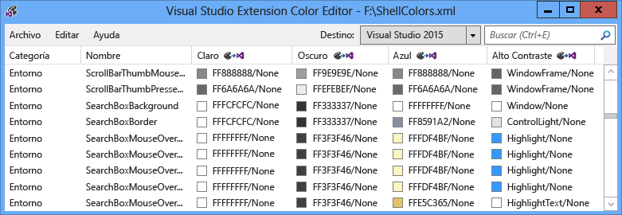
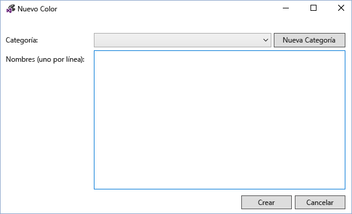
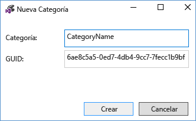
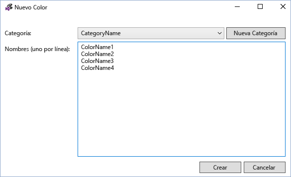
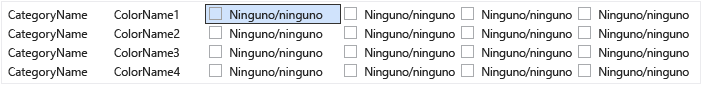
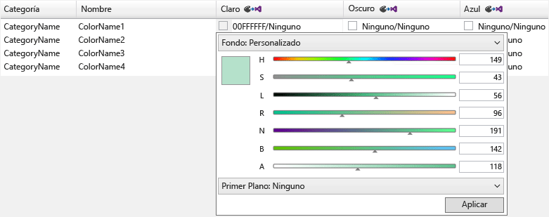
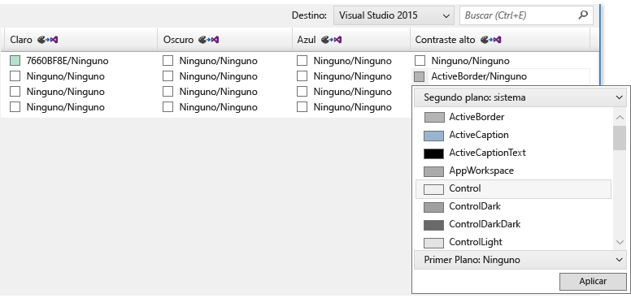
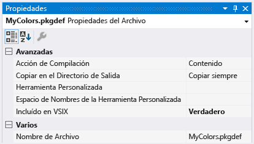
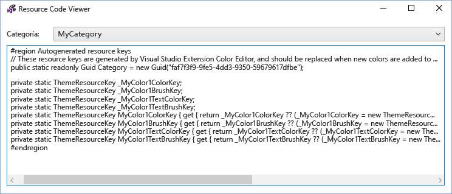
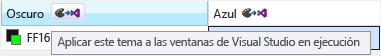

# <a name="vsix-color-editor"></a>Editor de colores de VSIX
La herramienta Editor de colores de extensión de Visual Studio puede crear y editar los colores personalizados para Visual Studio. La herramienta también puede generar las claves de recursos de tema para que se pueden usar los colores en el código. Esta herramienta es útil para realizar los colores de una extensión de Visual Studio que admite la creación de temas. Esta herramienta puede abrir archivos .pkgdef y XML. Temas visuales Studio (archivos .vstheme) pueden usarse con el Editor de colores en extensión de Visual Studio, al cambiar la extensión de archivo a XML. Además, los archivos de .vstheme pueden importarse en un archivo .xml actual.

 

 **Archivos de definición de paquete**

 Archivos de definición (.pkgdef) del paquete son los archivos que definen los temas. Los colores a sí mismos se almacenan en archivos .xml de color de tema, que se compilan en un archivo .pkgdef. Los archivos .pkgdef están implementados en ubicaciones de búsqueda de Visual Studio, procesados en tiempo de ejecución y combinados juntos para definir los temas.

 **Tokens de color**

 Un token de color se compone de cuatro elementos:

- **Nombre de categoría:** Una agrupación lógica de un conjunto de colores. Use un nombre de categoría existente si ya hay colores que son específicos para el elemento deseado de la interfaz de usuario o grupo de elementos de interfaz de usuario.

- **Nombre del token:** Establece un nombre descriptivo para el color de token y token. Conjuntos de incluyen en segundo plano y los nombres de token de primer plano (texto), así como todos sus Estados, y estos deben tener un nombre para que sea fácil identificar los pares y los Estados que se aplican a.

- **Los valores de color (o tonos):** Es necesario para cada tema color. Siempre cree en segundo plano y el texto valores de color en pares. Se emparejan colores de primer plano y fondo para que siempre sea legible con el color de fondo en el que se dibuja el color del texto (primer plano). Estos colores se vinculan y usarán conjuntamente en la interfaz de usuario. Si el fondo no está diseñado para su uso con texto, no se define un color de primer plano.

- **Nombre del color del sistema:** Para su uso en pantallas de alto contraste.

## <a name="how-to-use-the-tool"></a>Cómo usar la herramienta
 Tanto como sea posible, y en su caso, los colores de Visual Studio existentes deben reutilizarse en lugar de hacer otras nuevas. Sin embargo, para los casos donde no se definen colores adecuados, se deben crear colores personalizados para mantener una aplicación de temas de extensión compatible.

 **Creación de nuevos tokens de color**

 Para crear colores personalizados mediante el Editor de colores de extensión de Visual Studio, siga estos pasos:

1. Determinar los nombres de categoría y el token para los nuevos tokens de color.

2. Elija los tonos que va a usar el elemento de interfaz de usuario para cada tema y el color del sistema de contraste alto.

3. Utilice el editor de colores para crear nuevos tokens de color.

4. Use los colores de una extensión de Visual Studio.

5. Pruebe los cambios en Visual Studio.

   **Paso 1: Determinar los nombres de categoría y el token para los nuevos tokens de color.**

   Esquema de la nomenclatura preferido para un VSColor es **[categoría] [tipo de interfaz de usuario] [estado]**. No use la palabra "color" en los nombres de VSColor, ya que es redundante.

   Los nombres de categoría proporcionan agrupaciones lógicas y deben definirse como restrictiva como sea posible. Por ejemplo, el nombre de una ventana de herramientas solo puede ser un nombre de categoría, pero no lo es el nombre de un equipo de proyecto o la unidad empresarial completa. Agrupar entradas en categorías le ayuda a evitar la confusión entre los colores con el mismo nombre.

   Un nombre de token debe indicar claramente el tipo de elemento y las situaciones o "estado", que se aplicará el color. Por ejemplo, una activo de datos la sugerencia **[tipo de interfaz de usuario]** podría denominarse "**información sobre datos**" y la **[State]** podría denominarse "**Active**," resultante en un nombre del color de "**DataTipActive**." Puesto que las sugerencias de datos tienen texto, deben definirse un primer plano y un color de fondo. Mediante el uso de un emparejamiento de primer plano y fondo, el editor de colores creará automáticamente los colores "**DataTipActive**" para el fondo y "**DataTipActiveText**" para el primer plano.

   Si la parte de la interfaz de usuario tiene solo un estado el **[State]** se puede omitir la parte del nombre. Por ejemplo, si un cuadro de búsqueda tiene un borde y no hay ningún cambio de estado que podría afectar al color del borde, a continuación, el nombre de token de color del borde puede simplemente llamará "**SearchBoxBorder**."

   Algunos nombres de estado comunes incluyen:

- Activo

- Inactivo

- MouseOver

- MouseDown

- Seleccionado

- Con foco

  Ejemplos de algunos nombres de token para las partes de un control de elemento de lista:

- ListItem

- ListItemBorder

- ListItemMouseOver

- ListItemMouseOverBorder

- ListItemSelected

- ListItemSelectedBorder

- ListItemDisabled

- ListItemDisabledBorder

  **Paso 2: Elija los tonos que va a usar el elemento de interfaz de usuario para cada tema y el color del sistema de contraste alto.**

  Al elegir los colores personalizados para la interfaz de usuario, seleccione un elemento de interfaz de usuario similar existente y utilizar sus colores como base. Los colores de los elementos de interfaz de usuario en el equipo han sometido a revisión y pruebas, para que busque adecuados y se comporten correctamente en todos los temas.

  **Paso 3: Utilice el editor de colores para crear nuevos tokens de color.**

  Inicie el editor de colores y abra o cree un nuevo archivo .xml de colores de tema personalizado. Seleccione **Edición > nuevo Color** en el menú. Se abrirá un cuadro de diálogo para especificar la categoría y uno o varios nombres para las entradas de color dentro de esa categoría:

  

  Seleccione una categoría existente o seleccione **nueva categoría** para crear una nueva categoría. Se abrirá otro cuadro de diálogo, crear un nuevo nombre de categoría:

  

  La nueva categoría estará disponible en el **nuevo Color** menú desplegable de categoría. Después de elegir una categoría, escriba un nombre por línea para cada nuevo token de color y seleccione "Crear" cuando termine:

  

  Se muestran los valores de color en pares de primer plano y fondo, con "None" que indica que no se ha definido el color. Nota: si un color no tiene un texto de color/par de colores de fondo, a continuación, solo en segundo plano debe definirse.

  

  Para editar un token de color, seleccione un color para el tema (columna) de ese token. Agregue el valor de color por escribir un valor de color hexadecimal en formato ARGB de 8 dígitos, escriba un nombre de color del sistema en una celda o utilizando el menú desplegable para seleccionar el color deseado a través de un conjunto de controles deslizantes de color o una lista de colores del sistema.

  

  

  Para los componentes que no es necesario para mostrar el texto, escriba el valor de un solo color: el color de fondo. En caso contrario, introduzca valores para el color de fondo y de texto, separado por una barra diagonal.

  Al especificar los valores de contraste alto, escriba los nombres válidos de color de sistema de Windows. No escriba los valores codificados ARGB. Puede ver una lista de nombres de colores del sistema válido seleccionando "en segundo plano: Sistema"o" primer plano: Sistema"en los menús de lista desplegable del valor de color. Al crear los elementos que tienen componentes de texto, utilice el par de color de texto/plano correcto del sistema o el texto puede ser ilegible.

  Cuando termine de creación, configuración y edición de los tokens de color, guardarlos en el formato de .pkgdef o .xml deseado. Los tokens de color con ni en segundo plano ni un conjunto de primer plano se guarda como colores vacíos en el formato .xml, pero descarta en formato pkgdef. Un cuadro de diálogo le advertirá de posibles pérdidas de color si se intenta guardar colores vacíos en un archivo .pkgdef.

  **Paso 4: Use los colores de una extensión de Visual Studio.**

  Después de definir el nuevo color de los tokens, incluyen el .pkgdef en el archivo de proyecto con la "Acción de compilación" establecido en "Contenido" y "Incluir en VSIX" establecido en "True".

  

  En la extensión de Color Editor de Visual Studio, elija Archivo > ver el código de recurso para ver el código que se usa para tener acceso a la personalizada los colores de la interfaz de usuario basada en WPF.

  

  Incluir este código en una clase estática en el proyecto. Una referencia a **Microsoft.VisualStudio.Shell.\< VSVersion >.0.dll** debe agregarse al proyecto para usar el **ThemeResourceKey** tipo.

```csharp
namespace MyCustomColors
{
    public static class MyCategory
    {
        #region Autogenerated resource keys
        // These resource keys are generated by Visual Studio Extension Color Editor, and should be replaced when new colors are added to this category.
        public static readonly Guid Category = new Guid("faf7f3f9-9fe5-4dd3-9350-59679617dfbe");

        private static ThemeResourceKey _MyColor1ColorKey;
        private static ThemeResourceKey _MyColor1BrushKey;
        private static ThemeResourceKey _MyColor1TextColorKey;
        private static ThemeResourceKey _MyColor1TextBrushKey;
        public static ThemeResourceKey MyColor1ColorKey { get { return _MyColor1ColorKey ?? (_MyColor1ColorKey = new ThemeResourceKey(Category, "MyColor1", ThemeResourceKeyType.BackgroundColor)); } }
        public static ThemeResourceKey MyColor1BrushKey { get { return _MyColor1BrushKey ?? (_MyColor1BrushKey = new ThemeResourceKey(Category, "MyColor1", ThemeResourceKeyType.BackgroundBrush)); } }
        public static ThemeResourceKey MyColor1TextColorKey { get { return _MyColor1TextColorKey ?? (_MyColor1TextColorKey = new ThemeResourceKey(Category, "MyColor1", ThemeResourceKeyType.ForegroundColor)); } }
        public static ThemeResourceKey MyColor1TextBrushKey { get { return _MyColor1TextBrushKey ?? (_MyColor1TextBrushKey = new ThemeResourceKey(Category, "MyColor1", ThemeResourceKeyType.ForegroundBrush)); } }
        #endregion
    }
}
```

 Esto permite el acceso a los colores del código XAML y permite la interfaz de usuario responder a cambios de tema.

```xaml
<UserControl x:Class="NewTestProject.TestPackageControl" Name="MyToolWindow"
             xmlns="http://schemas.microsoft.com/winfx/2006/xaml/presentation"
             xmlns:x="http://schemas.microsoft.com/winfx/2006/xaml"
             xmlns:ns="clr-namespace:MyCustomColors">
  <Grid>
    <TextBlock Background="{DynamicResource {x:Static ns:MyCategory.MyColor1BrushKey}}"
               Foreground="{DynamicResource {x:Static ns:MyCategory.MyColor1TextBrushKey}}"
      >Sample Text</TextBlock>

  </Grid>
</UserControl>
```

 **Paso 5: Pruebe los cambios en Visual Studio.**

 El editor de colores puede aplicar temporalmente los tokens de color a las instancias en ejecución de Visual Studio para ver los cambios en directo a los colores sin volver a generar el paquete de extensión. Para ello, haga clic en el botón "En este tema se aplican a la ejecución de windows de Visual Studio" que se encuentra en el encabezado de columna de cada tema. Este tema temporal desaparecerá cuando se cierra el Editor de colores de VSIX.

 

 Para realizar los cambios permanentes, RECOMPILE y vuelva a implementar la extensión de Visual Studio después de agregar los nuevos colores para el archivo .pkgdef y escribir el código que se usará esos colores. Volver a generar la extensión de Visual Studio combinará los valores del registro para los nuevos colores en el resto de los temas. A continuación, vuelva a iniciar Visual Studio, ver la interfaz de usuario y compruebe que los nuevos colores aparecen según lo previsto.

## <a name="notes"></a>Notas
 Esta herramienta está diseñada para usarse para crear colores personalizados para los temas de Visual Studio preexistentes o para editar los colores de un tema personalizado de Visual Studio. Para crear temas personalizados de Visual Studio completos, descargue el [extensión de Visual Studio Color Theme Editor](https://marketplace.visualstudio.com/items?itemName=VisualStudioProductTeam.VisualStudio2015ColorThemeEditor) desde la Galería de extensiones de Visual Studio.

## <a name="sample-output"></a>Resultados del ejemplo
 **Color de XML**

 El archivo .xml generado por la herramienta será similar al siguiente:

```xml
<Themes>
  <Theme Name="Light" GUID="{de3dbbcd-f642-433c-8353-8f1df4370aba}">
    <Category Name="CategoryName" GUID="{eee9d521-dac2-48d9-9a5e-5c625ba2040c}">
      <Color Name="ColorName1">
        <Background Type="CT_RAW" Source="FFFFFFFF" />
      </Color>
      <Color Name="ColorName2">
        <Background Type="CT_RAW" Source="FFFFFFFF" />
        <Foreground Type="CT_RAW" Source="FF000000" />
      </Color>
      <Color Name="ColorName3">
        <Background Type="CT_RAW" Source="FFFF0000" />
      </Color>
      <Color Name="ColorName4">
        <Background Type="CT_RAW" Source="FF000088" />
        <Foreground Type="CT_RAW" Source="FFFFFFFF" />
      </Color>
    </Category>
  </Theme>
  <Theme Name="Dark" GUID="{1ded0138-47ce-435e-84ef-9ec1f439b749}">...</Theme>
  <Theme Name="Blue" GUID="{a4d6a176-b948-4b29-8c66-53c97a1ed7d0}">...</Theme>
  <Theme Name="HighContrast" GUID="{a5c004b4-2d4b-494e-bf01-45fc492522c7}">...</Theme>
</Themes>

```

 **Salida de color PKGDEF**

 El archivo .pkgdef generado por la herramienta será similar al siguiente:

```
[$RootKey$\Themes\{de3dbbcd-f642-433c-8353-8f1df4370aba}\CategoryName]
"Data"=hex:78,00,00,00,0b,00,00,00,01,00,00,00,21,d5,e9,ee,c2,da,d9,48,9a,5e,5c,62,5b,a2,04,0c,04,00,00,00,0a,00,00,00,43,6f,6c,6f,72,4e,61,6d,65,31,01,ff,ff,ff,ff,00,0a,00,00,00,43,6f,6c,6f,72,4e,61,6d,65,32,01,ff,ff,ff,ff,01,00,00,00,ff,0a,00,00,00,43,6f,6c,6f,72,4e,61,6d,65,33,01,ff,00,00,ff,00,0a,00,00,00,43,6f,6c,6f,72,4e,61,6d,65,34,01,00,00,88,ff,01,ff,ff,ff,ff
[$RootKey$\Themes\{1ded0138-47ce-435e-84ef-9ec1f439b749}\CategoryName]
"Data"=hex:...
[$RootKey$\Themes\{a4d6a176-b948-4b29-8c66-53c97a1ed7d0}\CategoryName]
"Data"=hex:...
[$RootKey$\Themes\{a5c004b4-2d4b-494e-bf01-45fc492522c7}\CategoryName]
"Data"=hex:...

```

 **Contenedor de claves de recursos de C#**

 Las claves de recurso de color generadas por la herramienta será similares al siguiente:

```csharp
namespace MyNamespace
{
    public static class MyColors
    {
        #region Autogenerated resource keys
        // These resource keys are generated by Visual Studio Extension Color Editor, and should be replaced when new colors are added to this category.

        public static string ColorName1ColorKey { get { return "ColorName1ColorKey"; } }
        public static string ColorName1BrushKey { get { return "ColorName1BrushKey"; } }

        public static string ColorName2ColorKey { get { return "ColorName2ColorKey"; } }
        public static string ColorName2BrushKey { get { return "ColorName2BrushKey"; } }
        public static string ColorName2TextColorKey { get { return "ColorName2TextColorKey"; } }
        public static string ColorName2TextBrushKey { get { return "ColorName2TextBrushKey"; } }

        public static string ColorName3ColorKey { get { return "ColorName4ColorKey"; } }
        public static string ColorName3BrushKey { get { return "ColorName4BrushKey"; } }
        public static string ColorName3TextColorKey { get { return "ColorName4TextColorKey"; } }
        public static string ColorName3TextBrushKey { get { return "ColorName4TextBrushKey"; } }
        #endregion
    }
}
```

 **Contenedor de diccionario de recursos WPF**

 El color **ResourceDictionary** las claves generadas por la herramienta será similares al siguiente:

```xaml
<ResourceDictionary xmlns="http://schemas.microsoft.com/winfx/2006/xaml/presentation"
        xmlns:x="http://schemas.microsoft.com/winfx/2006/xaml"
        xmlns:colors="clr-namespace:MyNamespace">

  <SolidColorBrush x:Key="{x:Static colors:MyColors.ColorName1BrushKey}" Color="#FFFFFFFF" />
  <Color x:Key="{x:Static colors:MyColors.ColorName1ColorKey}" A="255" R="255" G="255" B="255" />

  <SolidColorBrush x:Key="{x:Static colors:MyColors.ColorName2BrushKey}" Color="#FFFFFFFF" />
  <Color x:Key="{x:Static colors:MyColors.ColorName2ColorKey}" A="255" R="255" G="255" B="255" />
  <SolidColorBrush x:Key="{x:Static colors:MyColors.ColorName2TextBrushKey}" Color="#FF000000" />
  <Color x:Key="{x:Static colors:MyColors.ColorName2TextColorKey}" A="255" R="0" G="0" B="0" />

  <SolidColorBrush x:Key="{x:Static colors:MyColors.ColorName3BrushKey}" Color="#FFFF0000" />
  <Color x:Key="{x:Static colors:MyColors.ColorName3ColorKey}" A="255" R="255" G="0" B="0" />

  <SolidColorBrush x:Key="{x:Static colors:MyColors.ColorName4BrushKey}" Color="#FF000088" />
  <Color x:Key="{x:Static colors:MyColors.ColorName4ColorKey}" A="255" R="0" G="0" B="136" />
  <SolidColorBrush x:Key="{x:Static colors:MyColors.ColorName4TextBrushKey}" Color="#FFFFFFFF" />
  <Color x:Key="{x:Static colors:MyColors.ColorName4TextColorKey}" A="255" R="255" G="255" B="255" />
</ResourceDictionary>
```