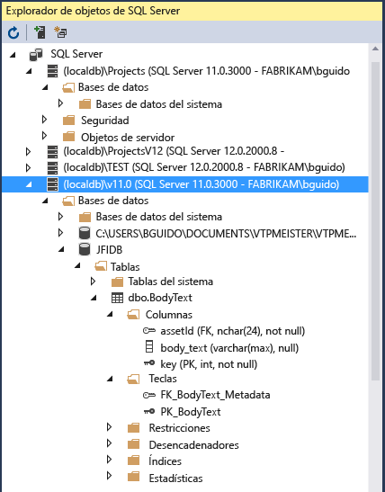

# Características de Visual Studio

En el artículo [Introducción al IDE de Visual Studio](../get-started/visual-studio-ide.md) se proporciona una introducción básica a Visual Studio. En este artículo se describen características que podrían ser más adecuadas para desarrolladores experimentados o para aquellos desarrolladores que ya están familiarizados con Visual Studio.

## Instalación modular

El instalador modular de Visual Studio permite elegir *cargas de trabajo* e instalarlas. Las cargas de trabajo son grupos de características necesarias para el lenguaje de programación o la plataforma que prefiera. Esta estrategia ayuda a mantener la superficie de la instalación de Visual Studio más pequeña, lo que se traduce también en una mayor rapidez a la hora de instalar y actualizar.

::: moniker range="vs-2017"

Si todavía no ha instalado Visual Studio, vaya a la página de [descargas de Visual Studio](https://visualstudio.microsoft.com/vs/older-downloads/?utm_medium=microsoft&utm_source=docs.microsoft.com&utm_campaign=vs+2017+download) para instalarlo de forma gratuita.

::: moniker-end

::: moniker range=">=vs-2019"

Si todavía no ha instalado Visual Studio, vaya a la página de [descargas de Visual Studio](https://visualstudio.microsoft.com/downloads) para instalarlo de forma gratuita.

::: moniker-end

Para obtener más información sobre la configuración de Visual Studio en el sistema, vea [Instalación de Visual Studio](../install/install-visual-studio.md).

## Creación de aplicaciones para la nube para Azure

Visual Studio ofrece un conjunto de herramientas que le permiten crear con facilidad aplicaciones habilitadas para la nube con tecnología de Microsoft Azure. Puede configurar, compilar, depurar, empaquetar e implementar aplicaciones y servicios en Microsoft Azure directamente desde el IDE. Para obtener las plantillas de proyecto y las herramientas de Azure, seleccione la carga de trabajo **Desarrollo de Azure** al instalar Visual Studio.

::: moniker range="vs-2017"

Después de instalar la carga de trabajo **Desarrollo de Azure**, en el cuadro de diálogo **Nuevo proyecto** estarán disponibles las siguientes plantillas de la **nube** para C#:

::: moniker-end

En [Cloud Explorer](/azure/vs-azure-tools-resources-managing-with-cloud-explorer) de Visual Studio puede ver y administrar los recursos de nube basados en Azure de Visual Studio. Estos recursos pueden incluir máquinas virtuales, tablas, bases de datos SQL y mucho más. **Cloud Explorer** muestra los recursos de Azure en todas las cuentas administradas en la suscripción de Azure en la que ha iniciado sesión. Y si una operación determinada requiere Azure Portal, **Cloud Explorer** proporciona vínculos que le dirigen al lugar del portal al que necesita ir.

Puede aprovechar los servicios de Azure para sus aplicaciones con **Servicios conectados** como:

- [Servicio conectado Active Directory](/azure/active-directory/develop/vs-active-directory-add-connected-service) de manera que los usuarios puedan usar sus cuentas de [Azure Active Directory](/azure/active-directory/active-directory-whatis) para conectarse a aplicaciones web
- [Servicio conectado Azure Storage](/azure/vs-azure-tools-connected-services-storage) para el almacenamiento de blobs, colas y tablas
- [Servicio conectado Key Vault](/azure/key-vault/vs-key-vault-add-connected-service) para administrar secretos para las aplicaciones web

Los **servicios conectados** disponibles dependerán del tipo de proyecto que tenga. Para agregar un servicio, haga clic con el botón derecho en el proyecto en el **Explorador de soluciones** y elija **Agregar** > **Servicio conectado**.

Para obtener más información, vea [Move to the cloud With Visual Studio and Azure](https://visualstudio.microsoft.com/vs/azure-tools/) (Pasarse a la nube con Visual Studio y Azure).

## Creación de aplicaciones para la Web

Nuestro mundo actual se basa en la Web, y Visual Studio puede ayudarle a escribir aplicaciones en este medio. Puede crear aplicaciones web mediante ASP.NET, Node.js, Python, JavaScript y TypeScript. Visual Studio comprende marcos web como Angular, jQuery, Express y más. ASP.NET Core y .NET Core funcionan en los sistemas operativos Windows, Mac y Linux. [ASP.NET Core](https://dotnet.microsoft.com/learn/aspnet/what-is-aspnet-core) es una actualización principal para MVC, WebAPI y SignalR, y se ejecuta en Windows, Mac y Linux.  ASP.NET Core se diseñó desde la base para ofrecer una pila de .NET eficiente y que admite composición, con el fin de compilar servicios y aplicaciones web modernos basados en la nube.

Para obtener más información, vea [Herramientas web modernas](https://visualstudio.microsoft.com/vs/modern-web-tooling/).

## Compilar aplicaciones y juegos multiplataforma

Puede usar Visual Studio para crear aplicaciones y juegos para MacOS, Linux y Windows, así como para Android, iOS y otros [dispositivos móviles](https://visualstudio.microsoft.com/vs/mobile-app-development/).

- Cree aplicaciones de [.NET Core](/dotnet/core/) que se ejecutan en Windows, macOS y Linux.

- Cree aplicaciones móviles para iOS, Android y Windows en C# y F# mediante el uso de [Xamarin](https://developer.xamarin.com/guides/cross-platform/windows/visual-studio/).

- Cree juegos 2D y 3D en C# mediante [Visual Studio Tools para Unity](/gamedev/unity/get-started/visual-studio-tools-for-unity.md).

- Cree aplicaciones C++ nativas para dispositivos iOS, Android y Windows. Comparta código común en bibliotecas compiladas para iOS, Android y Windows mediante [C++ para desarrollo multiplataforma](/cpp/cross-platform/visual-cpp-for-cross-platform-mobile-development).

## Conectarse a bases de datos

El **Explorador de servidores** sirve para explorar y administrar activos e instancias de SQL Server de forma local y remota, así como en Azure, Salesforce.com, Microsoft 365 y sitios web. Para abrir el **Explorador de servidores**, en el menú principal, elija **Ver** > **Explorador de servidores**. Para obtener más información sobre el uso del Explorador de servidores, vea [Adición de nuevas conexiones](../data-tools/add-new-connections.md).

[SQL Server Data Tools (SSDT)](/sql/ssdt/download-sql-server-data-tools-ssdt) es un eficaz entorno de desarrollo para SQL Server, Azure SQL Database y Azure SQL Data Warehouse. Le permite compilar, depurar, mantener y refactorizar bases de datos. Puede trabajar con un proyecto de base de datos o directamente con una instancia de base de datos conectada de manera local o externa.

El **Explorador de objetos de SQL Server** de Visual Studio ofrece una vista de los objetos de base de datos similar a la de SQL Server Management Studio. El Explorador de objetos de SQL Server permite realizar trabajos de administración y diseño de bases de datos ligeras. Algunos ejemplos de trabajo son la edición de datos de tabla, la comparación de esquemas, la ejecución de consultas mediante menús contextuales directamente desde el Explorador de objetos de SQL Server y mucho más.

## Depure, pruebe y mejore su código

Cuando se escribe código, debe ejecutarlo y probarlo para comprobar su rendimiento y ver si tiene errores. El innovador sistema de depuración de Visual Studio permite depurar el código que se ejecuta en el proyecto local, en un dispositivo remoto o en un [emulador de dispositivo](../cross-platform/visual-studio-emulator-for-android.md). Puede ejecutar el código mediante una instrucción a la vez e inspeccionar las variables a medida que avanza. Puede establecer puntos de interrupción que solo se alcanzan cuando una condición especificada es verdadera. Las opciones de depuración se pueden administrar en el propio editor de código para que no tenga que salir del código. Para obtener más detalles sobre la depuración en Visual Studio, consulte [Primer vistazo al depurador](../debugger/debugger-feature-tour.md).

Para obtener más información sobre cómo mejorar el rendimiento de las aplicaciones, consulte la característica de [generación de perfiles](../profiling/profiling-feature-tour.md) de Visual Studio.

Para las [pruebas](../test/improve-code-quality.md), Visual Studio ofrece pruebas unitarias, Live Unit Testing, IntelliTest, pruebas de carga y de rendimiento, etc. Visual Studio también cuenta con funciones avanzadas de [análisis de código](../code-quality/code-analysis-for-managed-code-overview.md) para detectar errores de diseño, de seguridad y otros tipos de errores.

## Implementar la aplicación finalizada

Cuando la aplicación está lista para implementarse en usuarios o clientes, Visual Studio proporciona las herramientas para hacerlo. Puede implementarse en Microsoft Store, en un sitio de SharePoint o mediante las tecnologías de InstallShield o Windows Installer, entre otros. Todo está disponible a través del IDE. Para más información, consulte [Implementar aplicaciones, servicios y componentes](../deployment/deploying-applications-services-and-components.md).

## Administrar el código fuente y colaborar con otras personas

Puede administrar el código fuente en repositorios Git que hospede cualquier proveedor, incluido GitHub. O bien use [Azure DevOps Services](/azure/devops/index) para administrar el código junto con los errores y elementos de trabajo de todo el proyecto. Vea [Get Started with Git and Azure Repos](/azure/devops/repos/git/gitquickstart?tabs=visual-studio) (Empezar a trabajar con Git y Azure Repos) para obtener más información sobre cómo administrar repositorios de Git en Visual Studio mediante Team Explorer. Visual Studio tiene otras características integradas de control de código fuente. Para obtener más información sobre ellas, vea [New Git Features in Visual Studio](https://devblogs.microsoft.com/devops/new-git-features-in-visual-studio-2017/) (Nuevas características de Git en Visual Studio [blog]).

Azure DevOps Services son servicios basados en la nube para planear, hospedar, automatizar e implementar software, y permitir la colaboración en equipos. Azure DevOps Services admite repositorios de Git (control de versiones distribuido) y de Control de versiones de Team Foundation (control de versiones centralizado). Admiten canalizaciones de compilación continua y lanzamiento (CI/CD) de código almacenado en sistemas de control de versiones. Azure DevOps Services también admiten las metodologías de desarrollo Scrum, CMMI y Agile.

Team Foundation Server (TFS) es el centro de administración del ciclo de vida de aplicación de Visual Studio. Permite a todas las partes interesadas en el proceso de desarrollo participar con una única solución. TFS es útil para administrar equipos heterogéneos y también proyectos.

Si tiene una organización de Azure DevOps o Team Foundation Server en la red, conéctese a ella en la ventana de **Team Explorer** en Visual Studio. Desde esta ventana puede proteger o desproteger código en el control de código fuente, administrar elementos de trabajo, iniciar compilaciones y acceder a los salones y las áreas de trabajo del equipo. Puede abrir **Team Explorer** desde el cuadro de búsqueda o en el menú principal, en **Ver** > **Team Explorer** o desde **Equipo** > **Administrar conexiones**.

En la siguiente imagen se muestra la ventana **Team Explorer** de una solución hospedada en Azure DevOps Services.

También puede automatizar el proceso de compilación para compilar el código que los desarrolladores del equipo han insertado en el control de versiones. Por ejemplo, puede compilar uno o varios proyectos por la noche o cada vez que se proteja ese código. Para obtener más información, consulte [Azure Pipelines](/azure/devops/pipelines/index?view=vsts&preserve-view=true).

## Ampliar Visual Studio

Si Visual Studio no tiene la funcionalidad exacta que necesita, puede agregarla. Puede personalizar el IDE en función de su flujo de trabajo y estilo, agregar compatibilidad para herramientas externas que aún no se han integrado con Visual Studio y modificar la funcionalidad existente para aumentar la productividad. Para obtener la versión más reciente de las herramientas de extensibilidad de Visual Studio (SDK de VS), vea [Kit de desarrollo de software (SDK) de Visual Studio](../extensibility/visual-studio-sdk.md).

Puede usar .NET Compiler Platform ("Roslyn") para escribir sus propios analizadores de código y generadores de código. Encuentre todo lo que necesita en [Roslyn](https://github.com/dotnet/Roslyn).

Busque las [extensiones existentes](https://marketplace.visualstudio.com/vs) para Visual Studio creadas por los desarrolladores de Microsoft y nuestra comunidad de desarrollo.

Para obtener más información acerca de la extensión de Visual Studio, consulte [Extender el IDE de Visual Studio](https://visualstudio.microsoft.com/vs/extend/).

## Vea también

- [Introducción al IDE de Visual Studio](../get-started/visual-studio-ide.md)
- [Novedades de Visual Studio 2017](../ide/whats-new-visual-studio-2017.md)
- [Novedades de Visual Studio 2019](../ide/whats-new-visual-studio-2019.md)
