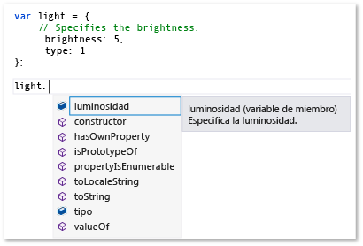
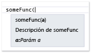

# Extender IntelliSense para JavaScript
[!INCLUDE[vs2017banner](../code-quality/includes/vs2017banner.md)]

La característica de extensibilidad de JavaScript IntelliSense permite personalizar los resultados de IntelliSense en el editor de JavaScript para bibliotecas de otros fabricantes.  Esto puede mejorar la experiencia de los desarrolladores que utilizan estas bibliotecas.  
  
 El servicio de lenguaje JavaScript proporciona las características de IntelliSense para las bibliotecas de otros fabricantes JavaScript que se agregan a un proyecto.  Para la mayoría de las bibliotecas, finalización de instrucciones proporcionan automáticamente el servicio de lenguaje.  La ilustración siguiente se muestra un ejemplo de la finalización de instrucciones:  
  
   
  
 Si la biblioteca contiene descripciones de variables, funciones, y de objetos de etiquetas estándar de comentario JavaScript \(\/\), se automáticamente se beneficia, de forma predeterminada, las características de extensibilidad de IntelliSense, que proporcionan información descriptiva en un cuadro móvil que aparece a la derecha de los elementos de una lista de finalización, o al escribir el paréntesis de apertura en una llamada de función.  Los comentarios del cuadro móvil contienen la descripción del miembro.  El ejemplo siguiente se muestra el cuadro móvil para una lista de finalización.  
  
   
  
 Para mejorar aún más la experiencia del desarrollador, puede que desee proporcionar información de tipo a los desarrolladores del cuadro móvil.  Puede proporcionar información de tipos con JavaScript [Comentarios de documentación XML](../ide/xml-documentation-comments-javascript.md) en lugar de etiquetas estándar de comentario.  Agrega Comentarios de documentación XML mediante etiquetas de comentario de la triple\- barra diagonal \(\/\) y un conjunto definido de elementos XML.  
  
 Alternativamente, puede proporcionar información de tipo mediante la extensibilidad de JavaScript IntelliSense.  Esta característica permite personalizar los resultados de IntelliSense creando extensiones JavaScript y agregándolas al contexto del script.  En la extensión, que es un archivo JavaScript, se suscribe a los eventos expuestos por el objeto de `intellisense` del servicio de lenguaje.  Extensibilidad de JavaScript IntelliSense es la solución preferida para las bibliotecas si un patrón de comportamiento en la biblioteca evita que el servicio de lenguaje JavaScript proporcione el nivel deseado de compatibilidad con IntelliSense, y una alternativa a los Comentarios de documentación XML declarativos también se necesita.  Personalizar los resultados de IntelliSense, puede crear una experiencia de primera clase de IntelliSense, independientemente de cualquier modelo de rendimiento que pueda limitar las funciones predeterminadas del servicio de lenguaje.  Para obtener más información, vea [Finalización de instrucciones para identificadores](../ide/statement-completion-for-identifiers.md).  
  
## Agregar una extensión al contexto de scripting  
 Para que una extensión de IntelliSense se ejecutarán, necesita agregar en el contexto actual del script.  La extensión se puede agregar automáticamente al contexto de script mediante el mecanismo de detección automática, o agregar la extensión al contexto de scripting manualmente mediante grupos de referencia o la directiva reference.  
  
 El mecanismo de detección automática permite al servicio de lenguaje automáticamente para buscar las extensiones que siguen la convención de nomenclatura *libraryname*.intellisense.js de archivo, y que se encuentran en el mismo directorio que la biblioteca a la que se aplica la extensión.  Por ejemplo, una extensión válida para la biblioteca de jQuery sería jQuery.intellisense.js.  Para extensiones más restrictivas jQuery, puede utilizar nombres de archivo como jQuery\-1.7.1.intellisense.js \(una extensión versión\- concreta o jQuery.ui.intellisense.js \(una extensión para una biblioteca ámbito jQuery\).  La versión más restrictiva de la extensión se usa si más de una extensión se encuentra para una biblioteca especificada.  
  
 Si desea utilizar la extensión para todos los archivos de proyecto de JavaScript, es posible que en su lugar elija para agregar la extensión a un grupo de referencia.  Hay varios tipos de grupos de referencia, en los que incluyan referencias implícitas y los que incluyen trabajo dedicado hace referencia.  Para agregar una extensión, normalmente tendrá que agregar el archivo como un grupo implícitamente de referencia, cualquier **Implícito \(Windows\)**, **Implícito \(Web\)**.  Las referencias implícitas están en el ámbito para cada archivo .js abiertos en el editor de código.  Cuando utiliza este método, debe agregar la extensión y el archivo que la extensión se complementando.  
  
 Utilice la página **intellisense** del cuadro de diálogo **opciones** para agregar una extensión como grupo de referencia.  Puede tener acceso a la página **intellisense** eligiendo **herramientas**, **opciones** en la barra de menús, y elegir **Editor de texto**, **JavaScript**, **intellisense**, **References**.  Para obtener más información sobre los grupos de referencia, vea [IntelliSense para JavaScript](../ide/javascript-intellisense.md) y [Opciones, editor de texto, JavaScript, IntelliSense](../ide/reference/options-text-editor-javascript-intellisense.md).  
  
 Si desea utilizar la extensión para un conjunto de archivos específica, utilice una directiva reference.  Cuando utiliza este método, es necesario hacer referencia a la extensión y el archivo que la extensión se complementando.  Para obtener información sobre cómo utilizar la directiva reference, vea [IntelliSense para JavaScript](../ide/javascript-intellisense.md).  
  
## Administrar los eventos de IntelliSense  
 La característica de extensibilidad permite personalizar los resultados de IntelliSense suscribiéndose a eventos como el evento de `statementcompletion` del objeto de `intellisense` del servicio de lenguaje.  El ejemplo siguiente se muestra una extensión simple que sea utilizada por el servicio de lenguaje para ocultar los miembros que comienzan con un subrayado de finalización de instrucciones.  Este código se contiene en underscorefilter.js y está en \\ \\ la carpeta de *Ruta de instalación de Visual Studio*\\JavaScript\\References.  
  
```javascript  
intellisense.addEventListener('statementcompletion', function (event) {  
    if (event.targetName === "this") return;  
  
    var filterRegex;  
  
    if (event.target === undefined || event.target === window)  
        filterRegex = /^_.*\d{2,}/;  
    else  
        filterRegex = /^_.*/;  
  
    event.items = event.items.filter(function (item) {  
        return !filterRegex.test(item.name);  
    });  
});  
```  
  
 En el código anterior, la extensión comprueba las propiedades de [propiedad de targetName](#TargetName) y de [propiedad de destino](#Target) del objeto de evento de `statementcompletion` para excluir objetos como `this` y `window`, y para asegurarse de que una lista de finalización de instrucciones válida puede identificarse.  Si una lista de finalización puede identificarse, la extensión actualiza la colección de [propiedad items](#Items) de finalización de instrucciones filtrando los miembros que comienzan con un subrayado.  
  
 Para obtener ejemplos adicionales, examine \\ \\ la carpeta de *Ruta de instalación de Visual Studio*\\JavaScript\\References.  El archivo de showPlainComments.js en esta carpeta proporciona ejemplos de cómo utilizar otros eventos para proporcionar compatibilidad predeterminado de IntelliSense para las etiquetas estándar de comentario JavaScript \(\/\).  Como underscorefilter.js, showPlainComments.js ya está disponible como una extensión que funciona y, puede ver información resultante de IntelliSense al utilizar etiquetas de comentario del código para las variables, funciones, y objetos.  Para obtener otros ejemplos, vea [Ejemplos de código](#CodeExamples).  
  
> [!WARNING]
>  Si modifica los archivos de extensión incluidos en Visual Studio, puede deshabilitar JavaScript IntelliSense o la característica admitida por la extensión.  
  
 En el código de extensión, puede crear controladores para los tipos de evento siguientes mediante `addEventListener`:  
  
-   `statementcompletion`, que agrega un controlador para un evento de finalización de instrucciones.  La finalización de instrucciones proporciona una lista de miembros para un tipo concreto que aparece después de escribir un carácter especial como un punto \(.\), o una lista de identificadores que aparece cuando escribe o al presionar CTRL \+ j.  El controlador recibe un objeto de evento de `CompletionEvent` escrito, que admite los miembros siguientes: [propiedad items](#Items), [propiedad de destino](#Target), [propiedad de targetName](#TargetName), y [propiedad de ámbito](#Scope).  
  
-   `signaturehelp`, que agrega un controlador para la información de parámetros de IntelliSense.  La información de parámetros ofrece información sobre el número, los nombres, y los tipos de parámetros que requiere una función.  El controlador recibe un objeto de evento de `SignatureHelpEvent` escrito, que admite los miembros siguientes: [propiedad de destino](#Target), [propiedad de parentObject](#ParentObject), [propiedad de los functionComments](#FunctionComments), [propiedad de functionHelp](#FunctionHelp).  
  
-   `statementcompletionhint`, que agrega un controlador para la información de IntelliSense Quick.  El cuadro móvil de información rápida muestra la declaración completa de identificadores en el código.  El controlador recibe un objeto de evento de `CompletionHintEvent` escrito, que admite los miembros siguientes: [propiedad de completionItem](#CompletionItem), y [propiedad de symbolHelp](#SymbolHelp).  
  
 Para obtener ejemplos que muestran las características de IntelliSense como la finalización de instrucciones, información de parámetros, así como información rápida, vea [Utilizar IntelliSense](../ide/using-intellisense.md).  
  
> [!NOTE]
>  En JavaScript, información rápida hace referencia al cuadro móvil que aparece a la derecha de una lista de finalización.  No puede invocar manualmente la información rápida.  
  
##  <a name="intellisenseObject"></a> objeto de intellisense  
 La tabla siguiente muestra las funciones que están disponibles para el objeto de `intellisense`.  El objeto de `intellisense` solo está disponible en tiempo de diseño.  
  
|Función|Descripción|  
|-------------|-----------------|  
|`addEventListener(type, handler);`|Agrega un controlador para un evento de IntelliSense.<br /><br /> `type` es un valor de cadena.  Incluyen `statementcompletion`, `signaturehelp`, y `statementcompletionhint` de los valores válidos.<br /><br /> `handler` es una función de controlador de eventos que recibe un objeto de evento de uno de los tipos siguientes:<br /><br /> -   `CompletionEvent`, utilizado para el evento de `statementcompletion`.<br />-   `SignatureHelpEvent`, utilizado para el evento de `signaturehelp`.<br />-   `CompletionHintEvent`, utilizado para el evento de `statementcompletionhint`.<br /><br /> Para obtener ejemplos que utilizan esta función, vea [Ejemplos de código](#CodeExamples).|  
|`annotate(obj, doc);`|Especifica la documentación para un objeto copiando comentarios de documentación a partir de un objeto a otro objeto.<br /><br /> `obj` especifica el objeto al que copiar la documentación.<br /><br /> `doc` especifica el objeto de que copiar la documentación.<br /><br /> Para obtener un ejemplo que muestra cómo utilizar esta función, vea [Anotaciones de IntelliSense de suma](#Annotations).|  
|`getFunctionComments(func);`|Devuelve los comentarios para una función especificada.<br /><br /> `func` especifica la función que se devuelven los comentarios.<br /><br /> Puede establecer el parámetro de `func` mediante `completionItem.value`.<br /><br /> El objeto devuelto de `functionComments` incluye los miembros siguientes: `above`, `inside`, y `paramComment`.  Para obtener más información, vea la propiedad [propiedad de los functionComments](#FunctionComments).<br /><br /> `getFunctionComments` solo se puede llamar desde uno de los controladores de eventos que se registran por `addEventListener`.<br /><br /> Para obtener un ejemplo que muestra cómo utilizar esta función, vea \\ \\*Ruta de instalación de Visual Studio*\\JavaScript\\References\\showPlainComments .js.|  
|`logMessage(msg);`|Envía mensajes de diagnóstico en la ventana de salida.<br /><br /> `msg` es una cadena que contiene el mensaje.<br /><br /> Para obtener un ejemplo que muestra cómo utilizar esta función, vea [Envío de mensajes a la ventana de resultados](#Logging).|  
|`nullWithCompletionsOf(value);`|Devuelve un valor NULL especial que la lista de finalización se determina por el objeto pasado en el parámetro de `value`.<br /><br /> `value` determina la lista de finalización para el valor devuelto.  `value` puede ser cualquier tipo.<br /><br /> El valor devuelto nulo es tan interpreta NULL en tiempo de diseño, pero la lista de finalización para el valor devuelto es el mismo que la lista de finalización para el parámetro de `value`.<br /><br /> Un uso para esta función es proporcionar IntelliSense para un valor devuelto al tipo de valor devuelto es confiable en tiempo de ejecución, pero el valor devuelto es `null` en el diseño\- Tiempo.|  
|`redirectDefinition(func, definition);`|Indica a IntelliSense para utilizar la función de la definición en lugar de la función funcional original cuando se solicita ayuda o **Ir a definición** de parámetros.<br /><br /> `func` especifica la función de destino.<br /><br /> `definition` especifica la función que se utilizará en lugar de la función de destino para la información y **Ir a definición** de parámetros.|  
|`setCallContext(func, thisArg);`|Establece el contexto de llamada, o el ámbito, para la función especificada.<br /><br /> `func` especifica la función para que establezca el ámbito.<br /><br /> `thisArg` es un literal de objeto al que la palabra clave de `this` puede consultar, que especifica el nuevo ámbito para el miembro.  Puede incluir argumentos para pasar en este parámetro, por ejemplo, `intellisense.setCallContext(func, { thisArg: "", args: [23,2] });`<br /><br /> `setCallContext` proporciona un comportamiento similar a `Function.prototype.bind`, salvo que utilizó sólo para compatibilidad con IntelliSense en tiempo de diseño.  Puede utilizar `setCallContext` para establecer el ámbito de la función si necesita simular una llamada a código que no sea de otra manera accesible, de modo que al llamar a la función, la llamada a la función incluye el ámbito y argumentos correctos.|  
|`undefinedWithCompletionsOf(value);`|Devuelve un valor indefinido especial que la lista de finalización se determina por el objeto pasado en el parámetro de `value`.<br /><br /> `value` determina la lista de finalización para el valor devuelto.  `value` puede ser cualquier tipo.<br /><br /> El valor devuelto no se trata en no definido en tiempo de diseño, pero la lista de finalización para el valor devuelto es el mismo que la lista de finalización para el parámetro de `value`.<br /><br /> Un uso para esta función es proporcionar IntelliSense para un valor devuelto al tipo de valor devuelto es confiable en tiempo de ejecución, pero el valor devuelto no está definido en el diseño\- Tiempo.|  
|`version()`|Devuelve la versión de Visual Studio.|  
  
## Miembros de evento  
 Las secciones siguientes se describen los miembros que se exponen en el objeto de evento para los eventos siguientes: `statementcompletion`, `signaturehelp`, y `statementcompletionhint`.  
  
###  <a name="CompletionItem"></a> propiedad de completionItem  
 Devuelve el identificador, conocido como elemento de finalización, para el que se solicita un cuadro móvil de información rápida.  Esta propiedad está disponible para el objeto de evento de `statementcompletionhint` y para la propiedad de [propiedad items](#Items) del objeto de evento de `statementcompletion`.  
  
 Valor devuelto: objeto de `completionItem`  
  
 Los siguientes son miembros de objetos de `completionItem`:  
  
-   `name`.  Escritura cuando se usa en la colección de `items`; si no, de sólo lectura.  Devuelve una cadena que identifica el elemento de finalización.  
  
-   `kind`.  Escritura cuando se usa en la colección de `items`; si no, de sólo lectura.  Devuelve una cadena que representa el tipo de elemento de finalización.  Los valores posibles son método, campo, propiedad, parámetro, variable, y reservado.  
  
-   `glyph`.  Escritura cuando se usa en la colección de `items`; si no, de sólo lectura.  Devuelve una cadena que representa un icono que se muestra en la lista de finalización.  Los valores posibles para `glyph` utilizan el formato siguiente: en:*glyphType*, donde *glyphType* corresponde a los miembros independientes del lenguaje en la enumeración de <xref:Microsoft.VisualStudio.Language.Intellisense.StandardGlyphGroup>.  Por ejemplo, `vs:GlyphGroupMethod` es un valor posible para `glyph`.  Cuando `glyph` no está establecida, la propiedad de `kind` determina el icono predeterminado.  
  
-   `parentObject`.  Es de solo lectura.  Devuelve el objeto primario.  
  
-   `value`.  Es de solo lectura.  Devuelve un objeto que representa el valor de finalización.  
  
-   `comments`.  Es de solo lectura.  Devuelve una cadena que contiene los comentarios que hacen referencia al campo o variable.  
  
-   `scope`.  Es de solo lectura.  Devuelve el ámbito del elemento de finalización.  Los valores posibles son globales, locales, parámetro, y miembro.  
  
###  <a name="Items"></a> propiedad items  
 Obtiene o establece la matriz de elementos de finalización de instrucciones.  Cada elemento de la matriz es un objeto de [propiedad de completionItem](#CompletionItem).  La propiedad de `items` está disponible para el objeto de evento de `statementcompletion`.  
  
 Valor devuelto: matriz  
  
###  <a name="FunctionComments"></a> propiedad de los functionComments  
 Devuelve los comentarios de la función.  Esta propiedad está disponible para el objeto de evento de `signaturehelp`.  
  
 Valor devuelto: objeto de `comments`  
  
 Los siguientes son miembros de objetos de `comments`:  
  
-   `above`.  Devuelve los comentarios sobre la función.  
  
-   `inside`.  Devuelve los comentarios dentro de la función, normalmente en el formato de VSDoc.  
  
-   `paramComments`.  Devuelve una matriz que representa los comentarios para cada parámetro de la función.  Los miembros de inclusión de matriz:  
  
    -   `name`.  Devuelve una cadena que representa el nombre de parámetro.  
  
    -   `comment`.  Devuelve una cadena que contiene el comentario del parámetro.  
  
###  <a name="FunctionHelp"></a> propiedad de functionHelp  
 Devuelve la Ayuda de la función.  Esta propiedad está disponible para el objeto de evento de `signaturehelp`.  
  
 Valor devuelto: objeto de `functionHelp`  
  
 Los siguientes son miembros de objetos de `functionHelp`:  
  
-   `functionName`.  Lectura y escritura.  Devuelve una cadena que contiene el nombre de función.  
  
-   `signatures`.  Lectura y escritura.  Obtiene o establece la matriz de firmas de la función.  Cada elemento de la matriz es un objeto de `signature`.  Algunas propiedades de `signature`, como `locid`, corresponden a [Comentarios de documentación XML](../ide/xml-documentation-comments-javascript.md) común atributos.  
  
     Los miembros de inclusión del objeto de `signature`:  
  
    -   `description`.  Lectura y escritura.  Devuelve una cadena que describe la función.  
  
    -   `locid`.  Lectura y escritura.  Devuelve un identificador de cadena que contiene la información de localización sobre la función.  
  
    -   `helpKeyword`.  Lectura y escritura.  Devuelve una cadena que contiene la palabra clave de Ayuda.  
  
    -   `externalFile`.  Lectura y escritura.  Devuelve una cadena que representa el archivo que contiene el identificador de miembro  
  
    -   `externalid`.  Lectura y escritura.  Devuelve una cadena que representa el identificador del miembro de la función.  
  
    -   `params`.  Lectura y escritura.  Obtiene o establece la matriz de parámetros para la función.  Cada elemento de la matriz de parámetros es un objeto de `parameter` que tiene propiedades que corresponden a los siguientes atributos del elemento de [\<param\>](../ide/param-javascript.md):  
  
        -   `name`.  Lectura y escritura.  Devuelve una cadena que representa el nombre de parámetro.  
  
        -   `type`.  Lectura y escritura.  Devuelve una cadena que representa el tipo de parámetro.  
  
        -   `elementType`.  Lectura y escritura.  Si el tipo es `Array`, devuelve una cadena que representa el tipo de los elementos de la matriz.  
  
        -   `description`.  Lectura y escritura.  Devuelve una cadena que describe el parámetro.  
  
        -   `locid`.  Lectura y escritura.  Devuelve un identificador de cadena que contiene la información de localización sobre la función.  
  
        -   `optional`.  Lectura y escritura.  Devuelve una cadena que indica si el parámetro es opcional.  `true` indica que el parámetro es opcional; `false` indica que no es.  
  
    -   `returnValue`.  Lectura y escritura.  Obtiene o establece un objeto de valor devuelto con propiedades que corresponden a los siguientes atributos del elemento de [\<returns\>](../ide/returns-javascript.md):  
  
        -   `type`.  Lectura y escritura.  Devuelve una cadena que representa el tipo de valor devuelto.  
  
        -   `elementType`.  Lectura y escritura.  Si el tipo es `Array`, devuelve una cadena que representa el tipo de los elementos de la matriz.  
  
        -   `description`.  Lectura y escritura.  Devuelve una cadena que describe el valor devuelto.  
  
        -   `locid`.  Lectura y escritura.  Devuelve un identificador de cadena que contiene la información de localización sobre la función.  
  
        -   `helpKeyword`.  Lectura y escritura.  Devuelve una cadena que contiene la palabra clave de Ayuda.  
  
        -   `externalFile`.  Lectura y escritura.  Devuelve una cadena que representa el archivo que contiene el identificador de miembro  
  
        -   `externalid`.  Lectura y escritura.  Devuelve una cadena que representa el identificador del miembro de la función.  
  
###  <a name="ParentObject"></a> propiedad de parentObject  
 Devuelve el objeto primario de una función miembro.  Por ejemplo, para `document.getElementByID`, `parentObject` devuelve el objeto de `document`.  Esta propiedad está disponible para el objeto de evento de `signaturehelp`.  
  
 Valor devuelto: objeto  
  
###  <a name="Target"></a> propiedad de destino  
 Devuelve un objeto que representa el elemento a la izquierda del carácter del desencadenador, que es un punto \(.\).  Para las funciones, `target` devuelve la función que se solicita información de parámetros.  Esta propiedad está disponible para los objetos de evento de `statementcompletion` y de `signaturehelp`.  
  
 Valor devuelto: objeto  
  
###  <a name="TargetName"></a> propiedad de targetName  
 Devuelve una cadena que representa el destino.  Por ejemplo, para “esto. ”, `targetName` devuelve “this”.  Para “A.B” \(cuando el cursor está después de “b”\), `targetName` devuelve “b”.  Esta propiedad está disponible para el objeto de evento de `statementcompletion`.  
  
 Valor devuelto: cadena  
  
###  <a name="SymbolHelp"></a> propiedad de symbolHelp  
 Devuelve el elemento de finalización para el que se solicita un cuadro móvil de información rápida.  Esta propiedad está disponible para el objeto de evento de `statementcompletionhint`.  
  
 Valor devuelto: objeto de `symbolHelp`.  
  
 Algunas propiedades del objeto de `symbolHelp`, como `locid`, corresponden a [Comentarios de documentación XML](../ide/xml-documentation-comments-javascript.md) común atributos.  
  
 Los siguientes son miembros de objetos de `symbolHelp`:  
  
-   `name`.  Lectura y escritura.  Devuelve una cadena que contiene el nombre de identificador.  
  
-   `symbolType`.  Lectura y escritura.  Devuelve una cadena que representa el tipo de token.  Desconocido de inclusión de valores posibles, boolean, número, string, object, función, matriz, fecha, y regex.  
  
-   `symbolDisplayType`.  Lectura y escritura.  Devuelve una cadena que contiene el nombre de tipo para mostrar.  Si `symbolDisplayType` no está establecida, se utiliza `symbolType`.  
  
-   `elementType`.  Lectura y escritura.  Si `symbolType` es `Array`, devuelve una cadena que representa el tipo de los elementos de la matriz.  
  
-   `scope`.  Lectura y escritura.  Devuelve una cadena que representa el ámbito de símbolos.  Los valores posibles son global, local, parámetro, y el miembro.  
  
-   `description`.  Lectura y escritura.  Devuelve una cadena que contiene una descripción del símbolo.  
  
-   `locid`.  Lectura y escritura.  Devuelve un identificador de cadena que contiene la información de localización sobre el símbolo.  
  
-   `helpKeyword`.  Lectura y escritura.  Devuelve una cadena que contiene la palabra clave de Ayuda.  
  
-   `externalFile`.  Lectura y escritura.  Devuelve una cadena que representa el archivo que contiene el identificador de miembro  
  
-   `externalid`.  Lectura y escritura.  Devuelve una cadena que representa el identificador del miembro del símbolo.  
  
-   `functionHelp`.  Lectura y escritura.  Devuelve [propiedad de functionHelp](#FunctionHelp), que pueden contener información cuando `symbolType` es función.  
  
###  <a name="Scope"></a> propiedad de ámbito  
 Devuelve el ámbito del evento.  Los valores posibles del ámbito de finalización son globales y miembros.  Esta propiedad está disponible para el objeto de evento de `statementcompletion`.  
  
 Valor devuelto: cadena  
  
## Extensiones de IntelliSense de depuración  
 No puede depurar extensiones, pero puede utilizar la función de [objeto de intellisense](#intellisenseObject) para enviar información a la ventana de resultados de Visual Studio.  Para obtener un ejemplo que muestra cómo utilizar esta función, vea [Envío de mensajes a la ventana de resultados](#Logging) más adelante en este tema.  Para que `logMessage` funcione, por lo menos un controlador de eventos debe registrarse en una extensión.  
  
##  <a name="CodeExamples"></a> Ejemplos de código  
 Esta sección contiene ejemplos de código que muestran cómo usar la extensibilidad API de IntelliSense.  También hay otras maneras de utilizar estas API.  Para obtener más ejemplos, vea los siguientes archivos en \\ \\ la carpeta de *Ruta de instalación de Visual Studio*\\JavaScript\\References.  Son ejemplos de ejecución utilizados por el servicio de lenguaje de JavaScript.  
  
-   underscoreFilter.js.  Este código oculta a los miembros privados de IntelliSense.  Incluye controladores de eventos para el evento `statementcompletion`.  
  
-   showPlainComments.js.  Este código proporciona compatibilidad con IntelliSense para los comentarios estándar.  Incluye controladores de eventos de `signaturehelp` y de `statementcompletionhint`.  
  
###  <a name="Annotations"></a> Anotaciones de IntelliSense de suma  
 El procedimiento siguiente muestra cómo proporcionar compatibilidad de documentación de IntelliSense para una biblioteca de terceros sin modificar la biblioteca directamente.  Para ello, puede utilizar `intellisense.annotate` en una extensión.  
  
 Para que este ejemplo funcione, necesita los siguientes archivos JavaScript en el proyecto:  
  
-   demoLib.js, que es un archivo de proyecto que representa una biblioteca de terceros.  
  
-   demoLib.intellisense.js, que es la extensión de IntelliSense.  Este archivo no tiene que incluir en el proyecto, sino que debe estar en la misma carpeta que exampleLib.js.  
  
-   appCode.js, que es un archivo de proyecto que representa el código de la aplicación.  
  
##### Para agregar una anotación de IntelliSense  
  
1.  Agregue el código siguiente a demoLib.js.  
  
    ```javascript  
    function someFunc(a) { };  
    var rectangle;  
  
    ```  
  
2.  Agregue el código siguiente a demoLib.intellisense.js.  
  
    ```javascript  
    intellisense.annotate(someFunc, function (a) {  
        /// <signature>  
        /// <summary>Description of someFunc</summary>  
        /// <param name="a">Param a</param>  
        /// </signature>  
    });  
  
    intellisense.annotate(window, {  
        // This is a comment on a global variable named rectangle.  
        rectangle: undefined  
    });  
    ```  
  
3.  Agregue la directiva reference siguiente como la primera línea en appCode.js.  La ruta de acceso utilizada aquí indica que los archivos JavaScript están en la misma carpeta.  
  
    ```javascript  
    /// <reference path="demoLib.js" />  
  
    ```  
  
4.  En appCode.js, escriba el código siguiente.  Verá los Comentarios de documentación XML en la extensión mostrará la información de parámetros de IntelliSense.  
  
       
  
5.  En appCode.js, escriba el código siguiente.  Cuando escribe, verá los comentarios estándar en la extensión mostrada como información de IntelliSense Quick.  
  
       
  
###  <a name="Logging"></a> Envío de mensajes a la ventana de resultados  
 El procedimiento siguiente muestra cómo enviar mensajes a la ventana de salida.  Puede enviar mensajes para ayudar a depurar extensiones de IntelliSense.  
  
 Para que este ejemplo funcione, necesita los siguientes archivos JavaScript en el proyecto:  
  
-   exampleLib.js, que es un archivo de proyecto que representa una biblioteca de terceros.  
  
-   exampleLib.intellisense.js, que es la extensión de IntelliSense.  Este archivo no tiene que incluir en el proyecto, sino que debe estar en la misma carpeta que exampleLib.js.  
  
-   appCode.js, que es un archivo de proyecto que representa el código de la aplicación.  
  
##### Para enviar un mensaje a la ventana de resultados  
  
1.  Agregue el código siguiente a exampleLib.js.  
  
    ```javascript  
    var someVar = {  
        a: 1,  
        b: 'hello'  
    };  
    ```  
  
2.  Agregue el código siguiente a exampleLib.intellisense.js.  
  
    ```javascript  
    intellisense.addEventListener('statementcompletion', function (e) {  
        // Prints out statement completion info: Either (1) the member   
        // list, if the trigger character was typed, or (2) the   
        // statement completion identifiers.  
        // e.target represents the object left of the trigger character.  
        intellisense.logMessage(  
            e.target ? 'member list requested, target: ' + e.targetName : 'statement completion for current scope requested');  
  
        // Prints out all statement completion items.  
        e.items.forEach(function (item) {  
            intellisense.logMessage('[completion item] ' + item.name + ', kind:' + item.kind + ', scope:' + item.scope + ', value:' + item.value);  
        });  
    });  
    ```  
  
3.  Agregue la directiva reference siguiente como la primera línea en appCode.js.  La ruta de acceso utilizada aquí indica que los archivos JavaScript están en la misma carpeta.  
  
    ```javascript  
    /// <reference path="exampleLib.js" />  
  
    ```  
  
4.  En la ventana de resultados, elija **Servicio de lenguaje JavaScript** en la lista **Mostrar resultados desde**.  \(Para ver la ventana de salida, **Resultado** seleccione en el menú ver.\)  
  
5.  En appCode.js, escriba el código siguiente.  Cuando escribe, la ventana de salida muestra los mensajes del servicio de lenguaje.  El primer mensaje en la ventana de salida indica que la finalización de instrucciones para el ámbito actual se ha solicitado.  
  
    ```javascript  
    some  
    ```  
  
     A continuación se muestra una vista parcial salida que debe ver.  
  
    ```scr  
    03:16:14.3113: statement completion for current scope requested  
    03:16:14.3113: [completion item] break, kind:reserved, scope:undefined, value:undefined  
    03:16:14.3113: [completion item] case, kind:reserved, scope:undefined, value:undefined  
    03:16:14.3113: [completion item] catch, kind:reserved, scope:undefined, value:undefined  
  
    …  
    ```  
  
6.  Elija el botón **Borrar todo** en la ventana de salida.  
  
7.  Escriba el código siguiente.  El primer mensaje en la ventana de salida indica que se ha solicitado una lista de miembros.  
  
    ```javascript  
    someVar.  
    ```  
  
     A continuación se muestra una vista parcial salida que debería ver:  
  
    ```scr  
    03:17:43.4032: member list requested, target: someVar  
    03:17:43.4032: [completion item] a, kind:field, scope:member, value:1  
    03:17:43.4032: [completion item] b, kind:field, scope:member, value:hello  
    03:17:43.4032: [completion item] constructor, kind:method, scope:member, value:  
  
    …  
    ```  
  
###  <a name="Icons"></a> Cambiar los iconos de IntelliSense  
 El procedimiento siguiente muestra cómo cambiar los iconos que aparecen por IntelliSense de forma predeterminada.  Esto puede ser útil cuando se proporciona información de IntelliSense sobre conceptos biblioteca\- específicos como espacios de nombres, clases, interfaces, y enumeraciones.  
  
 Para los valores disponibles del icono, vea <xref:Microsoft.VisualStudio.Language.Intellisense.StandardGlyphGroup>.  
  
 Para que este ejemplo funcione, necesita los siguientes archivos JavaScript en el proyecto:  
  
-   exampleLib.js, que es un archivo de proyecto que los represens una biblioteca de terceros.  
  
-   exampleLib.intellisense.js, que es la extensión de IntelliSense.  Este archivo no tiene que incluir en el proyecto, sino que debe estar en la misma carpeta que exampleLib.js.  
  
-   appCode.js, que es un archivo de proyecto que representa el código de la aplicación.  
  
##### Para cambiar los iconos  
  
1.  Agregue el código siguiente a exampleLib.js.  
  
    ```javascript  
    function Namespace(name) {  
        this._isNamespace = true;  
        window[name] = this;  
    };  
  
    function Enum(values) {  
        var e = Object.create(values);  
        e._isEnum = true;  
        return e;  
    };  
  
    var SomeNamespace = new Namespace('SomeNamespace');  
    // A constructor function is considered a class.  
    SomeNamespace.SomeClass1 = function () { }  
    SomeNamespace.Enum1 = new Enum({ VALUE1: 0, VALUE2: 1 });  
    ```  
  
2.  Agregue el código siguiente a exampleLib.intellisense.js.  
  
    ```javascript  
    intellisense.addEventListener('statementcompletion', function (e) {  
        e.items.forEach(function (item) {  
            // Detect a namespace by using the _isNamespace flag.  
            if (item.value && item.value._isNamespace) {  
                item.glyph = 'vs:GlyphGroupNamespace';  
                }  
  
            if (item.parentObject && item.parentObject._isNamespace) {  
                // The item is a member of a namespace.   
  
                // All constructor functions that are part of a namespace   
                // are considered classes.   
                // A constructor function starts with  
                // an uppercase letter by convention.    
                if (typeof item.value == 'function' && (item.name[0].toUpperCase()   
                    == item.name[0])) {  
                    item.glyph = 'vs:GlyphGroupClass';  
                }  
  
                // Detect an enumeration by using the _isEnum flag.  
                if (item.value && item.value._isEnum) {  
                    item.glyph = 'vs:GlyphGroupEnum';  
                }  
            }  
        });  
    });  
  
    intellisense.addEventListener('statementcompletionhint', function (e) {  
        if (e.completionItem.value) {  
            if (e.completionItem.value._isNamespace) {  
                e.symbolHelp.symbolDisplayType = 'Namespace';  
            }  
            if (e.completionItem.value._isEnum) {  
                e.symbolHelp.symbolDisplayType = 'Enum';  
            }  
        }  
    });  
    ```  
  
3.  Agregue la directiva reference siguiente como la primera línea en appCode.js.  La ruta de acceso utilizada aquí indica que los archivos JavaScript están en la misma carpeta.  
  
    ```javascript  
    /// <reference path="exampleLib.js" />  
  
    ```  
  
4.  En appCode.js, escriba el código siguiente.  Cuando escribe, verá que el icono del espacio de nombres ha cambiado “{}”, como se utiliza en C\#.  
  
       
  
5.  En appCode.js, escriba el código siguiente.  Cuando escribe, verá un nuevo icono de enumeración para el miembro Enum1, y un nuevo icono de clase para el miembro SomeClass1.  
  
       
  
###  <a name="Overriding"></a> Evitar efectos en tiempo de ejecución en los resultados de IntelliSense  
 El código del servicio de lenguaje JavaScript para proporcionar dinámicamente la información de IntelliSense.  Como resultado, el comportamiento en tiempo de ejecución puede interferir en ocasiones con los resultados deseados.  El siguiente procedimiento muestra cómo reemplazar los resultados de IntelliSense cuando el comportamiento en tiempo de ejecución da lugar a IntelliSense incorrecto.  
  
 Para que este ejemplo funcione, necesita los siguientes archivos JavaScript en el proyecto:  
  
-   exampleLib.js, que es un archivo de proyecto que representa una biblioteca de terceros.  
  
-   exampleLib.intellisense.js, que es la extensión de IntelliSense.  Este archivo no tiene que incluir en el proyecto, sino que debe estar en la misma carpeta que exampleLib.js.  
  
-   appCode.js, que es un archivo de proyecto que representa el código de la aplicación.  
  
##### Para evitar efectos en tiempo de ejecución en los resultados de IntelliSense  
  
1.  Agregue el código siguiente a exampleLib.js.  
  
    ```javascript  
    function after(count, func) {  
        return function () {  
            if (--times < 1) {  
                return func.apply(this, arguments);  
            }  
        };  
    };  
    ```  
  
     En el código anterior, la función ajustada omite llamadas iniciales, según el valor de `count`, y no muestra los resultados devueltos.  
  
2.  Agregue la directiva reference siguiente como la primera línea en appCode.js.  La ruta de acceso utilizada aquí indica que los archivos JavaScript están en la misma carpeta.  
  
    ```javascript  
    /// <reference path="exampleLib.js" />  
  
    ```  
  
3.  En appCode.js, escriba el código siguiente.  La lista de identificador en lugar de IntelliSense porque la función ajustada nunca se llama, lo que significa que la función de `throttled` no devuelve ningún resultado.  
  
       
  
4.  Agregue el código siguiente a exampleLib.intellisense.js.  Esto cambiará el comportamiento en tiempo de diseño para mostrar IntelliSense para la función ajustada, tal y como se esperaba.  
  
    ```javascript  
    window.after = function (count, func) {  
        // Just return func.   
        return func;  
    };  
    ```  
  
5.  En appCode.js, pruebe los resultados escribiendo el mismo código que especificó.  Esta vez, IntelliSense proporciona información deseada.  
  
       
  
## Vea también  
 [IntelliSense para JavaScript](../ide/javascript-intellisense.md)   
 [Finalización de instrucciones para identificadores](../ide/statement-completion-for-identifiers.md)