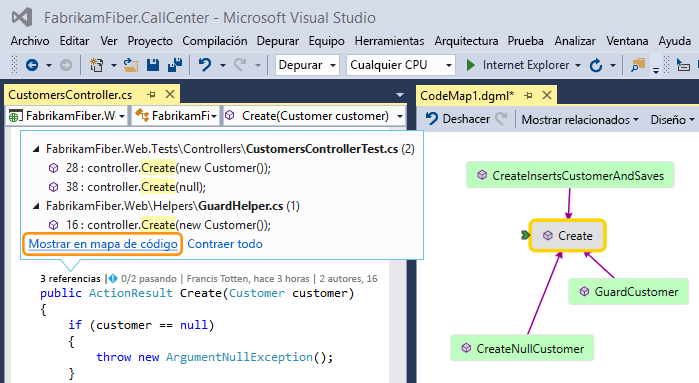
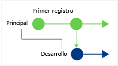
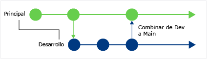
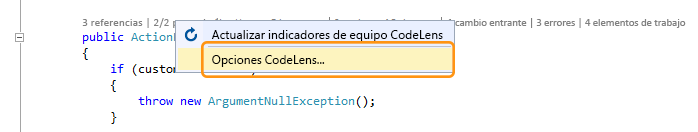
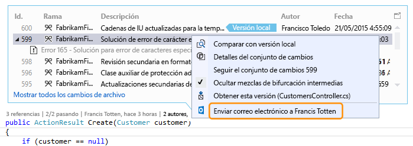
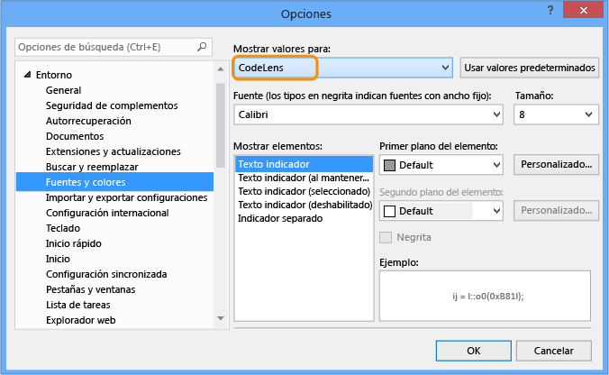
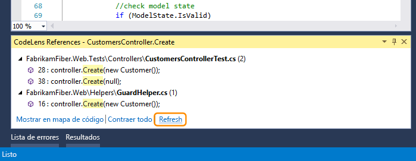
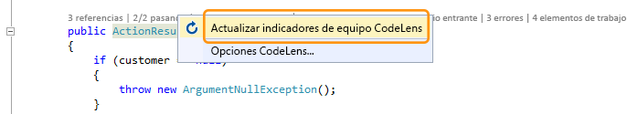

# Buscar cambios en el código y otro historial con CodeLens

CodeLens le permite averiguar qué ocurrió con el código mientras sigue centrado en su trabajo sin dejar el editor. Puede buscar referencias de una parte del código, cambios de código, errores vinculados, elementos de trabajo, revisiones de código y pruebas unitarias.

::: moniker range=">=vs-2019"

> [!NOTE]
> Los indicadores de CodeLens del control de código fuente no están disponibles en la edición Visual Studio Community.

::: moniker-end

::: moniker range="vs-2017"

> [!NOTE]
> CodeLens solo está disponible en las ediciones Visual Studio Enterprise y Professional. No está disponible en la edición Visual Studio Community.

::: moniker-end

Vea dónde y cómo se usan las partes individuales del código de la solución:

Póngase en contacto con su equipo para informar de los cambios en el código sin salir del editor:

Para elegir qué indicadores desea ver, o para activar o desactivar CodeLens, vaya a **Herramientas** > **Opciones** > **Editor de texto** > **Todos los lenguajes** > **CodeLens**.

## Buscar referencias al código

Puede buscar referencias en código de C# o de Visual Basic.

1. Elija el indicador **referencias** o presione **Alt**+**2**.

   

   > [!NOTE]
   > Si el indicador muestra **0 referencias**, significa que no tiene ninguna referencia de código de C# o Visual Basic. Pero podría haber referencias en otros elementos, como archivos *.xaml* y *.aspx*.

2. Para ver el código de referencia, mueva el mouse sobre la referencia en la lista.

   

3. Para abrir el archivo que contiene la referencia, haga doble clic en la referencia.

### Mapas de código

Para ver las relaciones entre este código y sus referencias, [cree un mapa de código](../modeling/map-dependencies-across-your-solutions.md). En el menú contextual del mapa de código, seleccione **Mostrar todas las referencias**.

## Buscar cambios en el código

Inspeccione el historial del código para averiguar qué ocurrió. O bien, revise esos cambios antes de combinarlos con su código para saber cómo los cambios de otras bifurcaciones podrían afectarlo.

Es necesario:

- Edición Visual Studio Enterprise o Professional

- Azure DevOps Services, Team Foundation Server 2013 o posterior o Git

- [Skype Empresarial](/skypeforbusiness/) para ponerse en contacto con su equipo desde el editor de código.

Para el código de C# o Visual Basic que está almacenado con control de versiones de Team Foundation (TFVC) o Git, los detalles de CodeLens se obtienen en los niveles de clase y método (indicadores*code-element-level*). Si el repositorio Git está hospedado en TfGit, también obtendrá vínculos a elementos de trabajo TFS.

Para otros tipos de archivos que no son *.cs* o *.vb*, los detalles de CodeLens se obtienen para todo el archivo en un mismo lugar, en la parte inferior de la ventana (indicadores de *nivel de archivo*).

### Indicadores de nivel de elemento del código

Los indicadores de nivel de elemento de código permiten ver quién cambió el código y qué cambios se realizaron. Los indicadores de nivel de elemento de código están disponibles para el código de C# y Visual Basic.

Esto es lo que se ve cuando se usa el Control de versiones de Team Foundation (TFVC) en Team Foundation Server o Azure DevOps Services.

El período de tiempo predeterminado son los últimos 12 meses. Si el código se almacena en Team Foundation Server, puede cambiar el periodo de tiempo ejecutando el [comando TFSConfig](/tfs/server/ref/command-line/tfsconfig-cmd) junto con el [comando CodeIndex](../ide/codeindex-command.md) y la marca **/indexHistoryPeriod**.

Para ver un historial detallado de todos los cambios, incluidos los de hace más de un año, elija **Mostrar todos los cambios de archivo**:

Se abre la ventana **Historial**:

Esto es lo que se ve cuando los archivos están en un repositorio Git y se elige el indicador de cambios en el nivel de elemento de código:

### Indicadores de nivel de archivo

Busque los cambios realizados en todo un archivo en los indicadores de nivel de archivo de la parte inferior de la ventana:

> [!NOTE]
> Los indicadores de nivel de archivo no están disponibles para los archivos de C# y Visual Basic.

Para obtener más detalles sobre un cambio, haga clic con el botón secundario en ese elemento. En función de si está usando TFVC o Git, hay diferentes opciones para comparar las versiones del archivo, ver detalles y realizar el seguimiento del conjunto de cambios, obtener la versión seleccionada del archivo y enviar un correo electrónico al autor del cambio. Algunos de estos detalles aparecen en **Team Explorer**.

También puede ver quién cambió el código a lo largo del tiempo. Esto puede ayudarle a identificar patrones en los cambios de su equipo y a evaluar su impacto.

### Buscar cambios en la bifurcación actual

Su equipo puede tener varias ramas, por ejemplo, una rama Main y una rama Development secundaria, para reducir el riesgo de que el código estable se interrumpa.

Puede saber cuántas personas realizaron cambios en el código y cuántos cambios se realizaron en la rama Main presionando **Alt**+**6**:

### Buscar cuándo se bifurcó el código

Para buscar cuándo se bifurcó el código, navegue hasta el código de la rama secundaria. Después, seleccione el indicador **cambios** o presione **Alt**+**6**:

### Buscar cambios entrantes de otras bifurcaciones

Puede ver los cambios entrantes. En la siguiente captura de pantalla, se realizó una corrección de errores en la rama "Dev":

Puede revisar el cambio sin salir de la rama actual ("Main"):

### Buscar cuándo se combinan los cambios

Puede ver cuándo se combinaron los cambios, para que pueda determinar qué cambios se incluyen en la rama:

Por ejemplo, el código de la bifurcación Main ahora incluye la corrección de errores de la bifurcación "Dev":

### Comparar un cambio entrante con la versión local

Compare un cambio entrante con la versión local presionando **MAYÚS**+**F10**, o haciendo doble clic en el conjunto de cambios.

### Iconos de rama

El icono de la columna **Rama** indica cómo se relaciona la rama en la que está trabajando con la rama.

|**Iconos**|**El cambio provino de:**|
|--------------| - |
||La bifurcación actual|
||La bifurcación primaria|
||Una bifurcación secundaria|
||Una bifurcación del mismo nivel|
||Una bifurcación más alejada que una primaria, secundaria o del mismo nivel|
||Una combinación de la bifurcación primaria y una bifurcación secundaria|
||Una combinación de una bifurcación secundaria con la bifurcación secundaria|
||Una combinación de una bifurcación no relacionada (combinación sin base)|

## Elementos de trabajo vinculados.

Buscar elementos de trabajo vinculados seleccionando el indicador **elementos de trabajo** o presionando **Alt**+**8**.

## Revisiones de código vinculadas

Buscar revisiones de código vinculadas seleccionando el indicador **revisiones**. Para usar el teclado, mantenga presionada la tecla **Alt** y, después, presione **Flecha izquierda** o **Flecha derecha** para navegar por las opciones de indicador.

## Errores vinculados

Buscar errores vinculados seleccionando el indicador **errores** o presionando **Alt**+**7**.

## Ponerse en contacto con el propietario de un elemento

Buscar el autor de un elemento seleccionando el indicador **autores** o presionando **Alt**+**5**.

Abra el menú contextual de un elemento para ver las opciones de contacto. Si tiene Lync o Skype Empresarial instalado, verá estas opciones:

## Pruebas unitarias asociadas

Puede buscar qué pruebas unitarias existen para el código de C# o Visual Basic sin tener que abrir el **Explorador de pruebas**.

1. Vaya al código de la aplicación que tenga [código pruebas unitarias](../test/unit-test-your-code.md) asociado.

2. Si todavía no lo ha hecho, compile la aplicación para que cargue los indicadores de prueba de CodeLens. Asegúrese de tener la [detección de ensamblados compilados](../test/test-explorer-faq.md#assembly-based-discovery) activada.

3. Revise las pruebas para el código presionando **Alt**+**3**.

     

4. Si aparece un icono de advertencia , las pruebas todavía no se han ejecutado, así que ejecútelas.

     

5. Para revisar la definición de una prueba, haga doble clic en el elemento de prueba en la ventana de indicador de CodeLens para abrir el archivo de código en el editor.

     

6. Para revisar los resultados de la prueba, elija el indicador de estado de la misma ( o ) o presione **Alt**+**1**.

     

7. Para ver cuántas personas cambiaron esta prueba, quién la cambió o cuántos cambios se realizaron, [busque el historial del código](#find-changes-in-your-code) y los elementos vinculados.

## Métodos abreviados de teclado

Para usar el teclado para seleccionar los indicadores, mantenga presionada la tecla **Alt** para mostrar las teclas numéricas relacionadas, luego presione el número que se corresponda con el indicador que quiere seleccionar.

> [!NOTE]
> Para seleccionar el indicador **revisiones**, mantenga pulsada la tecla **Alt** mientras usa las teclas de flecha derecha e izquierda para navegar.

## Preguntas y respuestas

### P: ¿Cómo activo o desactivo CodeLens o elijo qué indicadores ver?

**R:**  Puede activar o desactivar los indicadores, excepto el de referencias. Vaya a **Herramientas** > **Opciones** > **Editor de texto** > **Todos los lenguajes** > **CodeLens**.

Cuando se activen los indicadores, también podrá abrir las opciones de CodeLens desde estos.

Active o desactive los indicadores de nivel de archivo de CodeLens con los iconos de botón de contenido adicional de la parte inferior de la ventana del editor.

### P: ¿Dónde está CodeLens?

**R:** CodeLens aparece en el código de C# y Visual Basic, en el nivel de método, de clase, de indizador y de propiedad. CodeLens aparece en el nivel de archivo para todos los demás tipos de archivos.

- Asegúrese de que CodeLens esté activado. Vaya a **Herramientas** > **Opciones** > **Editor de texto** > **Todos los lenguajes** > **CodeLens**.

- Si el código está almacenado en TFS, asegúrese de que la indización de código esté activada. Para ello, use el [comando CodeIndex](../ide/codeindex-command.md) con el [comando TSF Config](/tfs/server/ref/command-line/tfsconfig-cmd).

- Los indicadores relacionados con DevOps aparecen solo cuando los elementos de trabajo se vinculan al código y cuando tiene permisos para abrir los elementos de trabajo vinculados. Confirme que tiene [permisos de miembro del equipo](/azure/devops/organizations/security/view-permissions?view=vsts).

- Los indicadores de pruebas unitarias no aparecen cuando el código de la aplicación no tiene pruebas unitarias. Dichos indicadores aparecen automáticamente en los proyectos de prueba. Si sabe que el código de la aplicación tiene pruebas unitarias, pero los indicadores de prueba no aparecen, pruebe a compilar la solución (**CTRL**+**Mayús**+**B**).

::: moniker range=">=vs-2019"

> [!TIP]
> Los indicadores del control de código fuente no están disponibles en la edición Visual Studio Community.

::: moniker-end

::: moniker range="vs-2017"

> [!TIP]
> CodeLens no está disponible en la edición Visual Studio Community.

::: moniker-end

### P: ¿Por qué no veo los detalles de los elementos de trabajo de una confirmación?

**R:** Esto podría deberse a que CodeLens no puede encontrar los elementos de trabajo en Azure Boards o TFS. Compruebe que está conectado al proyecto que tenga esos elementos de trabajo y que tiene permisos para verlos. Los detalles de elementos de trabajo también podrían no mostrarse si la descripción de confirmación tiene información incorrecta sobre los identificadores de elementos de trabajo en Azure Boards o TFS.

### P: ¿Por qué no veo los indicadores de Skype?

**R:** Los indicadores de Skype no aparecen si no ha iniciado sesión en Skype Empresarial, si no lo tiene instalado o si su configuración no es compatible. Pero podrá seguir enviando un correo electrónico:

**¿Qué configuraciones de Skype y Lync se admiten?**

- Skype Empresarial (32 o 64 bits)

- Solo Lync 2010 o posterior (32 bits o 64 bits), pero no Lync Basic 2013 con Windows 8.1

CodeLens no admite tener instaladas distintas versiones de Lync o Skype. Puede que no estén localizadas para todas las versiones localizadas de Visual Studio.

### P: ¿Cómo se cambian la fuente y el color de CodeLens?

**R:** Vaya a **Herramientas** > **Opciones** > **Entorno** > **Fuentes y colores**.

Para usar el teclado:

1. Presione **Alt**+**T**+**O** para abrir el cuadro de diálogo **Opciones**.

2. Presione **Flecha arriba** o **Flecha abajo** para ir al nodo **Entorno** y, a continuación, presione **Flecha izquierda** para expandir el nodo.

3. Presione **Flecha abajo** para ir a **Fuentes y colores**.

4. Presione **TAB** para ir a la lista **Mostrar configuración para** y, a continuación, presione **Flecha abajo** para seleccionar **CodeLens**.

### P: ¿Se puede mover la pantalla de aviso de CodeLens?

**R:** Sí, elija  para acoplar CodeLens como ventana.

### P: ¿Cómo se actualizan los indicadores?

**R:** Eso depende del indicador:

- **Referencias**: Este indicador se actualiza automáticamente cuando cambia el código. Si el indicador **Referencias** está acoplado como una ventana independiente, actualice el indicador seleccionando **Actualizar**:

   

- **Equipo**: Actualice estos indicadores al seleccionar **Actualizar indicadores de equipo CodeLens** desde el menú contextual:

   

- **Prueba**: [Buscar pruebas unitarias para el código](#associated-unit-tests) para actualizar el indicador **Prueba**.

### P: ¿Qué es la "Versión local"?

**R:** La flecha **Versión local** apunta al conjunto de cambios más reciente de la versión local de un archivo. Cuando el servidor tiene conjuntos de cambios más recientes, estos aparecen encima o debajo de la flecha **Versión local** , según el orden usado para ordenar los conjuntos de cambios.

### P: ¿Puedo administrar la forma en que CodeLens procesa código para mostrar el historial y los elementos vinculados?

**R:** Sí. Si el código está en TFS, use el [comando CodeIndex](../ide/codeindex-command.md) con el comando [TSF Config](/tfs/server/ref/command-line/tfsconfig-cmd).

### P: Los indicadores de prueba de CodeLens ya no aparecen en el archivo cuando abro la solución por primera vez. ¿Cómo puedo cargarlos?

**R:** Recompile el proyecto para obtener los indicadores de prueba de CodeLens que quiera cargar en el archivo. Asegúrese de tener la [detección de ensamblados compilados](../test/test-explorer-faq.md#assembly-based-discovery
) activada. Para mejorar el rendimiento, Visual Studio ya no obtiene la información de origen de los indicadores de prueba al cargar los archivos de código. Los indicadores de prueba se cargan después de la compilación o al desplazarse a una prueba haciendo doble clic en ella en el **Explorador de pruebas**.

## Vea también

- [Características del editor de código](../ide/writing-code-in-the-code-and-text-editor.md)
