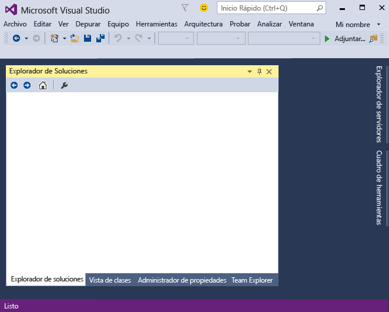
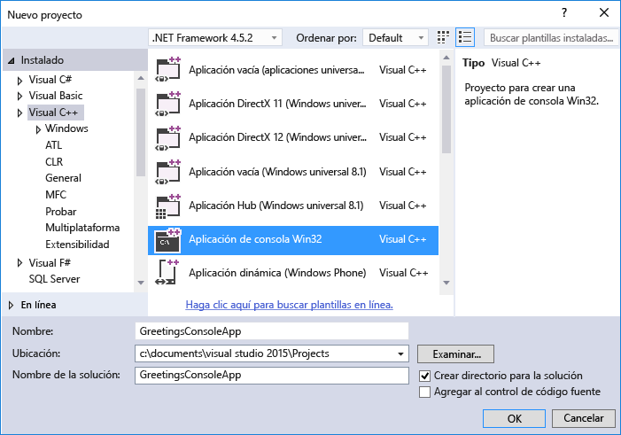
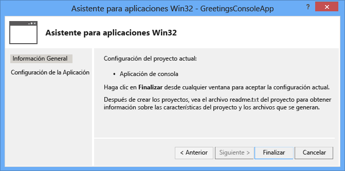
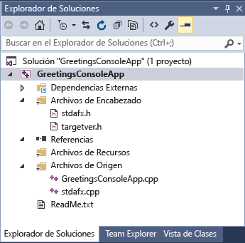
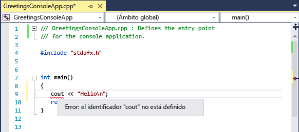
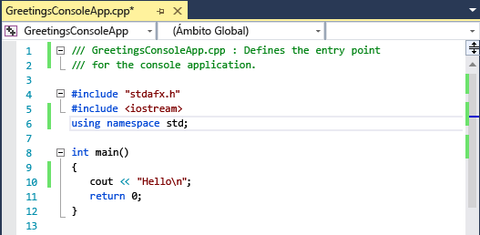
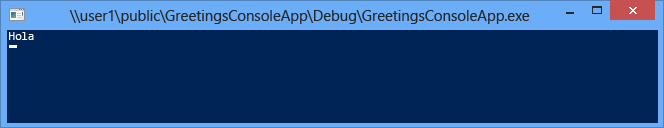

# <a name="getting-started-with-c-in-visual-studio"></a>Introducción a C++ en Visual Studio
Tras completar este tutorial, estará familiarizado con muchas de las herramientas y cuadros de diálogo que puede utilizar para desarrollar aplicaciones con Visual Studio. Creará una aplicación sencilla de estilo "Hola a todos" mientras aprende más sobre cómo trabajar en el entorno de desarrollo integrado (IDE).  
  
 Este tema contiene las siguientes secciones:  
  
 [Iniciar sesión en Visual Studio](../ide/getting-started-with-cpp-in-visual-studio.md#BKMK_Configure)  
  
 [Crear una aplicación sencilla](../ide/getting-started-with-cpp-in-visual-studio.md#BKMK_CreateApp)  
  
 [Agregar código a la aplicación](../ide/getting-started-with-cpp-in-visual-studio.md#BKMK_AddCode)  
  
 [Depurar y probar la aplicación](../ide/getting-started-with-cpp-in-visual-studio.md#BKMK_DebugTest)  
  
 [Compilar una versión de lanzamiento de la aplicación](../ide/getting-started-with-cpp-in-visual-studio.md#BKMK_BuildRelease)  
  
##  <a name="a-namebkmkconfigurea-sign-in-to-visual-studio"></a><a name="BKMK_Configure"></a> Iniciar sesión en Visual Studio  
 Al iniciar Visual Studio por primera vez, tendrá la oportunidad de iniciar sesión con una cuenta de Microsoft como Live o Outlook. El inicio de sesión permite sincronizar su configuración en todos los dispositivos. Para obtener más información, vea [Iniciar sesión en Visual Studio](../ide/signing-in-to-visual-studio.md).  
  
 Figura 1: IDE de Visual Studio  
  
   
  
 Después de abrir Visual Studio, puede ver las tres partes básicas del IDE: ventanas de herramientas, menús y barras de herramientas, así como el espacio de la ventana principal. Las ventanas de herramientas se acoplan a los lados izquierdo y derecho de la ventana de la aplicación, con **Inicio rápido**, la barra de menús y la barra de herramientas estándar en la parte superior. El centro de la ventana de la aplicación contiene la **Página principal**. Cuando se abre una solución o un proyecto, los editores y diseñadores aparecen en este espacio. Cuando desarrolle una aplicación, pasará la mayor parte del tiempo en esta área central.  
  
##  <a name="a-namebkmkcreateappa-create-a-simple-application"></a><a name="BKMK_CreateApp"></a> Crear una aplicación sencilla  
 Cuando cree una aplicación en Visual Studio, cree primero un proyecto y una solución. Para este ejemplo, creará una aplicación de consola de Windows.  
  
#### <a name="to-create-a-console-app"></a>Para crear una aplicación de consola  
  
1.  En la barra de menús, elija **Archivo**, **Nuevo**, **Proyecto**.  
  
       
  
2.  En la categoría **Visual C++** , elija la plantilla **Aplicación de consola Win32** y, después, asigne al proyecto el nombre `GreetingsConsoleApp`.  
  
       
     El cuadro de diálogo puede tener diferentes opciones, dependiendo de lo que ha instalado. Si no ve plantillas de proyecto de Visual C++, necesita volver al instalador e instalar una carga de trabajo de C++.
  
3.  Cuando aparezca el Asistente para aplicaciones Win32, elija el botón **Finalizar** .  
  
       
  
 El proyecto y la solución GreetingsConsoleApp, con los archivos básicos para una aplicación de consola Win32 se crean y se cargan automáticamente en el **Explorador de soluciones**. El archivo GreetingsConsoleApp.cpp se abre en el Editor de código. Los elementos siguientes aparecen en el **Explorador de soluciones**:  
  
 Figura 4: Elementos del proyecto  
  
   
  
##  <a name="a-namebkmkaddcodea-add-code-to-the-application"></a><a name="BKMK_AddCode"></a> Agregar código a la aplicación  
 A continuación, agregará código para mostrar la palabra "Hola" en la ventana de la consola.  
  
#### <a name="to-display-hello-in-the-console-window"></a>Para mostrar “Hola” en la ventana de la consola  
  
1.  En el archivo GreetingsConsoleApp.cpp, escriba una línea en blanco antes de la línea `return 0;` y, después, escriba el código siguiente:  
  
    ```  
    cout << "Hello\n";  
    ```  
  
     Aparece una línea ondulada roja debajo de `cout`. Si la apunta, aparecerá un mensaje de error.  
  
       
  
     El mensaje de error también aparece en la ventana **Lista de errores** . Para mostrar la ventana, en la barra de menús, pulse **Ver**, **Lista de errores**.  
  
     [cout](/cpp/standard-library/iostream) se incluye en el archivo de encabezado \<iostream>.  
  
2.  Para incluir el encabezado iostream, escriba el código siguiente después de `#include "stdafx.h"`:  
  
    ```  
    #include <iostream>  
    using namespace std;  
    ```  
  
     Probablemente ha observado que, al escribir código, apareció un cuadro que proporciona sugerencias para los caracteres escritos. Este cuadro forma parte de IntelliSense de C++, que proporciona indicaciones de codificación, incluida información sobre miembros de interfaz o clase y parámetros. También puede usar fragmentos de código, que son bloques de código predefinidos. Para obtener más información, vea [Usar IntelliSense](../ide/using-intellisense.md) y [Fragmentos de código](../ide/code-snippets.md).  
  
     La línea ondulada roja bajo `cout` desaparece cuando se corrige el error.  
  
3.  Guarde los cambios en el archivo.  
  
       
  
##  <a name="a-namebkmkdebugtesta-debug-and-test-the-application"></a><a name="BKMK_DebugTest"></a> Depurar y probar la aplicación  
 Puede depurar GreetingsConsoleApp para ver si aparece la palabra "Hola" en la ventana de consola.  
  
#### <a name="to-debug-the-application"></a>Para depurar la aplicación  
  
-   Inicie el depurador.  
  
       
  
     El depurador inicia y ejecuta el código. La ventana de consola (una ventana independiente que se parece a un símbolo del sistema) aparece durante unos segundos, pero se cierra rápidamente cuando el depurador deja de ejecutarse. Para ver el texto, deberá establecer un punto de interrupción para detener la ejecución del programa.  
  
#### <a name="to-add-a-breakpoint"></a>Para agregar un punto de interrupción  
  
1.  Agregue un punto de interrupción desde la barra de menús en la línea `return 0;`. También puede hacer clic en el margen izquierdo para establecer un punto de interrupción.  
  
       
  
     Aparece un círculo rojo al lado de la línea de código en el margen izquierdo de la ventana del editor.  
  
2.  Elija la tecla F5 para iniciar la depuración.  
  
     El depurador se inicia y aparece una ventana de consola con la palabra **Hola**.  
  
       
  
3.  Presione MAYÚS + F5 para detener la depuración.  
  
 Para obtener más información, vea [Preparación de la depuración: proyectos de consola](../debugger/debugging-preparation-console-projects.md).  
  
##  <a name="a-namebkmkbuildreleasea-build-a-release-version-of-the-app"></a><a name="BKMK_BuildRelease"></a> Compilar una versión de lanzamiento de la aplicación  
 Ahora que ha comprobado que todo funciona, puede preparar una versión de lanzamiento de la aplicación.  
  
#### <a name="to-clean-the-solution-files-and-build-a-release-version"></a>Para limpiar los archivos de solución y crear una versión de lanzamiento  
  
1.  En la barra de menús, elimine los archivos intermedios y de salida creados durante las compilaciones anteriores.  
  
       
  
2.  Cambie la configuración de compilación para GreetingsConsoleApp de **Depurar** a **Versión**.  
  
       
  
3.  Compile la solución.  
  
       
  
 ¡Enhorabuena por completar este tutorial! Si quiere explorar más ejemplos, vea [Ejemplos de Visual Studio](../ide/visual-studio-samples.md).  
  
## <a name="see-also"></a>Vea también  
 [Usar el IDE de Visual Studio para desarrollo de escritorio de C++](/cpp/ide/using-the-visual-studio-ide-for-cpp-desktop-development)   
 [Tutorial: Crear una aplicación sencilla con Visual C# o Visual Basic](../ide/walkthrough-create-a-simple-application-with-visual-csharp-or-visual-basic.md)   
 [Sugerencias de productividad para Visual Studio](../ide/productivity-tips-for-visual-studio.md)   
 [Ejemplos de Visual Studio](../ide/visual-studio-samples.md)   
 [Introducción al desarrollo con Visual Studio](../ide/get-started-developing-with-visual-studio.md)


<!--HONumber=Feb17_HO4-->


