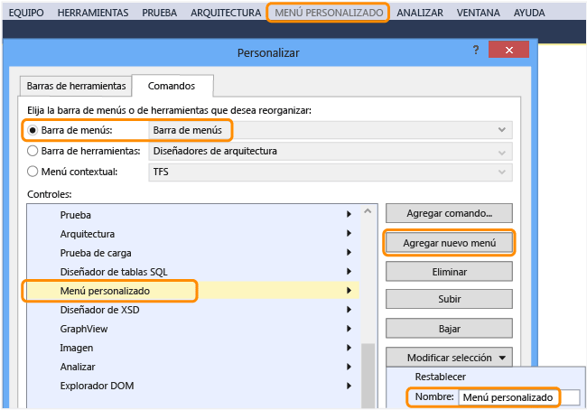
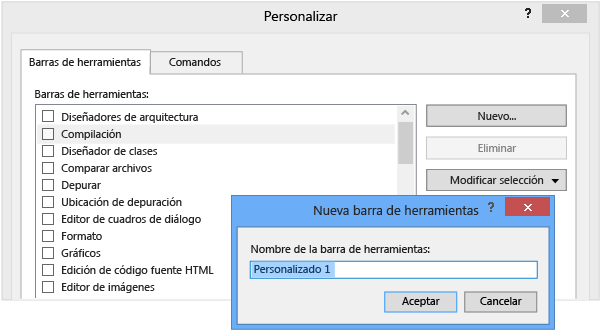
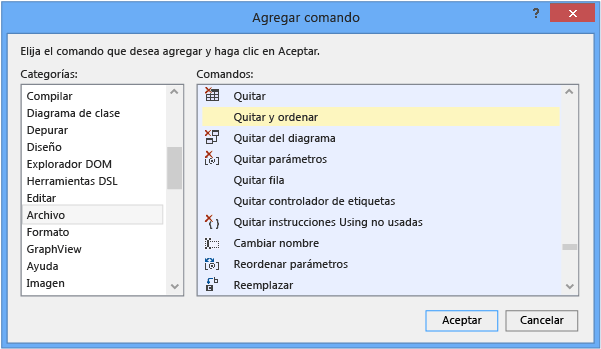

# Procedimiento para personalizar menús y barras de herramientas en Visual Studio

Puede personalizar Visual Studio no solo mediante la adición y la eliminación de barras de herramientas y menús de la barra de menús, sino mediante la adición y la eliminación de comandos de cualquier barra de herramientas o menú concreto.

> [!WARNING]
> Después de personalizar una barra de herramientas o un menú, asegúrese de que la casilla permanece seleccionada en el cuadro de diálogo **Personalizar**. De lo contrario, los cambios no se conservarán después de cerrar y volver a abrir Visual Studio.

## Agregar, quitar o mover un menú en la barra de menús

1. En la barra de menús, elija **Herramientas** > **Personalizar**.

     Se abrirá el cuadro de diálogo **Personalizar**.

2. En la pestaña **Comandos**, deje el botón de opción **Barra de menús** seleccionado, deje **Barra de menús** seleccionado en la lista situada junto a esa opción y realice uno de los siguientes conjuntos de pasos:

    - Para agregar un menú, elija el botón **Add New Menu** (Agregar nuevo menú), elija el botón **Modificar selección** y escriba un nombre para el menú que quiere agregar.

        

    - Para quitar un menú, selecciónelo en la lista **Controles** y elija el botón **Eliminar**.

    - Para mover un menú dentro de la barra de menús, seleccione el menú en la lista **Controles** y, después, elija el botón **Subir** o **Bajar**.

## Agregar, quitar o mover una barra de herramientas

1. En la barra de menús, elija **Herramientas** > **Personalizar**.

     Se abrirá el cuadro de diálogo **Personalizar**.

2. En la pestaña **Barra de herramientas**, realice uno de los siguientes conjuntos de pasos:

    - Para agregar una barra de herramientas, elija el botón **Nuevo**, especifique un nombre para la barra de herramientas que quiere agregar y, después, seleccione el botón **Aceptar**.

        

    - Para quitar una barra de herramientas personalizada, selecciónela en la lista **Barras de herramientas** y, después, elija el botón **Eliminar**.

        > [!IMPORTANT]
        > Puede eliminar las barras de herramientas que haya creado pero no las predeterminadas.

    - Para mover una barra de herramientas a otra ubicación de acoplamiento, selecciónela en la lista **Barras de herramientas**, elija el botón **Modificar selección** y elija una ubicación en la lista que aparece.

        También puede arrastrar una barra de herramientas por el borde izquierdo para moverla a cualquier parte del área de acoplamiento principal.

        > [!NOTE]
        > Para obtener más información sobre cómo mejorar el uso y la accesibilidad de las barras de herramientas, vea [Cómo: Establecer opciones de accesibilidad del IDE](../ide/reference/how-to-set-ide-accessibility-options.md).

## <a name="customizing_menu">Personalizar un menú o una barra de herramientas</a>

1. En la barra de menús, elija **Herramientas** > **Personalizar**.

    Se abrirá el cuadro de diálogo **Personalizar**.

2. En la pestaña **Comandos**, elija el botón de opción del tipo de elemento que quiere personalizar.

3. En la lista de ese tipo de elemento, elija el menú o la barra de herramientas que desea personalizar y después realice uno de los siguientes conjuntos de pasos:

    - Para agregar un comando, elija el botón **Agregar comando**.

        En el cuadro de diálogo **Agregar comando**, elija un elemento de la lista **Categorías**, un elemento de la lista **Comandos** y el botón **Aceptar**.

        

    - Para eliminar un comando, selecciónelo en la lista **Controles** y elija el botón **Eliminar**.

    - Para reordenar los comandos, seleccione un comando de la lista **Controles** y elija el botón **Subir** o **Bajar**.

    - Para agrupar los comandos bajo una línea horizontal, seleccione el primer comando de la lista **Controles**, elija el botón **Modificar selección** y, después, elija **Iniciar un grupo** en el menú que aparece.

## Restablecer un menú o una barra de herramientas

1. En la barra de menús, elija **Herramientas** > **Personalizar**.

    Se abrirá el cuadro de diálogo **Personalizar**.

2. En la pestaña **Comandos**, elija el botón de opción del tipo de elemento que quiere restablecer.

3. En la lista de ese tipo de elemento, elija el menú o la barra de herramientas que desea restaurar.

4. Elija el botón **Modificar selección** y seleccione **Restablecer** en el menú que aparece.

    También puede restablecer todos los menús y barras de herramientas mediante el botón **Restablecer todo**.

## Vea también

- [Personalizar el IDE](../ide/personalizing-the-visual-studio-ide.md)
- [Personalizar el editor](../ide/customizing-the-editor.md)