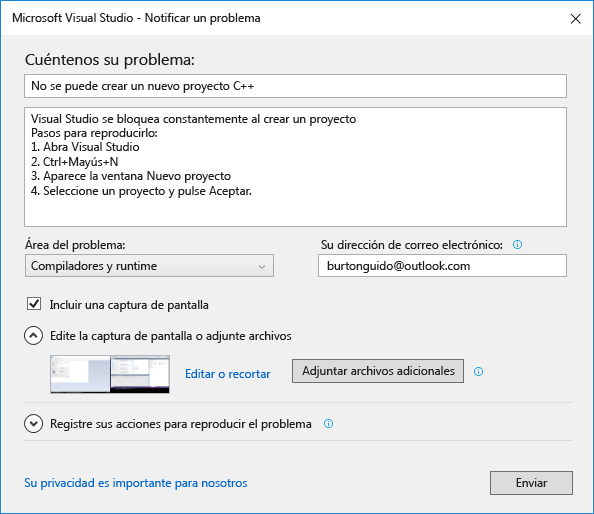
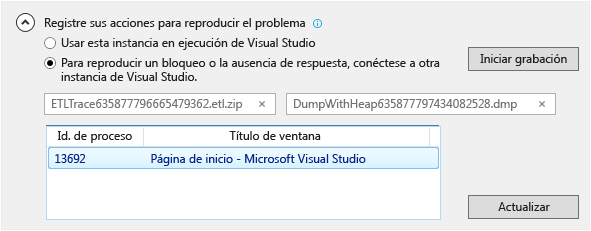

# C&#243;mo notificar un problema con Visual Studio
[!INCLUDE[vs2017banner](../code-quality/includes/vs2017banner.md)]

Si se produce un problema con Visual Studio, queremos saberlo para poder diagnosticarlo y corregirlo.  Mediante el uso de la herramienta **Notificar un problema**, puede recopilar información detallada acerca del problema y enviarla a Microsoft con unos pocos clics de botón.  
  
 Microsoft respeta su privacidad. Para obtener información acerca de cómo se tratan los datos que nos envía, consulte la [Declaración de privacidad de la familia de productos de Microsoft Visual Studio](https://www.visualstudio.com/en-us/dn948229).  
  
## Abrir la herramienta Notificar un problema  
 Haga clic en el icono de comentarios del usuario junto a **Inicio rápido** en la barra de título o bien haga clic en **Ayuda &#124; Enviar comentarios &#124; Notificar un problema**.  
  
   
  
## Describir el problema  
  
###    
  
1.  Asigne un título descriptivo al problema que nos ayude a dirigirlo al equipo de Visual Studio correcto.  
  
2.  Proporcione detalles adicionales y, si es posible, los pasos para reproducir el problema.  
  
3.  Elija un área problemática en la lista desplegable. Seleccione la mejor aproximación si no está seguro.  
  
   
  
## Proporcione una captura de pantalla \(opcional\)  
 Elija **Incluir captura de pantalla** para enviar la pantalla actual a Microsoft. La herramienta le permite recortar la imagen para mostrar sólo la parte de la pantalla que muestra el problema. Puede adjuntar capturas de pantalla adicionales u otros archivos. Para ello, haga clic en el botón **Adjuntar archivos adicionales**.  
  
## Proporcione un volcado de seguimiento y montón \(opcional\)  
  
###    
  
1.  Los archivos de volcado de seguimiento y montón son muy útiles para ayudarnos a diagnosticar problemas.   Apreciamos mucho que use la herramienta Notificar un problema para grabar los pasos de reproducción y enviar los datos a Microsoft.  
  
2.  Haga clic en el botón de contenido adicional junto a **Registre sus acciones para reproducir el problema**. Si el problema provoca que Visual Studio se bloquee, abra otra instancia de Visual Studio y selecciónela en la Vista de lista.  
  
3.  Haga clic en **Iniciar grabación** y realice los pasos que reproducen el problema. Cuando haya terminado, haga clic en **Detener grabación** en la ventana flotante.  
  
4.  Espere unos minutos mientras Visual Studio recopila y empaqueta la información que se haya grabado. El cuadro de diálogo tendrá un aspecto similar al siguiente cuando el proceso de recopilación se haya completado:  
  
       
  
## Describir la solución alternativa, si la hay  
 Si pudo solucionar el problema, describa la solución alternativa en el cuadro de edición proporcionado para ese fin. Esto nos ayuda no sólo a diagnosticar el problema, sino también a ayudar a otros usuarios que puedan encontrarse con el mismo problema.  
  
## Enviar el informe  
 Haga clic en el botón Enviar para enviar el informe junto con todas las imágenes y archivos de volcado o de seguimiento. Si el botón **Enviar** está atenuado, asegúrese de que proporcionó un título y una descripción.  
  
## Vea también  
 [Hable con nosotros](../ide/talk-to-us.md)