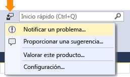

# Cómo notificar un problema con Visual Studio 2017 RC
Si se produce un problema con Visual Studio, queremos saberlo para poder diagnosticarlo y corregirlo.  La herramienta **Notificar un problema** le permite recopilar información detallada sobre el problema y enviarla a Microsoft con unos pocos clics de botón.  

 Microsoft respeta su privacidad. Para obtener información sobre cómo se tratan los datos que nos envía, vea la [Declaración de privacidad de la familia de productos de Microsoft Visual Studio](https://www.visualstudio.com/en-us/dn948229).  

## Abrir la herramienta Notificar un problema  
 Haga clic en el icono de comentarios del usuario junto a **Inicio rápido** en la barra de título o haga clic en **Ayuda &#124; Enviar comentarios &#124; Notificar un problema**.  

   

## Buscar y votar problemas similares  
###    

1.  Busque el problema y vea si otros usuarios ya lo han notificado.
2.  Si alguien lo ha notificado, "vótelo" para indicárnoslo.  

  

## Notificar un problema nuevo
###  
1.  En la parte inferior izquierda de la herramienta **Notificar un problema** de Visual Studio, haga clic en el botón "**+**".  
2.  Asigne un título descriptivo al problema que nos ayude a dirigirlo al equipo de Visual Studio correcto.  
3.  Proporcione detalles adicionales y, si es posible, los pasos para reproducir el problema.  

  

## Proporcionar una captura de pantalla y datos adjuntos (opcional)
###  
 Elija enviar la pantalla actual a Microsoft. Puede adjuntar capturas de pantalla adicionales u otros archivos. Para ello, haga clic en el botón **Adjuntar archivos adicionales**.  

## Proporcione un volcado de seguimiento y montón (opcional)  
###    

Los archivos de volcado de seguimiento y montón son muy útiles para ayudarnos a diagnosticar problemas.   Apreciamos mucho que use la herramienta **Notificar un problema** para grabar los pasos de reproducción y enviar los datos a Microsoft.  A continuación le mostramos cómo hacerlo.

1.  Haga clic en la pestaña **Grabar**.
2.  Haga clic en **Iniciar grabación**. Proporcione permiso para ejecutar la herramienta.
3.  Cuando aparezca la herramienta **Grabación de acciones de usuario**, realice los pasos que reproducen el problema.
4.  Cuando haya terminado, haga clic en **Detener grabación** en la ventana flotante.
5.  Espere unos minutos mientras Visual Studio recopila y empaqueta la información que ha grabado.  Cuando termine, verá un cuadro de diálogo que tiene un aspecto similar al siguiente.   

  

## Enviar el informe  
###    
 Haga clic en el botón **Enviar** para enviar el informe junto con todas las imágenes y archivos de volcado o de seguimiento. (Si el botón **Enviar** está atenuado, asegúrese de que ha proporcionado un título y una descripción para el informe).  

## Vea también  
 [Hable con nosotros](../ide/talk-to-us.md)

<!--HONumber=Feb17_HO4-->

