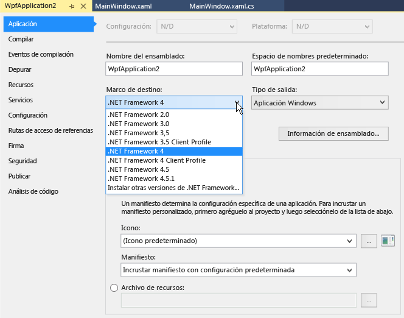

# C&#243;mo: Usar como destino una versi&#243;n de .NET Framework
[!INCLUDE[vs2017banner](../code-quality/includes/vs2017banner.md)]

En este documento se describe cómo se crea un proyecto que tiene como destino una versión de .NET Framework y cómo se modifica la versión de destino en un proyecto de Visual Basic, Visual C\# o Visual F\# existente.  
  
> [!IMPORTANT]
>  Para obtener información acerca de cómo cambiar la versión de destino para los proyectos de C\+\+, vea [Cómo: Modificar versión de .NET Framework de destino y el conjunto de herramientas de la plataforma](../Topic/How%20to:%20Modify%20the%20Target%20Framework%20and%20Platform%20Toolset.md).  
  
 **En este tema**  
  
-   [Especificar una versión de destino al crear un proyecto](../ide/how-to-target-a-version-of-the-dotnet-framework.md#bkmk_new)  
  
-   [Cambiar la versión de destino](../ide/how-to-target-a-version-of-the-dotnet-framework.md#bkmk_existing)  
  
##   Especificar una versión de destino al crear un proyecto  
 Cuando crea un proyecto, la versión destino de .NET Framework las plantillas que se pueden utilizar.  
  
> [!NOTE]
>  En las ediciones Express de Visual Studio, debe crear primero el proyecto y después cambiar el destino, como se describe más adelante en [Cambiar la versión de destino](../ide/how-to-target-a-version-of-the-dotnet-framework.md#bkmk_existing) en este tema.  
  
#### Para especificar una versión de destino al crear un proyecto  
  
1.  En la barra de menús, elija **Archivo**, **Nuevo**, **Proyecto**.  
  
2.  En la lista situada en la parte superior del cuadro de diálogo **Nuevo proyecto**, elija la versión de .NET Framework de destino que desea especificar para el proyecto.  
  
    > [!NOTE]
    >  Normalmente, solo se instala una versión de .NET Framework junto con Visual Studio.  Si desea establecer como destino otra versión, primero debe asegurarse de que está instalada.  Vea [Información general sobre la compatibilidad con múltiples versiones \(multi\-targeting\) en Visual Studio](../ide/visual-studio-multi-targeting-overview.md).  
  
3.  En la lista de plantillas instaladas, elija el tipo de proyecto que desea crear, asigne un nombre al proyecto y después elija el botón **Aceptar**.  
  
     La lista de plantillas muestra únicamente los proyectos que son compatibles con la versión de .NET Framework que ha elegido.  
  
##   Cambiar la versión de destino  
 Puede cambiar la versión de .NET Framework de destino en un proyecto de Visual Basic, Visual C\# o Visual F\# siguiendo este procedimiento.  
  
#### Para cambiar la versión de destino  
  
1.  En el **Explorador de soluciones**, abra el menú contextual del proyecto que desea cambiar y, a continuación, elija **Propiedades**.  
  
       
  
    > [!IMPORTANT]
    >  Para obtener información acerca de cómo cambiar la versión de destino para los proyectos de C\+\+, vea [Cómo: Modificar versión de .NET Framework de destino y el conjunto de herramientas de la plataforma](../Topic/How%20to:%20Modify%20the%20Target%20Framework%20and%20Platform%20Toolset.md).  
  
2.  En la columna izquierda de la ventana Propiedades, elija la pestaña **Aplicación**.  
  
       
  
    > [!NOTE]
    >  Después de crear una aplicación de la Tienda Windows, no puede cambiar la versión de destino de Windows ni de .NET Framework.  
  
3.  En la lista **Versión de .NET Framework de destino**, elija la versión que desee.  
  
4.  En el cuadro de diálogo de comprobación que aparece, elija el botón **Sí**.  
  
     Se descarga el proyecto.  Cuando se vuelva a cargar, la versión de .NET Framework de destino será la que acaba de elegir.  
  
    > [!NOTE]
    >  Si el código contiene referencias a una versión de .NET Framework distinta de la que indicó, pueden aparecer mensajes de error al compilar o ejecutar el código.  Para resolver estos errores, deberá modificar las referencias.  Vea [Solucionar problemas de versión de .NET Framework de destino](../msbuild/troubleshooting-dotnet-framework-targeting-errors.md)  
  
## Vea también  
 [Información general sobre la compatibilidad con múltiples versiones \(multi\-targeting\) en Visual Studio](../ide/visual-studio-multi-targeting-overview.md)   
 [.NET Framework Multi\-Targeting for ASP.NET Web Projects](../Topic/.NET%20Framework%20Multi-Targeting%20for%20ASP.NET%20Web%20Projects.md)   
 [Solucionar problemas de versión de .NET Framework de destino](../msbuild/troubleshooting-dotnet-framework-targeting-errors.md)   
 [Página de aplicación, Diseñador de proyectos \(C\#\)](../ide/reference/application-page-project-designer-csharp.md)   
 [Aplicación \(Página, Diseñador de proyectos\) \(Visual Basic\)](../ide/reference/application-page-project-designer-visual-basic.md)   
 [Configurar proyectos](../Topic/Configuring%20Projects%20\(F%23\).md)   
 [Cómo: Modificar versión de .NET Framework de destino y el conjunto de herramientas de la plataforma](../Topic/How%20to:%20Modify%20the%20Target%20Framework%20and%20Platform%20Toolset.md)