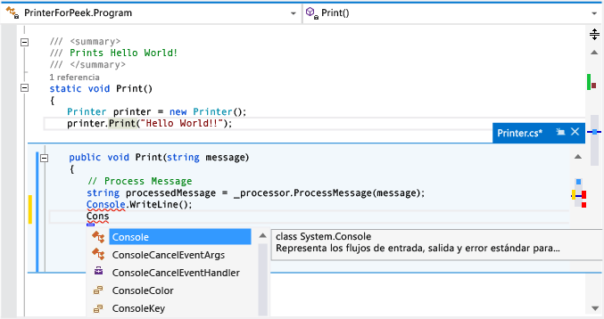

# Filtrar para ver y editar código mediante Ver la definición (Alt+F12)

Puede usar el comando **Ver la definición** para ver y editar código sin salir del código que está escribiendo. **Ver la definición** e **Ir a definición** muestran la misma información, pero **Ver la definición** la muestra en una ventana emergente, mientras que **Ir a definición** muestra el código en una ventana de código independiente. **Ir a definición** hace que el contexto (es decir, la ventana de código activa, la línea actual y la posición del cursor) cambie a la ventana de código de definición. Con **Ver la definición**, puede ver y editar la definición y moverse por el archivo de definición manteniendo su lugar en el archivo de código original.

Se puede usar **Ver la definición** con código de C#, Visual Basic y C++. En Visual Basic, **Ver la definición** muestra un vínculo al **Examinador de objetos** para los símbolos que no tienen metadatos de definición (por ejemplo, los tipos de .NET Framework integrados).

## Trabajar con Ver la definición

### Para abrir una ventana Ver la definición

1. Para ver una definición, seleccione **Ver la definición** en el menú contextual del tipo o el miembro que quiera explorar. A partir de la versión 15.4 de Visual Studio 2017, si la opción está habilitada, también puede ver una definición utilizando el mouse y presionando **Ctrl** (u otro modificador) y haciendo clic en el nombre del miembro. También puede presionar **Alt**+**F12** en el teclado.

     En esta ilustración se muestra la ventana **Ver la definición** para un método denominado `Print()`:

     

     La ventana de definición aparece debajo de la línea `printer.Print("Hello World!")` en el archivo original. La ventana no oculta ningún código del archivo original. Las líneas que siguen a `printer.Print("Hello World!")` aparecen bajo la ventana de definición.

1. Puede mover el cursor a distintas ubicaciones de la ventana Ver la definición. Sin embargo, puede seguir moviéndose por la ventana de código original.

1. Puede copiar una cadena de la ventana de definición y pegarla en el código original. También puede arrastrar y colocar la cadena desde la ventana de definición al código original sin eliminarla de la ventana de definición.

1. Puede cerrar la ventana de definición eligiendo la tecla **Esc** o el botón **Cerrar** en la pestaña de la ventana de definición.

### Apertura de una ventana Ver la definición desde una ventana Ver la definición

Si ya tiene abierta una ventana **Ver la definición**, puede llamar a **Ver la definición** de nuevo en el código de esa ventana. Se abre otra ventana de definición. Aparece un conjunto de puntos de ruta de navegación junto a la pestaña de la ventana de definición, que se puede utilizar para navegar entre las ventanas de definición. La información sobre herramientas de cada punto muestra el nombre de archivo y la ruta acceso del archivo de definición que el punto representa.

   

### Ver la definición con varios resultados

Si usa **Ver la definición** en código que tiene varias definiciones (por ejemplo, una clase parcial), aparece una lista de resultados a la derecha de la vista de definición de código. Puede elegir cualquier resultado de la lista para mostrar su definición.

   

### Edición dentro de la ventana Ver la definición

Cuando empieza a editar dentro de una ventana **Ver la definición**, el archivo que está modificando se abre automáticamente como una pestaña independiente en el editor de código y refleja los cambios que realice. Puede seguir haciendo, deshaciendo y guardando cambios en la ventana **Ver la definición** y la pestaña continuará reflejando esos cambios. Incluso aunque cierre la ventana **Ver la definición** sin guardar los cambios, puede hacer, deshacer y guardar más cambios en la pestaña, retomando el proceso exactamente dónde se quedó en la ventana **Ver la definición**.

   

### Para cambiar las opciones para ver la definición

1. Vaya a **Herramientas** > **Opciones** > **Editor de texto** > **General**.

1. Seleccione la opción **Abrir definición en vista de inspección**.

1. Haga clic en **Aceptar** para cerrar el cuadro de diálogo **Opciones**.

   

### Métodos abreviados de teclado para Ver la definición

Puede usar estos métodos abreviados de teclado con la ventana **Ver la definición**:

|Funcionalidad|Método abreviado de teclado|
|-------------------|:-----------------------:|
|Abrir la ventana de definición|**Alt**+**F12**|
|Cerrar la ventana de definición|**Esc**|
|Promover la ventana de definición a una pestaña de documento normal|**Mayús**+**Alt**+**Inicio**|
|Navegar entre ventanas de definición|**Ctrl**+**Alt**+**-** y **Ctrl**+**Alt**+**=**|
|Navegar entre varios resultados|**F8** y **Mayús**+**F8**|
|Alternar entre la ventana del editor de código y la ventana de definición|**Mayús**+**Esc**|

> [!NOTE]
> También puede usar los mismos métodos abreviados de teclado para editar código en una ventana **Ver la definición** como haría en otros lugares en Visual Studio.

## Vea también

- [Navegación en el código](../ide/navigating-code.md)
- [Ir a definición y Ver la definición](../ide/go-to-and-peek-definition.md)
- [Sugerencias de productividad](../ide/productivity-tips-for-visual-studio.md)