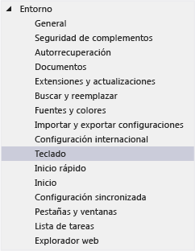
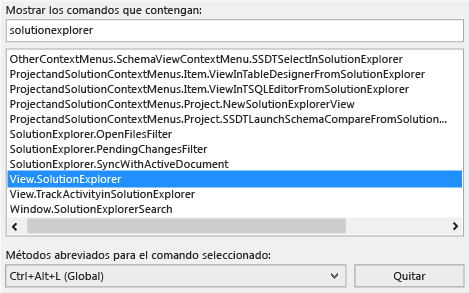
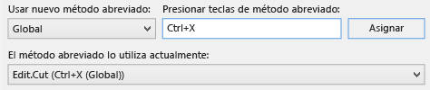
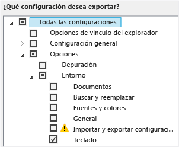
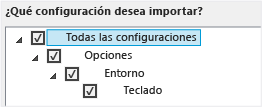

# Identificar y personalizar m&#233;todos abreviados de teclado en Visual Studio
[!INCLUDE[vs2017banner](../code-quality/includes/vs2017banner.md)]

Puede identificar los métodos abreviados de teclado de los comandos de Visual Studio, personalizarlos y exportarlos para que los usen otras personas.  Muchos métodos abreviados invocan siempre los mismos comandos, pero el comportamiento de un método abreviado puede variar en función de las condiciones siguientes:  
  
-   Las opciones predeterminadas del entorno que eligió la primera vez que ejecutó Visual Studio \(por ejemplo, Desarrollo general o Visual C\#\)  
  
-   Si ha personalizado el comportamiento del método abreviado.  
  
-   El contexto en el que se encuentra al elegir el método abreviado.  Por ejemplo, el método abreviado F2 invoca el comando Edit.EditCell si utiliza el Diseñador de configuración y el comando File.Rename si utiliza Team Explorer.  
  
 Con independencia de la configuración, personalización y contexto, puede buscar y cambiar siempre un método abreviado de teclado en el cuadro de diálogo **Opciones**.  También puede buscar los métodos abreviados de teclado predeterminados para varias decenas de comandos en [Métodos abreviados de teclado para comandos de uso frecuente](../ide/default-keyboard-shortcuts-for-frequently-used-commands-in-visual-studio.md), y puede encontrar una lista completa de todos los métodos abreviados predeterminados \(basados en la configuración Desarrollo general\) en [Métodos abreviados de teclado predeterminados](../ide/default-keyboard-shortcuts-in-visual-studio.md).  
  
 **En este tema**  
  
-   [Identificar un método abreviado de teclado](../ide/identifying-and-customizing-keyboard-shortcuts-in-visual-studio.md#bkmk_identify)  
  
-   [Personalizar un método abreviado de teclado](../ide/identifying-and-customizing-keyboard-shortcuts-in-visual-studio.md#bkmk_assign)  
  
-   [Compartir métodos abreviados de teclado](../ide/identifying-and-customizing-keyboard-shortcuts-in-visual-studio.md#bkmk_transfer)  
  
 Si un método abreviado se asigna a un comando en el contexto Global y no a otros contextos, el método abreviado invocará siempre ese comando.  Pero se puede asignar un método abreviado a un comando en el contexto Global y otro comando distinto en un contexto específico.  Si utiliza ese método abreviado en el contexto específico, el método abreviado invoca el comando del contexto concreto, no el del contexto Global.  
  
> [!NOTE]
>  La configuración y edición de Visual Studio podría cambiar los nombres y las ubicaciones de los comandos de menú y las opciones que aparecen en los cuadros de diálogo.  Este tema se basa en la **configuración general de desarrollo**.  
  
##   Identificar un método abreviado de teclado  
  
1.  En la barra de menús, elija **Herramientas**, **Opciones**.  
  
2.  Expanda **Entorno** y elija **Teclado**.  
  
       
  
3.  En el cuadro **Mostrar los comandos que contengan**, escriba todo o parte del nombre del comando sin espacios.  
  
     Por ejemplo, puede buscar comandos para el Explorador de soluciones.  
  
4.  En la lista, elija el comando correcto.  
  
     Por ejemplo, puede elegir **View.SolutionExplorer**.  
  
5.  Si el comando tiene un método abreviado de teclado, aparece en la lista **Métodos abreviados para el comando seleccionado**.  
  
       
  
##   Personalizar un método abreviado de teclado  
  
1.  En la barra de menús, elija **Herramientas**, **Opciones**.  
  
2.  Expanda la carpeta **Entorno** y elija **Teclado**.  
  
       
  
3.  En el cuadro **Mostrar los comandos que contengan**, escriba todo o parte del nombre del comando sin espacios.  
  
     Por ejemplo, puede buscar comandos para el Explorador de soluciones.  
  
4.  En la lista, elija el comando al que desea asignar un método abreviado de teclado.  
  
5.  En la lista **Usar nuevo método abreviado en**, elija el área de característica en que desea utilizar el método abreviado.  
  
     Por ejemplo, puede elegir **Global** si desea que el método abreviado funcione en todos los contextos.  Puede usar cualquier método abreviado que no esté asignado \(como Global\) en otro editor.  De lo contrario, el editor reemplaza el método abreviado.  
  
    > [!NOTE]
    >  No se pueden asignar las siguientes teclas a un método abreviado de teclado en **Global**: Imp Pant\/Pet Sis, Bloq Despl, Pausa\/Inter, Tab, Bloq Mayús, Ins, Inicio, Fin, Re Pág, Av Pág, la tecla del logotipo de Windows, la tecla de aplicación, cualquiera de las teclas de dirección o Intro; Bloq Num o Supr en el teclado numérico; o Ctrl\+Alt\+Supr.  
  
6.  En el cuadro **Presione las teclas de método abreviado**, especifique el método abreviado que desea utilizar.  
  
    > [!NOTE]
    >  Puede crear un método abreviado que combine una letra con la tecla Alt, Ctrl o ambas.  También puede crear un método abreviado que combine la tecla Mayús y una letra con la tecla Alt, Ctrl o ambas.  
  
     Si un método abreviado ya está asignado a otro comando, aparece en el cuadro **El método abreviado lo utiliza actualmente**.  En ese caso, elija la tecla Retroceso para eliminar ese método abreviado antes de probar con otro.  
  
       
  
7.  Elija el botón **Asignar**.  
  
    > [!NOTE]
    >  Si especifica un método abreviado diferente para un comando, elija el botón **Asignar** y luego el botón **Cancelar**; se cierra el cuadro de diálogo, pero el cambio no se revierte.  
  
##   Compartir métodos abreviados de teclado  
 Puede compartir los métodos abreviados de teclado personalizados exportándolos a un archivo y proporcionando el archivo a otras personas para que puedan importar los datos.  
  
#### Para exportar solo métodos abreviados de teclado  
  
1.  En la barra de menús, elija **Herramientas**, **Importar y exportar configuraciones**.  
  
2.  Elija **Exportar la configuración de entorno seleccionada** y elija el botón **Siguiente**.  
  
3.  En **¿Qué configuración desea exportar?**, desactive la casilla **Todas las configuraciones**, expanda **Opciones** y después expanda **Entorno**.  
  
4.  Active la casilla **Teclado** y después elija el botón **Siguiente**.  
  
       
  
5.  En los cuadros **¿Qué nombre desea dar al archivo de configuración?** y **Almacenar mi archivo de configuración en este directorio**, deje los valores predeterminados o especifique otros valores y elija el botón **Finalizar**.  
  
     De forma predeterminada, los métodos abreviados se guardan en un archivo en la carpeta %USERPROFILE%\\Documents\\Visual Studio 2013\\Settings.  El nombre del archivo indica la fecha en la que exportó la configuración y la extensión es .vssettings.  
  
#### Para importar solo métodos abreviados de teclado  
  
1.  En la barra de menús, elija **Herramientas**, **Importar y exportar configuraciones**.  
  
2.  Elija el botón de opción **Importar la configuración de entorno seleccionada** y después el botón **Siguiente**.  
  
3.  Elija el botón de opción **No, solo importar la nueva configuración, reemplazando la configuración actual** y elija el botón **Siguiente**.  
  
4.  Bajo **Mi configuración**, elija el archivo que contiene los métodos abreviados que desea importar o elija el botón **Examinar** para buscar el archivo correcto.  
  
5.  Elija el botón **Siguiente**.  
  
6.  En **¿Qué configuración desea importar?**, desactive la casilla **Todas las configuraciones**, expanda **Opciones** y después expanda **Entorno**.  
  
7.  Active la casilla **Teclado** y después elija el botón **Finalizar**.  
  
       
  
## Vea también  
 [Características de accesibilidad de Visual Studio](../ide/reference/accessibility-features-of-visual-studio.md)