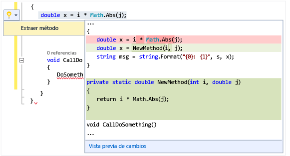

# Realizar acciones r&#225;pidas con las bombillas
[!INCLUDE[vs2017banner](../code-quality/includes/vs2017banner.md)]

Las bombillas son una nueva función de productividad en Visual Studio 2015 RC.  Son los iconos que aparecen en el editor de Visual Studio en los que puede hacer clic para realizar acciones rápidas, incluida la refactorización de corrección de errores.  Las bombillas centran la asistencia de corrección de errores y refactorización en un solo punto focal, que suele estar en la misma línea en que escribe.  
  
   
  
 En C\# y Visual Basic, verá una bombilla si hay una flecha en zigzag de color rojo y Visual Studio tiene una sugerencia para corregir el problema.  Por ejemplo, si tiene un error que se indica mediante una flecha en zigzag de color rojo, aparecerá una bombilla cuando haya disponibles correcciones para ese error.  En C\+\+, cuando agregue una función nueva a un archivo de encabezado, verá una bombilla que ofrece crear una implementación de código auxiliar de esa función.  Para cualquier lenguaje, un tercero puede proporcionar diagnósticos y sugerencias, por ejemplo, como parte de un SDK, y las bombillas de Visual Studio se encenderán siguiendo esas reglas.  
  
## Para ver una bombilla  
  
1.  En muchos casos, las bombillas aparecen espontáneamente cuando se desplaza el mouse sobre el punto de error, o en el margen izquierdo del editor cuando se coloca el cursor de inserción en una línea que tiene un error en ella.  Cuando vea una flecha zigzagueante de color rojo, puede mover el puntero por encima para mostrar la bombilla.  También puede hacer que una bombilla aparezca usando el ratón o el teclado para ir a algún sitio de la línea donde existe el problema.  
  
2.  Presione **Ctrl \+ .** en cualquier sitio de una línea para invocar la bombilla e ir directamente a la lista de posibles correcciones.  
  
   
  
## Para ver posibles correcciones  
 Haga clic en la flecha hacia abajo o en el vínculo Mostrar posibles correcciones para mostrar la lista de acciones rápidas que la bombilla puede llevar a cabo.  
  
   
  
## Para hacer una refactorización  
 Puede seguir haciendo refactorizaciones haciendo clic con el botón derecho para mostrar el menú contextual, pero también puede presionar Ctrl \+ .  para mostrar las opciones de refactorización.  En la ilustración siguiente, se ofrece la refactorización Extraer método tras presionar Ctrl \+ .  en algún punto de la línea que contiene la llamada `Math.Abs`:  
  
 