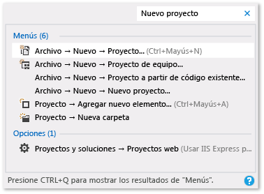

# Sugerencias de productividad para Visual Studio

Este tema contiene algunas sugerencias para ayudarle a escribir, navegar y depurar el código de manera más rápida y eficaz.

Para obtener más información acerca de los métodos abreviados de teclado más frecuentes, vea [Sugerencias y trucos de Visual Studio](../ide/tips-and-tricks-for-visual-studio.md). O bien, para obtener una lista completa de los métodos abreviados de teclado, vea [Identificación y personalización de métodos abreviados de teclado](../ide/identifying-and-customizing-keyboard-shortcuts-in-visual-studio.md) y [Métodos abreviados de teclado predeterminados de Visual Studio](../ide/default-keyboard-shortcuts-in-visual-studio.md).

## Escribir código

Escriba código más rápidamente con las características siguientes.

- **Usar comandos prácticos**. Visual Studio contiene varios comandos que le ayudarán a realizar las tareas de edición comunes con mayor rapidez. Por ejemplo, puede elegir un comando para duplicar fácilmente una línea de código sin tener que copiarla, cambiar la posición del cursor y luego pegarla. Elija **Editar** > **Duplicar** o presione **Ctrl**+**E**,**V**. También puede expandir o contraer una selección de texto rápidamente; para ello, seleccione **Edición** > **Avanzado** > **Expandir selección** o **Edición** > **Avanzado** > **Contraer selección**, o bien presione **Mayús**+**Alt**+**=** o **Mayús**+**Alt**+**-**.

- **Usar IntelliSense**. Cuando se escribe código en el editor, aparece información de IntelliSense, como Lista de miembros, Información de parámetros, Información rápida, ayuda para las signaturas y Palabra completa. Estas características admiten la coincidencia aproximada de texto; por ejemplo, las listas de resultados para Lista de miembros no solo incluyen las entradas que comienzan con los caracteres que escribió, sino también entradas que contienen la combinación de caracteres en cualquier lugar de sus nombres. Para obtener más información, vea [Usar IntelliSense](../ide/using-intellisense.md).

- **Cambiar la inserción automática de opciones de IntelliSense mientras se escribe código**. Si se cambia IntelliSense al modo de sugerencias, se puede especificar que las opciones de IntelliSense solo se inserten si se eligen explícitamente.

     Para habilitar el modo de sugerencias, pulse las teclas **Ctrl**+**Alt**+**Barra espaciadora** o bien, en la barra de menús, elija **Editar** > **IntelliSense** > **Alternar el modo de finalización**.

- **Usar fragmentos de código**. Puede usar fragmentos de código integrados o crear sus propios fragmentos de código.

     Para insertar un fragmento de código, en la barra de menús, elija**Editar** > **IntelliSense** > **Insertar fragmento de código** o **Delimitar con**, o abra el menú contextual en un archivo y seleccione **Fragmento de código** > **Insertar fragmento de código** o **Delimitar con**. Para obtener más información, vea [Fragmentos de código](../ide/code-snippets.md).

- **Corregir errores de código alineados**. Las acciones rápidas le permiten refactorizar, generar o modificar el código de otra manera fácilmente con una sola acción. Estas acciones se pueden aplicar con los iconos de destornillador  o de bombilla  o presionando **Alt**+**Entrar** o **Ctrl**+**.** cuando el cursor esté en la línea de código adecuada. Para obtener más información, vea [Acciones rápidas](quick-actions.md).

- **Mostrar y editar la definición de un elemento de código**. Puede mostrar y editar rápidamente el módulo en el que se define un elemento de código, como un miembro, una variable o un valor local.

    Para abrir una definición en una ventana emergente, resalte el elemento y, después, presione las teclas **Alt**+**F12**, o abra el menú contextual del elemento y seleccione **Ver la definición**. Para abrir una definición en una ventana de código diferente, abra el menú contextual del elemento de código y, después, pulse **Ir a definición**.

- **Usar aplicaciones de ejemplo**. Puede acelerar el desarrollo de aplicaciones si descarga e instala aplicaciones de ejemplo desde [Microsoft Developer Network](https://code.msdn.microsoft.com/). También puede obtener información sobre una tecnología o un concepto de programación determinado si descarga y explora un Sample Pack para esa área.

## Navegar dentro del código

 Puede usar diversas técnicas para buscar determinadas ubicaciones del código e ir a ellas con más rapidez.

- **Establecer marcadores en líneas de código**. Puede usar marcadores para navegar rápidamente a líneas de código concretas de un archivo.

    Para establecer un marcador, en la barra de menús, pulse **Editar** > **Marcadores** > **Alternar marcador**. Puede ver todos los marcadores de una solución en la ventana **Marcadores**. Para obtener más información, vea [Establecer marcadores en el código](../ide/setting-bookmarks-in-code.md).

- **Buscar definiciones de símbolos en un archivo**. Puede buscar en una solución para encontrar definiciones de símbolos y nombres de archivo, pero los resultados de la búsqueda no incluyen espacios de nombres ni variables locales.

   Para tener acceso a esta característica, en la barra de menús, pulse **Editar** > **Navegar a**.

- **Examinar la estructura general del código**. En el **Explorador de soluciones**, puede buscar y examinar clases y sus tipos y miembros en los proyectos. También puede buscar símbolos, ver la jerarquía de llamadas de un método, buscar referencias de símbolos y realizar otras tareas. Si elige un elemento de código en el **Explorador de soluciones**, el archivo asociado se abre en una pestaña **Vista previa** y el cursor se desplaza al elemento en el archivo. Para obtener más información, vea [Visualización de la estructura del código](../ide/viewing-the-structure-of-code.md).

## Buscar elementos más rápido

Puede buscar comandos, archivos y opciones en el IDE, además de filtrar el contenido de las ventanas de herramientas para mostrar solo la información pertinente para la tarea actual.

- **Filtrar el contenido de las ventanas de herramientas**. Puede buscar dentro del contenido de muchas ventanas de herramientas, como el **Cuadro de herramientas**, la ventana **Propiedades** y el **Explorador de soluciones**, pero mostrar únicamente los elementos cuyos nombres contengan los caracteres que especifique.

- **Mostrar solo los errores que quiera abordar**. Si elige el selecciona el botón **Filtro** de la barra de herramientas **Lista de errores**, puede reducir el número de errores que aparecen en la ventana **Lista de errores**. Puede mostrar solo los errores de los archivos que están abiertos en el editor, solo los errores del archivo actual o solo los errores del proyecto actual. También puede buscar errores específicos dentro de la ventana **Lista de errores**.

- **Buscar cuadros de diálogo, comandos de menú, opciones y demás**. En el cuadro de búsqueda, escriba palabras clave o frases correspondientes a los elementos que intenta buscar. Por ejemplo, aparecen las opciones siguientes si escribe **nuevo proyecto**:

   ::: moniker range="vs-2017"

   

   En **Inicio rápido** se muestran vínculos para crear un proyecto, agregar un nuevo elemento a un proyecto y a la página **Proyectos y soluciones** del cuadro de diálogo **Opciones**, entre otros. Los resultados de Inicio rápido también pueden incluir archivos de proyecto y ventanas de herramientas.

   ::: moniker-end

   ::: moniker range=">=vs-2019"

   

   ::: moniker-end

   Presione **Ctrl**+**Q** para ir directamente al cuadro de búsqueda.

## Depurar código

La depuración puede consumir mucho tiempo, pero las siguientes sugerencias pueden ayudarle a acelerar el proceso.

- **Probar la misma página, aplicación o sitio en exploradores diferentes**. Cuando depura código, puede cambiar fácilmente entre los exploradores web instalados, incluido [Inspector de página (Visual Studio)](https://msdn.microsoft.com/Library/65880969-1ad2-47be-85b9-bb12c81bf209), sin tener que abrir el cuadro de diálogo **Explorar con**. Puede usar la lista **Depurar destino**, que se encuentra en la barra de herramientas **Estándar** junto al botón **Iniciar depuración**, para comprobar rápidamente qué explorador está usando mientras depura o ve páginas.

    

- **Establecer puntos de interrupción temporales**. Puede crear un punto de interrupción temporal en la línea actual de código e iniciar el depurador simultáneamente. Al llegar a esa línea de código, el depurador activa el modo de interrupción. Para obtener más información, vea [Desplazarse por el código con el depurador](../debugger/navigating-through-code-with-the-debugger.md).

    Para usar esta característica, pulse las teclas **Ctrl**+**F10** o abra el menú contextual de la línea de código en la que desea establecer una interrupción y, después, elija **Ejecutar hasta el cursor**.

- **Mover el punto de ejecución durante la depuración**. Puede mover el punto de ejecución actual a otra sección de código y reiniciar la depuración a partir de ese punto. Esta técnica es útil si desea depurar una sección de código sin tener que volver a crear todos los pasos necesarios para llegar a esa sección. Para obtener más información, vea [Desplazarse por el código con el depurador](../debugger/navigating-through-code-with-the-debugger.md).

     Para mover el punto de ejecución, arrastre la punta de flecha amarilla hasta una ubicación donde desee establecer la siguiente instrucción en el mismo archivo de código fuente y elija la tecla **F5** para continuar con la depuración.

- **Capturar información de valor para variables**. Puede agregar una información sobre datos a una variable del código y anclarla para poder tener acceso al último valor conocido de la variable una vez finalizada la depuración. Para obtener más información, consulte [Ver valores de datos en sugerencias de datos en el editor de código](../debugger/view-data-values-in-data-tips-in-the-code-editor.md).

     Para agregar una Información sobre datos, el depurador debe estar en modo de interrupción. Coloque el cursor en la variable y elija el botón de anclaje en la información sobre datos que aparece. Cuando se detiene la depuración, aparece un icono azul de anclaje en el archivo de código fuente junto a la línea de código que contiene la variable. Si apunta al icono azul, aparece el valor de la variable de la sesión de depuración más reciente.

- **Borrar la ventana Inmediato**. Para borrar el contenido de la [ventana Inmediato](../ide/reference/immediate-window.md) en tiempo de diseño, escriba `>cls` o `>Edit.ClearAll`.

     Para obtener más información sobre los comandos adicionales, vea [Alias de comandos de Visual Studio](../ide/reference/visual-studio-command-aliases.md).

## Acceso a Visual Studio Tools

Puede tener acceso rápidamente al Símbolo del sistema para desarrolladores o a otra herramienta de Visual Studio si ancla este elemento en el menú Inicio o en la barra de tareas.

::: moniker range="vs-2017"

1. En el Explorador de Windows, vaya a *%ProgramData%\Microsoft\Windows\Start Menu\Programs\Visual Studio 2017\Visual Studio Tools*.

::: moniker-end

::: moniker range=">=vs-2019"

1. En el Explorador de Windows, vaya a *%ProgramData%\Microsoft\Windows\Start Menu\Programs\Visual Studio 2019\Visual Studio Tools*.

::: moniker-end

2. Haga clic con el botón derecho o abra el menú contextual de **Símbolo del sistema para desarrolladores** y, luego, elija **Anclar a Inicio** o **Anclar a la barra de tareas**.

## Administrar archivos, barras de herramientas y ventanas

En cualquier momento, puede trabajar en varios archivos de código y desplazarse entre varias ventanas de herramientas mientras desarrolla una aplicación. Para organizarse, utilice las sugerencias siguientes.

- **Mantener los archivos que usa con frecuencia visibles en el editor**. Puede anclar archivos en el lado izquierdo del cuadro de la pestaña de modo que sigan siendo visibles independientemente de cuántos archivos haya abiertos en el editor.

     Para anclar un archivo, pulse la pestaña del archivo y, después, seleccione el botón **Alternar estado de anclaje**.

- **Mover documentos y ventanas a otros monitores**. Si utiliza más de un monitor al desarrollar aplicaciones, puede trabajar en algunas partes de la aplicación más fácilmente si mueve a otro monitor los archivos que están abiertos en el editor. También puede mover las ventanas de herramientas, por ejemplo las ventanas del depurador, a otro monitor y acoplar en una pestaña las ventanas de documentos y de herramientas para crear "pilas". Para obtener más información, vea [Personalizar los diseños de ventana de Visual Studio](../ide/customizing-window-layouts-in-visual-studio.md).

     También puede administrar los archivos más fácilmente si crea otra instancia del **Explorador de soluciones** y la mueve a otro monitor. Para crear otra instancia del **Explorador de soluciones**, abra un menú contextual en el **Explorador de soluciones** y pulse **Nueva vista del Explorador de soluciones**.

- **Personalizar las fuentes que aparecen en Visual Studio**. Puede cambiar la fuente, el tamaño y el color que se usa para el texto en el IDE. Por ejemplo, puede personalizar el color de determinados elementos de código en el editor y la fuente en las ventanas de herramientas o en todo el IDE. Para obtener más información, vea [Cómo: Cambiar fuentes y colores](../ide/how-to-change-fonts-and-colors-in-visual-studio.md) y [Cómo: Cambiar las fuentes y los colores del editor](../ide/reference/how-to-change-fonts-and-colors-in-the-editor.md).

## Vea también

- [Métodos abreviados de teclado predeterminados para comandos de uso frecuente](../ide/default-keyboard-shortcuts-for-frequently-used-commands-in-visual-studio.md)
- [Cómo: Personalizar menús y barras de herramientas](../ide/how-to-customize-menus-and-toolbars-in-visual-studio.md)
- [Tutorial: Creación de una aplicación sencilla](../get-started/csharp/tutorial-wpf.md)
- [Sugerencias y trucos de accesibilidad](../ide/reference/accessibility-tips-and-tricks.md)