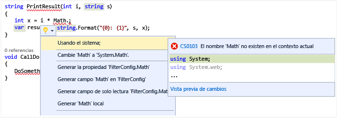

# <a name="quick-actions"></a>Acciones rápidas

Las [acciones rápidas](refactoring-code-generation-quick-actions.md#quick-actions) le permiten refactorizar, generar o modificar el código de otra manera fácilmente con una sola acción. Las acciones rápidas están disponibles para C#, [C++](/cpp/ide/writing-and-refactoring-code-cpp) y los archivos de código de Visual Basic. Algunas acciones son específicos de un lenguaje mientras que otras se aplican a todos los lenguajes. Las acciones rápidas se pueden aplicar mediante el icono de bombilla  o mediante **Ctrl** + **.** cuando el cursor esté en la línea de código adecuada.

Verá una bombilla si hay una flecha en zigzag de color rojo y Visual Studio tiene una sugerencia para corregir el problema. Por ejemplo, si tiene un error que se indica mediante una flecha en zigzag de color rojo, aparecerá una bombilla cuando haya disponibles correcciones para ese error. Para cualquier lenguaje, un tercero puede proporcionar diagnósticos y sugerencias, por ejemplo, como parte de un SDK, y las bombillas de Visual Studio se encenderán siguiendo esas reglas.

## <a name="to-see-a-light-bulb"></a>Para ver una bombilla

1. En muchos casos, las bombillas aparecen espontáneamente cuando se desplaza el mouse sobre el punto de error, o en el margen izquierdo del editor cuando se coloca el cursor de inserción en una línea que tiene un error en ella. Cuando vea una flecha zigzagueante de color rojo, puede mover el puntero por encima para mostrar la bombilla. También puede hacer que una bombilla aparezca usando el ratón o el teclado para ir a algún sitio de la línea donde existe el problema.

1. Presione **Ctrl** + **.** en cualquier sitio de una línea para invocar a la bombilla e ir directamente a la lista de posibles correcciones.

   

## <a name="to-see-potential-fixes"></a>Para ver posibles correcciones

Haga clic en la flecha hacia abajo o en el vínculo Mostrar posibles correcciones para mostrar la lista de acciones rápidas que la bombilla puede llevar a cabo.



## <a name="common-quick-actions"></a>Acciones rápidas comunes

Estas son algunas de las acciones rápidas comunes que se aplican a código de C# y de Visual Basic:

- [Acciones que corrigen errores](#fix)
- [Acciones que quitan código innecesario](#remove)
- [Acciones que agregan código que falta](#add)
- [Transformaciones de código](#transform)

### <a id="fix"></a> Acciones que corrigen errores

#### <a name="correct-misspelled-symbol-or-keyword"></a>Corrección de símbolos o palabras clave mal escritos

|  Identificador del error: | Lenguajes aplicables |  Versión compatible |
| ------- | -------------------- | ----------------  |
| CS0103, BC30002 | C# y Visual Basic | Visual Studio 2015 Update 2 |

Si se equivoca al escribir un tipo o una palabra clave en Visual Studio, esta acción rápida lo corregirá automáticamente. Verá estos elementos en el menú de bombilla como **"Cambiar '*palabra mal escrita*' a '*palabra correcta*'"**.  Por ejemplo:

```csharp
// Before
private viod MyMethod()
{
}

// Change 'viod' to 'void'

// After
private void MyMethod()
{
}
```

```vb
' Before
Function MyFunction as Intger
End Function

' Change 'Intger' to 'Integer'

' After
Function MyFunction as Integer
End Function
```

#### <a name="resolve-git-merge-conflict"></a>Resolver conflictos de fusión mediante combinación de GIT

|  Identificador del error: | Lenguajes aplicables |  Versión compatible |
| ------- | -------------------- | ----------------  |
| CS8300, BC37284  | C# y Visual Basic | Visual Studio 2017 versión 15.3 |

Estas acciones rápidas permiten resolver conflictos de fusión mediante combinación de GIT al "adoptar un cambio" que elimina los marcadores y el código en conflicto.  

```csharp
// Before
private void MyMethod()
{
<<<<<<< HEAD
    if (true)
    {

    }
=======
    if (false)
    {

    }
>>>>>>> upstream
}

// Take changes from 'HEAD'

// After
private void MyMethod()
{
    if (true)
    {

    }
}
```

#### <a name="make-method-synchronous"></a>Convertir un método en sincrónico

|  Identificador del error: | Lenguajes aplicables |  Versión compatible |
| ------- | -------------------- | ----------------  |
| CS1998, BC42356 | C# y Visual Basic | Visual Studio 2015 Update 2 |

Cuando se usa la palabra clave `async` o `Async` en un método, se espera que en algún lugar dentro de ese método también se use la palabra clave `await` o `Await`.  Pero si este no es el caso, aparecerá una acción rápida que le permitirá convertir el método en sincrónico si elimina la palabra clave `async` o `Async` y cambia el tipo de valor devuelto. Use la opción **Convertir el método en sincrónico** del menú Acciones rápidas.

```csharp
// Before
async Task<int> MyAsyncMethod()
{
    return 3;
}

// Make method synchronous

// After
int MyAsyncMethod()
{
    return 3;
}
```

```vb
' Before
Async Function MyAsyncMethod() As Task(Of Integer)
    Return 3
End Function

' Make method synchronous

' After
Function MyAsyncMethod() As Integer
    Return 3
End Function
```

#### <a name="make-method-asynchronous"></a>Convertir un método en asincrónico

|  Identificador del error: | Lenguajes aplicables |  Versión compatible |
| ------- | -------------------- | ----------------  |
| CS4032, BC37057 | C# y Visual Basic | Visual Studio 2017 |

Cuando se usa la palabra clave `await` o `Await` dentro de un método, se espera que el propio método esté marcado con la palabra clave `async` o `Async`.  Pero si este no es el caso, aparecerá una acción rápida que le permitirá convertir el método en asincrónico. Use la opción **Make method/Function asynchronous** (Convertir el método/función en asincrónico) del menú Acciones rápidas.

```csharp
// Before
int MyAsyncMethod()
{
    return await Task.Run(...);
}

// Make method asynchronous

// After
async Task<int> MyAsyncMethod()
{
    return await Task.Run(...);
}
```

```vb
' Before
Function MyAsyncMethod() as Integer
    Return  Await Task.Run(...)
End Function

' Make method asynchronous

' After
Async Function MyAsyncMethod() As Task(Of Integer)
    Return Await Task.Run(...)
End Function
```

### <a id="remove"></a> Acciones que quitan código innecesario

#### <a name="remove-unnecesary-usingsimports"></a>Quitar instrucciones Using o Import innecesarias

|  Lenguajes aplicables |  Versión compatible |
|  -------------------- | ----------------  |
|  C# y Visual Basic | Visual Studio 2015 RTW |

La acción rápida **Eliminar instrucciones Using innecesarias/Quitar instrucciones Import innecesarias** quitará todas las instrucciones `using` y `Import` sin usar del archivo actual.  Cuando se selecciona este elemento, las importaciones de espacios de nombres sin usar se quitarán inmediatamente.

#### <a name="remove-unnecessary-cast"></a>Quitar conversión innecesaria

|  Id. de diagnóstico | Lenguajes aplicables |  Versión compatible |
| ------- | -------------------- | ----------------  |
| IDE0004 | C# y Visual Basic | Visual Studio 2015 RTW |

Si convierte un tipo a otro que no requiere una conversión, el elemento de acción rápida **Quitar conversión innecesaria** quitará la conversión del código.

```csharp
// before
int number = (int)3;

// Remove Unnecessary Cast

// after
int number = 3;
```

```vb
' Before
Dim number as Integer = CType(3, Integer)

' Remove Unnecessary Cast

' After
Dim number as Integer = 3
```

#### <a name="remove-unused-variables"></a>Quitar variables no usadas

|  Id. de diagnóstico | Lenguajes aplicables |  Versión compatible |
| ------- | -------------------- | ----------------  |
| CS0219, BC42024 | C# y Visual Basic | Visual Studio 2017 versión 15.3 |

Esta acción rápida permite quitar variables que se han declarado pero que nunca se han usado en el código.

```csharp
// Before
public MyMethod()
{
    var unused = 8;
    var used = 1;
    return DoStuff(used);
}

// Remove unused variables

// After
public MyMethod()
{
    var used = 1;
    return DoStuff(used);
}
```

#### <a name="remove-type-from-default-value-expression"></a>Quitar el tipo de la expresión de valor **predeterminado**

|  Id. de diagnóstico | Lenguajes aplicables |  Versión compatible |
| ------- | -------------------- | ----------------  |
| IDE0034 | C# 7.1+ | Visual Studio 2017 versión 15.3 |

Esta acción rápida quita el tipo de valor de una expresión de valor predeterminado y usa el [literal `default`](/dotnet/csharp/programming-guide/statements-expressions-operators/default-value-expressions#default-literal-and-type-inference) cuando el compilador puede deducir el tipo de la expresión.

```csharp
// Before
void DoWork(CancellationToken cancellationToken = default(CancellationToken)) { ... }

// Simplify default expression

// After
void DoWork(CancellationToken cancellationToken = default) { ... }

```

### <a id="add"></a> Acciones que agregan código que falta

#### <a name="add-usingsimports-for-types-in-reference-assemblies-nuget-packages-or-other-types-in-your-solution"></a>Agregar instrucciones Using o Import para tipos en ensamblados de referencia, paquetes NuGet u otros tipos de la solución

|  Id. de diagnóstico | Lenguajes aplicables |  Versión compatible |
| ------- | -------------------- | ----------------  |
| CS0103, BC30451 | C# y Visual Basic| Visual Studio 2015 Update 2 |

Si usa tipos ubicados en otros proyectos de la solución, la acción rápida se mostrará automáticamente, pero deberá habilitar los demás en la pestaña **Herramientas > Opciones > C#** o **Básico > Avanzadas**:

- Sugerir instrucciones Using o Import para tipos de ensamblados de referencia
- Sugerir instrucciones Using o Import para tipos de paquetes NuGet

Cuando está habilitado, si usa un tipo de un espacio de nombres que actualmente no se importa pero que existe en un ensamblado de referencia o un paquete NuGet, se creará la instrucción Using o Import.

```csharp
// Before
Debug.WriteLine("Hello");

// using System.Diagnostics;

// After
using System.Diagnostics;

Debug.WriteLine("Hello");
```

```vb
' Before
Debug.WriteLine("Hello")

' Imports System.Diagnostics

// After
Imports System.Diagnostics

Debug.WriteLine("Hello")
```

#### <a name="add-missing-casesdefault-caseboth"></a>Agregar casos que faltan, un caso predeterminado o ambos

|  Id. de diagnóstico | Lenguajes aplicables |  Versión compatible |
| ------- | -------------------- | ----------------  |
| IDE0010 | C# y Visual Basic| Visual Studio 2017 versión 15.3 |

Al crear una instrucción `switch` en C# o una instrucción `Select Case` en Visual Basic, puede usar una acción de código para agregar automáticamente los elementos de casos que faltan, una instrucción de caso predeterminado o ambos.

Tenga en cuenta la enumeración siguiente y vacíe la instrucción `switch` o `Select Case`:

```csharp
enum MyEnum
{
    Item1,
    Item2,
    Item3
}

...

MyEnum myEnum = MyEnum.Item1;

switch(myEnum)
{
}
```

```vb
Enum MyEnum
    Item1
    Item2
    Item3
End Enum

...

Dim myEnum as MyEnum = MyEnum.Item1

Select Case myEnum
End Select
```

Con la acción rápida **Agregar ambos** se completan los casos omitidos y se agrega un caso predeterminado:

```csharp
switch(myEnum)
{
    case MyEnum.Item1:
        break;
    case MyEnum.Item2:
        break;
    case MyEnum.Item3:
        break;
    default:
        break;
}
```

```vb
Select Case myEnum
    Case MyEnum.Item1
        Exit Select
    Case MyEnum.Item2
        Exit Select
    Case Else
        Exit Select
End Select
```

#### <a name="add-null-checks-for-parameters"></a>Agregar comprobaciones de parámetros nulos

| Lenguajes aplicables |  Versión compatible |
| -------------------- | ----------------  |
| C# y Visual Basic| Visual Studio 2017 versión 15.3 |

Esta acción rápida permite agregar una comprobación en el código para saber si un parámetro es nulo.

```csharp
// Before
class MyClass
{
    public string MyProperty { get; set; }

    public MyClass(string myProperty) // cursor inside myProperty
    {
        MyProperty = myProperty;
    }
}

// Add null check

// After
class MyClass
{
    public string MyProperty { get; set; }

    public MyClass(string myProperty)
    {
        MyProperty = myProperty ?? throw new ArgumentNullException(nameof(myProperty));
    }
}
```

#### <a name="add-argument-name"></a>Agregar nombre de argumento

| Lenguajes aplicables |  Versión compatible |
| -------------------- | ----------------  |
| C# y Visual Basic| Visual Studio 2017 versión 15.3 |

```csharp
// Before
var date = new DateTime(1997, 7, 8);

// Include argument name 'year' (include trailing arguments)

// After
var date = new DateTime(year: 1997, month: 7, day: 8);
```

#### <a name="add-braces"></a>Agregar llaves

|  Id. de diagnóstico | Lenguajes aplicables |  Versión compatible |
| ------- | -------------------- | ----------------  |
| IDE0011 | C# | Visual Studio 2017 RTW |

Las acción rápida Agregar llaves encapsula llaves alrededor de instrucciones `if` de una sola línea.

```csharp
// Before
if (true)
    return "hello,world";

// Add braces

// After
if (true)
{
    return "hello,world";
}
```

#### <a name="add-and-order-modifiers"></a>Agregar y ordenar modificadores

|  Id. de diagnóstico | Lenguajes aplicables |  Versión compatible |
| ------- | -------------------- | ----------------  |
| IDE0036 | C# y Visual Basic| Versión 15.5 de Visual Studio 2017 |
| IDE0040 | C# y Visual Basic| Versión 15.5 de Visual Studio 2017 |

Estas acciones rápidas ayudan a organizar los modificadores permitiendo ordenar los modificadores de accesibilidad existentes y agregar los que faltan.

```csharp
// Before
enum Color
{
    Red, White, Blue
}

// Add accessibility modifiers

// After
internal enum Color
{
    Red, White, Blue
}
```

```csharp
// Before
static private int thisFieldIsPublic;

// Order modifiers

// After
private static int thisFieldIsPublic;
```

### <a id="transform"></a> Transformaciones de código

#### <a name="convert-if-construct-to-switch"></a>Convertir la construcción **if** en **switch**

| Lenguajes aplicables |  Versión compatible |
| -------------------- | ----------------  |
| C# y Visual Basic| Visual Studio 2017 versión 15.3 |

Esta acción rápida permite convertir una construcción **if-then-else** en una construcción **switch**.

```csharp
// Before
if (obj is string s)
{
  Console.WriteLine("obj is a string: " + s);
}

else if (obj is int i && i > 10)
{
  Console.WriteLine("obj is an int greater than 10");
}

// Convert to switch

// After
switch (obj)
{
  case string s:
    Console.WriteLine("Obj is a string: " + s);
    break;
  case int i when i > 10:
    Console.WriteLine("obj is an int greater than 10");
    break;
}
```

```vb
' Before
If TypeOf obj Is String s Then
    Console.WriteLine("obj is a string: " + s)
Else If TypeOf obj Is Integer i And i > 10 Then
    Console.WriteLine("obj is an int greater than 10")
End If

' Convert to switch

' After
Select Case obj
  Case String s
    Console.WriteLine("Obj is a string: " + s)
    Exit Sub
  Case Integer i when i > 10
    Console.WriteLine("obj is an int greater than 10")
    Exit Sub
End Select
```

#### <a name="convert-to-interpolated-string"></a>Convertir en una cadena interpolada

| Lenguajes aplicables |  Versión compatible |
| -------------------- | ----------------  |
| C# 6.0+ y Visual Basic 14+ | Visual Studio 2017 RTW |

Las [cadenas interpoladas](/dotnet/csharp/language-reference/keywords/interpolated-strings) son una forma sencilla de expresar cadenas con variables insertadas, similar al método **[String.Format](https://msdn.microsoft.com/library/system.string.format.aspx)**.  Esta acción rápida reconoce los casos en los que las cadenas están concatenadas o usan **String.Format** y cambia el uso a una cadena interpolada.

```csharp
// Before
int num = 3;
string s = string.Format("My string with {0} in the middle", num);

// Convert to interpolated string

// After
int num = 3;
string s = $"My string with {num} in the middle";
```

```vb
' Before
Dim num as Integer = 3
Dim s as String = String.Format("My string with {0} in the middle", num)

' Convert to interpolated string

' After
Dim num as Integer = 3
Dim s As String = $"My string with {num} in the middle"
```

#### <a name="use-object-initializers"></a>Usar inicializadores de objeto

| Id. de diagnóstico | Lenguajes aplicables | Versión compatible |
| ------- | -------------------- | ----------------  |
| IDE0017 | C# y Visual Basic | Visual Studio 2017 RTW |

Esta acción rápida permite usar [inicializadores de objeto](/dotnet/csharp/programming-guide/classes-and-structs/object-and-collection-initializers.md) en lugar de invocar el constructor y tener líneas adicionales de instrucciones de asignación.

```csharp
// Before
var c = new Customer();
c.Age = 21;

// Object initialization can be simplified

// After
var c = new Customer() { Age = 21 };
```

```vb
' Before
Dim c = New Customer()
c.Age = 21

' Object initialization can be simplified

' After
Dim c = New Customer() With {.Age = 21}
```

#### <a name="use-collection-initializers"></a>Usar inicializadores de colección

| Id. de diagnóstico | Lenguajes aplicables | Versión compatible |
| ------- | -------------------- | ----------------  |
| IDE0028 | C# y Visual Basic | Visual Studio 2017 RTW |

Esta acción rápida permite usar [inicializadores de colección](/dotnet/csharp/programming-guide/classes-and-structs/object-and-collection-initializers.md) en lugar de varias llamadas al método `Add` de la clase.

```csharp
// Before
var list = new List<int>();
list.Add(1);
list.Add(2);
list.Add(3);

// Collection initialization can be simplified

// After
var list = new List<int> { 1, 2, 3 };
```

```vb
' Before
Dim list = New List(Of Integer)
list.Add(1)
list.Add(2)
list.Add(3)

' Collection initialization can be simplified

' After
Dim list = New List(Of Integer) From {1, 2, 3}

```

#### <a name="convert-auto-property-to-full-property"></a>Convertir propiedad automática en propiedad completa

|  Lenguajes aplicables |  Versión compatible |
|  -------------------- | ----------------  |
| C# y Visual Basic | Versión 15.5 de Visual Studio 2017 |

Esta acción rápida permite convertir una propiedad automática en una propiedad completa y viceversa.

```csharp
// Before
private int MyProperty { get; set; }

// Convert to full property

// After
private int MyProperty
{
    get { return _myProperty; }
    set { _myProperty = value; }
}
```

```vb
' Before
Public Property Name As String

' Convert to full property

' After
Private _Name As String

Public Property Name As String
    Get
        Return _Name
    End Get
    Set
        _Name = Value
    End Set
End Property
```

#### <a name="convert-block-body-to-expression-bodied-member"></a>Convertir cuerpo de bloques en miembro con forma de expresión

|  Id. de diagnóstico | Lenguajes aplicables |  Versión compatible |
| ------- | -------------------- | ----------------  |
| IDE0021-27 | C# 6.0+ | Visual Studio 2017 RTW |

Esta acción rápida permite convertir cuerpos de bloques en miembros con forma de expresión para métodos, constructores, operadores, propiedades, indizadores y descriptores de acceso.

```csharp
//Before
class MyClass4
{
    private int _myProperty;

    public int MyProperty
    {
        get { return _myProperty; }
        set
        {
            _myProperty = value;
        }
    }

    public MyClass4(int myProperty)
    {
        MyProperty = myProperty;
    }

    public void PrintProperty()
    {
        Console.WriteLine(MyProperty);
    }
}

// Use expression body for accessors/constructors/methods

// After
class MyClass4
{
    private int _myProperty;

    public int MyProperty
    {
        get => _myProperty;
        set => _myProperty = value;
    }

    public MyClass4(int myProperty) => MyProperty = myProperty;

    public void PrintProperty() => Console.WriteLine(MyProperty);
}
```

#### <a name="convert-anonymous-function-to-local-function"></a>Convertir función anónima en función local

|  Id. de diagnóstico | Lenguajes aplicables |  Versión compatible |
| ------- | -------------------- | ----------------  |
| IDE0039 | C# 7.0+ | Versión 15.5 de Visual Studio 2017 |

Esta acción rápida convierte funciones anónimas en funciones locales.

```csharp
// Before
Func<int, int> fibonacci = null;
fibonacci = (int n) =>
{
    return n <= 1 ? 1 : fibonacci(n - 1) + fibonacci(n - 2);
};

// Use local function

// After
int fibonacci(int n)
{
    return n <= 1 ? 1 : fibonacci(n-1) + fibonacci(n-2);
}
```

#### <a name="convert-referenceequals-to-is-null"></a>Convertir `ReferenceEquals` en `is null`

|  Id. de diagnóstico | Lenguajes aplicables |  Versión compatible |
| ------- | -------------------- | ----------------  |
| IDE0041 | C# 7.0+ | Versión 15.5 de Visual Studio 2017 |

Esta acción rápida sugiere el uso de la [coincidencia de patrones](/dotnet/csharp/pattern-matching) en lugar del patrón de codificación ```ReferenceEquals```, siempre que sea posible.

```csharp
// Before
var value = "someString";
if (object.ReferenceEquals(value, null))
{
    return;
}

// Use 'is null' check

// After
var value = "someString";
if (value is null)
{
    return;
}
```

#### <a name="introduce-pattern-matching"></a>Introducir la coincidencia de patrones

| Id. de diagnóstico | Lenguajes aplicables | Versión compatible |
| ------- | -------------------- | ----------------  |
| IDE0020 | C# 7.0+ | Visual Studio 2017 RTW |
| IDE0019 | C# 7.0+ | Visual Studio 2017 RTW |

Esta acción rápida sugiere el uso de la [coincidencia de patrones](/dotnet/csharp/pattern-matching) con conversiones y comprobaciones de valores NULL en C#.   

```csharp
// Before
if (o is int)
{
    var i = (int)o;
    ...
}

// Use pattern matching

// After
if (o is int i)
{
    ...
}

```

```csharp
// Before
var s = o as string;
if (s != null)
{
    ...
}

// Use pattern matching

// After
if (o is string s)
{
    ...
}
```

#### <a name="change-base-for-numeric-literals"></a>Cambiar base de literales numéricos

| Lenguajes aplicables | Versión compatible |
| ------- | -------------------- | ----------------  |
| C# 7.0+ y Visual Basic 14+ | Visual Studio 2017 versión 15.3 |

Esta acción rápida le permite convertir un literal numérico de un sistema numérico base a otro. Por ejemplo, puede cambiar un número a hexadecimal o a formato binario. 

```csharp
// Before
int countdown = 2097152;

// Convert to hex

// After
int countdown = 0x200000;
```

```vb
' Before
Dim countdown As Integer = 2097152

' Convert to hex

' After
Dim countdown As Integer = &H200000
```

#### <a name="insert-digit-separators-into-literals"></a>Insertar separadores de dígitos en literales

| Lenguajes aplicables | Versión compatible |
| ------- | -------------------- | ----------------  |
| C# 7.0+ y Visual Basic 14+ | Visual Studio 2017 versión 15.3 |

Esta acción rápida le permite agregar caracteres separadores en valores literales.

```csharp
// Before
int countdown = 1000000;

// Separate thousands

// After
int countdown = 1_000_000;
```

```vb
' Before
Dim countdown As Integer = 1000000

' Separate thousands

' After
Dim countdown As Integer = 1_000_000
```

#### <a name="use-explicit-tuple-names"></a>Usar nombres de tupla explícitos

| Id. de diagnóstico | Lenguajes aplicables | Versión compatible |
| ------- | -------------------- | ----------------  |
| IDE0033 | C# 7.0+ y Visual Basic 15+ | Visual Studio 2017 RTW |

Esta acción rápida identifica las áreas donde se puede usar el nombre de tupla explícito en lugar de Elemento1, Elemento2, etc.

```csharp
// Before
(string name, int age) customer = GetCustomer();
var name = customer.Item1;

// Use explicit tuple name

// After
(string name, int age) customer = GetCustomer();
var name = customer.name;
```

```vb
' Before
Dim customer As (name As String, age As Integer) = GetCustomer()
Dim name = customer.Item1

' Use explicit tuple name

' After
Dim customer As (name As String, age As Integer) = GetCustomer()
Dim name = customer.name
```

#### <a name="use-inferred-names"></a>Usar nombres deducidos

| Id. de diagnóstico | Lenguajes aplicables | Versión compatible |
| ------- | -------------------- | ----------------  |
| IDE0037 | C# | Visual Studio 2017 v. 15.5 |
| IDE0037 | C# 7.1+ | Visual Studio 2017 v. 15.5 |

Estas acciones rápidas indican cuándo pueden los usuarios usar nombres de miembro deducidos en tipos anónimos o nombres de elemento de tupla deducidos de C# 7.1.

```csharp
// Before
var anon = new { age = age, name = name };

// Use inferred member name

// After
var anon = new { age, name };
```

```csharp
// Before
var tuple = (age: age, name: name);

// Use inferred tuple element name

// After
var tuple = (age, name);
```

#### <a name="deconstruct-tuple-declaration"></a>Deconstruir la declaración de tupla

| Id. de diagnóstico | Lenguajes aplicables | Versión compatible |
| ------- | -------------------- | ----------------  |
| IDE0042 | C# 7.0+ | Visual Studio 2017 v. 15.5 |

Esta acción rápida permite deconstruir las declaraciones de variable de tupla. 

```csharp
// Before
var person = GetPersonTuple();
Console.WriteLine($"{person.name} {person.age}");

(int x, int y) point = GetPointTuple();
Console.WriteLine($"{point.x} {point.y}");

//Deconstruct variable declaration

// After
var (name, age) = GetPersonTuple();
Console.WriteLine($"{name} {age}");

(int x, int y) = GetPointTuple();
Console.WriteLine($"{x} {y}");
```

## <a name="see-also"></a>Vea también

[Estilos de código y acciones rápidas](code-styles-and-quick-actions.md)  
[Escribir y refactorizar código (C++)](/cpp/ide/writing-and-refactoring-code-cpp)
