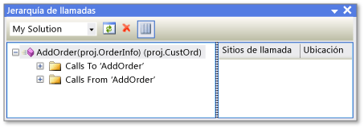

# Jerarqu&#237;a de llamadas
[!INCLUDE[vs2017banner](../../code-quality/includes/vs2017banner.md)]

La jerarquía de llamadas permite navegar por el código mostrando todas las llamadas a y desde un método, propiedad, o un constructor seleccionados.  Esto permite entender mejor cómo fluye el código y evaluar los efectos de los cambios que se realizan en el código.  Puede examinar varios niveles de código para ver cadenas complejas de llamadas a métodos y puntos de entrada adicionales al código, lo que le permite explorar todas las posibles rutas de ejecución.  
  
 Jerarquía de llamadas está disponible en tiempo de diseño, a diferencia de la pila de llamadas que muestra el depurador.  
  
## Usar Jerarquía de llamadas  
 Para mostrar la ventana **Jerarquía de llamadas**, haga clic con el botón secundario en el nombre de una llamada a un método, propiedad o constructor y, a continuación, haga clic en **Ver jerarquía de llamadas**.  
  
 El nombre del método aparece en un panel de vista de árbol de la ventana **Jerarquía de llamadas**.  Si expande el nodo del miembro, aparecen los subnodos **Llamadas a** *nombre de miembro* y **Llamadas desde** *nombre de miembro*.  La ilustración siguiente muestra estos nodos de la ventana **Jerarquía de llamadas**.  
  
   
Ventana Jerarquía de llamadas  
  
-   Si expande el nodo **Llamadas a**, se muestran todos los miembros que llaman al miembro seleccionado.  
  
-   Si expande el nodo **Llamadas desde**, se muestran todos los miembros llamados por el miembro seleccionado.  
  
 A continuación, puede expandir cada uno de estos miembros del subnodo en los nodos **Llamadas a** y **Llamadas desde**.  Eso le permite navegar a la pila de llamadores, como se muestra en la ilustración siguiente.  
  
   
Ventana Jerarquía de llamadas  
  
 En el caso de los miembros que se definen como virtuales o abstractos, aparece un nodo **Invalida nombre del método**.  En el caso de los miembros de interfaz, aparece el nodo **Implementa nombre del método**.  Estos nodos expansibles aparecen en el mismo nivel que los nodos **Llamadas a** y **Llamadas desde**.  
  
 El cuadro **Ámbito de búsqueda** de la barra de herramientas contiene las opciones **Mi solución**, **Proyecto actual** y **Documento actual**.  
  
 Cuando se selecciona un miembro secundario en el panel de vista de árbol de **Jerarquía de llamadas**:  
  
-   En el panel de detalles **Jerarquía de llamadas** se muestran todas las líneas de código en las que se llama a ese miembro secundario desde el miembro primario.  
  
-   **Ventana Definición de código**, si está abierto, se muestra el código del miembro seleccionado.  Esta ventana está disponible en C\# y C\+\+.  Para obtener más información sobre esta ventana, vea [Ver la estructura del código](../../ide/viewing-the-structure-of-code.md).  
  
> [!NOTE]
>  Jerarquía de llamadas no encuentra las referencias del grupo de métodos, que contiene ubicaciones en las que un método se agrega como controlador de eventos o se asigna a un delegado.  Para buscar todas las referencias a un método, puede usar el comando **Buscar todas las referencias**.  
  
## Elementos del menú contextual  
 En la tabla siguiente se describen varias opciones del menú contextual disponibles al hacer clic con el botón secundario en un nodo del panel de vista de árbol.  
  
|Elemento del menú contextual|Descripción|  
|----------------------------------|-----------------|  
|**Agregar como nueva raíz**|Agrega el nodo seleccionado al panel de vista de árbol como un nuevo nodo raíz.  De este modo, podrá concentrarse en un subárbol concreto.|  
|**Quitar raíz**|Quita el nodo raíz seleccionado del panel de vista de árbol.  Esta opción solo está disponible desde un nodo raíz.   También puede usar el botón de la barra de herramientas **Quitar raíz** para quitar el nodo raíz seleccionado.|  
|**Ir a definición**|Ejecuta el comando Ir a definición en el nodo seleccionado.  Con esto se navega a la definición original de una llamada al miembro o definición de variable.   Para ejecutar el comando Ir a definición, también puede hacer doble clic en el nodo seleccionado o presionar F12.|  
|**Buscar todas las referencias**|Ejecuta el comando Buscar todas las referencias en el nodo seleccionado.  Esto busca todas las líneas de código de su proyecto que hacen referencia a una clase o miembro.   También puede usar MAYÚS\+F12 para ejecutar el comando Buscar todas las referencias en el nodo seleccionado.|  
|**Copiar**|Copia el contenido del nodo seleccionado \(pero no sus subnodos\).|  
|**Actualizar**|Contrae el nodo seleccionado de modo que al volver a expandirse muestre la información actual.|