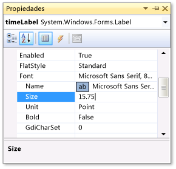
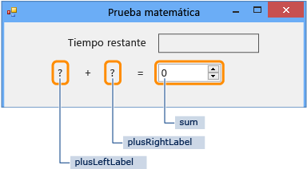
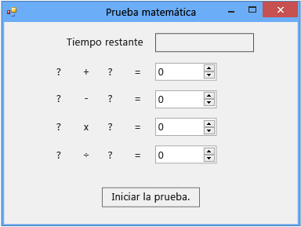

# Paso 1: Crear un proyecto y agregar etiquetas al formulario

Como primeros pasos para desarrollar esta prueba, creará el proyecto y agregará etiquetas, un botón y otros controles a un formulario. También establecerá las propiedades de cada control que agregue. El proyecto contendrá el formulario, los controles y (más adelante en el tutorial) el código. El botón inicia la prueba, las etiquetas muestran los problemas de la prueba y los demás controles muestran las respuestas de la prueba y el tiempo que queda para finalizarla.

> [!NOTE]
> Este tema forma parte de una serie de tutoriales sobre conceptos de codificación básicos. Para obtener información general sobre el tutorial, vea [Tutorial 2: Crear una prueba matemática cronometrada](../ide/tutorial-2-create-a-timed-math-quiz.md).

## Para crear un proyecto para un formulario

::: moniker range="vs-2017"

1. En la barra de menús, elija **Archivo** > **Nuevo** > **Proyecto**.

1. Elija **Visual C#** o **Visual Basic** en la parte izquierda del cuadro de diálogo **Nuevo proyecto** y, a continuación, elija **Escritorio de Windows**.

1. En la lista de plantillas, elija la plantilla **Aplicación de Windows Forms (.NET Framework)**, denomínela *MathQuiz* y, después, haga clic en el botón **Aceptar**.

    Aparecerá un formulario denominado *Form1.cs* o *Form1.vb*, según el lenguaje de programación elegido.

   > [!NOTE]
   > Si no ve la plantilla **Aplicación de Windows Forms (.NET Framework)**, use el instalador de Visual Studio para instalar la carga de trabajo **Desarrollo de escritorio de .NET**.     Para obtener más información, vea la página [Instalación de Visual Studio](../install/install-visual-studio.md).

::: moniker-end

::: moniker range="vs-2019"

1. En la ventana de inicio, elija **Crear un proyecto nuevo**.

   

1. En el cuadro de búsqueda de la ventana **Crear un proyecto**, escriba *Windows Forms*. A continuación, elija **Escritorio** en la lista **Tipo de proyecto**.

   Después de aplicar el filtro **Tipo de proyecto**, elija la plantilla **Aplicación de Windows Forms (.NET Framework)** para C# o Visual Basic, y después seleccione **Siguiente**.

   

   > [!NOTE]
   > Si no ve la plantilla **Aplicación de Windows Forms (.NET Framework)** , puede instalarla desde la ventana **Crear un proyecto**. En el mensaje **¿No encuentra lo que busca?** , elija el vínculo **Instalar más herramientas y características**.
   >
   > 
   >
   > A continuación, en el Instalador de Visual Studio, elija la carga de trabajo **Desarrollo de escritorio de .NET**.
   >
   > 
   >
   > Después, elija el botón **Modificar** en el Instalador de Visual Studio. Es posible que se le pida que guarde su trabajo; si es así, hágalo. Seguidamente, elija **Continuar** para instalar la carga de trabajo.

1. En la ventana **Configurar el nuevo proyecto**, escriba *MathQuiz* en el cuadro **Nombre del proyecto**. Luego, elija **Crear**.

::: moniker-end

## Para establecer las propiedades de un formulario

1. En Visual Studio, elija el formulario (ya sea *Form1.cs* o *Form1.vb*, según el lenguaje de programación) y, a continuación, cambie su propiedad **Text** a **Prueba matemática**.

     La ventana **Propiedades** contiene las propiedades del formulario.

1. Cambie el tamaño del formulario a 500 píxeles de ancho por 400 píxeles de alto.

     Puede cambiar el tamaño del formulario arrastrando los bordes hasta que aparezca el tamaño correcto en la esquina inferior izquierda del entorno de desarrollo integrado (IDE). Si quiere, también puede cambiar los valores de la propiedad **Size**.

1. Cambie el valor de la propiedad **FormBorderStyle** a **Fixed3D** y establezca la propiedad **MaximizeBox** en **False**.

     Estos valores impiden que los jugadores cambien el tamaño del formulario.

## Para crear el cuadro Tiempo restante

1. Agregue un control <xref:System.Windows.Forms.Label> desde el **Cuadro de herramientas** y establezca el valor de la propiedad **(Name)** en **timeLabel**.

     Esta etiqueta se convertirá en un cuadro que aparecerá en la esquina superior derecha en el que se mostrará el número de segundos que quedan para la prueba.

2. Cambie la propiedad **AutoSize** a **False** para poder cambiar el tamaño del cuadro.

3. Cambie la propiedad **BorderStyle** a **FixedSingle** para dibujar una línea alrededor del cuadro.

4. Establezca la propiedad **Size** en **200, 30**.

5. Mueva la etiqueta hacia la esquina superior derecha del formulario, donde aparecerán líneas azules de separación.

     Estas líneas le ayudan a alinear los controles en el formulario.

6. En la ventana **Propiedades**, elija la propiedad **Text** y, después, pulse la tecla **Retroceso** para borrar el valor.

7. Seleccione el signo más ( **+** ) situado junto a la propiedad **Font** y, después, cambie el valor de la propiedad **Size** a **15,75**.

     Puede cambiar varias propiedades de fuente, tal y como se muestra en la captura de pantalla siguiente.

     

8. Agregue otro control Label desde el **Cuadro de herramientas** y establezca el tamaño de fuente en **15,75**.

9. Establezca la propiedad **Text** en **Tiempo restante**.

10. Mueva la etiqueta para que se alinee inmediatamente a la izquierda de la etiqueta **timeLabel**.

### Para agregar controles para los problemas de suma

1. Agregue un control **Label** desde el cuadro de herramientas y, después, establezca la propiedad **Text** en **?** (signo de interrogación).

2. Establezca la propiedad **AutoSize** en **False**.

3. Establezca la propiedad **Size** en **60, 50**.

4. Establezca el tamaño de fuente en **18**.

5. Establezca la propiedad **TextAlign** en **MiddleCenter**.

6. Establezca la propiedad **Location** en **50, 75** para colocar el control en el formulario.

7. Establezca la propiedad **(Name)** en **plusLeftLabel**.

8. Seleccione la etiqueta **plusLeftLabel** y, después, pulse las teclas **Ctrl**+**C** o la opción **Copiar** del menú **Edición**.

9. Pegue la etiqueta tres veces mediante las teclas **Ctrl**+**V** o la opción **Pegar** del menú **Edición**.

10. Organice las tres nuevas etiquetas para que estén en fila a la derecha de la etiqueta **plusLeftLabel**.

     Puede utilizar las líneas de separación para separarlas y alinearlas.

11. Establezca el valor de la propiedad **Text** de la segunda etiqueta en **+** (signo más).

12. Establezca el valor de la propiedad **(Name)** de la tercera etiqueta en **plusRightLabel**.

13. Establezca el valor de la propiedad **Text** de la cuarta etiqueta en **=** (signo igual).

14. Agregue un control <xref:System.Windows.Forms.NumericUpDown> desde el **cuadro de herramientas**, establezca el tamaño de fuente en **18** y establezca el ancho en **100**.

     Obtendrá más información sobre este tipo de control más adelante.

15. Alinee el control NumericUpDown con los controles de etiqueta para el problema de suma.

16. Cambie el valor de la propiedad **(Name)** del control NumericUpDown a **suma**.

     Se ha creado la primera fila, tal como se muestra en la ilustración siguiente.

     

## Si desea agregar controles para los problemas de resta, multiplicación y división

1. Copie los cinco controles del problema de suma (los cuatro controles Label y el control NumericUpDown) y péguelos.

     El formulario contiene cinco nuevos controles, que todavía están seleccionados.

2. Mueva todos los controles a su posición de modo que estén alineados debajo de los controles de suma.

     Puede usar las líneas de separación para proporcionar una distancia suficiente entre las dos filas.

3. Cambie el valor de la propiedad **Text** de la segunda etiqueta a **-** (signo menos).

4. Cambie el nombre de la primera etiqueta del signo de interrogación a **minusLeftLabel**.

5. Cambie el nombre de la segunda etiqueta del signo de interrogación a **minusRightLabel**.

6. Cambie el nombre del control NumericUpDown a **diferencia**.

7. Pegue los cinco controles dos veces más.

8. Para la tercera fila, cambie el nombre de la primera etiqueta a **timesLeftLabel**, cambie la propiedad **Text** de la segunda etiqueta a **×** (signo de multiplicación), cambie el nombre de la tercera etiqueta a **timesRightLabel** y cambie el nombre del control NumericUpDown a **producto**.

9. Para la cuarta fila, cambie el nombre de la primera etiqueta a **dividedLeftLabel**, cambie la propiedad **Text** de la segunda etiqueta a **÷** (signo de división), cambie el nombre de la tercera etiqueta a **dividedRightLabel** y cambie el nombre del control NumericUpDown a **quotient**.

    > [!NOTE]
    > Puede copiar el signo de multiplicación × y el signo de división ÷ de este tutorial y pegarlos en el formulario.

## Para agregar un botón Iniciar y establecer el orden del índice de tabulación

1. Agregue un control <xref:System.Windows.Forms.Button> desde el **cuadro de herramientas** y establezca su propiedad **(Name)** en **startButton**.

2. Establezca la propiedad **Text** en **Iniciar la prueba**.

3. Establezca el tamaño de fuente en **14**.

4. Establezca la propiedad **AutoSize** en **True**, para que el tamaño del botón se ajuste automáticamente al texto.

5. Centre el botón cerca de la parte inferior del formulario.

6. Establezca el valor de la propiedad **TabIndex** del control **startButton** en **1**.

    > [!NOTE]
    > La propiedad **TabIndex** establece el orden de los controles cuando el usuario pulsa la tecla **Tab**. Para ver cómo funciona, abra cualquier cuadro de diálogo (por ejemplo, en la barra de menús, pulse **Archivo** > **Abrir**) y pulse la tecla **Tab** varias veces. Observe cómo se mueve el cursor de un control a otro cada vez que elige la tecla **Tab**. Un programador decidió el orden al crear el formulario.

7. Establezca el valor de la propiedad **TabIndex** del control de suma NumericUpDown en **2**, del control de diferencia en **3**, del control de producto en **4** y del control de cociente en **5**.

     El formulario debe ser similar al de la captura de pantalla siguiente.

     

8. Para comprobar si la propiedad **TabIndex** funciona tal como se esperaba, guarde y ejecute el programa; para ello, pulse la tecla **F5** o seleccione **Depurar** > **Iniciar depuración** en la barra de menús y, después, pulse la tecla **Tab** varias veces.

## Para continuar o revisar

- Para ir al siguiente paso del tutorial, vea **[Paso 2: Crear un problema de suma aleatoria](../ide/step-2-create-a-random-addition-problem.md)** .

- Para volver al tema de información general, vea [Tutorial 2: Crear una prueba matemática cronometrada](../ide/tutorial-2-create-a-timed-math-quiz.md).
