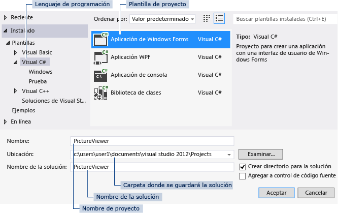

# Paso 1: Crear un proyecto de aplicación de Windows Forms
Cuando se crea un visor de imagen, el primer paso consiste en crear un proyecto de aplicación de Windows Forms.  

 Para obtener una versión en vídeo de este tema, vea el [Tutorial 1: Crear un visor de imágenes en Visual Basic (vídeo 1)](http://go.microsoft.com/fwlink/?LinkId=205209) o el [Tutorial 1: Crear un visor de imágenes en C# (vídeo 1)](http://go.microsoft.com/fwlink/?LinkId=205199). En estos vídeos se utilizó una versión anterior de Visual Studio, por lo que hay ligeras diferencias en algunos comandos de menú y otros elementos de la interfaz de usuario. Sin embargo, los conceptos y procedimientos funcionan de forma similar en la versión actual de Visual Studio.  

### Para crear un proyecto de Aplicación de Windows Forms  

1.  En la barra de menús, elija **Archivo**, **Nuevo**, **Proyecto**. El cuadro de diálogo debe tener un aspecto similar al que se muestra a continuación.  

       
Cuadro de diálogo Nuevo proyecto  

2.  Seleccione **Visual C#** o **Visual Basic** en la lista **Plantillas instaladas**.  

3.  En la lista de plantillas, pulse el icono **Aplicación de Windows Forms**. Asigne un nombre al nuevo formulario **PictureViewer** y, después, pulse el botón **Aceptar**.  

     Visual Studio crea una solución para el programa. Una solución actúa como un contenedor de todos los proyectos y archivos necesarios para el programa. Estos términos se explicarán con más detalle en secciones posteriores de este tutorial.  

4.  En la ilustración siguiente se muestra lo que debería aparecer ahora en la interfaz de Visual Studio.  

    > [!NOTE]
    >  El diseño de la ventana puede no ser exactamente igual que el de la ilustración. El diseño exacto de la ventana depende de la versión de Visual Studio, el lenguaje de programación utilizado y otros factores. No obstante, debe comprobar que aparezcan las tres ventanas.  

       
Ventana IDE  

     La interfaz contiene tres ventanas: una ventana principal, el **Explorador de soluciones** y la ventana **Propiedades**.  

     Si falta alguna de estas ventanas, restaure el diseño de ventana predeterminado; para ello, en la barra de menús, pulse **Ventana**, **Restablecer diseño de la ventana**. También puede mostrar ventanas mediante comandos de menú. En la barra de menús, pulse **Ver**, **Ventana Propiedades** o **Explorador de soluciones**. Si hay otras ventanas abiertas, ciérrelas con el botón **Cerrar** (x) de la esquina superior derecha.  

5.  En la ilustración se muestran las ventanas siguientes (en el sentido de las agujas del reloj desde la esquina superior izquierda):  

    -   **Ventana principal** En esta ventana, realizará la mayor parte del trabajo, como ejecutar formularios y editar código. En la ilustración, la ventana muestra un formulario en el Editor de formularios. En la parte superior de la ventana, aparecerán las pestañas **Página principal** y **Form1.cs [Diseño]**. (En Visual Basic, el nombre de la pestaña termina con .vb en lugar de .cs).  

    -   **Ventana Explorador de soluciones** En esta ventana, puede ver todos los elementos de la solución y navegar por ellos. Al seleccionar un archivo, cambia el contenido de la ventana **Propiedades**. Si abre un archivo de código (que finaliza en .cs para Visual C# y en .vb para Visual Basic), aparece el archivo de código o un diseñador para él. Un diseñador es una superficie visual en la que se pueden agregar controles, como botones y listas. En los formularios de Visual Studio, el diseñador se llama Diseñador de Windows Forms.  

    -   **Ventana Propiedades** En esta ventana, puede cambiar las propiedades de los elementos elegidos en las otras ventanas. Por ejemplo, si elige Form1, puede cambiar el título mediante la propiedad **Text** y el color de fondo mediante la propiedad **Backcolor**.  

    > [!NOTE]
    >  En la línea superior del **Explorador de soluciones** se muestra **Solución "PictureViewer" (1 proyecto)**, lo que significa que Visual Studio ha creado una solución. Una solución puede contener varios proyectos, pero, por ahora, trabajará con soluciones que contengan un solo proyecto.  

6.  En la barra de menús, pulse **Archivo**, **Guardar todo**.  

     Si quiere, también puede pulsar el botón **Guardar todo** de la barra de herramientas que se muestra en la ilustración siguiente.  

       
Botón de la barra de herramientas Guardar todo  

     Visual Studio rellena automáticamente el nombre de la carpeta y el nombre del proyecto, y después guarda el proyecto en la carpeta de proyectos.  

### Para continuar o revisar  

-   Para ir al siguiente paso del tutorial, vea [Paso 2: Ejecutar el programa](../ide/step-2-run-your-program.md).  

-   Para volver al tema de información general, vea [Tutorial 1: Crear un visor de imagen](../ide/tutorial-1-create-a-picture-viewer.md).
