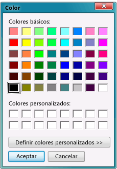

# Paso 11: Ejecutar el visor de imágenes y probar otras características

La aplicación de visor de imágenes está finalizada y lista para ejecutarse. Puede ejecutarla y establecer el color de fondo del control <xref:System.Windows.Forms.PictureBox>. Para obtener más información e intentar mejorar la aplicación, cambie el color del formulario, personalice los botones y la casilla, y cambie las propiedades del formulario.

## Procedimientos para ejecutar la aplicación y establecer el color de fondo

1. Pulse **F5** o, en la barra de menús, pulse **Depurar** > **Iniciar depuración**.

1. Antes de abrir una imagen, pulse el botón **Establecer el color de fondo**. Se abrirá el cuadro de diálogo **Color**.

      
*Cuadro de diálogo* ***Color***

1. Elija un color para establecer el color de fondo de PictureBox. Fíjese con atención en el método `backgroundButton_Click()` (o `BackgroundButton_Click()`) para entender cómo funciona.

    > [!NOTE]
    > Puede cargar una imagen de Internet pegando su dirección URL en el cuadro de diálogo **Abrir archivo**. Intente encontrar una imagen con un fondo transparente, para que se vea el color de fondo.

1. Elija el botón **Borrar la imagen** para asegurarse de que se borra. Después, seleccione el botón **Cerrar** para salir de la aplicación.

## Probar otras características

* Cambie el color del formulario y de los botones mediante la propiedad **BackColor**.

* Personalice sus botones y la casilla mediante las propiedades **Font** y **ForeColor**.

* Cambie las propiedades **FormBorderStyle** y **ControlBox** del formulario.

* Use las propiedades **AcceptButton** y **CancelButton** del formulario para que, cuando el usuario pulse la tecla **Entrar** o **Esc**, los botones se seleccionen automáticamente. Haga que la aplicación abra el cuadro de diálogo **Abrir archivo** cuando el usuario presione **Entrar** y que lo cierre cuando presione **Esc**.

## Pasos siguientes

Para obtener más información, continúe con el tutorial siguiente:

> [!div class="nextstepaction"]
> [Tutorial 2: Creación de una prueba matemática cronometrada](../ide/tutorial-2-create-a-timed-math-quiz.md)

Para volver al paso anterior del tutorial, vea [Paso 10: Escribir código para botones adicionales y una casilla](../ide/step-10-write-code-for-additional-buttons-and-a-check-box.md).

## Vea también

* [Más tutoriales de C#](/visualstudio/get-started/csharp/)
* [Más tutoriales de Visual Basic](/visualstudio/get-started/visual-basic/)
* [Tutorial de C++](/cpp/get-started/tutorial-console-cpp)
