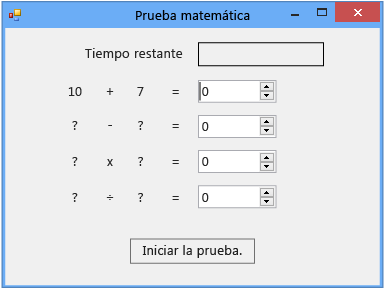

# Paso 2: Crear un problema de suma aleatoria
En la segunda parte del tutorial, agregará problemas de matemáticas basados en números aleatorios para crear una prueba desafiante. También puede crear un método denominado `StartTheQuiz()` que establezca los problemas e inicie el temporizador de cuenta atrás. Más adelante en este tutorial, agregará los problemas de resta, multiplicación y división.

> [!NOTE]
>  Este tema forma parte de una serie de tutoriales sobre conceptos de codificación básicos. Para obtener información general sobre el tutorial, vea [Tutorial 2: Crear una prueba matemática cronometrada](../ide/tutorial-2-create-a-timed-math-quiz.md).

## Para crear un problema de suma aleatoria

1.  En el diseñador de formularios, elija el formulario (**Form1**).

2.  En la barra de menús, elija **Ver** > **Código**.

     Aparecerá *Form1.cs* o *Form1.vb*, según el lenguaje de programación que esté utilizando, de modo que podrá ver el código subyacente del formulario.

3.  Cree un objeto <xref:System.Random> agregando una instrucción `new` cerca de la parte superior del código, tal y como se muestra a continuación.

     [!code-csharp[VbExpressTutorial3Step2#1](../ide/codesnippet/CSharp/step-2-create-a-random-addition-problem_1.cs)]
     [!code-vb[VbExpressTutorial3Step2#1](../ide/codesnippet/VisualBasic/step-2-create-a-random-addition-problem_1.vb)]

     Ha agregado un objeto aleatorio al formulario y lo ha denominado **randomizer**.

     `Random` se denomina objeto. Probablemente habrá oído esta palabra antes. Obtendrá más información sobre lo que significa en programación en el siguiente tutorial. De momento, solo tiene que recordar que puede utilizar las instrucciones `new` para crear botones, etiquetas, paneles, controles OpenFileDialog, ColorDialog, SoundPlayer y Random e incluso formularios, y que estos elementos se denominan objetos. Cuando se ejecute el programa, se iniciará el formulario y el código subyacente creará un objeto aleatorio, que denominará **randomizer**.

     Pronto compilaremos un método para comprobar las respuestas, de modo que la prueba debe utilizar variables para almacenar los números aleatorios que genera para cada problema. Vea [Variables en Visual Basic](/dotnet/visual-basic/programming-guide/language-features/variables/index) o [Tipos (Guía de programación de C#)](/dotnet/csharp/programming-guide/types/index). Para utilizar correctamente las variables, debe declararlas, lo que significa que debe enumerar sus nombres y tipos de datos.

4.  Agregue dos variables de entero al formulario y asígneles los nombres **addend1** y **addend2**.

    > [!NOTE]
    >  Una variable de entero se conoce como int en C# o integer en Visual Basic. Este tipo de variable almacena un número positivo o negativo comprendido entre -2147483648 y 2147483647, y solo puede almacenar números enteros, no decimales.

     Para agregar una variable de entero se utiliza una sintaxis similar a la que usó para agregar el objeto aleatorio, tal y como se muestra en el código siguiente.

     [!code-csharp[VbExpressTutorial3Step2#2](../ide/codesnippet/CSharp/step-2-create-a-random-addition-problem_2.cs)]
     [!code-vb[VbExpressTutorial3Step2#2](../ide/codesnippet/VisualBasic/step-2-create-a-random-addition-problem_2.vb)]

5.  Agregue un método denominado `StartTheQuiz()` que utilice el método <xref:System.Random.Next> del objeto aleatorio para mostrar números aleatorios en las etiquetas. `StartTheQuiz()` irá rellenando gradualmente todos los problemas e iniciará el temporizador, así que debe agregar un comentario. La función debería tener un aspecto parecido al siguiente.

     [!code-csharp[VbExpressTutorial3Step2#3](../ide/codesnippet/CSharp/step-2-create-a-random-addition-problem_3.cs)]
     [!code-vb[VbExpressTutorial3Step2#3](../ide/codesnippet/VisualBasic/step-2-create-a-random-addition-problem_3.vb)]

     Observe que cuando escribe el punto (.) después de `randomizer` en el código, se abre una ventana de IntelliSense en la que se muestran todos los métodos del objeto aleatorio a los que puede llamar. Por ejemplo, IntelliSense muestra el método `Next()` de la forma siguiente.

      Método Next

     Cuando escribe un punto después de un objeto, IntelliSense muestra una lista de los miembros del objeto, como las propiedades, métodos y eventos.

    > [!NOTE]
    >  Cuando use el método `Next()` con el objeto `Random`, por ejemplo cuando llame a `randomizer.Next(50)`, obtendrá un número aleatorio menor que 50 (del 0 al 49). En este ejemplo, se llamó a `randomizer.Next(51)`. Se ha utilizado 51 y no 50 para que los dos números aleatorios sumen una respuesta que esté comprendida entre 0 y 100. Si pasa 50 al método `Next()`, este elige un número del 0 al 49, de modo que la respuesta mayor posible es 98, y no 100. Después de ejecutarse las dos primeras instrucciones del método, cada una de las dos variables de entero, **addend1** y **addend2**, contiene un número aleatorio del 0 al 50. Esta captura de pantalla muestra el código de Visual C#, pero IntelliSense funciona de la misma manera con Visual Basic.

     Fijémonos con más atención en estas instrucciones.

     [!code-csharp[VbExpressTutorial3Step2#18](../ide/codesnippet/CSharp/step-2-create-a-random-addition-problem_4.cs)]
     [!code-vb[VbExpressTutorial3Step2#18](../ide/codesnippet/VisualBasic/step-2-create-a-random-addition-problem_4.vb)]

     Las instrucciones establecen las propiedades **Text** de **plusLeftLabel** y **plusRightLabel** para que muestren los dos números aleatorios. Debe utilizar el método `ToString()` del entero para convertir los números en texto. (En programación, cadena significa texto). Los controles de etiqueta muestran únicamente texto, no números.

6.  En la ventana de diseño, haga doble clic en el botón **Iniciar**, o púlselo y presione la tecla **Entrar**.

     Cuando un jugador elija este botón, la prueba deberá iniciarse. Por este motivo, acaba de agregar un controlador de eventos Click, para implementar este comportamiento.

7.  Agregue las dos instrucciones siguientes.

     [!code-csharp[VbExpressTutorial3Step2#4](../ide/codesnippet/CSharp/step-2-create-a-random-addition-problem_5.cs)]
     [!code-vb[VbExpressTutorial3Step2#4](../ide/codesnippet/VisualBasic/step-2-create-a-random-addition-problem_5.vb)]

     La primera instrucción llama al nuevo método `StartTheQuiz()`. La segunda instrucción establece la propiedad **Enabled** del control **startButton** en **False**, de modo que el usuario de la prueba no pueda pulsar el botón durante esta.

8.  Guarde el código, ejecútelo y, después, pulse el botón **Iniciar**.

     Aparece un problema de suma aleatoria, tal y como se muestra en la ilustración siguiente.

      Problema de sumas aleatorias

     En el siguiente paso del tutorial, agregará la suma.

## Para continuar o revisar

-   Para ir al siguiente paso del tutorial, vea [Paso 3: Agregar un temporizador de cuenta atrás](../ide/step-3-add-a-countdown-timer.md).

-   Para volver al paso anterior del tutorial, vea [Paso 1: Crear un proyecto y agregar etiquetas al formulario](../ide/step-1-create-a-project-and-add-labels-to-your-form.md).
