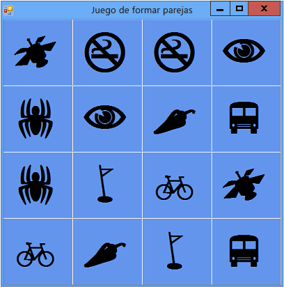

# <a name="step-3-assign-a-random-icon-to-each-label"></a>Paso 3: Asignar un icono aleatorio a cada etiqueta
Si los iconos aparecen en las mismas celdas en todas las partidas, el juego no presenta ningún reto. Para evitarlo, asigne los iconos aleatoriamente a los controles de etiqueta del formulario mediante un método `AssignIconsToSquares()`.

## <a name="to-assign-a-random-icon-to-each-label"></a>Para asignar un icono aleatorio a cada etiqueta

1.  Antes de agregar el siguiente código, considere cómo funciona el método. Hay una nueva palabra clave: `foreach` en Visual C# y `For Each` en Visual Basic. (Una de las líneas está comentada intencionadamente; se explica al final de este procedimiento).

     [!code-csharp[VbExpressTutorial4Step2_3_4#2](../ide/codesnippet/CSharp/step-3-assign-a-random-icon-to-each-label_1.cs)]
     [!code-vb[VbExpressTutorial4Step2_3_4#2](../ide/codesnippet/VisualBasic/step-3-assign-a-random-icon-to-each-label_1.vb)]

2.  Agregue el método `AssignIconsToSquares()` tal como se indica en el paso anterior. Puede colocarlo justo debajo del código que ha agregado en [Paso 2: Agregar un objeto aleatorio y una lista de iconos](../ide/step-2-add-a-random-object-and-a-list-of-icons.md).

     Como se ha mencionado previamente, hay una novedad en el método `AssignIconsToSquares()`: un bucle `foreach` en Visual C# y `For Each` en Visual Basic. Se puede usar un bucle `For Each` siempre que se desee realizar la misma acción una y otra vez. En este caso, conviene ejecutar las mismas instrucciones para cada etiqueta de <xref:System.Windows.Forms.TableLayoutPanel>, tal y como se observa en el siguiente código. La primera línea crea una variable denominada `control` que almacena un solo control cada vez mientras dicho control tiene las instrucciones del bucle que se ejecutan en él.

     [!code-csharp[VbExpressTutorial4Step2_3_4#14](../ide/codesnippet/CSharp/step-3-assign-a-random-icon-to-each-label_2.cs)]
     [!code-vb[VbExpressTutorial4Step2_3_4#14](../ide/codesnippet/VisualBasic/step-3-assign-a-random-icon-to-each-label_2.vb)]

    > [!NOTE]
    >  Se usan los nombres "iconLabel" y"control" porque son descriptivos. Se pueden reemplazar por cualquier nombre sin que ello repercuta en el funcionamiento del código, siempre y cuando se cambie el nombre en cada instrucción del bucle.

     El método `AssignIconsToSquares()` recorre en iteración cada control de etiqueta de TableLayoutPanel y ejecuta las mismas instrucciones para cada uno de ellos. Esas instrucciones extraen un icono aleatorio de la lista que se ha agregado en [Paso 2: Agregar un objeto aleatorio y una lista de iconos](../ide/step-2-add-a-random-object-and-a-list-of-icons.md). (Por eso se incluyeron dos iconos de cada en la lista, para que hubiera un par de iconos asignados a controles de etiqueta aleatorios).

     Examine más detenidamente el código que se ejecuta en el bucle `foreach` o `For Each`. Este código se reproduce aquí.

     [!code-csharp[VbExpressTutorial4Step2_3_4#16](../ide/codesnippet/CSharp/step-3-assign-a-random-icon-to-each-label_3.cs)]
     [!code-vb[VbExpressTutorial4Step2_3_4#16](../ide/codesnippet/VisualBasic/step-3-assign-a-random-icon-to-each-label_3.vb)]

     La primera línea convierte la variable **control** en una etiqueta denominada **iconLabel**. La línea siguiente es una instrucción `if` que comprueba que la conversión ha funcionado. Si la conversión funciona, se ejecutan las instrucciones de la instrucción `if`. (Es posible que recuerde de los tutoriales anteriores que la instrucción `if` se utiliza para evaluar cualquier condición que se especifique.) La primera línea de la instrucción `if` crea una variable denominada **randomNumber** que contiene un número aleatorio que se corresponde con uno de los elementos de la lista de iconos. Para ello, utiliza el método <xref:System.Random.Next> del objeto de <xref:System.Random> que creó anteriormente. El método `Next` devuelve el número aleatorio. Esta línea también utiliza la propiedad <xref:System.Collections.Generic.List%601.Count> de la lista de **iconos** para determinar el intervalo en el que se elige el número aleatorio. La línea siguiente asigna uno de los elementos de la lista de iconos a la propiedad <xref:System.Windows.Forms.Label.Text> de la etiqueta. La línea comentada se explica más adelante en este tema. Finalmente, la última línea de la instrucción `if` quita de la lista el icono agregado al formulario.

     Recuerde que, si no está seguro de qué hace una parte del código, puede situar el puntero del mouse sobre un elemento y consultar la información sobre herramientas que aparece. También puede avanzar por cada línea de código mientras se ejecuta el programa con el depurador de Visual Studio. Vea [Cómo: Step with The Debugger in Visual Studio?](https://msdn.microsoft.com/vstudio/ee672313.aspx) (Cómo: Recorrer con el depurador en Visual Studio) o [Navegar por el código con el depurador de Visual Studio](../debugger/navigating-through-code-with-the-debugger.md) para obtener más información.

3.  Para rellenar el tablero de juego de iconos, debe llamar al método `AssignIconsToSquares()` en cuanto el programa se inicie. Si usa Visual C#, agregue una instrucción justo debajo de la llamada al método `InitializeComponent()` en el _constructor_**Form1**, de modo que el formulario llame al nuevo método para que se establezca antes de mostrarse. A los constructores se les llama cuando se crea un nuevo objeto, como una clase o struct. Para más información, vea [Constructores (Guía de programación de C#)](/dotnet/csharp/programming-guide/classes-and-structs/constructors) o [Utilizar constructores y destructores](/previous-versions/visualstudio/visual-studio-2008/2z08e49e\(v\=vs.90\)) en Visual Basic.

     [!code-csharp[VbExpressTutorial4Step2_3_4#13](../ide/codesnippet/CSharp/step-3-assign-a-random-icon-to-each-label_4.cs)]

     En Visual Basic, agregue la llamada al método `AssignIconsToSquares()` al método `Form1_Load` de forma que el código sea similar al siguiente.

    ```vb
    Private Sub Form1_Load(sender As Object, e As EventArgs) Handles MyBase.Load
        AssignIconsToSquares()
    End Sub
    ```

4.  Guarde el programa y ejecútelo. Ahora, debería mostrar un formulario con iconos aleatorios asignados a cada etiqueta.

5.  Cierre el programa y, a continuación, ejecútelo de nuevo. Observe que hay iconos diferentes asignados a cada etiqueta, como se muestra en la siguiente ilustración.

      Juego de formar parejas con iconos aleatorios

     Los iconos se muestran visibles ahora porque no los ha ocultado. Para ocultárselos al jugador, establezca la propiedad **ForeColor** de cada etiqueta en el mismo color que su propiedad **BackColor**.

    > [!TIP]
    >  Otra manera de ocultar controles como etiquetas es establecer su propiedad **Visible** en **False**.

6.  Para ocultar los iconos, detenga el programa y quite las marcas de comentario de la línea de código comentada dentro del bucle `For Each`.

     [!code-csharp[VbExpressTutorial4Step2_3_4#15](../ide/codesnippet/CSharp/step-3-assign-a-random-icon-to-each-label_5.cs)]
     [!code-vb[VbExpressTutorial4Step2_3_4#15](../ide/codesnippet/VisualBasic/step-3-assign-a-random-icon-to-each-label_5.vb)]

7.  En la barra de menús, elija el botón **Guardar todo** para guardar el programa y luego ejecútelo. Parece que los iconos han desaparecido (únicamente se muestra un fondo azul). Sin embargo, los iconos se asignan aleatoriamente y siguen ahí. Dado que los iconos son del mismo color que el fondo, quedan ocultos al jugador. Después de todo, no sería un juego muy desafiante si se vieran todos los iconos desde el comienzo.

## <a name="to-continue-or-review"></a>Para continuar o revisar

-   Para ir al siguiente paso del tutorial, vea [Paso 4: Agregar un controlador de eventos Click a cada etiqueta](../ide/step-4-add-a-click-event-handler-to-each-label.md).

-   Para volver al paso anterior del tutorial, vea [Paso 2: Agregar un objeto aleatorio y una lista de iconos](../ide/step-2-add-a-random-object-and-a-list-of-icons.md).
