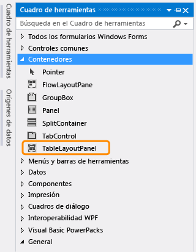
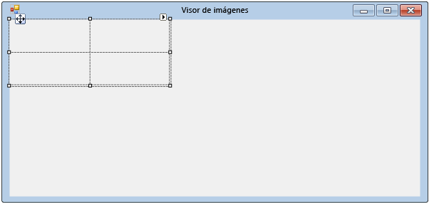
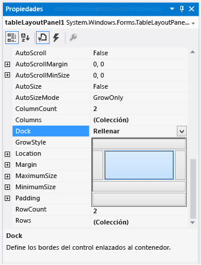
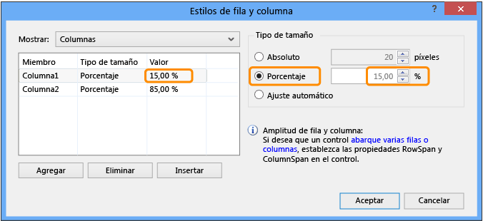
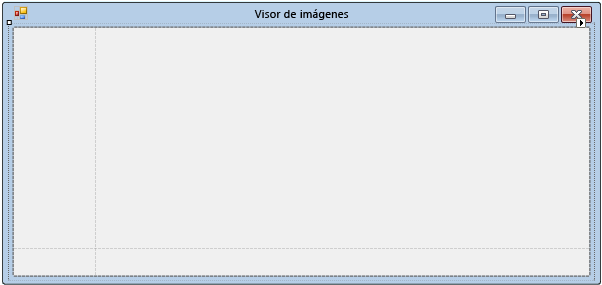

# Paso 4: Diseñar un formulario con un control TableLayoutPanel

En este paso, agregará un control <xref:System.Windows.Forms.TableLayoutPanel> al formulario. El control TableLayoutPanel ayuda a alinear correctamente los controles del formulario que se agregarán posteriormente.

## Procedimientos para diseñar el formulario con un control TableLayoutPanel

1. En el lado izquierdo del IDE de Visual Studio, seleccione la pestaña **Cuadro de herramientas**. (Como alternativa, seleccione **Ver** > **Cuadro de herramienta** en la barra de menús, o bien presione **Ctrl**+**Alt**+**X**).

1. Seleccione el símbolo del triángulo pequeño que se encuentra junto al grupo **Contenedores** para abrirlo, como se muestra en la captura de pantalla siguiente.

      
***Grupo de***  *contenedores*

1. Puede agregar controles como botones, casillas y etiquetas al formulario. Haga doble clic en el control TableLayoutPanel del **cuadro de herramientas**. (También puede arrastrar el control desde el Cuadro de herramientas hasta el formulario). Al hacerlo, el IDE agrega un control TableLayoutPanel al formulario, como se muestra en la captura de pantalla siguiente.

      
***Control***  *TableLayoutPanel*

    > [!NOTE]
    > Si, después de agregar el control TableLayoutPanel, aparece una ventana dentro del formulario con el título **Tareas de TableLayoutPanel**, haga clic en cualquier parte del formulario para cerrarla. Más adelante en el tutorial obtendrá más información sobre esta ventana.

     Observe que el **cuadro de herramientas** se expande para abarcar el formulario cuando se elige su pestaña, y se cierra cuando se hace clic fuera de él. Se trata de la característica Ocultar automáticamente del IDE. Puede activarla o desactivarla en cualquiera de las ventanas si selecciona la chincheta de la esquina superior derecha de la ventana para alternar Ocultar automáticamente y dejarlo bloqueado. El icono del pin tiene este aspecto.

      
***Icono de***  *pin*

1. Pulse TableLayoutPanel para asegurarse de que está seleccionado. Puede comprobar qué control está seleccionado si examina la lista desplegable de la parte superior de la ventana **Propiedades**, como se muestra en la captura de pantalla siguiente.

      
***Ventana*** Propiedades *mostrando el* ***control***  *TableLayoutPanel*

1. Pulse el botón **Alfabético** en la barra de herramientas de la ventana **Propiedades**. Esto ordena la lista de propiedades de la ventana **Propiedades** en orden alfabético, lo que facilita la localización de propiedades en este tutorial.

1. El selector de controles es una lista desplegable que figura en la parte superior de la ventana **Propiedades**. En este ejemplo, muestra que un control denominado `tableLayoutPanel1` está seleccionado. Puede seleccionar los controles eligiendo un área en el **Diseñador de Windows Forms** o eligiéndolos en el selector de controles.

   Ahora que TableLayoutPanel está seleccionado, busque la propiedad **Dock** y elija **Dock**, que debería estar establecida en **None**. Observe que aparece una flecha de lista desplegable al lado del valor. Seleccione la flecha y, después, seleccione el botón **Rellenar** (el botón grande del centro), como se muestra en la captura de pantalla siguiente.

      
***Ventana*** Propiedades *con la opción* ***Rellenar***  *seleccionada*

     *Acoplar* en Visual Studio hace referencia a cuando una ventana está asociada a otra ventana o área en el IDE. Por ejemplo, la ventana **Propiedades** puede estar desacoplada, es decir, estar desasociada y flotar libremente en Visual Studio, o puede estar acoplada en el **Explorador de soluciones**.

1. Después de establecer la propiedad **Dock** de TableLayoutPanel en **Rellenar**, observe que el panel rellena el formulario completo. Si vuelve a cambiar el tamaño del formulario, TableLayoutPanel permanecerá acoplado y cambiará de tamaño para ajustarse al formulario.

    > [!NOTE]
    > TableLayoutPanel funciona como una tabla de Microsoft Office Word: Tiene filas y columnas y una celda individual puede abarcar varias filas y columnas. Cada celda puede contener un control (como un botón, una casilla o una etiqueta). El control TableLayoutPanel debe contener un control <xref:System.Windows.Forms.PictureBox> que abarca la totalidad de su fila superior, un control <xref:System.Windows.Forms.CheckBox> en la celda inferior izquierda, y cuatro controles <xref:System.Windows.Forms.Button> en la celda inferior derecha.

1. Actualmente, TableLayoutPanel tiene dos filas del mismo tamaño y dos columnas del mismo tamaño. Se cambiarán de tamaño para que la fila superior y la columna derecha sean mucho mayores. En el **Diseñador de Windows Forms**, seleccione TableLayoutPanel. En la esquina superior derecha, hay un botoncito triangular de color negro, con el siguiente aspecto.

      
***Botón***  *Triángulo*

     Este botón indica que el control tiene tareas que le ayudan a establecer sus propiedades automáticamente.

1. Elija el triángulo para mostrar la lista de tareas del control, como se muestra en la captura de pantalla siguiente.

      
***Tareas de*** *TableLayoutPanel*

1. Pulse la tarea **Editar filas y columnas** para abrir la ventana **Estilos de columna y fila**. Elija **Column1** y establezca su tamaño en el 15 por ciento; para ello, asegúrese de que el botón **Porcentaje** está seleccionado y escriba **15** en el cuadro **Porcentaje**. (Se trata de un control <xref:System.Windows.Forms.NumericUpDown>, que usará en un tutorial posterior). Pulse **Column2** y establézcala en el 85 por ciento. No pulse todavía el botón **Aceptar**, ya que se cerraría la ventana. (Si lo hace, puede volver a abrirla mediante la lista de tareas).

      
***Estilos de columna y fila de*** *TableLayoutPanel*

1. En la lista desplegable **Mostrar** de la parte superior de la ventana **Estilos de columna y fila**, seleccione **Filas**. Establezca **Row1** en el 90 por ciento y **Row2** en el 10 por ciento.

1. Elija el botón **Aceptar** . TableLayoutPanel debería tener ahora una fila superior grande, una fila inferior pequeña, una columna izquierda pequeña y una columna derecha grande. (Puede cambiar el tamaño de las filas y columnas de TableLayoutPanel si elige **tableLayoutPanel1** en el formulario y arrastra sus bordes de fila y columna).

      
***Form1*** (visor de imágenes) con *TableLayoutPanel* ***cambiado de tamaño***

## Pasos siguientes

* Para ir al siguiente paso del tutorial, vea **[Paso 5: Adición de controles al formulario](../ide/step-5-add-controls-to-your-form.md)** .

* Para volver al paso anterior del tutorial, vea [Paso 3: Establecer las propiedades del formulario](../ide/step-3-set-your-form-properties.md).

## Vea también

* [Tutorial 2: Creación de una prueba matemática cronometrada](tutorial-2-create-a-timed-math-quiz.md)
* [Tutorial 3: Creación de un juego de formar parejas](tutorial-3-create-a-matching-game.md)
