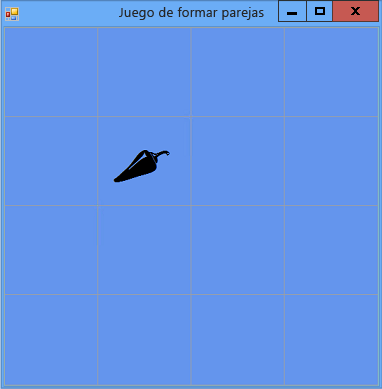

# Paso 5: Agregar referencias a etiquetas
El programa necesita realizar un seguimiento de los controles Label que elige el jugador. De momento, el programa muestra todas las etiquetas elegidas por el jugador. Pero vamos a cambiar eso. Después de que se haga elegido la primera etiqueta, el programa debería mostrar el icono correspondiente. Una vez elegida la segunda etiqueta, el programa debe mostrar ambos iconos durante un breve período de tiempo y después ocultar ambos iconos de nuevo. El programa realizará ahora un seguimiento del control de etiqueta elegido en primer lugar y del control elegido en segundo lugar mediante *variables de referencia*.  
  
### Para agregar referencias de etiqueta  
  
1.  Para agregar referencias de etiqueta a un formulario, use el siguiente código.  
  
     [!code-vb[VbExpressTutorial4Step5#5](../ide/codesnippet/VisualBasic/step-5-add-label-references_1.vb)]
     [!code-csharp[VbExpressTutorial4Step5#5](../ide/codesnippet/CSharp/step-5-add-label-references_1.cs)]  
  
     Estas variables de referencia son similares a las instrucciones usadas anteriormente para agregar objetos (por ejemplo, objetos `Timer`, objetos `List` y objetos `Random`) a un formulario. Sin embargo, estas instrucciones no hacen aparecer dos controles de etiqueta adicionales en el formulario porque ninguna de las dos instrucciones incluye la palabra clave `new`. Sin la palabra clave `new`, no se crea ningún objeto. Por ello, `firstClicked` y `secondClicked` se denominan variables de referencia: simplemente realizan un seguimiento o hacen referencia a objetos `Label`.  
  
     Cuando una variable no realiza el seguimiento de ningún objeto, se establece en un valor reservado especial: `null` en Visual C# y `Nothing` en Visual Basic. Por lo tanto, cuando se inicia el programa, el valor de `firstClicked` y el valor de `secondClicked` están establecidos en `null` o `Nothing`, lo que significa que las variables no realizan ningún tipo de seguimiento.  
  
2.  Modifique el controlador de eventos Click para usar la nueva variable de referencia `firstClicked`. Quite la última instrucción del método de control de eventos `label_Click()` (`clickedLabel.ForeColor = Color.Black;`) y reemplácela por la instrucción `if` que figura a continuación. (Asegúrese de incluir el comentario y la instrucción `if` completa).  
  
     [!code-vb[VbExpressTutorial4Step5#6](../ide/codesnippet/VisualBasic/step-5-add-label-references_2.vb)]
     [!code-csharp[VbExpressTutorial4Step5#6](../ide/codesnippet/CSharp/step-5-add-label-references_2.cs)]  
  
3.  Guarde y ejecute el programa. Elija uno de los controles de etiqueta y aparecerá el correspondiente icono.  
  
4.  Elija el siguiente control de etiqueta y verá que no sucede nada. El programa ya está realizando un seguimiento de la primera etiqueta que eligió el jugador, por lo que el valor de `firstClicked` no es `null` en Visual C# ni `Nothing` en Visual Basic. Cuando la instrucción `if` comprueba `firstClicked` para determinar si su valor es `null` o `Nothing`, concluye que no tiene ese valor y no ejecuta las instrucciones de la instrucción `if`. Por lo tanto, solo el primer icono elegido se vuelve negro y los demás iconos se vuelven invisibles, tal y como se muestra en la siguiente imagen.  
  
       
Juego de formar parejas con un icono visible  
  
     Corregirá esta situación en el siguiente paso del tutorial agregando un control **Timer**.  
  
### Para continuar o revisar  
  
-   Para ir al siguiente paso del tutorial, vea [Paso 6: Agregar un temporizador](../ide/step-6-add-a-timer.md).  
  
-   Para volver al paso previo del tutorial, vea [Paso 4: Agregar un controlador de eventos Click a cada etiqueta](../ide/step-4-add-a-click-event-handler-to-each-label.md).