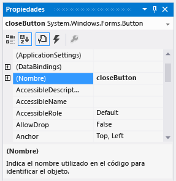

# Paso 6: Asignar un nombre a los controles de botón
Hay solo un control PictureBox en el formulario. Al agregarlo, el IDE lo denominó automáticamente **pictureBox1**. Solamente hay una casilla, denominada **checkBox1**. Pronto, escribirá código, y ese código hará referencia a CheckBox y PictureBox. Como no hay más que un ejemplar de cada control, entenderá lo que significan los términos **pictureBox1** o **checkBox1** cuando los vea en su código.  
  
> [!NOTE]
>  En Visual Basic, la primera letra del nombre de un control se pone en mayúscula de forma predeterminada, de modo que los nombres son **PictureBox1**, **CheckBox1**, etc.  
  
 Hay cuatro botones en el formulario, que el IDE ha denominado **button1**, **button2**, **button3**y **button4**. Solo con mirar los nombres actuales no sabemos cuál es el botón **Cerrar** ni cuál es el botón **Mostrar una imagen** . Por eso resulta útil asignar a los controles de botón nombres más descriptivos.  
  
 Para obtener una versión en vídeo de este tema, vea el [Tutorial 1: Crear un visor de imágenes en Visual Basic (vídeo 3)](http://go.microsoft.com/fwlink/?LinkId=205213) o el [Tutorial 1: Crear un visor de imágenes en C# (vídeo 3)](http://go.microsoft.com/fwlink/?LinkId=205202). En estos vídeos se utilizó una versión anterior de Visual Studio, por lo que hay ligeras diferencias en algunos comandos de menú y otros elementos de la interfaz de usuario. Sin embargo, los conceptos y procedimientos funcionan de forma similar en la versión actual de Visual Studio.  
  
### Para dar un nombre a los controles de botón  
  
1.  En el formulario, elija el botón **Cerrar** . (Si todavía están seleccionados todos los botones, elija la tecla ESC para cancelar la selección). Desplácese en la ventana **Propiedades** hasta que vea la propiedad **(Name)**. (La propiedad **(Name)** se encuentra cerca de la parte superior cuando las propiedades están por orden alfabético). Cambie el nombre a **closeButton**, como se muestra en la siguiente imagen.  
  
       
Ventana Propiedades mostrando el nombre closeButton  
  
    > [!NOTE]
    >  Si intenta cambiar el nombre del botón por **closeButton**, con un espacio entre las palabras Botón y Cerrar, el IDE muestra el mensaje de error: "El valor de propiedad no es válido". En los nombres de los controles no se permiten espacios (ni algunos otros caracteres).  
  
2.  Cambie el nombre de los otros tres botones a **backgroundButton**, **clearButton**y **showButton**. Puede comprobar los nombres eligiendo la lista desplegable de selección de controles de la ventana **Propiedades** . Aparecerán los nuevos nombres de los botones.  
  
3.  Haga doble clic en el botón **Mostrar una imagen** del formulario. Si lo desea, también puede elegir el botón **Mostrar una imagen** del formulario y, a continuación, la tecla ENTRAR. Al hacerlo, el IDE abre una pestaña adicional en la ventana principal denominada **Form1.cs** (**Form1.vb** si utiliza Visual Basic). En esta pestaña se muestra el archivo de código subyacente del formulario, tal y como se muestra en la siguiente imagen.  
  
       
Pestaña Form1.cs con código de Visual C#  
  
4.  Céntrese en esta parte del código. (Si utiliza Visual Basic, elija la pestaña **VB** que se muestra a continuación para ver la versión de Visual Basic del código).  
  
     [!code-vb[VbExpressTutorial1Step6#1](../ide/codesnippet/VisualBasic/step-6-name-your-button-controls_1.vb)]  [!code-cs[VbExpressTutorial1Step6#1](../ide/codesnippet/CSharp/step-6-name-your-button-controls_1.cs)]  
  
     Se trata de código denominado `showButton_Click()`. El IDE lo agregó al código del formulario cuando abrió el archivo de código del botón **showButton** . En tiempo de diseño, cuando abra el archivo de código de un control de un formulario, se generará el código del control si este aún no existe. Este código, conocido como *método*, se ejecuta a la vez que el programa y elige el control (en este caso, el botón **Mostrar una imagen** ).  
  
    > [!NOTE]
    >  En este tutorial, el código de Visual Basic que se genera automáticamente se ha simplificado quitando todo lo que hay entre los paréntesis (). Siempre que esto sucede, se puede quitar el mismo código. El programa funcionará en ambos casos. En el resto de los tutoriales, se simplifica el código generado automáticamente siempre que sea posible.  
  
5.  Vuelva a elegir la pestaña del Diseñador de Windows Forms (**Form1.cs [Diseño]** en Visual C#, **Form1.vb [Diseño]** en Visual Basic) y luego abra el archivo de código para que el botón **Borrar la imagen** cree un método para él en el código del formulario. Repita el procedimiento con los dos botones restantes. El IDE agrega cada vez un nuevo método al archivo de código del formulario.  
  
6.  Si desea agregar varios métodos, abra el archivo de código del control CheckBox en el Diseñador de Windows Forms para hacer que el IDE agregue un método `checkBox1_CheckedChanged()` . Cada vez que el usuario activa o desactiva la casilla, se llama a este método.  
  
    > [!NOTE]
    >  Cuando se trabaja en un programa, a menudo se utilizan alternativamente el editor de código y el Diseñador de Windows Forms. El IDE facilita la navegación en el proyecto. Use el **Explorador de soluciones** para abrir el Diseñador de Windows Forms haciendo doble clic en **Form1.cs** en Visual C# o en **Form1.vb** en Visual Basic o, en la barra de menús, elija **Ver**, **Diseñador**.  
  
     A continuación se muestra el nuevo código que aparece en el editor de código.  
  
     [!code-vb[VbExpressTutorial1Step6#2](../ide/codesnippet/VisualBasic/step-6-name-your-button-controls_2.vb)]  [!code-cs[VbExpressTutorial1Step6#2](../ide/codesnippet/CSharp/step-6-name-your-button-controls_2.cs)]  
  
     Los cinco métodos que ha agregado se denominan *controladores de eventos*, porque el programa los llama cada vez que se produce un evento (por ejemplo, cuando un usuario elige un botón o activa una casilla).  
  
     Cuando ve el código de un control del IDE en tiempo de diseño, Visual Studio agrega un método de control de eventos para el control si aún no está ahí. Por ejemplo, cuando se hace doble clic en un botón, el IDE agrega un controlador para este evento Click (al que se llamará cada vez que el usuario elija el botón). Cuando se hace doble clic en una casilla, el IDE agrega un controlador para el evento CheckedChanged correspondiente (al que se llamará cada vez que el usuario active o desactive la casilla).  
  
     Después de agregar un controlador de eventos para un control, puede volver en cualquier momento a él desde el Diseñador de Windows Forms haciendo doble clic en el control o eligiendo **Ver**, **Código**en la barra de menús.  
  
     Los nombres son importantes al compilar programas. Los métodos (incluso los controladores de eventos) pueden tener cualquier nombre que se desee. Cuando agregue un controlador de eventos con el IDE, se creará un nombre basado en el nombre del control y en el evento que se controla. Por ejemplo, el evento Click para un botón denominado **showButton** se denomina método de control de eventos `showButton_Click()` . Además, se suelen agregar paréntesis de apertura y cierre () después del nombre de método para indicar que se trata de un método. Si decide que desea cambiar un nombre de variable de código, haga clic con el botón secundario en la variable del código y elija **Refactorizar**, **Cambiar nombre**. Todas las instancias de esa variable del código cambiarán de nombre. Vea [Cambiar el nombre de refactorización (C#)](../csharp-ide/refactoring/rename.md) o [Refactorización y Cambiar nombre (Cuadro de diálogo) (Visual Basic)](../vb-ide/refactoring/rename.md) para obtener más información.
  
### Para continuar o revisar  
  
-   Para ir al siguiente paso del tutorial, vea [Paso 7: Agregar componentes de diálogo al formulario](../ide/step-7-add-dialog-components-to-your-form.md).  
  
-   Para volver al paso anterior del tutorial, vea [Paso 5: Agregar controles al formulario](../ide/step-5-add-controls-to-your-form.md).
