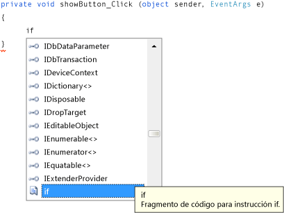

# Paso 8: Escribir código para el controlador de eventos del botón Mostrar una imagen
En este paso, conseguirá que el botón **Mostrar una imagen** funcione así:

-   Cuando un usuario pulsa ese botón, el programa abre un cuadro <xref:System.Windows.Forms.OpenFileDialog>.

-   Si un usuario abre un archivo de imagen, el programa muestra esa imagen en <xref:System.Windows.Forms.PictureBox>.

 El IDE incluye una eficaz herramienta denominada IntelliSense que ayuda a escribir código. Cuando se escribe código, el IDE abre un cuadro con sugerencias para completar las palabras parciales que se escriben. Intenta determinar lo que se desea hacer a continuación y salta automáticamente al último elemento que se elige en la lista. Puede utilizar las flechas arriba o abajo para moverse por la lista o bien continuar escribiendo letras para reducir las opciones propuestas. Cuando vea la opción que busca, elija la tecla **Tab** para seleccionarla. Otra opción es pasar por alto las sugerencias, si no las necesita.

 Para obtener una versión en vídeo de este tema, vea el [Tutorial 1: Crear un visor de imágenes en Visual Basic (vídeo 4)](http://go.microsoft.com/fwlink/?LinkId=205215) o el [Tutorial 1: Crear un visor de imágenes en C# (vídeo 4)](http://go.microsoft.com/fwlink/?LinkId=205203). En estos vídeos se utilizó una versión anterior de Visual Studio, por lo que hay ligeras diferencias en algunos comandos de menú y otros elementos de la interfaz de usuario. Sin embargo, los conceptos y procedimientos funcionan de forma similar en la versión actual de Visual Studio.

## Para escribir código para el controlador de eventos de botón Mostrar una imagen

1.  Vaya al **Diseñador de Windows Forms** y haga doble clic en el botón **Mostrar una imagen**. El IDE va inmediatamente al diseñador de código y mueve su cursor de modo para situarlo dentro del método `showButton_Click()` que agregó previamente.

2.  Escriba una `i` en la línea vacía entre las dos llaves `{ }`. (En Visual Basic, escriba en la línea vacía entre `Private Sub...` y `End Sub`). Se abre una ventana **IntelliSense**, como se muestra en la siguiente imagen.

     
**IntelliSense** with Visual C# code

3.  La ventana **IntelliSense** debe mostrar resaltada la palabra `if`. (De lo contrario, escriba una `f` minúscula, y lo hará). Observe cómo un pequeño cuadro de *información sobre herramientas* situado junto a la ventana **IntelliSense** aparece con la descripción, **Fragmento de código para la instrucción if**. (En Visual Basic, la información sobre herramientas dice también que se trata de un fragmento de código, pero con una redacción ligeramente diferente.) Como quiere usar ese fragmento, pulse la tecla **Tab** para insertar `if` en el código. Pulse de nuevo la tecla **Tab** para usar el fragmento de código `if`. (Si ha hecho clic en alguna otra parte y ha desaparecido la ventana **IntelliSense**, borre la `i`con la tecla de retroceso y vuelva a escribirla; se volverá a abrir la ventana **IntelliSense**).

      Código de Visual C#

4.  A continuación, use IntelliSense para escribir más código y abrir un cuadro de diálogo **Abrir archivo**. Si el usuario selecciona el botón **Aceptar**, el control PictureBox cargará el archivo seleccionado por el usuario. En los siguientes pasos se muestra cómo escribir el código. Aunque los pasos son muchos, solamente habrá que presionar unas cuantas teclas:

    1.  Comience con el texto seleccionado **true** del fragmento de código. Escriba `op` para sobrescribirlo. (En Visual Basic, empieza con mayúscula inicial, de modo que deberá escribir `Op`).

    2.  Se abre la ventana **IntelliSense** y muestra **openFileDialog1**. Elija la tecla **Tab** para seleccionarlo. (En Visual Basic, empieza con mayúscula inicial, de modo que aparecerá **OpenFileDialog1**. Asegúrese de que **OpenFileDialog1** está seleccionado).

         Para obtener más información sobre `OpenFileDialog`, vea [OpenFileDialog](http://msdn.microsoft.com/library/system.windows.forms.openfiledialog.aspx).

    3.  Escriba un punto (`.`) (En inglés se denomina period o dot). Dado que ha escrito un punto justo después de **openFileDialog1**, se abre una ventana **IntelliSense**, que contiene todas las propiedades y los métodos de componente de **OpenFileDialog**. Se trata de las mismas propiedades que aparecen en la ventana **Propiedades** cuando selecciona este componente en el **Diseñador de Windows Forms**. También puede elegir métodos que indiquen al componente que realice acciones (como abrir un cuadro de diálogo).

        > [!NOTE]
        >  La ventana **IntelliSense** puede mostrar propiedades y métodos. Para determinar qué se está mostrando, fíjese en el icono del lado izquierdo de cada elemento de la ventana **IntelliSense**. Se muestra una imagen de un bloque junto a cada método y una imagen de una llave inglesa (o fija) junto a cada propiedad. Además, aparece un icono de rayo junto a cada evento. Estas imágenes se muestran como sigue.

         
**Method** icon

         
**Property** icon

         
**Event** icon

    4.  Empiece a escribir `ShowDialog` (el uso de mayúsculas o minúsculas no es significativo en IntelliSense). El método `ShowDialog()` mostrará el cuadro de diálogo **Abrir archivo**. Cuando la ventana haya resaltado **ShowDialog**, pulse la tecla **Tab**. También puede resaltar "ShowDialog" y pulsar la tecla **F1** para obtener ayuda sobre ella.

         Para obtener más información sobre el método `ShowDialog()`, vea [ShowDialog Method](http://msdn.microsoft.com/library/c7ykbedk.aspx).

    5.  Cuando se usa un método con un control o un componente (lo que se denomina *llamar a un método*), es preciso agregar paréntesis. Así pues, especifique los paréntesis de apertura y cierre inmediatamente después de la "g" en `ShowDialog`: `()` Debe tener la apariencia siguiente: "openFileDialog1.ShowDialog()".

        > [!NOTE]
        >  Los métodos constituyen una parte importante de cualquier programa. En este tutorial se han mostrado varias maneras de utilizarlos. Se puede llamar al método de un componente para ordenarle que haga algo, por ejemplo, como cuando llamó al método `ShowDialog()` del componente **OpenFileDialog**. Puede crear sus propios métodos para que los programas realicen acciones, como el que estamos construyendo ahora, que se denomina método `showButton_Click()` y que abre un cuadro de diálogo y una imagen cuando un usuario elige en un botón.

    6.  Para Visual C#, agregue un espacio y, después, agregue dos signos igual (`==`). Para Visual Basic, agregue un espacio y, después, use un solo signo igual (`=`). (Visual C# y Visual Basic utilizan distintos operadores de igualdad.)

    7.  Agregue otro espacio. En cuanto lo haga, se abrirá otra ventana **IntelliSense**. Empiece a escribir `DialogResult` y pulse la tecla **Tab** para agregarlo.

        > [!NOTE]
        >  Cuando se escribe código para llamar a un método, a veces devuelve un valor. En este caso, el método <xref:System.Windows.Forms.CommonDialog.ShowDialog> del componente **OpenFileDialog** devuelve un valor <xref:System.Windows.Forms.DialogResult>. DialogResult es un valor especial que le indica lo que ha sucedido en un cuadro de diálogo. Un componente **OpenFileDialog** puede dar lugar a que el usuario pulse **Aceptar** o **Cancelar**, de modo que el método `ShowDialog()` devuelva `DialogResult.OK` o `DialogResult.Cancel`.

    8.  Escriba un punto para abrir la ventana **IntelliSense** del valor DialogResult. Escriba la letra `O` y pulse la tecla **Tab** para insertar **Aceptar**.

         Para obtener más información sobre DialogResult, vea [DialogResult](http://msdn.microsoft.com/library/system.windows.forms.dialogresult.aspx).

        > [!NOTE]
        >  Deberá quedar completa la primera línea de código. Para Visual C#, debería ser la siguiente.
        >
        >  `if (openFileDialog1.ShowDialog() == DialogResult.OK)`
        >
        >  Para Visual Basic, debería ser la siguiente.
        >
        >  `If OpenFileDialog1.ShowDialog() = DialogResult.OK Then`

    9. Ahora, agregue otra línea de código más. Puede escribirla (o copiar y pegar), pero puede resultar interesante utilizar IntelliSense para agregarla. Cuanto más se familiarice con IntelliSense, más rápidamente podrá escribir su propio código. El método `showButton_Click()` final tendrá el siguiente aspecto. (Pulse la pestaña **VB** para ver la versión de Visual Basic del código).

         [!code-csharp[VbExpressTutorial1Step8#1](../ide/codesnippet/CSharp/step-8-write-code-for-the-show-a-picture-button-event-handler_1.cs)]
         [!code-vb[VbExpressTutorial1Step8#1](../ide/codesnippet/VisualBasic/step-8-write-code-for-the-show-a-picture-button-event-handler_1.vb)]

## Para continuar o revisar

-   Para ir al siguiente paso del tutorial, vea [Paso 9: Revisar, comentar y probar el código](../ide/step-9-review-comment-and-test-your-code.md).

-   Para volver al paso anterior del tutorial, vea [Paso 7: Agregar componentes de diálogo al formulario](../ide/step-7-add-dialog-components-to-your-form.md).
