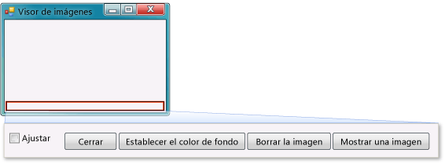

# <a name="step-9-review-comment-and-test-your-code"></a>Paso 9: Revisar, comentar y probar el código

A continuación, se agrega un comentario al código. Un comentario es una nota que no cambia la forma de comportarse de la aplicación. Hace que resulte más fácil entender el código a la persona que lo lee. Agregar comentarios al código es un hábito recomendable.

En C#, se usan dos barras diagonales (//) para marcar una línea como comentario. En Visual Basic, se utiliza una comilla sencilla (') para marcar una línea como comentario. Después de agregar un comentario, se prueba la aplicación. Es recomendable ejecutar y probar el código con frecuencia mientras trabaja en sus proyectos para que pueda detectar y corregir pronto cualquier problema, antes de que la complejidad del código aumente. Esto se denomina *prueba iterativa*.

Acaba de compilar algo que funciona y, aunque todavía no está terminado, ya es capaz de cargar una imagen. Antes de agregar un comentario al código y probarlo, dedique un tiempo a revisar los conceptos del código, porque los utilizará con frecuencia:

- Al hacer doble clic en el botón **Show a picture** (Mostrar una imagen) en el **Diseñador de Windows Forms**, el IDE agregó automáticamente un *método* al código del programa.

- Los métodos sirven para organizar el código: Son la forma de agrupar el código.

- En la mayoría de los casos, un método realiza una cantidad reducida de acciones en un orden concreto; por ejemplo, el método `showButton_Click()` (o `ShowButton_Click()`) muestra un cuadro de diálogo y después carga una imagen.

- Un método se compone de *instrucciones* o líneas de código. Podemos considerar que un método es una manera de empaquetar instrucciones de código juntas.

- Cuando se ejecuta un método, o se le *llama*, se ejecutan las instrucciones que contiene en orden, una tras otra, empezando por la primera.

   A continuación, se muestra un ejemplo de una instrucción.

  ```csharp
  PictureBox1.Load(openFileDialog1.FileName);
  ```

  ```vb
  pictureBox1.Load(openFileDialog1.FileName)
  ```

   Las instrucciones son lo que permite que el programa haga cosas. En C#, una instrucción finaliza siempre con un signo de punto y coma. En Visual Basic, el final de una línea es el final de una instrucción. (No se necesita indicar el signo de punto y coma en Visual Basic.) La instrucción anterior ordena al control <xref:System.Windows.Forms.PictureBox> que cargue el archivo que el usuario ha seleccionado con el componente **OpenFileDialog**.

## <a name="to-add-comments"></a>Para agregar comentarios

1. Agregue el siguiente comentario al código.

    > [!IMPORTANT]
    > Use el control del lenguaje de programación situado en la parte superior derecha de esta página para ver el fragmento de código de C# o el de Visual Basic.<br><br>

     [!code-csharp[VbExpressTutorial1Step9_10#1](../ide/codesnippet/CSharp/step-9-review-comment-and-test-your-code_1.cs)]

     [!code-vb[VbExpressTutorial1Step9_10#1](../ide/codesnippet/VisualBasic/step-9-review-comment-and-test-your-code_1.vb)]

    El controlador de eventos <xref:System.Windows.Forms.Control.Click> del botón **showButton** ya está completado y funciona. Ha empezado a escribir código, comenzando por una instrucción `if`. Una instrucción `if` es la manera de ordenar a la aplicación: "Comprueba esto y, si se cumple, realiza estas acciones". En este caso, se le indica a la aplicación que abra el cuadro de diálogo **Abrir archivo** y que, si el usuario selecciona un archivo y elige el botón **Aceptar**, cargue ese archivo en **PictureBox**.

    > [!TIP]
    > El IDE se ha creado para facilitar la tarea de escribir código. Los *fragmentos de código* constituyen una manera de conseguirlo. Un fragmento de código es un acceso directo que se expande para crear un bloque pequeño de código.
    >
    >  Puede ver todos los fragmentos de código disponibles. En la barra de menús, elija **Herramientas** > **Administrador de fragmentos de código**. En C#, el fragmento de código `if` está en **Visual C#** . En Visual Basic, los fragmentos de código `if` están en **Condicionales y bucles** > **Code Patterns** (Patrones de código). Este administrador se puede utilizar para examinar los fragmentos de código existentes o agregar los suyos propios.
    >
    >  Para activar un fragmento de código mientras está especificando el código, escríbalo y elija la tecla **Tab**. Muchos fragmentos de código aparecen en la ventana **IntelliSense**, motivo por el cual la tecla **Tab** se elige dos veces: la primera para seleccionar el fragmento de código en la ventana **IntelliSense** y la segunda para indicarle al IDE que lo use. (IntelliSense admite el fragmento de código `if`, pero no el fragmento de código `ifelse`.)

1. Antes de ejecutar la aplicación, seleccione el botón **Guardar todo** de la barra de herramientas para guardarla, que debe ser similar a la captura de pantalla siguiente.

     <br>
*Botón* ***Guardar todo***

     O bien, para guardar la aplicación, elija **Archivo** > **Guardar todo** en la barra de menús (o presione **Ctrl**+**Mayús**+**S**). El procedimiento recomendado consiste en guardar desde el principio y a menudo.

     Mientras se ejecuta, el programa debería parecerse a la imagen siguiente.

     <br>***Visor de imágenes***

## <a name="to-test-your-app"></a>Para probar la aplicación

1. Elija la tecla **F5** o el botón de la barra de herramientas **Iniciar depuración**.

1. Elija el botón **Show a picture** (Mostrar una imagen) para ejecutar el código que acaba de escribir. Primero, la aplicación abre un cuadro de diálogo **Abrir archivo**. Compruebe que los filtros aparecen en la lista desplegable **Tipo de archivo** en la parte inferior del cuadro de diálogo. A continuación, navegue hasta una imagen y ábrala. Normalmente, encontrará imágenes de ejemplo que se distribuyen con el sistema operativo Windows en la carpeta *Mis documentos*, dentro de la carpeta *Mis imágenes\Imágenes de muestra*.

    > [!TIP]
    > Si no ve ninguna imagen en el cuadro de diálogo **Select a picture file** (Seleccionar un archivo de imagen), asegúrese de que el filtro **Todos los archivos (*.\*)** esté seleccionado en la lista desplegable situada en la parte inferior derecha del cuadro de diálogo.

1. Cargue una imagen y esta aparecerá en el control PictureBox. A continuación intente cambiar el tamaño del formulario arrastrando los bordes. Como el control PictureBox está acoplado dentro de un control TableLayoutPanel, que a su vez está acoplado en el formulario, el ancho del área de imagen se ajustará al ancho del formulario y el alto ocupará el 90 por ciento superior del formulario. Por eso se han usado los contenedores <xref:System.Windows.Forms.TableLayoutPanel> y <xref:System.Windows.Forms.FlowLayoutPanel>: Mantienen el tamaño del formulario correcto cuando el usuario lo modifica.

     En este momento, las imágenes más grandes sobrepasan los bordes del visor de imágenes. En el paso siguiente, agregará código para que las imágenes se ajusten a la ventana.

## <a name="to-continue-or-review"></a>Para continuar o revisar

- Para ir al siguiente paso del tutorial, vea **[Paso 10: Escritura de código para botones adicionales y una casilla](../ide/step-10-write-code-for-additional-buttons-and-a-check-box.md)** .

- Para volver al paso anterior del tutorial, vea [Paso 8: Escribir código para el controlador de eventos del botón Mostrar una imagen](../ide/step-8-write-code-for-the-show-a-picture-button-event-handler.md).

## <a name="see-also"></a>Vea también

* [Tutorial 2: Creación de una prueba matemática cronometrada](tutorial-2-create-a-timed-math-quiz.md)
* [Tutorial 3: Creación de un juego de formar parejas](tutorial-3-create-a-matching-game.md)
