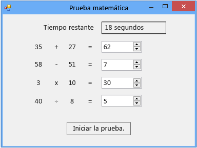

# Tutorial 2: Crear una prueba matemática cronometrada

En este tutorial, se compila un juego de prueba matemática en el que el jugador debe responder a cuatro problemas aritméticos aleatorios en un tiempo especificado.

> [!NOTE]
> En este tutorial, se trata tanto C# como Visual Basic, por lo que deberá centrarse en la información específica del lenguaje de programación que use.

Este tutorial le guiará por las tareas siguientes:

- Generar números aleatorios mediante la clase <xref:System.Random>.

- Generar eventos que se producirán en un momento concreto con un control <xref:System.Windows.Forms.Timer>.

- Controlar el flujo del programa con instrucciones `if else`.

- Realizar operaciones aritméticas básicas en el código.

Cuando termine, el cuestionario se parecerá a la siguiente captura de pantalla, pero tendrá otros números:

## Vínculos del tutorial

|Title|Descripción|
|-----------|-----------------|
|[Paso 1: Crear un proyecto y agregar etiquetas al formulario](../ide/step-1-create-a-project-and-add-labels-to-your-form.md)|Comience creando el proyecto, cambiando las propiedades y agregando controles `Label`.|
|[Paso 2: Crear un problema de suma aleatoria](../ide/step-2-create-a-random-addition-problem.md)|Cree un problema de suma y use la clase `Random` para generar números aleatorios.|
|[Paso 3: Agregar un temporizador de cuenta atrás](../ide/step-3-add-a-countdown-timer.md)|Agregue un temporizador de cuenta atrás para poder limitar el tiempo de la prueba.|
|[Paso 4: Agregar el método CheckTheAnswer()](../ide/step-4-add-the-checktheanswer-parens-method.md)|Agregue un método para comprobar si el jugador ha escrito una respuesta correcta para el problema.|
|[Paso 5: Agregar controladores de eventos Enter para los controles NumericUpDown](../ide/step-5-add-enter-event-handlers-for-the-numericupdown-controls.md)|Agregue controladores de eventos para que sea más fácil jugar.|
|[Paso 6: Agregar un problema de resta](../ide/step-6-add-a-subtraction-problem.md)|Agregue un problema de resta que genere números aleatorios, utilice el temporizador y compruebe si las respuestas son correctas.|
|[Paso 7: Agregar problemas de multiplicación y división](../ide/step-7-add-multiplication-and-division-problems.md)|Agregue problemas de multiplicación y división que generen números aleatorios, utilicen el temporizador y se comprueban para ver si las respuestas son correctas.|
|[Paso 8: Personalizar la prueba](../ide/step-8-customize-the-quiz.md)|Pruebe con otras características, como cambiar colores y agregar sugerencias.|

También dispone de excelentes recursos de aprendizaje en vídeo gratuitos. Para obtener más información sobre la programación en C#, vea [C# fundamentals: Development for absolute beginners](https://channel9.msdn.com/Series/C-Sharp-Fundamentals-Development-for-Absolute-Beginners) (Fundamentos de C#: desarrollo para principiantes absolutos). Para obtener más información sobre la programación en Visual Basic, vea [Visual Basic Fundamentals: Development for absolute beginners](https://channel9.msdn.com/Series/Visual-Basic-Development-for-Absolute-Beginners) (Fundamentos de C#: desarrollo para principiantes absolutos).

## Pasos siguientes

Para comenzar el tutorial, empiece por el **[Paso 1: Crear un proyecto y agregar etiquetas al formulario](../ide/step-1-create-a-project-and-add-labels-to-your-form.md)** .

## Vea también

* [Más tutoriales de C#](../get-started/csharp/index.yml)
* [Tutoriales de Visual Basic](../get-started/visual-basic/index.yml)
* [Tutoriales de C++](/cpp/get-started/tutorial-console-cpp)