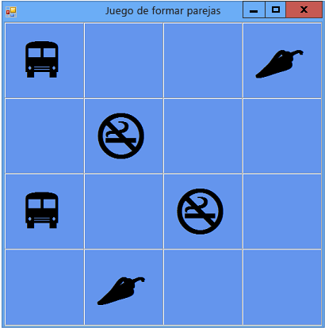

# Tutorial 3: Crear un juego de formar parejas

En este tutorial, compilará un juego de formar parejas en el que el jugador debe buscar las coincidencias entre pares de iconos ocultos.

> [!NOTE]
> En este tutorial, se trata tanto C# como Visual Basic, por lo que deberá centrarse en la información específica del lenguaje de programación que use.

Este tutorial le guiará por las tareas siguientes:

- Almacenar objetos, como iconos, en un objeto <xref:System.Collections.Generic.List%601>.

- Use un bucle de `foreach` en C# o un bucle de `For Each` en Visual Basic para recorrer en iteración los elementos de una lista.

- Realizar un seguimiento del estado de un formulario mediante variables de referencia.

- Crear un controlador de eventos que responda a eventos que se puedan usar con varios objetos.

- Crear un temporizador para la cuenta atrás y desencadenar un evento una y solo una vez después de iniciarse.

Cuando termine, la aplicación debe ser similar a la de la imagen siguiente:

## Vínculos del tutorial

|Title|Descripción|
|-----------|-----------------|
|[Paso 1: Crear un proyecto y agregar una tabla a un formulario](../ide/step-1-create-a-project-and-add-a-table-to-your-form.md)|Para empezar, cree el proyecto y agregue un control `TableLayoutPanel` para mantener los controles correctamente alineados.|
|[Paso 2: Agregar un objeto aleatorio y una lista de iconos](../ide/step-2-add-a-random-object-and-a-list-of-icons.md)|Agregará un objeto `Random` y un objeto `List`, para crear una lista de iconos.|
|[Paso 3: Asignar un icono aleatorio a cada etiqueta](../ide/step-3-assign-a-random-icon-to-each-label.md)|Asigne los iconos aleatoriamente a los controles `Label`, de modo que cada juego sea diferente.|
|[Paso 4: Agregar un controlador de eventos Click a cada etiqueta](../ide/step-4-add-a-click-event-handler-to-each-label.md)|Agregará un controlador de eventos `Click` que cambiará el color de la etiqueta en la que se haga clic.|
|[Paso 5: Agregar referencias a etiquetas](../ide/step-5-add-label-references.md)|Agregará variables de referencia para realizar el seguimiento de las etiquetas en las que se hace clic.|
|[Paso 6: Agregar un temporizador](../ide/step-6-add-a-timer.md)|Agregará un temporizador al formulario para realizar un seguimiento del tiempo que ha transcurrido en el juego.|
|[Paso 7: Mantener visibles los pares](../ide/step-7-keep-pairs-visible.md)|Mantendrá los pares de iconos visibles si se selecciona una pareja coincidente.|
|[Paso 8: Agregar un método para comprobar si el jugador ganó](../ide/step-8-add-a-method-to-verify-whether-the-player-won.md)|Agregará un método `CheckForWinner()` para comprobar si el jugador ganó.|
|[Paso 9: Probar otras características](../ide/step-9-try-other-features.md)|Probará otras características, como cambiar los iconos y colores, agregar una cuadrícula y agregar sonidos. Intentará aumentar el tamaño del tablero y ajustar el temporizador.|

También dispone de excelentes recursos de aprendizaje en vídeo gratuitos. Para obtener más información sobre la programación en C#, vea [C# fundamentals: Development for absolute beginners](https://channel9.msdn.com/Series/C-Sharp-Fundamentals-Development-for-Absolute-Beginners) (Fundamentos de C#: desarrollo para principiantes absolutos). Para obtener más información sobre la programación en Visual Basic, vea [Visual Basic Fundamentals: Development for absolute beginners](https://channel9.msdn.com/Series/Visual-Basic-Development-for-Absolute-Beginners) (Fundamentos de C#: desarrollo para principiantes absolutos).

## Pasos siguientes

Para comenzar el tutorial, empiece por el **[Paso 1: Crear un proyecto y agregar una tabla a un formulario](../ide/step-1-create-a-project-and-add-a-table-to-your-form.md)** .

## Vea también

* [Más tutoriales de C#](/visualstudio/get-started/csharp/)
* [Tutoriales de Visual Basic](/visualstudio/get-started/visual-basic/)
* [Tutoriales de C++](/cpp/get-started/tutorial-console-cpp)
