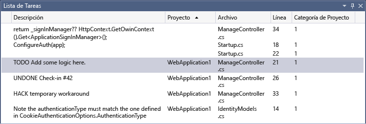

# <a name="use-the-task-list"></a>Uso de la lista de tareas

Use la **Lista de tareas** para hacer un seguimiento de los comentarios de código que usan tokens como `TODO` y `HACK` (o tokens personalizados) y administrar los accesos directos que le llevarán directamente a una ubicación predefinida del código. Haga clic en el elemento de la lista para ir a su ubicación en el código fuente.

> [!NOTE]
> Este tema se aplica a Visual Studio para Windows. En el caso de Visual Studio para Mac, vea [Comentarios de tareas (Visual Studio para Mac)](/visualstudio/mac/task-comments).

## <a name="the-task-list-window"></a>La ventana Lista de tareas

Cuando la ventana **Lista de tareas** está abierta, aparece en la parte inferior de la ventana de la aplicación.

Para abrir**Lista de tareas**, seleccione **Vista** > **Lista de tareas** o presione **Ctrl**+ **\\** ,**T** en el teclado.



Para cambiar el criterio de ordenación de la lista, seleccione el encabezado de cualquier columna. Para refinar los resultados de la búsqueda, presione la tecla **Mayúsculas** y elija un segundo encabezado de columna. Como alternativa, elija **Ordenar por** en el menú contextual y elija un encabezado. Para refinar los resultados de la búsqueda, presione la tecla **Mayúsculas** y elija un segundo encabezado de columna.

Para mostrar u ocultar columnas, elija **Mostrar columnas** en el menú contextual. Seleccione las columnas que quiere mostrar u ocultar.

Para cambiar el orden de las columnas, arrastre cualquier encabezado de columna a la ubicación que quiere.

## <a name="user-tasks"></a>Tareas de usuario

La característica de tareas de usuario se retiró en Visual Studio 2015. Cuando se abre una solución que tiene datos de tareas de usuario de Visual Studio 2013 y versiones anteriores, dichos datos no se verán afectados en el archivo *.suo*, pero las tareas de usuario no se mostrarán en la lista de tareas.

Si quiere seguir teniendo acceso los datos de tareas de usuario y actualizarlos, abra el proyecto en Visual Studio 2013 y copie el contenido de las tareas de usuario en la herramienta de administración de proyecto que prefiera (por ejemplo, Team Foundation Server).

## <a name="tokens-and-comments"></a>Tokens y comentarios

También aparece un comentario en el código precedido de un marcador de comentario y un token predefinido en la ventana **Lista de tareas**. Por ejemplo, el siguiente comentario de C# tiene tres partes distintas:

- El marcador de comentario (`//`)

- El token, por ejemplo (`TODO`)

- El comentario (el resto del texto)

```csharp
// TODO: Load state from previously suspended application
```

Dado que `TODO` es un token predefinido, este comentario aparece como una tarea `TODO` en la lista.

> [!NOTE]
> Los tokens predeterminados solo están disponibles para los lenguajes C/C++, C# y VB.

### <a name="custom-tokens"></a>Tokens personalizados

De manera predeterminada, Visual Studio incluye los tokens siguientes: `HACK`, `TODO`, `UNDONE` y `UnresolvedMergeConflict`. No distinguen mayúsculas de minúsculas. También puede crear tokens propios personalizados.

Para crear un token personalizado:

1. En el menú **Herramientas** , elija **Opciones**.

2. Abra la carpeta **Entorno** y, a continuación, elija **Lista de tareas**.

   Se muestra la [página Opciones de la lista de tareas](../ide/reference/task-list-environment-options-dialog-box.md).

   

3. En el cuadro de texto **Nombre**, escriba el nombre del token, por ejemplo, **BUG**.

4. En la lista desplegable **Prioridad** , elija una prioridad predeterminada para el nuevo token.

5. Haga clic en **Agregar**.

> [!TIP]
> El botón **Agregar** se habilita una vez que especifica un nombre. Debe escribir un nombre antes de hacer clic en **Agregar**.

### <a name="c-todo-comments"></a>Comentarios TODO en C++

De manera predeterminada, los comentarios TODO en C++ se muestran en la ventana **Lista de tareas**.

Para desactivar los comentarios TODO en C++, en el menú **Herramientas**, elija **Opciones** > **Editor de texto** > **C/C++** > **Vista** > **Enumerar tareas de comentario** y establezca el valor en **false**.

## <a name="shortcuts"></a>Accesos directos

Un *acceso directo* es un marcador en el código cuyo seguimiento se hace en **Lista de tareas**. Tiene un icono diferente que los marcadores normales. Haga doble clic en el acceso directo en la **Lista de tareas** para ir a la ubicación correspondiente en el código.


### <a name="create-a-shortcut"></a>Crear un acceso directo

Para crear un acceso directo, inserte el puntero donde quiera colocar un acceso directo en el código. Elija **Edición** > **Marcadores** > **Agregar acceso directo de la Lista de tareas** o presione **CTRL**+**K**, **CTRL**+**H**.

Para navegar por los accesos directos en el código, elija un acceso directo de la lista y, después, elija **Tarea siguiente** o **Tarea anterior** en el menú contextual.

## <a name="see-also"></a>Consulte también

- [Lista de tareas, Entorno, Opciones (Cuadro de diálogo)](../ide/reference/task-list-environment-options-dialog-box.md)
- [Comentarios de tareas (Visual Studio para Mac)](/visualstudio/mac/task-comments)
