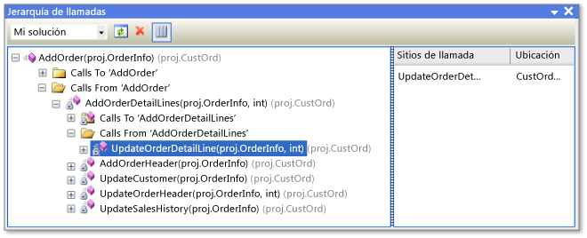

# Ver la estructura del código
Puede examinar los objetos y miembros de proyectos de Visual Studio y los objetos y miembros de componentes de .NET Framework, componentes de COM, bibliotecas de vínculos dinámicos (DLL) y bibliotecas de tipo (TLB).  
  
 En las siguientes secciones de este documento se describen las distintas ventanas de estructura de código.  
  
 [Vista de clases (Visual Basic, C#, C++)](#BKMK_ClassView)  
  
 [Jerarquía de llamadas (Visual Basic, C#, C++)](#BKMK_CallHierarchy)  
  
 [Examinador de objetos](#BKMK_ObjectBrowser)  
  
 [Ventana Definición de código (C#, C++)](#BKMK_CodeDefinition)  
  
 También puede usar el **Explorador de soluciones** para examinar los tipos y miembros de sus proyectos, buscar símbolos, ver la Jerarquía de llamadas de un método o buscar referencias de símbolos, entre otros, sin necesidad de cambiar entre las múltiples ventanas de herramientas enumeradas anteriormente.  
  
 Si tiene Visual Studio Enterprise puede utilizar mapas de código para visualizar la estructura del código y sus dependencias en toda la solución y explorar en profundidad hasta llegar a las partes del código que le interesen. Para obtener más información, vea [Asignar dependencias en sus soluciones](../modeling/map-dependencies-across-your-solutions.md).  
  
> [!NOTE]
>  La edición de Visual Studio y la configuración que use pueden afectar a las características en el IDE. Podrían ser diferentes de las descritas en este tema.  
  
##  Vista de clases (Visual Basic, C#, C++)  
 La **Vista de clases** se muestra como parte del **Explorador de soluciones**, así como en una ventana independiente. La ventana **Vista de clases** muestra los elementos de una aplicación. En el panel superior se muestran los espacios de nombres, los tipos, las interfaces, las enumeraciones y las clases, y en el panel inferior se muestran los miembros que pertenecen al tipo que se haya seleccionado en el panel superior. Al usar esta ventana, puede navegar hasta las definiciones de miembros en el código fuente (o en el **Examinador de objetos** si el elemento se define fuera de la solución).  
  
 No es necesario compilar un proyecto para ver sus elementos en la **Vista de clases**. A medida que se modifica el código en el proyecto, se actualiza la ventana.  
  
 Puede agregar código al proyecto, seleccionando el nodo del proyecto y el botón **Agregar** para que se abra el cuadro de diálogo **Agregar nuevo elemento**. El código se agrega en un archivo independiente.  
  
 Si el proyecto se protege en el control de código fuente, cada elemento **Vista de clases** muestra un icono que indica el estado del código fuente del archivo. Los comandos comunes de control de código fuente, como **Extraer del repositorio**, **Insertar en el repositorio** y **Obtener última versión** también están disponibles en el menú contextual del elemento.  
  
### Barra de herramientas de Vista de clases  
 La barra de herramientas de Vista de clases contiene los siguientes comandos.  
  
|||  
|-|-|  
|**Nueva carpeta**|Crea una carpeta virtual o una subcarpeta en la que puede organizar los elementos utilizados con frecuencia. Se guardan en el archivo de la solución activa (.suo). Después de cambiar el nombre o eliminar un elemento en el código, puede aparecer en una carpeta virtual como un nodo de error. Para corregir este problema, elimine el nodo de error. Si cambió el nombre de un elemento, puede volver a moverlo desde la jerarquía del proyecto hasta la carpeta.|  
|**Atrás**|Navegal al elemento seleccionado anteriormente.|  
|**Adelante**|Navega al siguiente elemento seleccionado.|  
|**Ver diagrama de clases** (solo para proyectos de código administrado)|Se vuelve disponible al seleccionar un espacio de nombres o al escribir en la **Vista de clases**. Cuando se selecciona un espacio de nombres, el diagrama de clases muestra todos los tipos que contiene. Cuando se selecciona un tipo, el diagrama de clases solo muestra ese tipo.|  
  
### Configuración de vista de clases  
 El botón **Configuración de vista de clases** de la barra de herramientas tiene los siguientes valores.  
  
|||  
|-|-|  
|**Mostrar tipos base**|Se muestran los tipos base.|  
|**Mostrar tipos derivados**|Se muestran los tipos derivados.|  
|**Mostrar tipos y miembros ocultos**|Se muestran en texto gris claro los tipos y miembros ocultos (los que no están diseñados para que los usen los clientes).|  
|**Mostrar miembros públicos**|Se muestran los miembros públicos.|  
|**Mostrar miembros protegidos**|Se muestran los miembros protegidos.|  
|**Mostrar miembros privados**|Se muestran los miembros privados.|  
|**Mostrar otros miembros**|Se muestran otros tipos de miembros, incluidos los miembros internos (o amigos en Visual Basic).|  
|**Mostrar miembros heredados**|Se muestran los miembros heredados.|  
|**Mostrar métodos de extensión**|Se muestran los métodos de extensión.|  
  
### Menú contextual de la Vista de clases  
 El menú contextual de la **Vista de clases** puede contener los siguientes comandos, en función del tipo de proyecto seleccionado.  
  
|||  
|-|-|  
|**Ir a definición**|Busca la definición del elemento en el código fuente o en el **Examinador de objetos** si el elemento no está definido en el proyecto abierto.|  
|**Examinar definición**|Muestra el elemento seleccionado en el **Examinador de objetos**.|  
|**Buscar todas las referencias**|Busca el elemento del objeto seleccionado actualmente y muestra los resultados en la ventana **Resultados de la búsqueda**.|  
|**Filtrar tipo** (solo para código administrado)|Solo muestra el tipo o espacio de nombres seleccionado. Para quitar el filtro, seleccione el botón **Borrar búsqueda**  (X) situado junto al cuadro **Buscar**.|  
|**Copiar**|Copia el nombre completo del elemento.|  
|**Ordenar alfabéticamente**|Enumera los tipos y miembros según su nombre por orden alfabético.|  
|**Ordenar por tipo de miembro**|Ordena los tipos y miembros por tipo (de tal modo que las clases preceden a las interfaces, las interfaces preceden a los delegados y los métodos preceden a las propiedades).|  
|**Ordenar por acceso a miembros**|Enumera los tipos y miembros por tipo de acceso, como público o privado.|  
|**Agrupar por tipo de miembro**|Ordena los tipos y miembros en grupos por tipo de objeto.|  
|**Ir a declaración** (solo para código C++)|Muestra la declaración del tipo o miembro en el código fuente si es que está disponible.|  
|**Ir a definición**|Muestra la definición del tipo o miembro en el código fuente si es que está disponible.|  
|**Ir a referencia**|Muestra una referencia al tipo o miembro en el código fuente si es que está disponible.|  
|**Ver jerarquía de llamadas**|Muestra el método seleccionado en la ventana **Jerarquía de llamadas**.|  
  
##  Jerarquía de llamadas (Visual Basic, C#, C++)  
 La ventana **Jerarquía de llamadas** muestra dónde se llama a un determinado método (o propiedad o constructor) y enumera los métodos que se llaman desde ese método. Puede ver varios niveles del gráfico de llamada, que muestra las relaciones llamador/destinatario entre los métodos en un ámbito especificado.  
  
 Para mostrar la ventana **Jerarquía de llamadas**, puede seleccionar un método (o propiedad o constructor) y, después, elegir **Ver jerarquía de clases** en el menú contextual. La visualización debería tener un aspecto similar al de la siguiente imagen.  
  
   
Ventana Jerarquía de llamadas  
  
 Mediante la lista desplegable de la barra de herramientas, puede especificar el ámbito de la jerarquía: la solución, el proyecto actual o el documento actual.  
  
 El panel principal muestra las llamadas realizadas al método y desde él, mientras que el panel **Sitios de llamada** muestra la ubicación de la llamada seleccionada. Para los miembros virtuales o abstractos, se muestra un nodo **Reemplaza nombre de método**. Para los miembros de interfaz, se muestra un nodo **Implementa nombre de método**.  
  
 La ventana **Jerarquía de llamadas** no encuentra referencias a grupos de métodos, que incluyen los lugares donde un método se agrega como controlador de eventos o se asigna a un delegado. Para buscar estas referencias, use el comando **Buscar todas las referencias**.  
  
 El menú contextual de la ventana **Jerarquía de llamadas** contiene los siguientes comandos.  
  
|||  
|-|-|  
|**Agregar como nueva raíz**|Agrega el nodo seleccionado como un nuevo nodo raíz.|  
|**Quitar raíz**|Quita el nodo raíz seleccionado del panel de vista de árbol.|  
|**Ir a definición**|Navega a la definición original de un método.|  
|**Buscar todas las referencias**|Busca en el proyecto todas las referencias al método seleccionado.|  
|**Copiar**|Copia el nodo seleccionado (pero no sus subnodos).|  
|**Actualizar**|Actualiza la información.|  
  
##   Examinador de objetos  
 El **Examinador de objetos** muestra descripciones del código en sus proyectos.  
  
 Puede filtrar lo que quiere ver en el **Examinador de objetos**. Mediante la lista desplegable situada en la parte superior de la ventana, puede elegir una de las siguientes opciones:  
  
-   Cualquier versión de .NET Framework  
  
-   Silverlight  
  
-   La solución activa  
  
-   Un conjunto de componentes personalizado  
  
 Los componentes personalizados pueden incluir archivos ejecutables de código administrado, ensamblados de biblioteca, bibliotecas de tipo y archivos .ocx. No es posible agregar componentes personalizados de C++. La configuración personalizada se guarda en el directorio de aplicaciones de usuario de Visual Studio, % APPDATA%\Roaming\Microsoft\VisualStudio\11.0\ObjBrowEX.dat.  
  
 El panel izquierdo del **Examinador de objetos** muestra contenedores físicos, como componentes COM y .NET Framework. Puede expandir los nodos de contenedores para mostrar los espacios de nombres que contengan y, a continuación, expandir los espacios de nombres para mostrar los tipos que contengan. Cuando se selecciona un tipo, sus miembros (como es el caso de las propiedades y los métodos) se enumeran en el panel derecho. El panel inferior derecho muestra información detallada acerca del elemento seleccionado.  
  
 Puede buscar un elemento específico mediante el cuadro **Buscar** situado en la parte superior de la ventana. Las búsquedas no distinguen entre mayúsculas y minúsculas. Los resultados de las búsquedas se muestran en el panel izquierdo. Para borrar una búsqueda, seleccione el botón **Borrar búsqueda** (X) situado junto al cuadro **Buscar**.  
  
 El **Examinador de objetos** realiza un seguimiento de las selecciones que haya realizado y puede navegar entre ellas usando los botones **Adelante** y **Atrás** de la barra de herramientas.  
  
 Puede usar el **Examinador de objetos** para agregar una referencia de ensamblado a una solución abierta seleccionando un elemento (ensamblado, espacio de nombres, tipo o miembro) y seleccionando el botón **Agregar referencia** de la barra de herramientas.  
  
### Configuración del Examinador de objetos  
 Puede especificar una de las siguientes vistas mediante el botón **Configuración del Examinador de objetos**.  
  
|||  
|-|-|  
|**Ver espacios de nombres**|Muestra los espacios de nombres en lugar de los contenedores físicos en el panel izquierdo. Los espacios de nombres almacenados en varios contenedores físicos se combinan.|  
|**Ver contenedores**|Muestra los contenedores físicos en lugar de los espacios de nombres en el panel izquierdo. Los ajustes **Ver espacios de nombres** y **Ver contenedores** son mutuamente excluyentes.|  
|**Mostrar tipos base**|Muestra los tipos base.|  
|**Mostrar tipos derivados**|Muestra los tipos derivados.|  
|**Mostrar tipos y miembros ocultos**|Muestra en texto gris claro los tipos y miembros ocultos (los que no están diseñados para que los usen los clientes).|  
|**Mostrar miembros públicos**|Muestra los miembros públicos.|  
|**Mostrar miembros protegidos**|Muestra los miembros protegidos.|  
|**Mostrar miembros privados**|Muestra los miembros privados.|  
|**Mostrar otros miembros**|Muestra otros tipos de miembros, incluyendo los miembros internos (o amigos en Visual Basic).|  
|**Mostrar miembros heredados**|Muestra los miembros heredados.|  
|**Mostrar métodos de extensión**|Muestra los métodos de extensión.|  
  
### Comandos del menú contextual del Examinador de objetos  
 El menú contextual del **Examinador de objetos** puede contener los siguientes comandos, en función del tipo de elemento seleccionado.  
  
|||  
|-|-|  
|**Examinar definición**|Muestra el nodo principal del elemento seleccionado.|  
|**Buscar todas las referencias**|Busca el elemento del objeto seleccionado actualmente y muestra los resultados en la ventana **Resultados de la búsqueda**.|  
|**Filtro a tipo**|Solo muestra el tipo o espacio de nombres seleccionado. Puede quitar el filtro seleccionando el botón **Borrar búsqueda**.|  
|**Copiar**|Copia el nombre completo del elemento.|  
|**Remove**|Si el ámbito es un conjunto de componentes personalizados, quita el componente seleccionado del ámbito.|  
|**Ordenar alfabéticamente**|Enumera los tipos y miembros según su nombre por orden alfabético.|  
|**Ordenar por tipo de objeto**|Ordena los tipos y miembros por tipo (de tal modo que las clases preceden a las interfaces, las interfaces preceden a los delegados y los métodos preceden a las propiedades).|  
|**Ordenar por acceso a objetos**|Enumera los tipos y miembros por tipo de acceso, como público o privado.|  
|**Agrupar por tipo de objeto**|Ordena los tipos y miembros en grupos por tipo de objeto.|  
|**Ir a declaración** (solo para proyectos de C++)|Muestra la declaración del tipo o miembro en el código fuente si es que está disponible.|  
|**Ir a definición**|Muestra la definición del tipo o miembro en el código fuente si es que está disponible.|  
|**Ir a referencia**|Muestra una referencia al tipo o miembro en el código fuente si es que está disponible.|  
|**Ver jerarquía de llamadas**|Muestra el método seleccionado en la ventana **Jerarquía de llamadas**.|  
  
##  Ventana Definición de código (C#, C++)  
 La ventana **Definición de código** muestra la definición de un tipo o miembro seleccionado del proyecto activo. El tipo o miembro se puede seleccionar en el editor de código o en una ventana de vista de código.  
  
 Aunque esta ventana es de solo lectura, puede establecer puntos de interrupción o marcadores en ella. Para modificar la definición mostrada, pulse **Editar definición** en el menú contextual. Esto abre el archivo de origen en el editor de código y mueve el punto de inserción a la línea en la que comienza la definición.  
  
### Menú contextual de Definición de código  
 El menú contextual de la ventana **Definición de código** puede contener los siguientes comandos, en función del lenguaje de programación.  
  
|||  
|-|-|  
|**Crear pruebas unitarias**|Crea pruebas unitarias para el elemento seleccionado.|  
|**Generar diagrama de secuencia**|Cuando se selecciona un método, genera un diagrama de secuencia.|  
|**Crear descriptor de acceso privado**|Si una prueba unitaria está presente en la solución, genera un método que utiliza la prueba para obtener acceso al código.|  
|**Ir a definición**|Busca la definición (o definiciones, en el caso de clases parciales) y las muestra en la ventana **Resultados de la búsqueda**.|  
|**Buscar todas las referencias**|Busca las referencias al tipo o miembro en la solución.|  
|**Ver jerarquía de llamadas**|Muestra el método en la ventana **Jerarquía de llamadas**.|  
|**Mostrar pruebas que llaman**|Si hay pruebas unitarias en el proyecto, muestra las pruebas que llaman al código seleccionado.|  
|**Ejecutar pruebas que llaman**|Si hay pruebas unitarias en el proyecto, las ejecuta para el código seleccionado.|  
|**Punto de interrupción**|Inserta un punto de interrupción (o un punto de seguimiento).|  
|**Ejecutar hasta el cursor**|Ejecuta el programa en modo de depuración hasta la ubicación del cursor.|  
|**Copiar**|Copia la línea seleccionada.|  
|**Esquematización**|Comandos de esquematización habituales.|  
|**Editar definición**|Desplaza el punto de inserción hasta la definición en la ventana de código.|  
|**Elegir codificación**|Abre la ventana **Codificación** para que pueda establecer una codificación para el archivo.|  
  
### Ventana Esquema del documento  
 Puede usar la ventana **Esquema del documento** junto con las vistas del diseñador, como el diseñador de una página XAML o un diseñador de Windows Forms, o con páginas HTML. En esta ventana se muestran los elementos en una vista de árbol para que pueda ver la estructura lógica del formulario o la página y buscar los controles que están profundamente incrustados u ocultos.  
  
## Vea también  
 [Iconos de la Vista de clases y del Examinador de objetos](../ide/class-view-and-object-browser-icons.md)
