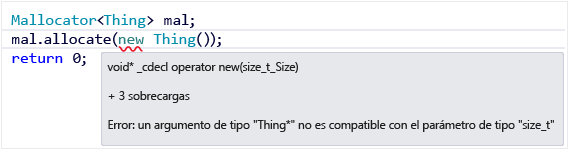
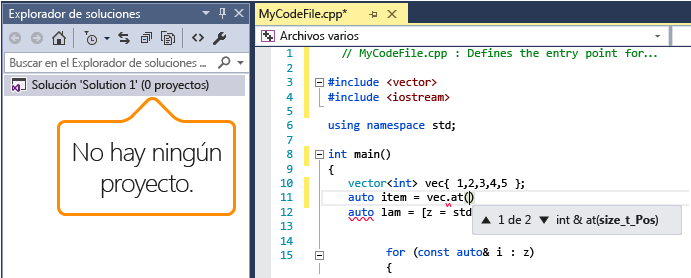

# IntelliSense para Visual C++
En Visual Studio de 2015, IntelliSense está disponible para archivos de código individuales y para archivos de proyectos. En los proyectos multiplataforma, algunas características de IntelliSense están disponibles en archivos .cpp y .c en el proyecto de código compartido incluso cuando se encuentre en un contexto de Android o iOS.  
  
## Características de Intellisense en C++  
 IntelliSense es el nombre que se le da a un conjunto de características que hacen que codificar sea más práctico. Dado que cada persona puede tener una idea diferente de lo que es práctico, prácticamente todas las características de IntelliSense pueden habilitarse o deshabilitarse en la página de propiedades **Editor de texto, C/C++, Avanzado**.  
  
   
  
 Puede utilizar los elementos de menú y métodos abreviados de teclado que se muestran en la siguiente imagen para acceder a IntelliSense.  
  
   
  
### Lista de finalización de instrucciones y de miembros  
 Cuando empiece a escribir una palabra clave, un tipo, una función, el nombre de una variable u otro elemento de programa que el compilador reconozca, el editor le ofrecerá la opción de completar la palabra por usted.  
  
 Para ver una lista de los iconos y sus significados, vea [Iconos de la Vista de clases y del Examinador de objetos](../ide/class-view-and-object-browser-icons.md).  
  
   
  
 La primera vez que se invoca la lista de miembros solo muestra los miembros a los que se puede acceder en el contexto actual. Si después de esa primera vez usa **Ctrl+J**, muestra todos los miembros, independientemente de su accesibilidad. Si se invoca una tercera vez, se muestra una lista de elementos de programa aún más amplia. Puede desactivar la finalización de instrucciones en la página **Opciones generales de C/C++**.  
  
   
  
### Ayuda de parámetro  
 Cuando se escribe una llave de apertura de una llamada de función o un corchete angular en una declaración de variable de plantilla de clase, el editor muestra una pequeña ventana con los tipos de parámetros para cada sobrecarga de la función o el constructor. El parámetro "actual", basado en la ubicación del cursor, está en negrita. Puede desactivar la finalización de instrucciones en la página **Opciones generales de C/C++**.  
  
   
  
### Información rápida  
 Cuando coloca el cursor del mouse sobre una variable, se muestra una pequeña ventana en línea que muestra la información de tipo y el encabezado en el que se define el tipo. Para ver la firma de la función, coloque el puntero sobre una llamada a función. Puede desactivar Información rápida en la página **Editor de texto, C/C++, Avanzado**.  
  
   
  
## Subrayados ondulados de error  
 Los subrayados ondulados bajo un elemento de programa (variable, palabra clave, llave, nombre de tipo, etc.), intentan indicarle la existencia de un error o un posible error en el código. Un subrayado ondulado aparece cuando escribe una declaración adelantada, para recordarle que aún le queda por escribir la implementación. Un subrayado ondulado de color púrpura se muestra en un proyecto compartido para indicar que hay un error en código que no está activo actualmente, como sucede, por ejemplo, cuando está trabajando en el contexto de Windows pero introduce algo que sería un error en un contexto de Android. Un subrayado ondulado de color rojo indica una advertencia o un error del compilador en el código activo que tiene que resolver.  
  
   
  
## Coloración y fuentes de código  
 Los colores y las fuentes predeterminados se pueden cambiar mediante la página de propiedades **Entorno, fuentes y colores**. Puede cambiar las fuentes de muchas ventanas de interfaz de usuario, no solo las del editor. Los ajustes específicos de C++ comienzan con "C++"; el resto de ajustes es para todos los lenguajes.  
  
## IntelliSense multiplataforma  
 En un proyecto de código compartido, algunas características de IntelliSense, como los subrayados ondulados, están disponibles incluso cuando se está trabajando en un contexto de Android. Si escribe código que produciría un error en un proyecto inactivo, IntelliSense mostrará subrayados ondulados de todos modos, pero en un color distinto al de los subrayados ondulados de errores del contexto actual.  
  
 Esta es una aplicación de OpenGLES que está configurada para compilarse para Android e iOS. La ilustración muestra el código compartido que se está editando. En la primera imagen, Android es el proyecto activo:  
  
   
  
 Tenga en cuenta lo siguiente:  
  
-   La rama #else de la línea 8 aparece en gris para indicar que se trata de una región inactiva, porque se ha definido __ANDROID\_\_ para un proyecto de Android.  
  
-   La variable de saludo de la línea 11 se inicializa con el identificador HELLO, que tiene un subrayado ondulado de color púrpura. Esto se debe a que no se ha definido ningún identificador HELLO en el proyecto de iOS actualmente inactivo. Aunque la línea 11 se compilará en un proyecto Android, no lo hará en iOS. Puesto que se trata de código compartido, es algo que debe cambiar aunque se compile en la configuración activa actualmente.  
  
-   La línea 12 tiene un subrayado ondulado de color rojo en el identificador BYE; este identificador no está definido en el proyecto activo seleccionado actualmente.  
  
 Ahora cambie el proyecto activo a iOS.StaticLibrary y observe cómo cambia el subrayado ondulado.  
  
   
  
 Tenga en cuenta lo siguiente:  
  
-   La rama #ifdef de la línea 6 aparece en gris para indicar que se trata de una región inactiva, porque no se ha definido __ANDROID\_\_ para un proyecto de iOS.  
  
-   La variable de saludo de la línea 11 se inicializa con el identificador HELLO, que ahora tiene un subrayado ondulado de color rojo. Esto se debe a que no se ha definido ningún identificador HELLO en el proyecto de iOS actualmente activo.  
  
-   La línea 12 tiene un subrayado ondulado de color púrpura en el identificador BYE; este identificador no está definido en el proyecto Android.NativeActivity actualmente inactivo.  
  
## Intellisense de archivo único  
 Al abrir un único archivo fuera de cualquier proyecto, se sigue obteniendo IntelliSense. Puede habilitar o deshabilitar características específicas yendo a **Editor de texto, C/C++, Avanzado** para activar o desactivar las características de IntelliSense. Para configurar IntelliSense para archivos individuales que no forman parte de un proyecto, busque el tema que habla sobre **IntelliSense y explorar archivos que no son del proyecto** en la sección **Avanzada**. Vea el [Paseo guiado de Visual C++](http://msdn.microsoft.com/en-us/499cb66f-7df1-45d6-8b6b-33d94fd1f17c).  
  
   
  
 De forma predeterminada, IntelliSense de archivo único solo utiliza directorios de inclusión estándar para buscar archivos de encabezado. Para agregar directorios adicionales, abra el menú contextual del nodo Solución y agregue el directorio a la lista **Depurar código fuente**, tal como se muestra en la siguiente ilustración:  
  
   
  
## Vea también  
 [Usar IntelliSense](../ide/using-intellisense.md)
