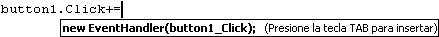
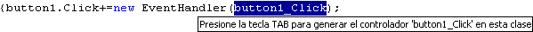

# IntelliSense para C#

IntelliSense para C# está disponible al programar en el editor y mientras se depura en la ventana de comandos [Modo Inmediato](../ide/reference/immediate-window.md).

## Listas de finalización

Las listas de finalización de IntelliSense en C# contienen, entre otros, los tokens de la lista de miembros y palabra completa. Proporciona acceso rápido a:

- miembros de un tipo o espacio de nombres;

- variables, comandos y nombres de funciones;

- Fragmentos de código

- Palabras clave del lenguaje

- Métodos de extensión

La lista de finalización en C# también es lo suficientemente inteligente como para filtrar los tokens irrelevantes y hacer una selección previa de un token en función del contexto. Para obtener más información, vea [Listas de finalización filtradas](#filtered-completion-lists).

### Fragmentos de código en listas de finalización

En C#, la lista de finalización incluye fragmentos de código para facilitar la inserción en el programa de cuerpos de código predefinidos. Los fragmentos de código aparecen en la lista de finalización como el [texto de acceso directo](../ide/code-snippets-schema-reference.md#shortcut-element) del fragmento de código. Para obtener más información sobre los fragmentos de código que están disponibles en C# de forma predeterminada, consulte [Fragmentos de código de C#](../ide/visual-csharp-code-snippets.md).

### Palabras clave de lenguaje en listas de finalización

En C#, la lista de finalización también incluye palabras clave del lenguaje. Para obtener más información sobre las palabras claves del lenguaje C#, vea el artículo sobre [palabras clave de C#](/dotnet/csharp/language-reference/keywords/index).

### Métodos de extensión en listas de finalización

En C#, la lista de finalización incluye métodos de extensión que están en el ámbito.

> [!NOTE]
> La lista de finalización no muestra todos los métodos de extensión para objetos <xref:System.String>.

Los métodos de extensión usan un icono diferente del que usan los métodos de instancia. Para obtener una guía de referencia de la lista de los iconos, vea el artículo sobre [iconos de la vista de clases y del examinador de objetos](../ide/class-view-and-object-browser-icons.md). Cuando un método de instancia y un método de extensión que tienen el mismo nombre se encuentran ambos en el ámbito, la lista de finalización muestra el icono de método de extensión.

### Listas de finalización filtradas

IntelliSense usa filtros para quitar los miembros innecesarios de la lista de finalización. C# filtra las listas de finalización que aparecen para estos elementos:

- **Interfaces y clases base**: IntelliSense quita automáticamente los elementos de las listas de finalización de clase base e interfaz, tanto en las listas de interfaz y base de declaración de clases como en las listas de restricciones. Por ejemplo, las enumeraciones no aparecen en la lista de finalización de las clases base porque las enumeraciones no se pueden usar para clases base. La lista de finalización de clases base solo contiene interfaces y espacios de nombres. Si selecciona un elemento en la lista y luego escribe una coma, IntelliSense quita las clases base de la lista de finalización porque C# no admite herencia múltiple. El mismo comportamiento se produce con las cláusulas de restricción.

- **Atributos**: Cuando se aplica un atributo a un tipo, la lista de finalización se filtra para incluir únicamente los tipos que descienden de los espacios de nombres que contienen esos tipos, como <xref:System.Attribute>.

- **Cláusulas catch**

- **Inicializadores de objeto**: Solo los miembros que se pueden inicializar aparecerán en la lista de finalización.

- **Palabra clave new**: Si se escribe `new` y luego se presiona la **barra espaciadora**, aparece una lista de finalización. Automáticamente se selecciona un elemento de la lista, que variará según el contexto del código. Por ejemplo, se seleccionan automáticamente elementos en la lista de finalización para las declaraciones y las instrucciones return de métodos.

- **Palabra clave enum**: Si se presiona la **barra espaciadora** después de un signo igual para una asignación de enumeración, aparece una lista de finalización. Automáticamente se selecciona un elemento de la lista, que variará según el contexto del código. Por ejemplo, se seleccionan automáticamente elementos en la lista de finalización después de escribir la palabra clave Return y al realizar una declaración.

- **Operadores as e is**: Cuando se presiona la **barra espaciadora** después de haber escrito la palabra clave `as` o `is`, aparece automáticamente una lista de finalización filtrada.

- **Eventos**: al escribir la palabra clave `event`, la lista de finalización solo contiene tipos delegados.

- La **ayuda de parámetros** se ordena automáticamente por la primera sobrecarga de método que coincida con los parámetros que se especifican. Si existen varias sobrecargas de método, puede usar las flechas arriba y abajo para desplazarse a la siguiente sobrecarga posible de la lista.

### Miembros usados más recientemente

IntelliSense recuerda los miembros que se han seleccionado recientemente en el cuadro emergente [Lista de miembros](../ide/using-intellisense.md) para autocompletar nombres de objetos. La siguiente vez que utilice la **lista de miembros**, los miembros utilizados más recientemente se mostrarán en la parte superior. El historial de los miembros usados recientemente se borra entre cada sesión de Visual Studio.

### override

Cuando escriba [invalidar](/dotnet/csharp/language-reference/keywords/override) y, luego, presione la **barra espaciadora**, IntelliSense muestra todos los miembros de la clase base válidos que se pueden reemplazar en un cuadro de lista emergente. Si se escribe el tipo de valor devuelto del método después de `override`, IntelliSense muestra solo los métodos que devuelven el mismo tipo. Cuando IntelliSense no encuentra ninguna coincidencia, muestra todos los miembros de clase base.

### IntelliSense mejorado para inteligencia artificial

[Visual Studio IntelliCode](/visualstudio/intellicode/intellicode-visual-studio) proporciona listas de finalización de código de IntelliSense mejoradas para inteligencia artificial. IntelliCode predice la API probablemente más correcta para usar, en lugar de simplemente presentar una lista alfabética de miembros. Usa el contexto de código actual y patrones para proporcionar esta lista dinámica.

## Generación automática de código

### Agregar using

La operación **Agregar using** de IntelliSense agrega automáticamente la directiva `using` necesaria al archivo de código. Esta característica le permite mantener el foco en el código que escribe en lugar de tener que cambiar el foco a otra parte del código.

Para iniciar la operación **Agregar using**, coloque el cursor en una referencia de tipo que no se pueda resolver. Por ejemplo, al crear una aplicación de consola y después agregar `XmlReader` en el cuerpo del método `Main`, aparece un subrayado ondulado de color rojo en esa línea de código porque no se puede resolver la referencia de tipo. Puede invocar **Agregar using** a través de **Acciones rápidas**. **Acciones rápidas** solo está visible cuando el cursor se coloca en el tipo sin enlazar.

Haga clic en el icono de la bombilla de error y después elija **using System.Xml;** para agregar la directiva "using" de forma automática.

### Eliminar y ordenar instrucciones Using

La opción **Eliminar y ordenar instrucciones Using** ordena y quita instrucciones `using` y `extern` sin cambiar el comportamiento del código fuente. Con el tiempo, los archivos de origen se inflan y resultan difíciles de leer debido a la presencia de directivas `using` innecesarias y desorganizadas. La opción **Eliminar y ordenar instrucciones Using** compacta el código fuente eliminando las instrucciones `using` que no se usan; además, las ordena, lo que hace que sean más fáciles de leer. En el menú **Edición**, elija **IntelliSense** y, después, **Organizar instrucciones Using**.

### Implementación de interfaz

IntelliSense proporciona una opción para ayudar a implementar una [interfaz](/dotnet/csharp/language-reference/keywords/interface) mientras trabaja en el editor de código. Normalmente, para implementar una interfaz correctamente, debe crear una declaración de método para cada miembro de la interfaz de su clase. Con IntelliSense, después de escribir el nombre de una interfaz en una declaración de clase, se muestra una bombilla de **Acciones rápidas**. La bombilla ofrece la opción de implementar la interfaz automáticamente, mediante denominación explícita o implícita. Con la denominación explícita, las declaraciones de método llevan el nombre de la interfaz. Con la denominación implícita, las declaraciones de método no indican la interfaz a la que pertenecen. Puede tener acceso a un método de interfaz denominada explícitamente a través de una instancia de interfaz, pero no a través de una instancia de clase. Para obtener más información, vea [Implementación explícita de interfaz](/dotnet/csharp/programming-guide/interfaces/explicit-interface-implementation).

La opción Implementar interfaz genera el número mínimo de códigos auxiliares del método necesario para satisfacer la interfaz. Si una clase base implementa partes de la interfaz, esos códigos auxiliares no se vuelven a generar.

### Implementar una clase base abstracta

IntelliSense proporciona una opción útil para implementar miembros de una clase base abstracta de forma automática mientras se trabaja en el editor de código. Normalmente, la implementación de miembros de una clase base abstracta requiere la creación de una nueva definición de método para cada método de la clase base abstracta en la clase derivada. Con IntelliSense, después de escribir el nombre de una clase base abstracta en una declaración de clase, se muestra una bombilla de **Acciones rápidas**. La bombilla ofrece la opción de implementar los métodos de la clase base automáticamente.

El código auxiliar del método generado por la característica **Implementar clases base abstractas** está modelado por el fragmento de código definido en el archivo *MethodStub.snippet*. Los fragmentos de código son modificables. Para obtener más información, vea [Tutorial: Creación de un fragmento de código](../ide/walkthrough-creating-a-code-snippet.md).

### Generar a partir del uso

La característica **Generar a partir del uso** le permite usar clases y miembros antes de definirlos. Puede generar un código auxiliar para cualquier clase, constructor, método, propiedad, campo o enumeración que desee usar pero aún no haya definido. Puede generar nuevos tipos y miembros sin abandonar su ubicación actual en el código. Esto minimiza la interrupción del flujo de trabajo.

Aparece un subrayado ondulado de color rojo debajo de cada identificador no definido. Cuando se sitúa el puntero del mouse sobre el identificador, aparece un mensaje de error en una ventana de información rápida. Para mostrar las opciones adecuadas, puede usar uno de los procedimientos siguientes:

- Haga clic en el identificador no definido. Aparece una bombilla de error **Acciones rápidas** debajo del identificador. Haga clic en la bombilla de error.

- Haga clic en el identificador no definido y, después, presione **CTRL**+ **.** (**CTRL** + punto).

- Haga clic con el botón derecho en el identificador no definido y, después, haga clic en **Acciones rápidas y refactorizaciones**.

Las opciones que aparecen pueden incluir lo siguiente:

- **Generar propiedad**

- **Generar campo**

- **Generar método**

- **Generar clase**

- **Generar nuevo tipo** (para una clase, estructura, interfaz o enumeración)

## Generar controladores de eventos

En el editor de código, IntelliSense puede ayudarle a enlazar métodos (controladores de eventos) a campos de evento.

Si escribe el operador `+=` después de un campo de evento en un archivo *.cs*, IntelliSense le indicará que presione la tecla **TAB**. Al hacerlo, se inserta una nueva instancia de un delegado que apunta al método que controlará el evento.

Si presiona **TAB**, IntelliSense completa la instrucción automáticamente y muestra la referencia del controlador de eventos como texto seleccionado en el editor de código. Para completar el enlace de eventos automático, IntelliSense le indicará que presione la tecla **TAB** para crear un código auxiliar vacío del controlador de eventos.

> [!NOTE]
> Si un nuevo delegado creado por IntelliSense hace referencia a un controlador de eventos existente, IntelliSense comunica esta información en la información rápida. A continuación, puede modificar la referencia. El texto estará ya seleccionado en el editor de código. De lo contrario, el enlace de eventos automático se habrá completado en este momento.

Si presiona **TAB**, IntelliSense crea el código auxiliar de un método con la firma correcta y coloca el cursor en el cuerpo del controlador de eventos.

> [!NOTE]
> Use el comando **Navegar hacia atrás** del menú **Vista** (**CTRL**+ **-** ) para volver a la instrucción de enlace de eventos.

## Vea también

- [Uso de IntelliSense](../ide/using-intellisense.md)
- [IDE de Visual Studio](../get-started/visual-studio-ide.md)
