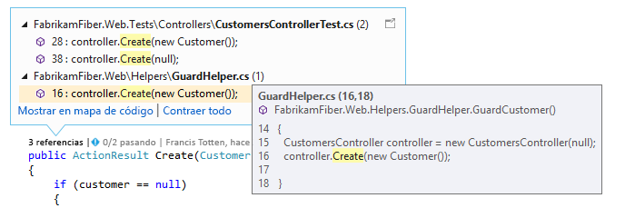
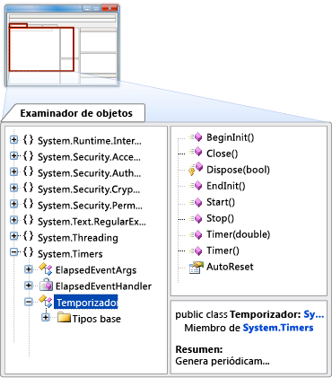

# Paseo por las características del IDE de Visual Studio
Este tema le presenta las características del IDE de Visual Studio. El IDE de Visual Studio es un entorno de desarrollo integrado (IDE); un panel de inicio creativo que puede usar para ver y editar prácticamente cualquier tipo de código y, a continuación, depurar, generar y publicar aplicaciones para Android, iOS, Windows, la Web y la nube. Hay versiones disponibles para Mac y Windows. Analizaremos algunas de las operaciones que se pueden realizar con Visual Studio y veremos cómo instalarlo y utilizarlo, recorreremos la creación de un proyecto simple, obtendremos punteros en código de depuración e implementación y daremos un paseo por las distintas ventanas de herramientas.

## ¿Qué puede hacer con el IDE de Visual Studio?
¿Desea crear una aplicación para un teléfono Android? Puede hacerlo. ¿Y qué le parecería crear un juego vanguardista mediante C++? Puede hacerlo también, entre otras muchas cosas más. Visual Studio proporciona plantillas que le ayudan a crear sitios web, juegos, aplicaciones de escritorio, aplicaciones móviles, aplicaciones para Office y mucho más.

También puede simplemente abrir casi cualquier código que reciba desde prácticamente cualquier lugar y ponerlo en funcionamiento. ¿Ha visto un proyecto en GitHub que le gusta? Pues basta con clonar el repositorio, abrirlo en Visual Studio y empezar a codificar.

### Creación de aplicaciones móviles
Puede crear aplicaciones móviles nativas para diferentes plataformas utilizando Visual C# y Xamarin, o Visual C++, o aplicaciones híbridas que usan JavaScript con Apache Cordova. Puede escribir juegos móviles para Unity, Unreal, DirectX, Cocos y mucho más. Visual Studio incluye un emulador de Android que le ayudará a ejecutar y depurar aplicaciones de Android.

Puede aprovechar la eficacia de la nube para las aplicaciones móviles mediante la creación de servicios de aplicaciones de Azure. Los servicios de aplicaciones de Azure permiten que las aplicaciones almacenen datos en la nube, autentiquen de manera segura a los usuarios y escalen sus recursos hacia arriba o hacia abajo para satisfacer las necesidades de su negocio y de la aplicación. Para obtener más información, consulte [Desarrollo de aplicaciones móviles](https://www.visualstudio.com/vs/mobile-app-development/).

### Creación de aplicaciones en la nube para Azure
Visual Studio ofrece un conjunto de herramientas que le permiten crear con facilidad aplicaciones habilitadas para la nube con tecnología de Microsoft Azure. Puede configurar, compilar, depurar, empaquetar e implementar aplicaciones y servicios en Microsoft Azure directamente desde el IDE. Aproveche los servicios de Azure para sus aplicaciones con Servicios conectados. Para obtener Azure Tools para. NET, seleccione la carga de trabajo **Desarrollo de Azure** al instalar Visual Studio. Para obtener más información, vea [Visual Studio Tools for Azure](https://www.visualstudio.com/vs/azure-tools/).

### Creación de aplicaciones para la Web
Nuestro mundo actual se basa en la Web, y Visual Studio puede ayudarle a escribir aplicaciones en este medio. Puede crear aplicaciones web mediante ASP.NET, Node.js, Python, JavaScript y TypeScript. Visual Studio comprende marcos web como Angular, jQuery, Express y más. ASP.NET Core y .NET Core funcionan en los sistemas operativos Windows, Mac y Linux. Para obtener más información, vea [Herramientas web modernas](https://www.visualstudio.com/vs/modern-web-tooling/).

### Escritura de código en un entorno de edición de primera clase mundial
Visual Studio le ayuda a escribir código de forma rápida y sencilla mediante características como la coloración de sintaxis, la finalización de instrucciones, IntelliSense (descripciones emergentes del elemento de código seleccionado), la esquematización de código, el establecimiento de puntos de interrupción para depuración y mucho más.

Para obtener más información, consulte [Escribir código en el editor de código y texto](https://docs.microsoft.com/visualstudio/ide/writing-code-in-the-code-and-text-editor).

Visual Studio puede ayudarle a hacer muchas más cosas. Para obtener una lista más completa, vea [IDE de Visual Studio](https://www.visualstudio.com/vs/).

## Instalación del IDE de Visual Studio
Para comenzar, descargue Visual Studio e instálelo en su sistema. Puede descargarlo en [Visual Studio 2017](https://www.visualstudio.com/vs/visual-studio-2017/).

Visual Studio ahora es más ligero que nunca. El nuevo instalador modular le permite elegir e instalar *cargas de trabajo*, que son grupos de características necesarias para el lenguaje de programación o la plataforma que prefiera. Esta estrategia ayuda a mantener la superficie de la instalación de Visual Studio más pequeña que nunca, lo que se traduce también en una mayor rapidez a la hora de instalar y actualizar.

Además del mejor rendimiento para la instalación, se han hecho muchas mejoras en Visual Studio 2017 para mejorar el tiempo global para el inicio del IDE y la carga de soluciones. Por ejemplo, la selección de la nueva característica Carga de solución ligera, ubicada en el menú principal bajo **Herramientas**, **Opciones**, **Proyectos y soluciones**, permite la carga más rápida de soluciones más grandes. Para obtener más información acerca de la configuración de Visual Studio en su sistema, consulte [Instalación de Visual Studio 2017](https://docs.microsoft.com/visualstudio/install/install-visual-studio).

## Inicio de sesión
Cuando se inicia Visual Studio por primera vez, puede iniciar sesión opcionalmente con su cuenta Microsoft o con su cuenta profesional o educativa. Al iniciar sesión puede sincronizar la configuración de Visual Studio, como los diseños de ventana, en varios dispositivos. También le conecta automáticamente a los servicios que podría necesitar, como las suscripciones de Azure y Visual Studio Team Services.

## Creación de un programa

¡Una buena manera de aprender algo es usarlo! Vamos a profundizar y crear un nuevo y sencillo programa.

1. Abra Visual Studio. En el menú, elija **Archivo**, **Nuevo**, **Proyecto**. (Use los valores de proyecto predeterminados).

  

  Como alternativa, puede crear un proyecto mediante la página de inicio. Para más información, vea la entrada de blog [Harness the Power of the Redesigned Start Page](https://blogs.msdn.microsoft.com/visualstudio/2016/11/29/harness-the-power-of-the-redesigned-start-page/) (Aprovechar la eficacia de la página de inicio rediseñada).

1. El cuadro de diálogo **Nuevo proyecto** muestra varias plantillas de proyecto. Elija la categoría **Windows Universal** en **Visual C#**, seleccione la plantilla **Aplicación vacía (Windows universal)** y, a continuación, elija el botón **Aceptar**.

  

  Con este proceso se crea un nuevo proyecto de aplicación universal de Windows en blanco que utiliza Visual C# y XAML como lenguajes de programación. Espere un poco mientras Visual Studio configura el proyecto. Si se le pide alguna información, simplemente acepte los valores predeterminados por ahora.

1. En breve, debería ver algo parecido a la captura de pantalla siguiente. Los archivos del proyecto se muestran en el lado derecho de una ventana llamada Explorador de soluciones.

  

1. En el Explorador de soluciones, elija el pequeño triángulo negro situado junto al archivo MainPage.xaml para expandirlo; así, debería ver un archivo MainPage.xaml.cs debajo. Elija este archivo (que contiene el código de C#) para abrirlo.

  El código de C# en MainPage.xaml.cs aparece en el editor de código en el lado izquierdo de la pantalla. Observe que la sintaxis del código se colorea automáticamente para indicar diferentes tipos de código, como instrucciones o comentarios. Además, líneas pequeñas, verticales y discontinuas en el código indican qué llaves coinciden, y los números de línea sirven para ubicar código más adelante. Puede elegir el pequeño signo de menos en la casilla para contraer o expandir código. Esta característica de esquematización de código le permite ocultar el código que no necesita, ayudando a minimizar el desorden en la pantalla.

  

  Hay otros menús y ventanas de herramientas disponibles, pero por ahora vamos a continuar.

1. Agregue un botón al formulario XAML para proporcionar a los usuarios una manera de interactuar con la aplicación. Para ello, abra el archivo MainPage.xaml. De este modo se muestra una vista en dos paneles: un diseñador arriba, para colocar visualmente los controles, y una vista de código debajo, que muestra el código XAML subyacente al diseñador. Al ejecutar el programa más adelante, lo que ve en el diseñador se convierte en una ventana que verán los usuarios, un "formulario", y el código XAML subyacente determina lo que aparece en el formulario.

1. En el lado izquierdo de la pantalla, elija la pestaña **Herramientas** para abrir el cuadro de herramientas. El cuadro de herramientas contiene un número de controles visuales que puede agregar a los formularios. Por ahora, solo vamos a agregar un control de botón.

1. Expanda la sección **Controles de XAML comunes** y, a continuación, arrastre el control de botón hacia el centro del formulario. (No importa la ubicación exacta).

  

  Cuando haya terminado, debería ver algo parecido a lo siguiente.

  

  El botón aparece en el diseñador y su código subyacente (resaltado) se agrega automáticamente al código XAML del diseñador.

1. Vamos a cambiar parte del código XAML. Cambie el nombre de texto en el código del botón de `Button` a `Hello!`.

  

1. Ahora, inicie la aplicación. Para ello, tiene varias posibilidades: haga clic en **Inicio** () en la barra de herramientas, elija la tecla F5 o, en el menú, seleccione **Depurar**, **Iniciar depuración**.

  

  La aplicación inicia su proceso de compilación y aparecen mensajes de estado en la ventana de resultados. Pronto, verá que aparece el formulario con su botón en él. ¡Ya tiene una aplicación en ejecución!

  

  Por supuesto, ahora no hace mucho, pero puede agregarle más funcionalidad más adelante si lo desea.

1. Cuando haya terminado de ejecutar el programa, haga clic en el botón Detener () de la barra de herramientas para detenerlo.

Resumamos lo que hemos hecho hasta ahora: ha creado un nuevo proyecto de Windows Universal de C# en Visual Studio, ha visto su código, ha agregado un control al diseñador, ha cambiado parte del código XAML y, a continuación, ha ejecutado el proyecto. Aunque se ha simplificado el proceso para este ejemplo, aquí se muestran algunas partes habituales del IDE de Visual Studio que va a utilizar al desarrollar sus propias aplicaciones. Si desea más detalles acerca de este ejemplo, vea [Crear una aplicación "Hello, world" (XAML)](https://docs.microsoft.com/windows/uwp/get-started/create-a-hello-world-app-xaml-universal).

## Depure, pruebe y mejore su código
Nada se ejecuta a la perfección todo el tiempo. Cuando se escribe código, debe ejecutarlo y probarlo para comprobar su rendimiento y ver si tiene errores. El sistema de depuración con última tecnología de Visual Studio le permite depurar el código que se ejecuta en su proyecto local, en un dispositivo remoto o en un emulador, como los de los dispositivos Android o Windows Phone. Puede ejecutar el código instrucción por instrucción e inspeccionar las variables en cada paso, puede ejecutar paso a paso aplicaciones multiproceso y puede establecer puntos de interrupción que solo se producen cuando se cumple una condición especificada. Puede supervisar los valores de las variables a medida que se ejecuta el código, entre otras cosas. Todo esto se puede administrar en el propio editor de código para que no tenga que salir del código.

Para las pruebas, Visual Studio ofrece pruebas unitarias, IntelliTest, carga y pruebas de rendimiento, entre otras cosas. Para obtener más detalles sobre el proceso de depuración de Visual Studio, consulte [Debugger Feature Tour](https://review.docs.microsoft.com/visualstudio/debugger/debugger-feature-tour?branch=mikejo-tour) (Guía de características del depurador). Para obtener más información acerca de las pruebas, consulte [Herramientas de pruebas](https://www.visualstudio.com/vs/testing-tools/). Para obtener más información acerca de cómo mejorar el rendimiento de las aplicaciones, consulte [Herramientas de generación de perfiles](https://docs.microsoft.com/visualstudio/profiling/profiling-tools).

## Implementar la aplicación finalizada  
Cuando la aplicación está lista para implementarse en los usuarios o los clientes, Visual Studio proporciona las herramientas para hacerlo, ya sea para implementar en la Tienda Windows, en un sitio de SharePoint o usando las tecnologías InstallShield o Windows Installer. Todo está disponible a través del IDE. Para obtener más información, vea [Implementar aplicaciones, servicios y componentes](../deployment/deploying-applications-services-and-components.md).

## Paseo rápido del IDE
Para ofrecerle una amplia información gráfica de Visual Studio, la siguiente imagen muestra Visual Studio con un proyecto abierto junto con varias ventanas de herramientas clave que probablemente utilizará.
 - El [Explorador de soluciones](../ide/solutions-and-projects-in-visual-studio.md) le permite ver y navegar por sus archivos de código, así como administrarlos.
 - La ventana [Editor](../ide/writing-code-in-the-code-and-text-editor.md) muestra el código y le permite editar código fuente y datos de diseñador.
 - En la ventana [Salida](../ide/reference/output-window.md) se muestran mensajes de resultados de la compilación, ejecución, depuración, etc.
 - [Team Explorer](https://www.visualstudio.com/docs/connect/work-team-explorer) le permite realizar el seguimiento de elementos de trabajo y compartir código con otros usuarios mediante tecnologías de control de versiones como [Git](https://git-scm.com/) y [Control de versiones de Team Foundation (TFVC)](https://www.visualstudio.com/docs/tfvc/overview).
 - [Cloud Explorer](https://azure.microsoft.com/documentation/articles/vs-azure-tools-resources-managing-with-cloud-explorer/) le permite ver y administrar los recursos de Azure, como máquinas virtuales, tablas, bases de datos SQL, etc.

  

A continuación se muestran algunas otras características de productividad comunes en Visual Studio.  

- El cuadro de búsqueda [Inicio rápido](https://docs.microsoft.com/en-us/visualstudio/ide/reference/quick-launch-environment-options-dialog-box) supone una excelente manera de encontrar rápidamente lo que necesita en Visual Studio. Simplemente empiece a escribir el nombre de lo que esté buscando y Visual Studio le ofrece opciones que le llevan exactamente a donde desea ir. El inicio rápido muestra también vínculos que inician el instalador de Visual Studio para cualquier componente individual o carga de trabajo.

  

-  [Refactorización](../ide/refactoring-in-visual-studio.md) incluye operaciones tales como el cambio inteligente de nombre de las variables, mover líneas seleccionadas de código a una función diferente, mover código a otras ubicaciones, reordenar los parámetros de una función y mucho más.

   

-  **IntelliSense** es un término que agrupa un conjunto de características muy populares que muestran información de escritura sobre el código directamente en el editor y, en algunos casos, escriben pequeños fragmentos de código automáticamente. Básicamente, IntelliSense es como tener documentación básica insertada en el editor, lo que evita tener que buscar información de escritura en una ventana de ayuda independiente. Las características de IntelliSense varían según el lenguaje. Para obtener más información, vea [Visual C# IntelliSense](../ide/visual-csharp-intellisense.md), [Visual C++ Intellisense](../ide/visual-cpp-intellisense.md), [JavaScript IntelliSense](../ide/javascript-intellisense.md), [Opciones de IntelliSense específicas de Visual Basic](../ide/visual-basic-specific-intellisense.md). La ilustración siguiente muestra algunas características de IntelliSense en funcionamiento:  

    

-  Los **subrayados ondulados** son rayas rojas con formas de onda debajo de las palabras que le alertan de errores o posibles problemas en el código en tiempo real a medida que escribe. Gracias a esta característica es posible corregir tales problemas de inmediato sin esperar a que el error se detecte durante la compilación o el tiempo de ejecución. Si mantiene el mouse sobre la línea ondulada, verá información adicional sobre el error. También puede aparecer una bombilla en el margen izquierdo con sugerencias para corregir el error. Para obtener más información, vea [Realizar acciones rápidas con las bombillas](../ide/perform-quick-actions-with-light-bulbs.md).  

   

-  En el menú contextual del editor de texto, puede abrir la ventana [Jerarquía de llamadas](../ide/reference/call-hierarchy.md) para mostrar los métodos que llaman al método, y que son llamados por este, situado debajo del símbolo de intercalación (punto de inserción).

 

-  [CodeLens](../ide/find-code-changes-and-other-history-with-codelens.md) le permite buscar referencias y cambios en el código, errores vinculados, elementos de trabajo, revisiones de código y pruebas unitarias, todo sin salir del editor.

 

-  La ventana [Ojear la definición](../ide/how-to-view-and-edit-code-by-using-peek-definition-alt-plus-f12.md) muestra un método o definición de tipo en línea, sin salir del contexto actual.  

 

-  La opción de menú contextual **Ir a definición** le lleva directamente al lugar donde se definen la función o el objeto. También hay otros comandos de navegación disponibles haciendo clic con el botón secundario en el editor.

 

- La herramienta relacionada [Examinador de objetos](http://msdn.microsoft.com/f89acfc5-1152-413d-9f56-3dc16e3f0470) permite inspeccionar ensamblados .NET o Windows Runtime en el sistema para ver qué tipos contienen y qué miembros (propiedades, métodos y eventos) contienen esos tipos.

    

## Administrar el código fuente y colaborar con otras personas
Puede administrar el código fuente en repositorios Git que hospede cualquier proveedor, incluido GitHub. O bien use [Visual Studio Team Services (VSTS)](https://www.visualstudio.com/team-services/) para administrar el código junto con los errores y elementos de trabajo de todo el proyecto. Vea [Get Started with Git and Team Services](https://www.visualstudio.com/en-us/docs/git/gitquickstart-vs2017) (Empezar a trabajar con Git y Team Services) para obtener más información sobre cómo administrar repositorios de Git en Visual Studio mediante Team Explorer.  Visual Studio tiene otras características integradas de control de código fuente. Para obtener más información sobre ellas, vea la entrada de blog [New Git Features in Visual Studio 2017](https://blogs.msdn.microsoft.com/visualstudioalm/2017/03/06/new-git-features-in-visual-studio-2017/) (Nuevas características de Git en Visual Studio 2017).

Visual Studio Team Services es un servicio en la nube para hospedar proyectos de software y que permite la colaboración en los equipos. VSTS admite los sistemas de control de código fuente Git y Team Foundation, así como las metodologías de desarrollo Scrum, CMMI y Agile. El control de versiones de Team Foundation (TFVC) usa un solo repositorio del servidor centralizado para los archivos de seguimiento y de versión. Los cambios locales siempre se protegen en el servidor central, donde otros desarrolladores pueden obtener los cambios más recientes.

Team Foundation Server (TFS) es el centro de administración del ciclo de vida de aplicación de Visual Studio. Permite a todas las partes interesadas en el proceso de desarrollo participar con una única solución. TFS es útil para administrar equipos heterogéneos y también proyectos.

Si tiene una cuenta de Visual Studio Team Services o Team Foundation Server en la red, conéctese a ella en la ventana de Team Explorer en Visual Studio. Desde esta ventana puede proteger o desproteger código en el control de código fuente, administrar elementos de trabajo, iniciar compilaciones y acceder a los salones y las áreas de trabajo del equipo. Puede abrir Team Explorer desde el cuadro **Inicio rápido** o, en el menú principal, en **Ver, Team Explorer** o desde **Equipo, Administrar conexiones**.
En la siguiente imagen se muestra la ventana Team Explorer de una solución hospedada en VSTS.

  

Para obtener más información sobre Visual Studio Team Services, consulte [Visual Studio Team Services](https://www.visualstudio.com/team-services/). Para más información sobre Team Foundation Server, vea [Team Foundation Server](https://www.visualstudio.com/products/tfs-overview-vs).

## Conexión a servicios, bases de datos y recursos basados en la nube
La nube es fundamental para el mundo en línea de hoy, y Visual Studio le proporciona los medios para aprovecharla. Por ejemplo, la característica Servicios conectados le permite conectar la aplicación a los servicios. Las aplicaciones pueden usarla para almacenar sus datos en Azure Storage, entre otras cosas.

Al seleccionar un servicio en la página **Servicios conectados** se inicia el asistente de Servicios conectados que configura el proyecto y descarga los paquetes de NuGet necesarios para ayudarle a comenzar la codificación en el servicio.

Puede ver y administrar los recursos de nube basados en Azure en Visual Studio mediante [Cloud Explorer](https://azure.microsoft.com/documentation/articles/vs-azure-tools-resources-managing-with-cloud-explorer/). Cloud Explorer muestra los recursos de Azure en todas las cuentas administradas en la suscripción de Azure en la que ha iniciado sesión. Puede obtener Cloud Explorer seleccionando la carga de trabajo de desarrollo de Azure en el instalador de Visual Studio.

El **Explorador de servidores** le ayuda a explorar y administrar activos e instancias de SQL Server en Azure, Salesforce.com, Office 365 y sitios web. Para abrir el Explorador de servidores, en el menú principal, elija **Ver**, **Explorador de servidores**. Consulte [Add new connections](https://docs.microsoft.com/visualstudio/data-tools/add-new-connections) (Agregar nuevas conexiones) para obtener más información acerca de cómo utilizar el Explorador de servidores.

[SQL Server Data Tools (SSDT)](https://docs.microsoft.com/sql/ssdt/download-sql-server-data-tools-ssdt) es un eficaz entorno de desarrollo para SQL Server, Azure SQL Database y Azure SQL Data Warehouse. Le permite compilar, depurar, mantener y refactorizar bases de datos. Puede trabajar con un proyecto de base de datos o directamente con una instancia de base de datos conectada de manera local o externa.

El **Explorador de objetos de SQL Server** de Visual Studio ofrece una vista de los objetos de base de datos similar a la de SQL Server Management Studio. El Explorador de objetos de SQL Server permite realizar trabajos ligeros de administración y diseño de bases de datos, incluida la edición de datos de tabla, comparación de esquemas y ejecución de consultas mediante los menús contextuales directamente desde el Explorador de objetos de SQL Server. Consulte [Manage Objects by Using Object Explorer](https://docs.microsoft.com/sql/ssms/object/manage-objects-by-using-object-explorer) (Administrar objetos mediante el Explorador de objetos) para obtener más información.

  

## Ampliar Visual Studio
Si Visual Studio no tiene la funcionalidad exacta que necesita, puede agregarla. Puede personalizar el IDE en función de su flujo de trabajo y estilo, agregar compatibilidad para herramientas externas que aún no se han integrado con Visual Studio y modificar la funcionalidad existente para aumentar la productividad. Visual Studio proporciona herramientas, controles y plantillas procedentes de Microsoft, nuestros asociados y la comunidad. Para obtener más información acerca de la extensión de Visual Studio, consulte [Extender el IDE de Visual Studio](https://www.visualstudio.com/vs/extend/).

## Más información y novedades
Si nunca ha usado Visual Studio, aprenda los aspectos básicos con [Introducción a Visual Studio](../ide/get-started-with-visual-studio.md) o consulte los cursos gratuitos de Visual Studio disponibles en [Microsoft Virtual Academy](https://mva.microsoft.com/product-training/visual-studio-courses#!index=2&lang=1033).
Si quiere obtener información sobre las nuevas características de Visual Studio 2017, vea [Novedades de Visual Studio 2017](../ide/whats-new-in-visual-studio.md).

¡Enhorabuena por haber completado el paseo por el IDE de Visual Studio! Esperamos que haya aprendido algo útil sobre algunas de sus principales características.

## Vea también
* [IDE de Visual Studio](https://www.visualstudio.com/vs/)
* [Descargas de Visual Studio](https://www.visualstudio.com/downloads/)
* [Blog de Visual Studio](https://blogs.msdn.microsoft.com/visualstudio/)
* [Foros de Visual Studio](https://social.msdn.microsoft.com/Forums/vstudio/en-US/home?category=visualstudio%2Cvsarch%2Cvsdbg%2Cvstest%2Cvstfs%2Cvsdata%2Cvsappdev%2Cvisualbasic%2Cvisualcsharp%2Cvisualc)
* [Microsoft Virtual Academy](https://mva.microsoft.com/)
* [Channel 9](https://channel9.msdn.com/)

