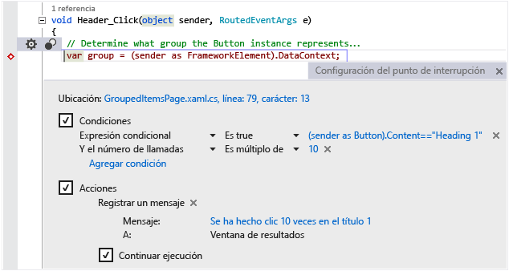

# IDE de Visual Studio
Microsoft Visual Studio 2017 RC es un conjunto de herramientas para crear software, desde la fase de planificación pasando por la fases de diseño de la interfaz de usuario, codificación, pruebas, depuración, análisis de la calidad y el rendimiento del código, implementación en los clientes y recopilación de telemetría de uso. Estas herramientas están diseñadas para trabajar juntas de la forma más eficiente posible y todas se exponen a través del Entorno de desarrollo integrado (IDE) de Visual Studio.  

 Puede usar Visual Studio para crear muchos tipos de aplicaciones, desde sencillas aplicaciones y juegos de la Tienda para clientes móviles, hasta sistemas grandes y complejos para empresas y centros de datos. Puede crear  

 - aplicaciones y juegos que se ejecutan no solo en Windows, sino también en Android y en iOS;

 - sitios web y servicios web basados en ASP.NET, JQuery, AngularJS y otros entornos populares;

 - aplicaciones para dispositivos y plataformas tan diversos como Azure, Office, SharePoint, Hololens, Kinect e Internet de las cosas, por nombrar solo algunos ejemplos;

 - juegos y aplicaciones con gráficos avanzados para una variedad de dispositivos Windows, incluido Xbox, con DirectX.

 De manera predeterminada, Visual Studio proporciona compatibilidad con C#, C y C++, JavaScript, TypeScript, F # y Visual Basic. Visual Studio funciona y se integra bien con Xamarin a través de [Xamarin para Visual Studio](https://www.xamarin.com/visual-studio), y de aplicaciones de terceros como Unity a través de la extensión [Visual Studio Tools para Unity](../cross-platform/visual-studio-tools-for-unity.md) y Apache Cordova a través de [Visual Studio Tools para Apache Cordova](../misc/get-started-with-visual-studio-tools-for-apache-cordova2.md). Si desea extender Visual Studio usted mismo, cree herramientas personalizadas que realicen tareas especializadas a través de [Visual Studio SDK](../extensibility/visual-studio-sdk.md).

## Novedades
 Si nunca ha usado Visual Studio, descubra los aspectos básicos empezando con [Introducción a Visual Studio](../ide/get-started-with-visual-studio.md).
Para obtener información sobre las nuevas características de Visual Studio 2017 RC, vea [Novedades en Visual Studio 2017 RC](../ide/whats-new-in-visual-studio.md).

## Instalar Visual Studio
 Puede averiguar qué edición de Visual Studio es adecuada para usted en [Productos de Visual Studio](https://www.visualstudio.com/products/).

 Puede instalar Visual Studio 2017 RC descargándolo de [Descargas de Visual Studio](https://www.visualstudio.com/vs/). Para obtener más información sobre el proceso de instalación, vea [Instalar Visual Studio 2017 RC](https://go.microsoft.com/fwlink/?linkid=833223).

## Paseo rápido del IDE
 En la siguiente imagen se muestra el IDE de Visual Studio con un proyecto abierto junto con varias ventanas de herramientas principales.
 - [Explorador de soluciones](../ide/solutions-and-projects-in-visual-studio.md) le permite ver y navegar por sus archivos de código.
 - [Team Explorer](https://www.visualstudio.com/en-us/docs/connect/work-team-explorer) le permite realizar el seguimiento de elementos de trabajo y compartir código con otros usuarios mediante tecnologías de control de versiones como [Git](https://git-scm.com/) y [Control de versiones de Team Foundation (TFVC)](https://www.visualstudio.com/en-us/docs/tfvc/overview).
 - [Cloud Explorer](https://azure.microsoft.com/en-us/documentation/articles/vs-azure-tools-resources-managing-with-cloud-explorer/) le permite ver y administrar los recursos de Azure, como máquinas virtuales, tablas, bases de datos SQL, etc.
 - La ventana [Editor](../ide/writing-code-in-the-code-and-text-editor.md) le permite ver y editar código fuente y datos de diseñador.
 - En la ventana [Salida](../ide/reference/output-window.md) se muestra el resultado de la compilación, ejecución, depuración, etc.

   

 ### Inicio de sesión
  Cuando se inicia Visual Studio por primera vez, puede iniciar sesión con su cuenta de Microsoft o con su cuenta de trabajo o escuela. Iniciar sesión le permite sincronizar los parámetros de configuración (por ejemplo, la disposición de ventanas) entre varios dispositivos y conectarse automáticamente a los servicios que pueda necesitar, como las suscripciones de Azure y Visual Studio Team Services. Si tiene una licencia de suscripción, deberá iniciar sesión Visual Studio de forma periódica para mantener actualizado su token de licencia. Si tiene una licencia de clave de producto, no tiene que iniciar sesión, pero hacerlo le permitirá conectarse más cómodamente a Visual Studio Team Services y a sus cuentas con Azure, Office 365, Salesforce.com. Para obtener más información, vea [Iniciar sesión en Visual Studio](../ide/signing-in-to-visual-studio.md).

  Si tiene varias cuentas de Visual Studio Team Services, cuentas de Azure o suscripciones a MSDN, puede vincularlas y acceder a los recursos y servicios de todas las cuentas con un inicio de sesión único. Para obtener más información, vea [Trabajar con varias cuentas de usuario](../ide/work-with-multiple-user-accounts.md).

 ### Mantenerse actualizado
  La bandera de notificación situada en la esquina superior de la barra de título le avisa si hay actualizaciones disponibles para Visual Studio o para otros componentes relacionados que haya instalado. Puede elegir si desea descartar estas notificaciones o actuar sobre ellas. Para obtener más información, vea [Notificaciones de Visual Studio](../ide/visual-studio-notifications.md).

 ### Buscar elementos y obtener ayuda
  La ventana [Inicio rápido](../ide/reference/quick-launch-environment-options-dialog-box.md), destacada en rojo en la siguiente captura de pantalla, es una manera rápida de encontrar los comandos, las herramientas o las características de Visual Studio si no conoce la ubicación del menú o el método abreviado de teclado. Escriba lo que está buscando e Inicio rápido le proporcionará un vínculo.

 

 En Visual Studio, puede presionar **F1** para ir a la ayuda en línea de la ventana activa. También puede presionar **F1** en el editor de código para ir a la página de ayuda para la API o la palabra clave que está en la posición actual del símbolo de intercalación. Por ejemplo, en un archivo de C#, podría colocar el símbolo de intercalación en algún lugar dentro o al final de una declaración `System.String` y, después, presionar **F1** para ir a la página de ayuda de [String](assetId:///T:System.String?qualifyHint=False&autoUpgrade=True).

### Enviar comentarios
 Es fácil enviar comentarios sobre Visual Studio siempre que quiera. Haga clic en el icono de comentarios de la barra de título junto a **Inicio rápido** y, después, haga clic en **Notificar un problema** u **Ofrecer una sugerencia**.

 Las ediciones preliminares de Visual Studio también tienen una opción para **Calificar este producto** . Consultamos todos estos comentarios y los usamos para mejorar el producto. Para obtener más información, vea [Hable con nosotros](../ide/talk-to-us.md).

### Personalizar el IDE
 Puede personalizar el diseño de las ventanas para que se ajuste a su estilo de desarrollo. Puede acoplar, hacer flotar u ocultar cualquier ventana en cualquier momento, y también puede ejecutar el editor en modo de pantalla completa. Puede crear y guardar varios diseños de ventanas personalizados que muestren solo las ventanas que necesita para contextos específicos. Por ejemplo, puede crear un diseño de pantalla completa para que todo lo que vea sea el editor de código. Y puede crear diseños diferentes para la depuración y para las operaciones del equipo. Para obtener más información, vea [Personalizar los diseños de ventana](../ide/customizing-window-layouts-in-visual-studio.md).

 Puede personalizar Visual Studio de muchas otras formas y trasladar la configuración si trabaja en varios equipos. Para obtener más información, vea [Personalizar el IDE](../ide/personalizing-the-visual-studio-ide.md).

 Hay métodos abreviados de teclado para casi todo, y puede personalizarlos también. Para crear nuevos métodos abreviados, escriba "Teclado" en el Inicio rápido para abrir el cuadro de diálogo Teclado. Desde ahí puede presionar F1 para ir a la página de ayuda si necesita más información sobre las opciones. Para obtener más información, vea [Métodos abreviados de teclado predeterminados de Visual Studio](../ide/default-keyboard-shortcuts-in-visual-studio.md).

## Conectarse a Visual Studio Team Services y Team Foundation Server
  Visual Studio Team Services (VSTS) es un servicio en la nube para hospedar proyectos de software y que permite la colaboración en los equipos. VSTS admite los sistemas de control de código fuente Git y Team Foundation, así como las metodologías de desarrollo Scrum, CMMI y Agile. El control de versiones de Team Foundation (TFVC) usa un solo repositorio del servidor centralizado para los archivos de seguimiento y de versión. Los cambios locales siempre se protegen en el servidor central, donde otros desarrolladores pueden obtener los cambios más recientes. Team Foundation Server (TFS) 2015 es el centro de administración del ciclo de vida de aplicación de Visual Studio. Permite a todas las partes interesadas en el proceso de desarrollo participar con una única solución. TFS es útil para administrar equipos heterogéneos y también proyectos.

  Si tiene una cuenta de Visual Studio Team Services o Team Foundation Server en la red, conéctese a ella en la ventana de Team Explorer. Desde esta ventana puede proteger o desproteger código en el control de código fuente, administrar elementos de trabajo, iniciar compilaciones y acceder a los salones y las áreas de trabajo del equipo. Puede abrir Team Explorer desde **Inicio rápido** o, en el menú principal, en **Ver, Team Explorer** o desde **Equipo, Administrar conexiones**.  Para más información sobre Visual Studio Online, consulte [www.visualstudio.com](https://www.visualstudio.com/). Para más información sobre Team Foundation Server, vea [Team Foundation Server](https://www.visualstudio.com/products/tfs-overview-vs).

  En la siguiente imagen se muestra el panel Team Explorer de una solución que se hospeda en VSTS:

   

## Crear soluciones y proyectos
  Aunque puede usar Visual Studio para examinar archivos de código individuales, normalmente trabajará en un *proyecto*. Un proyecto de Visual Studio es una colección de archivos y recursos que, en el caso de las aplicaciones, se compilan en un solo archivo ejecutable binario (por ejemplo, .exe, DLL, appx, etc.). En el caso de sitios web que no sean ASP.NET, no se genera ningún archivo ejecutable y el proyecto contiene solo los archivos HTML y JavaScript e imágenes. Como a veces quizás tenga que crear varios archivos binarios o sitios web que están estrechamente relacionados, Visual Studio tiene el concepto de solución, que puede contener varios proyectos o sitios web. Cuando se crea un proyecto, en realidad está creando un proyecto en una solución, y más adelante puede agregar más proyectos a esa solución si es necesario. Por ejemplo, si tiene un proyecto DLL, puede agregar a la solución un proyecto .exe que carga y usa el archivo DLL.

  Una *plantilla de proyecto* es una colección de archivos de código y opciones de configuración previamente rellenados que permite preparar rápidamente la creación de un tipo específico de aplicación. Visual Studio incluye numerosas plantillas de proyecto para elegir pero, si no le sirve ninguna de las plantillas predeterminadas, puede crear las suyas propias. Después de crear un proyecto con una plantilla, puede empezar a escribir su propio código en él, en los archivos proporcionados o en los nuevos archivos que agregue. Para obtener más información, vea [Soluciones y proyectos](../ide/solutions-and-projects-in-visual-studio.md). La ilustración siguiente muestra el cuadro de diálogo Nuevo proyecto con las plantillas de proyecto que hay disponibles para las aplicaciones ASP.NET.

   

## Escribir, navegar y comprender el código  
 Si es programador, la ventana del editor es el lugar donde probablemente pasará la mayor parte del tiempo. Visual Studio incluye compatibilidad de edición integrada para C#, C++, Visual Basic, F#, JavaScript, TypeScript, XML, HTML y CSS. Visual Studio también admite la edición y la compilación para muchos otros lenguajes.

 Puede modificar archivos individuales en el editor de texto seleccionando **Archivo, Abrir, Archivo**. Para editar archivos en un proyecto abierto, pulse y abra el nombre de archivo en el Explorador de soluciones. Se colorea el código y puede personalizar la combinación de colores escribiendo "Colores" en el inicio rápido. Puede tener muchas ventanas en pestañas del editor de texto abiertas a la vez. Puede dividir cada ventana de forma independiente. También puede ejecutar el editor de texto en modo de pantalla completa.  

   

 El editor de texto es sumamente interactivo (si quiere que lo sea) con muchas características de productividad que le ayudarán a escribir código mejor y más rápidamente. Las características varían según el lenguaje y no tiene que usar todas ellas. Escriba "Editor" en Inicio rápido para activar o desactivar características. Algunas de las características de productividad más comunes son:  

-  [Refactorización](../ide/refactoring-in-visual-studio.md) incluye operaciones tales como el cambio inteligente de nombre de las variables, mover líneas seleccionadas de código a una función diferente, mover código a otras ubicaciones, reordenar los parámetros de una función y mucho más.

    

-  **IntelliSense** es un término que agrupa un conjunto de características muy populares que muestran información de escritura sobre el código directamente en el editor y, en algunos casos, escriben pequeños fragmentos de código automáticamente. Básicamente, IntelliSense es como tener documentación básica insertada en el editor, lo que evita tener que buscar información de escritura en una ventana de ayuda independiente. Las características de IntelliSense varían según el lenguaje. Para obtener más información, vea [Visual C# IntelliSense](../ide/visual-csharp-intellisense.md), [Visual C++ Intellisense](../ide/visual-cpp-intellisense.md), [JavaScript IntelliSense](../ide/javascript-intellisense.md), [Opciones de IntelliSense específicas de Visual Basic](../ide/visual-basic-specific-intellisense.md). La ilustración siguiente muestra algunas características de IntelliSense en funcionamiento:  

       

-  Los**subrayados ondulados** le avisan de errores o posibles problemas en el código en tiempo real a medida que escribe, lo que permite corregirlos inmediatamente sin esperar a que el error se detecte en tiempo de compilación o de ejecución. Si mantiene el mouse sobre la línea ondulada, verá información adicional sobre el error. También puede aparecer una bombilla en el margen izquierdo con sugerencias para corregir el error. Para obtener más información, vea [Realizar acciones rápidas con las bombillas](../ide/perform-quick-actions-with-light-bulbs.md).  

    

-  Los [marcadores](../ide/setting-bookmarks-in-code.md) le permiten ir rápidamente a líneas específicas en los archivos en los que está trabajando activamente.

    

-  En el menú contextual del editor de texto, puede invocar la ventana [Jerarquía de llamadas](../ide/reference/call-hierarchy.md) para mostrar los métodos que llaman al método, y son llamados por este, situado debajo del símbolo de intercalación.

    

-  **CodeLens** le permite buscar referencias y cambios en el código, errores vinculados, elementos de trabajo, revisiones de código y pruebas unitarias, todo sin salir del editor.

    

  Para obtener más información, vea [Buscar cambios en el código y otro historial](../ide/find-code-changes-and-other-history-with-codelens.md).  

-  La ventana **Ojear la definición** muestra un método o definición de tipo en línea, sin salir del contexto actual. Esta ventana ahora funciona también para XAML.  

    

-  La opción de menú contextual **Ir a definición** le lleva directamente al lugar donde se definen la función o el objeto. También hay otros comandos de navegación disponibles haciendo clic con el botón secundario en el editor.

    

- La herramienta relacionada [Examinador de objetos](http://msdn.microsoft.com/en-us/f89acfc5-1152-413d-9f56-3dc16e3f0470) permite inspeccionar ensamblados .NET o Windows Runtime en el sistema para ver qué tipos contienen y qué métodos y propiedades contienen esos tipos.  

       

 La mayoría de los elementos de los menús Editar y Ver se relacionan con el editor de código de alguna manera. Para obtener más información sobre el editor, vea [Writing Code (Escribir código)](../ide/writing-code-in-the-code-and-text-editor.md) y [Edición del código](https://www.visualstudio.com/features/ide-vs).  

## Compilar y generar el código  
 Compilar un proyecto significa compilar el código fuente y realizar los pasos necesarios para generar el archivo ejecutable. Los distintos lenguajes tienen operaciones de compilación diferentes y los sitios web normales no se compilan. Independientemente del tipo de proyecto, el menú **Compilar** es la ubicación estándar de estos comandos. Para compilar y ejecutar el código con una sola pulsación de tecla, presione F5. Cada compilador se puede configurar totalmente mediante el IDE. La barra de herramientas Compilar permite especificar si se va a compilar una versión de depuración del programa, con símbolos y comprobación de errores adicional habilitados para admitir puntos de interrupción y ejecución paso a paso en el depurador, o una compilación de versión, que es lo que finalmente proporcionará a los usuarios. Puede configurar más opciones de compilación y muchas otras opciones en la página de propiedades de un proyecto. Seleccione el menú contextual (botón derecho) del nodo del proyecto en el Explorador de soluciones y, después, pulse el comando Propiedades. También puede ejecutar compilaciones desde la línea de comandos.  

 La salida de la compilación, incluidos los mensajes de error o éxito, aparecen en la ventana de salida. La Lista de errores (que se muestra a continuación) proporciona información detallada sobre los errores de compilación.  

   

## Depurar el código  
 El depurador con última tecnología de Visual Studio le permite depurar el código que se ejecuta en su proyecto local, en un dispositivo remoto o en un emulador, como los de los dispositivos Android o Windows Phone. Puede ejecutar el código instrucción por instrucción e inspeccionar las variables en cada paso, puede ejecutar paso a paso aplicaciones multiproceso y puede establecer puntos de interrupción que solo se producen cuando se cumple una condición especificada. Puede supervisar los valores de las variables a medida que se ejecuta el código. Todo esto se puede administrar en el propio editor de código para que no tenga que salir del contexto del código.  

   

 El propio depurador tiene varias ventanas que le permiten ver y manipular las variables locales, la pila de llamadas y otros aspectos del entorno en tiempo de ejecución. Encontrará estas ventanas en el menú **Depurar** .  

 La [Ventana Inmediato](../ide/reference/immediate-window.md) le permite escribir en una expresión y ver su resultado inmediatamente.

 La ventana [IntelliTrace](../debugger/intellitrace.md) registra cada llamada a métodos y otros eventos en un programa de .NET en ejecución, que puede ayudar a encontrar rápidamente dónde se origina un problema.

 Para obtener más información, vea [Depurar en Visual Studio](../debugger/debugging-in-visual-studio.md).  

## Probar el código  
 Visual Studio incluye un entorno de pruebas unitarias para código administrado (.NET) y otro para C++ nativo. Para crear pruebas unitarias, basta con agregar un proyecto de prueba a la solución, escribir las pruebas y, después, ejecutarlas desde la ventana Explorador de pruebas. Para obtener más información, vea [Haga una prueba unitaria de su código](../test/unit-test-your-code.md).  

   

## Analizar la calidad y el rendimiento del código  
 Visual Studio incluye herramientas eficaces para el análisis estático y en tiempo de ejecución. Las herramientas de análisis estático ayudan a identificar posibles errores de diseño, globalización, interoperabilidad, rendimiento, seguridad y otras categorías. Las pruebas de rendimiento o de generación de perfiles implican medir cómo se ejecuta el programa. A estas herramientas se accede desde el menú **Analizar** . Para obtener más información, vea [Mejorar la calidad con las herramientas de diagnóstico de Visual Studio](../test/improve-code-quality.md).  

## Conectarse a bases de datos y servicios en la nube  
 La extensión [Cloud Explorer](https://azure.microsoft.com/en-us/documentation/articles/vs-azure-tools-resources-managing-with-cloud-explorer/) de Visual Studio muestra los recursos de Azure en todas las cuentas administradas en la suscripción de Azure en la que ha iniciado sesión. Para obtener Cloud Explorer, instale [Azure SDK](https://azure.microsoft.com/en-us/downloads/).

 

 [Explorador de servidores](https://msdn.microsoft.com/en-us/library/cd2cz7yy.aspx) también está disponible para ayudarle a explorar y administrar activos e instancias de SQL Server en Azure, Salesforce.com, Office 365 y sitios web.

 Visual Studio incluye [Microsoft SQL Server Data Tools](https://msdn.microsoft.com/en-us/data/tools.aspx) (SSDT), que permiten compilar, depurar, mantener y refactorizar bases de datos. Puede trabajar con un proyecto de base de datos o directamente con una instancia de base de datos conectada de manera local o externa.  

 El [Explorador de objetos de SQL Server](https://msdn.microsoft.com/en-us/library/hh231250.aspx) en Visual Studio ofrece una vista de los objetos de base de datos similar a la de SQL Server Management Studio. El Explorador de objetos de SQL Server permite realizar trabajos ligeros de administración y diseño de bases de datos, incluida la edición de datos de tabla, comparación de esquemas y ejecución de consultas mediante los menús contextuales directamente desde el Explorador de objetos de SQL Server. SSDT también incluye tipos de proyecto especiales y herramientas para desarrollar soluciones de SQL Server 2012 Analysis Services, Reporting Services e Integration Services Business Intelligence (BI), antes conocido como Business Intelligence Development Studio.  

   

## Implementar la aplicación finalizada  
 Cuando la aplicación está lista para implementarse en los clientes, Visual Studio proporciona las herramientas para hacerlo, ya sea para implementar en la Tienda Windows, en un sitio de Sharepoint o usando las tecnologías Installshield o Windows Installer. Todo está disponible a través del IDE. Para obtener más información, vea [Implementar aplicaciones, servicios y componentes](../deployment/deploying-applications-services-and-components.md).  

## Herramientas de arquitectura y modelado (solo en Enterprise)  
 Puede usar las herramientas de arquitectura y modelado de Visual Studio para diseñar y modelar la aplicación. Estas herramientas ayudan a visualizar la estructura del código, su comportamiento y sus relaciones. Puede crear modelos con distintos niveles de detalle a lo largo del ciclo de vida de la aplicación como parte del proceso de desarrollo. Puede controlar los requisitos, las tareas, los casos de prueba, los errores y otros trabajos asociados con los modelos mediante la vinculación de elementos del modelo a elementos de trabajo de Team Foundation Server y su plan de desarrollo. Para obtener más información, vea [Diseñar y modelar la aplicación](../modeling/analyze-and-model-your-architecture.md).  

## Extender Visual Studio mediante Visual Studio SDK  
 Visual Studio es una plataforma extensible. Una extensión de Visual Studio es una herramienta personalizada que se integra con el IDE. Puede agregar extensiones de terceros o crear las suyas propias. Para obtener más información, vea [Empezar a desarrollar extensiones de Visual Studio](../extensibility/starting-to-develop-visual-studio-extensions.md).  

 Las [Directrices de la experiencia de usuario de Visual Studio](../extensibility/ux-guidelines/visual-studio-user-experience-guidelines.md) son una referencia esencial para todo aquel que escriba extensiones para Visual Studio. Estas directrices específicas para cada plataforma incluyen información sobre el diseño de cuadros de diálogo, fuentes, colores, iconos, controles comunes y otros patrones de interacción que harán que la nueva característica se integren perfectamente con Visual Studio.  

## Vea también  
 [Instalar Visual Studio 2017 RC](../install/install-visual-studio.md)   
 [Edición del código](https://www.visualstudio.com/features/ide-vs)   
 [Novedades en Visual Studio 2017 RC](../ide/whats-new-in-visual-studio.md)   
 [Portar, migrar y actualizar proyectos de Visual Studio](../porting/porting-migrating-and-upgrading-visual-studio-projects.md)   
 [Hable con nosotros](../ide/talk-to-us.md)

<!--HONumber=Feb17_HO4-->

