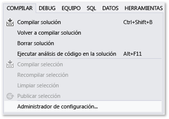
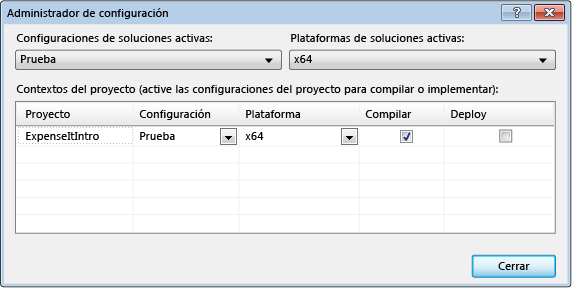
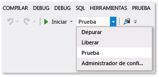
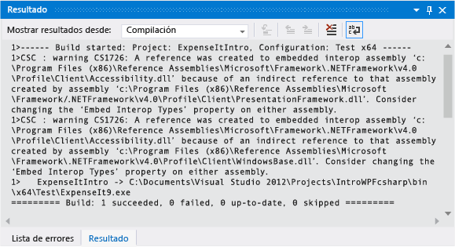
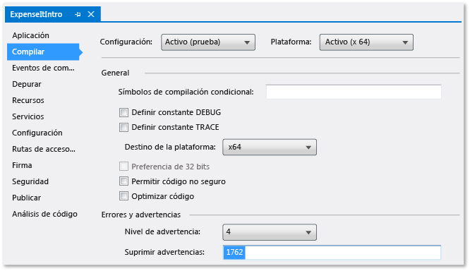
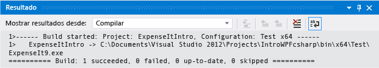
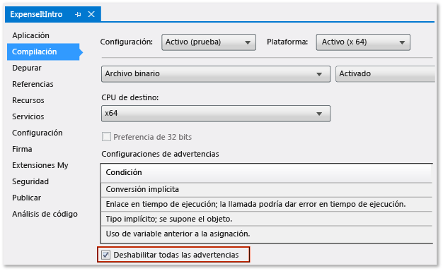
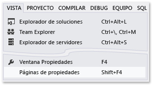

# Tutorial: Compilar una aplicación

Cuando complete este tutorial, estará más familiarizado con varias opciones que se pueden configurar al compilar aplicaciones con Visual Studio. Creará una configuración de compilación personalizada, ocultará determinados mensajes de advertencia y aumentará la información de los resultados de la compilación para una aplicación de ejemplo.

## Instalar la aplicación de ejemplo

Descargue el ejemplo [Introducción a la compilación de aplicaciones de WPF](https://code.msdn.microsoft.com/Introduction-to-Building-b8d16419). Elija C# o Visual Basic. Una vez descargado el archivo .zip, extráigalo y abra el archivo **ExpenseItIntro.sln** con Visual Studio.

## Crear una configuración de compilación personalizada

Cuando se crea una solución, se definen automáticamente configuraciones de compilación de depuración y de versión y sus destinos de plataforma predeterminados para la solución. Es posible personalizar estas configuraciones o crear sus propias configuraciones. Las configuraciones de compilación especifican el tipo de compilación. Las plataformas de compilación especifican el sistema operativo de destino de una aplicación para esa configuración. Para obtener más información, consulte [Descripción de las configuraciones de compilación](../ide/understanding-build-configurations.md), [Descripción de las plataformas de compilación](../ide/understanding-build-platforms.md) y [Cómo: Establecer configuraciones Debug y Release](../debugger/how-to-set-debug-and-release-configurations.md).

Puede cambiar o crear configuraciones y opciones de plataforma mediante el cuadro de diálogo **Administrador de configuración**. En este procedimiento, creará una configuración de compilación para probar.

### Para crear una configuración de compilación
  
1. Abra el cuadro de diálogo **Administrador de configuración**.
  
       
  
2. En la lista **Configuración de soluciones activas**, elija **\<Nueva...\>**.
  
3. En el cuadro de diálogo **Nueva configuración de la solución**, asigne a la nueva configuración el nombre `Test`, copie valores de la configuración de depuración existente y luego elija el botón **Aceptar**.
  
       
  
4. En la lista **Plataforma de soluciones activas**, elija **\<Nueva...\>**.
  
5. En el cuadro de diálogo **Nueva plataforma de soluciones**, elija **x64** y no copie valores de la plataforma x86.
  
       
  
6. Elija el botón **Aceptar** .
  
 La configuración de soluciones activa ha cambiado a Prueba y la plataforma de soluciones activas se ha establecido en x64.
  
   
  
7. Elija **Cerrar**.

Puede comprobar o cambiar rápidamente la configuración de soluciones activas mediante la lista **Configuraciones de soluciones** de la barra de herramientas **Estándar**.
  
  
  
## Compilar la aplicación

Después, compilará la solución con la configuración de compilación personalizada.
  
### Para compilar la solución
  
-   En la barra de menús, elija **Compilar**, **Compilar solución**.
  
    La ventana **Salida** muestra los resultados de la compilación. La compilación se ha realizado correctamente.
  
## Ocultar advertencias del compilador

A continuación presentamos determinado código que causa que el compilador genere una advertencia.

1. En el proyecto de C#, abra el archivo **ExpenseReportPage.xaml.cs**. En el método **ExpenseReportPage**, agregue el código siguiente: `int i;`.

    O

    En el proyecto de Visual Basic, abra el archivo **ExpenseReportPage.xaml.vb**. En el constructor personalizado **Public Sub New...**, agregue el código siguiente: `Dim i`.

2. Compile la solución.

La ventana **Salida** muestra los resultados de la compilación. La compilación se ha realizado correctamente, pero se han generado advertencias:  

 Figura 1: advertencias de Visual Basic  
  
   
  
 Figura 2: Advertencias de C#  
  
   
  
Es posible ocultar temporalmente determinados mensajes de advertencia durante una compilación en lugar de que se acumulen en los resultados de la compilación.

### Para ocultar una advertencia específica de C#
  
1. En el **Explorador de soluciones**, elija el nodo de proyecto de nivel superior.
  
2. En la barra de menús, elija **Ver**, **Páginas de propiedades**.
  
     The **Project Designer** opens.
  
3. Elija la página **Compilación** y, después, en el cuadro **Suprimir advertencias**, especifique el número de advertencia **0168**.
  
       
  
     For more information, see [Build Page, Project Designer (C#)](../ide/reference/build-page-project-designer-csharp.md).
  
4. Compile la solución.
  
     The **Output** window displays only summary information for the build.
  
       
  
### Para suprimir todas las advertencias de compilación de Visual Basic
  
1. En el **Explorador de soluciones**, elija el nodo de proyecto de nivel superior.
  
2. En la barra de menús, elija **Ver**, **Páginas de propiedades**.
  
     The **Project Designer** opens.
  
3. En la página **Compilación**, active la casilla **Deshabilitar todas las advertencias**.
  
       
  
     For more information, see [Configuring Warnings in Visual Basic](../ide/configuring-warnings-in-visual-basic.md).
  
4. Compile la solución.
  
 La ventana **Salida** solo muestra información de resumen de la compilación.
  
   
  
 Para obtener más información, consulte [Cómo: Suprimir advertencias del compilador](../ide/how-to-suppress-compiler-warnings.md).
  
## Mostrar detalles de compilación adicionales en la ventana de salida

Se puede cambiar la cantidad de información sobre el proceso de compilación que aparece en la ventana **Salida**. El nivel de detalle de la compilación se establece normalmente en Mínimo, lo que significa que la ventana **Salida** solo muestra un resumen del proceso de compilación, junto con las advertencias y los errores de alta prioridad. Puede mostrar más información sobre la compilación mediante el [cuadro de diálogo Opciones, Proyectos y soluciones, Compilar y ejecutar](../ide/reference/options-dialog-box-projects-and-solutions-build-and-run.md).
  
> [!IMPORTANT]
>  Si se muestra más información, la compilación tardará más tiempo en completarse.
  
### Para cambiar la cantidad de información que se muestra en la ventana Salida
  
1. Abra el cuadro de diálogo **Opciones**.
  
       
  
2. Elija la categoría **Proyectos y soluciones** y luego elija la página **Compilar y ejecutar**.
  
3. En la lista **Detalles de la salida de la compilación del proyecto de MSBuild**, elija **Normal** y después elija el botón **Aceptar**.
  
4. En la barra de menús, elija **Compilar**, **Limpiar solución**.
  
5. Compile la solución y después revise la información de la ventana **Salida**.
  
     The build information includes the time that the build started (located at the beginning) and the order in which files were processed. This information also includes the actual compiler syntax that Visual Studio runs during the build.
  
     For example, in the C# build, the [/nowarn](/dotnet/visual-basic/reference/command-line-compiler/nowarn) option lists the warning code, 1762, that you specified earlier in this topic, along with three other warnings.
  
     In the Visual Basic build, [/nowarn](/dotnet/visual-basic/reference/command-line-compiler/nowarn) doesn't include specific warnings to exclude, so no warnings appear.
  
    > [!TIP]
    >  You can search the contents of the **Output** window if you display the **Find** dialog box by choosing the Ctrl+F keys.
  
Para obtener más información, consulte [Cómo: Ver, guardar y configurar archivos de registro de compilación](../ide/how-to-view-save-and-configure-build-log-files.md).
  
## Crear una compilación de versión

Se puede compilar una versión de la aplicación de ejemplo optimizada para su entrega. Para la compilación de versión, especificará que el ejecutable se copie a un recurso compartido de red antes de que se inicie la compilación.

Para obtener más información, consulte [Cómo: Cambiar el directorio de resultados de compilación](../ide/how-to-change-the-build-output-directory.md) y [Compilar y limpiar proyectos y soluciones en Visual Studio](../ide/building-and-cleaning-projects-and-solutions-in-visual-studio.md).

### Para especificar una compilación de versión para Visual Basic
  
1. Abra el **Diseñador de proyectos**.
  
       
  
2. Elija la página **Compilación**.
  
3. En la lista **Configuración**, elija **Versión**.
  
4. En la lista **Plataforma**, elija **x86**.
  
5. En el cuadro **Ruta de acceso de los resultados de la compilación**, especifique una ruta de acceso de red.
  
     For example, you can specify \\\myserver\builds.
  
    > [!IMPORTANT]
    >  A message box might appear, warning you that the network share that you've specified might not be a trusted location. If you trust the location that you've specified, choose the **OK** button in the message box.
  
6. Compile la aplicación.
  
       
  
### Para especificar una compilación de versión para C# #
  
1. Abra el **Diseñador de proyectos**.
  
       
  
2. Seleccione la página **Compilación**.
  
3. En la lista **Configuración**, elija **Versión**.
  
4. En la lista **Plataforma**, elija **x86**.
  
5. En el cuadro **Ruta de acceso de salida**, especifique una ruta de acceso de red.
  
     For example, you could specify \\\myserver\builds.
  
    > [!IMPORTANT]
    >  A message box might appear, warning you that the network share that you've specified might not be a trusted location. If you trust the location that you've specified, choose the **OK** button in the message box.
  
6. En la **barra de herramientas estándar**, establezca las configuraciones de soluciones en **Versión** y las plataformas de soluciones en **x86**.

7. Compile la aplicación.
  
       
  
 El archivo ejecutable se copia a la ruta de acceso de red especificada. Su ruta de acceso sería \\\miServidor\compilaciones\\*NombreDeArchivo*.exe.
  
Ha completado correctamente este tutorial.
  
## Vea también

[Tutorial: Compilar un proyecto (C++)](/cpp/ide/walkthrough-building-a-project-cpp)  
[Información general sobre la precompilación de proyectos de aplicación web ASP.NET](http://msdn.microsoft.com/b940abbd-178d-4570-b441-52914fa7b887)  
[Tutorial: Usar MSBuild](../msbuild/walkthrough-using-msbuild.md)
